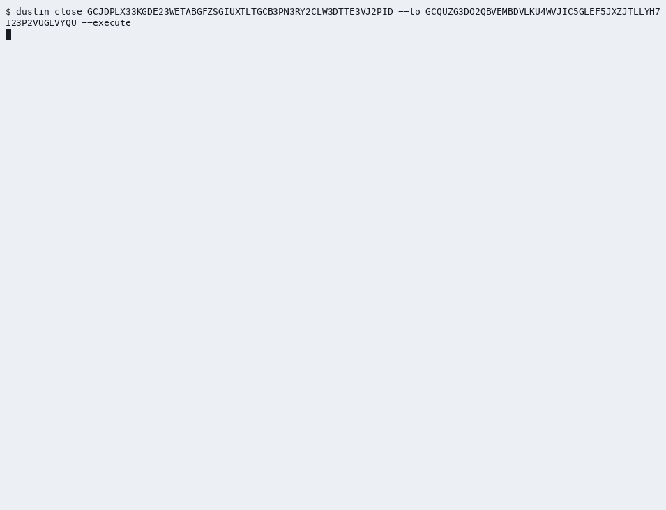

# Dustin

[](https://github.com/0xsimoneth/dustin/actions/workflows/ci.yml)  

Dustin closes messy Stellar testnet accounts: it cancels offers, disposes of leftover balances, removes trustlines and data entries, and merges the account into a destination you choose. Every transaction is fee-bumped by a sponsor, so an account holding zero spendable XLM, which cannot pay for its own teardown, can still be closed. `planClose()` shows the whole ordered plan before anything is signed, so a wallet can offer account closure without sending its users to a web form.

The gap: the existing StellarExpert Account Demolisher sources and pays every transaction from the account being closed and has no fee-bump or sponsored-reserve handling ([client source](https://github.com/stellar-expert/stellar-expert-explorer/blob/master/business-logic/demolisher/demolisher-tx-builder.js)), so an account at its minimum reserve cannot even start. Other tools, and how Dustin differs from each, are in the [write-up](docs/write-up.md) (section 9, prior art).

> **Status: version 0.1.0.** The package is `stellar-dustin` (command `dustin`); the builder publishes 0.1.0 to npm, and if the registry does not list it yet (`npm view stellar-dustin version`), install from source (below). Built during a 30-day Stellar Instaward sprint (2026-09-22 to 2026-10-22). The SOW's success metric was met on 2026-09-28 and recorded again on the 0.1.0 code on 2026-09-29: a zero-spendable messy account closed on testnet with every fee paid by a sponsor ([evidence package](evidence/README.md)). The 60-second video was produced on 2026-09-29 and again on 2026-09-30, with StellarExpert's pages, and waits for the builder's approval and hosting; the recording of the existing tool on the baseline fixture is the builder's. Testnet only.

## Demo

The 60-second video of a full close from the CLI: `<pending: builder approves and hosts the 60-second video (E4-S6)>`; it was produced on 2026-09-30 from the script [docs/demo-video-script.md](docs/demo-video-script.md) on a fresh fixture, with the account's pages on StellarExpert before and after the close (the take of 2026-09-29 is kept as a backup), and its record, with the terminal recordings, the captions and key frames, is [evidence/demo/](evidence/demo/README.md). The close, from the typed confirmation to the receipt:



Until then, the recorded CLI close on the 0.1.0 code, of 2026-09-29, can be checked in a browser (the links stop resolving at the testnet reset of 2026-12-16):

- the closed account: [explorer](https://stellar.expert/explorer/testnet/account/GCIVEA6YVJCSYE2Y7V2IUEYATOO36X7GQOAYNOI2MDNOW7HI4LPJVKZT), and [Horizon](https://horizon-testnet.stellar.org/accounts/GCIVEA6YVJCSYE2Y7V2IUEYATOO36X7GQOAYNOI2MDNOW7HI4LPJVKZT), which answers 404;
- its three fee-bump transactions, each paid by the sponsor: [cleanup](https://stellar.expert/explorer/testnet/tx/835457ceff4b0443ec52ebbb408edc8988627e5de8442d28dda85b3331b52a5b), [sale](https://stellar.expert/explorer/testnet/tx/c6c99beddca7685293bdb0e156e320cbb4189e4247e4451578b60e82ba76de61), [merge](https://stellar.expert/explorer/testnet/tx/dd56e18f152dc7f15ee370dce9b8ddae556e90f04dd1cd52fe3281df4bf118e2);
- the destination, which received 4.0000007 XLM: [explorer](https://stellar.expert/explorer/testnet/account/GBR43GJ2WAHU7FPEAYLNFR4WJUQMCJGOOS6ESF2O6ZBB6GVWL6FVS3OY).

The command's own output, with the receipt, is [`transcript.txt`](evidence/runs/20260929T111408Z-e4-cli/transcript.txt), and the plan it printed first is [`plan.txt`](evidence/runs/20260929T111408Z-e4-cli/plan.txt). The same close was first recorded on 2026-09-28, before the output was polished ([CLI](evidence/runs/20260928T112252Z-e3-cli/summary.md), [SDK](evidence/runs/20260928T112239Z-e3/summary.md)).

## Install

Requires Node.js 22.12 or newer.

From npm:

```bash
npm install -g stellar-dustin   # published by the builder as 0.1.0; puts `dustin` on your PATH
npx stellar-dustin --help       # or run it without installing
```

If the registry does not have `stellar-dustin` 0.1.0 yet, install from source:

```bash
git clone https://github.com/0xsimoneth/dustin.git
cd dustin
npm ci
npm run build
node dist/cli/main.js --help   # the CLI, run from the clone
npm link                       # optional: puts `dustin` on your PATH (writes to npm's global prefix)
```

After a from-source install, `dustin` is not on your PATH until `npm link`; without it, write `node dist/cli/main.js` wherever this README writes `dustin`. The package name is `stellar-dustin`; the bare npm name `dustin` belongs to an unrelated package, so do not run `npx dustin` unless `stellar-dustin` is installed in that project.

## Quick start: CLI

```bash
# Read-only: prints the ordered close plan. Needs no secret.
dustin plan G<ACCOUNT> --to G<DESTINATION> --sponsor G<SPONSOR>

# Executes the plan after you type the last four characters of the destination.
dustin close G<ACCOUNT> --to G<DESTINATION> --execute
```

`dustin close --execute` needs two secret keys: `DUSTIN_ACCOUNT_SECRET`, the account being closed, and `DUSTIN_SPONSOR_SECRET`, a funded testnet account that pays every fee. It reads them from the environment, else from a `.env` file in the working directory, else it asks for a missing one with a hidden prompt, but only when standard input and standard error are terminals and `--json` is not given (Ctrl-C or the end of input counts as missing: exit 2). A secret on the command line is refused. `.env` holds secrets: copy [`.env.example`](.env.example) to it and make it readable only by you (`chmod 600 .env`); it is gitignored. For a fixture built with `dustin fixture create` (section [Run the tests yourself](#run-the-tests-yourself)), the two secrets are `secrets.fixture` and `secrets.sponsor` in its `keys.json`, and this writes them to `.env` without printing them:

```bash
node -e 'const k = require("./.fixture/<id>/keys.json").secrets; require("fs").writeFileSync(".env", `DUSTIN_ACCOUNT_SECRET=${k.fixture}\nDUSTIN_SPONSOR_SECRET=${k.sponsor}\n`, { mode: 0o600 })'
```

- `dustin plan`, and `dustin close` without `--execute`, only read from Horizon; nothing is signed or submitted.
- `dustin close --execute` reads the account again, prints the fresh plan and a summary (the destination and what it receives, the sponsor and the most it can pay, the transactions), then asks for the last four characters of the destination. `--yes` skips the question for scripts. If the plan changed, or a quote got worse so the close would recover less than the summary said, it stops with exit code 3 and signs nothing.
- Each transaction prints its hash and explorer link as it is submitted, then its ledger and the fee charged to the sponsor. A merge held back by the sequence-number guard prints the start and the end of its wait.
- The receipt ends with Horizon's 404 for the account, what became of each leftover balance, each unclosable item with its reason and remedy, the reserves released to reserve sponsors as observed on Horizon, and the explorer and Horizon links of the account and the destination.
- Ctrl-C (or SIGTERM) is handled from the start of `close --execute`. Before anything is signed it ends the command with `INTERRUPTED` and exit 3, and a second one exits 3 at once. While the transactions run, it stops the close at the next safe point, checked right before every submission: nothing is posted after it, the receipt is printed and `--report` written, and a second one writes the latest report at once and exits 5. While the hidden prompt or the typed confirmation waits, Ctrl-C is the prompt's answer (a missing secret, exit 2, or not confirmed, exit 3). Running the same command again continues from the ledger; on an account that is already gone it records Horizon's 404, signs nothing and exits 3.

| Option of `dustin close` | Effect |
|---|---|
| `--to <G...>` | Destination of the merge (`--destination` is an alias). |
| `--execute` | Sign and submit after the typed confirmation; without it, `close` is a dry run. |
| `--yes` | Skip the typed confirmation; only with `--execute`. |
| `--partial` | Run everything that can run when an item cannot be disposed of; no merge (exit 4). |
| `--memo <text>` | Memo for a destination or issuer that requires one (SEP-29), at most 28 bytes. |
| `--prefer-destination` | Try the transfer to the destination before the return to the issuer. |
| `--sponsor <G...>` | The fee sponsor; with `--execute` it must own `DUSTIN_SPONSOR_SECRET`. |
| `--base-fee <stroops>` | Bid per operation instead of the `fee_stats` estimate; with `--execute` also the highest bid. |
| `--json` | Machine mode: exactly one JSON document on standard output (the close report, or the plan when the run was refused before the executor started; [plan-schema.json](schemas/plan-schema.json), [receipt-schema.json](schemas/receipt-schema.json), both shipped in the package), and NDJSON only on standard error: one JSON object per line with a `type`, for the executor's events, `notice` and `error` ([integration notes](docs/integration-notes.md), section 7). If standard output is closed early, the document follows on standard error as one `document` line. It never asks anything: `--execute --json` without `--yes` exits 3 (`CONFIRMATION_REQUIRED`), and a missing secret exits 2. |
| `--report <file>` | With `--execute`, keep the close report (JSON, no secrets) in this file as the run goes. |

`dustin plan` takes `--to`, `--sponsor`, `--prefer-destination`, `--memo`, `--base-fee` and `--json`. The global options are `--network testnet` (the only network accepted), `--verbose` (on an error, its stage, verdict, Horizon result codes, details and cause chain as well, with secrets redacted), `--no-color` (accepted for scripts; it changes nothing, since no colour is ever printed), `--help` and `--version`. The output is plain ASCII, and human text wraps at 120 columns. Every error prints its code, one sentence and what to do, a usage error too (`dustin: USAGE_ERROR: ...` after the command's help); [docs/errors.md](docs/errors.md) lists every code. `dustin fixture create --profile messy|edge` builds a fixture account on testnet and `dustin fixture verify <manifest>` checks it against Horizon (section [Run the tests yourself](#run-the-tests-yourself)).

## Quick start: SDK

Install the package and the Stellar JavaScript SDK it builds on. `@stellar/stellar-sdk` 17.1.0 comes with `stellar-dustin` as its dependency, but install it yourself when your code imports it, so the import resolves with every package manager (pnpm and Yarn Plug'n'Play do not hoist dependencies):

```bash
npm install stellar-dustin @stellar/stellar-sdk@17.1.0
```

If the registry does not have `stellar-dustin` 0.1.0 yet, build a tarball from a clone with `npm pack` and install that instead ([integration notes](docs/integration-notes.md), section 1).

A read-only plan of any testnet account, with no secret (save as `plan.mjs` and run `node plan.mjs <account G...> <destination G...>`; it is valid TypeScript as well):

```js
import { planClose, renderPlan } from "stellar-dustin";

const [account, destination] = process.argv.slice(2);
if (!account || !destination) throw new Error("usage: node plan.mjs <account> <destination>");

// Read-only: GET requests to the testnet Horizon, no secret, nothing signed.
const plan = await planClose({ account, destination });
console.log(renderPlan(plan));
console.log(`${plan.status}: ${plan.steps.length} steps in ${plan.transactions.length} transactions`);
```

The whole flow, with the approval and the fee sponsor (TypeScript, ESM):

```ts
import { writeFileSync } from "node:fs";
import { Keypair } from "@stellar/stellar-sdk";
import { executeClose, keypairSigner, planClose, renderPlan, renderReport } from "stellar-dustin";

// Your own key handling; here, two testnet secrets from the environment.
const account = Keypair.fromSecret(process.env.DUSTIN_ACCOUNT_SECRET!);
const sponsor = Keypair.fromSecret(process.env.DUSTIN_SPONSOR_SECRET!);

// Read-only: GET requests to Horizon, no secret, nothing signed.
const plan = await planClose({
  account: account.publicKey(),
  destination: "G...", // receives the XLM through the merge
  feeSponsor: sponsor.publicKey(), // pays every fee
});
console.log(renderPlan(plan)); // show it to the account holder and get their approval

const report = await executeClose(
  plan,
  { account: keypairSigner(account), feeSponsor: keypairSigner(sponsor) },
  {
    confirm: true, // required: executing is irreversible
    allowPartial: false, // true: run everything but the merge when an item cannot be disposed of
    onEvent: (event) => console.log(event.type), // tx:submitted, tx:confirmed, verified, ...
    // A copy after every change, so no hash is lost; keep it in your own storage.
    onReport: (copy) => writeFileSync("close-report.json", JSON.stringify(copy, null, 2)),
  },
);
console.log(renderReport(report, { plans: [plan] }));
// report.status is "closed", "partial", "aborted" or "failed";
// report.verification?.accountExists is false once Horizon answers 404 for the account.
```

Both snippets type-check with `tsc --strict --module nodenext` (with `@types/node`), and the first ran as written against a testnet account on 2026-09-29.

- `keypairSigner()` keeps the keypair in a closure. Any object with `publicKey()` and `sign(tx)` is a `Signer`, so a wallet can sign with its own key store or a hardware device. The sponsor signs only the fee-bump envelopes.
- Before signing, `executeClose()` re-reads the account and plans again. If the plan changed, it stops with status `aborted` and submits nothing; pass `onDrift: "replan"` to continue with the fresh plan.
- Errors are `DustinError`s with a stable `code`; `remedyOf(error)` gives what to do, and every code is in [docs/errors.md](docs/errors.md). When a run stops on an error after something was submitted, the error carries the report so far in `error.report`.
- Pass `signal` (an `AbortSignal`) to stop a run at the next safe point; the report then ends with the stop `INTERRUPTED`.
- The SDK never reads environment variables or `.env`; the CLI does, for `dustin close --execute` only.

Two programs show the SDK end to end, and CI type-checks both against the package's published types: [examples/close-with-sponsor.ts](examples/close-with-sponsor.ts), the whole close with the typed confirmation, the events, `allowPartial`, `preferDestination` and the error codes; and [examples/plan-a-fixture.ts](examples/plan-a-fixture.ts), which uses the second entry point, `stellar-dustin/testing`: it builds a messy fixture on the testnet (every key new from `Keypair.random()`, every account funded by Friendbot), checks it against SOW Appendix B with `checkMessyFixture()`, and plans its close offline from the Horizon responses the build recorded (`recordedReader()`).

The [integration notes](docs/integration-notes.md) cover the whole wallet flow: rendering the plan, approval, signers, events, drift, partial closes, continuing a stopped run, errors, and how to fund and protect a sponsor.

## Safety model

1. **Dry run by default.** `planClose()`, `dustin plan` and `dustin close` without `--execute` only read from Horizon; nothing is signed without `--execute` and the typed confirmation (or `--yes`).
2. **The merge is last.** It is always the last operation and is submitted only after every pre-merge check passes: no subentries left, the sequence-number guard, the account sponsors nothing, the destination exists and gets any memo it requires.
3. **Two signers, split duties.** The account being closed signs the inner transactions; the sponsor signs only the fee-bump envelopes and never an operation, within a per-close budget (default 5 XLM), so it cannot move the account's assets.
4. **Secrets stay secret.** They are read only by `dustin close --execute`, from the environment, `.env` or a hidden prompt that echoes nothing; they never appear in output, reports, `--report` files or `--json`, and a secret passed on the command line is refused. Keep `.env` readable only by its owner (`chmod 600 .env`).
5. **Testnet only.** Any other network passphrase, any Horizon that does not serve the testnet, and an explorer base (`DUSTIN_EXPLORER_BASE`) that names another network are refused before the first read. How to report a vulnerability: [SECURITY.md](SECURITY.md).

## Exit codes

The CLI's exit codes ([canonical decision 5](docs/README.md), `src/cli/exit-codes.ts`; every code with its exit in [docs/errors.md](docs/errors.md)):

| Code | Meaning |
|---|---|
| 0 | Plan printed, account closed and verified gone (Horizon answers 404), or a fixture built or verified |
| 1 | Unexpected error, including Horizon data that breaks the protocol's rules (`LEDGER_DATA_INVALID`) and, for the fixture commands, Friendbot failing (`FRIENDBOT_FAILED`) before anything was submitted |
| 2 | Usage or validation error: bad address, secret on the command line, missing, malformed or wrong secret, a network other than testnet, an explorer base that names another network, a URL that is not a Horizon server, a file that is not a fixture manifest (`MANIFEST_INVALID`) |
| 3 | Nothing executed: confirmation declined or impossible (no terminal and no `--yes`, or `--json` without `--yes`), unclosable items without `--partial`, nothing to execute, the account changed after the plan was shown, the account no longer exists (Horizon's 404 is recorded), a fee bid over the sponsor's budget, a sponsor that cannot cover it, or an interruption (SIGINT or SIGTERM) before anything was submitted; for `fixture verify`, a failing check or a suspected testnet reset (`RESET_SUSPECTED`) |
| 4 | Partial: everything possible was done and the account still exists |
| 5 | Stopped or failed during execution, interrupted after something was or may have been submitted, a second signal while the transactions run, a merge that was not verified gone, or a fixture build that stopped after a submission; run the same command again to continue |
| 6 | Horizon unreachable before anything was submitted (after three retries of each request) |

## What is not handled

Out of scope for this release (SOW section 4.1):

- Mainnet. Testnet only, no real value.
- Contract accounts (C addresses). Classic G address accounts only.
- Liquidity pool share withdrawal. Detected and reported, not automated.
- Multisig accounts with raised thresholds. Detected and reported, not automated.
- Claimable balance cleanup.
- Production key management. The sponsor uses an env key for this scope.
- Wallet UI. A CLI demo is the interface for this scope, integration UI is left to the integrator.
- Third-party wallet integration work.

Limits set by the protocol:

- A balance on a trustline its issuer has deauthorized (or authorized to maintain liabilities only) cannot be moved by the holder; Dustin reports it as unclosable, and only the issuer can re-authorize it, or claw it back when the trustline is clawback-enabled.
- A balance with no market whose issuer requires a memo needs `--memo`; without it and without a destination that can take it, it has no route (`NO_DISPOSAL_ROUTE`). A merged-away issuer is no obstacle: paying the balance back still burns it.
- An account that sponsors reserves for other accounts (including claimable balances it created), an account with the `AUTH_IMMUTABLE` flag, and an account whose sequence number is far ahead of the ledger cannot be merged. Dustin detects each case and says what to do.

Every case with its code and remedy is in the [write-up](docs/write-up.md), section 8.

## Run the tests yourself

On a fresh machine with Node.js 22.12 or newer and internet access. No key, no secret and no `.env` is needed: every live test and every fixture funds its own throwaway accounts from Friendbot.

```bash
git clone https://github.com/0xsimoneth/dustin.git
cd dustin
npm ci
npm test                                     # offline tier: no network at all
DUSTIN_TESTNET=1 npm run test:testnet -- --reporter=verbose   # live tier on testnet
```

- **Offline tier** (`npm test`): recorded Horizon JSON and a fake ledger, with the network blocked for the whole tier; it does not need a build first. The committed green run, on commit `e563470` (2026-09-30): 125 files, 1236 tests in 8.7 s ([`evidence/tests/offline.txt`](evidence/tests/offline.txt)); CI runs it on Node 22.12.0, 22 and 24 on every push.
- **Live tier** (`DUSTIN_TESTNET=1 npm run test:testnet`): every file builds its own fixture accounts with fresh keys, so nothing is shared between runs and the builder's baseline fixture is never touched. The last run, on `main` at `e563470` in the [testnet CI job](https://github.com/0xsimoneth/dustin/actions/runs/36757533611) (2026-09-30): 11 files, 58 tests in 345 s, as on the 0.1.0 code (run 36560464977, 2026-09-29, 342 s); the complete logs of both are in `evidence/tests/` ([`testnet-ci-36757533611.txt`](evidence/tests/testnet-ci-36757533611.txt), [`testnet-ci-36560464977.txt`](evidence/tests/testnet-ci-36560464977.txt)), and a local green run of the same tier is [`evidence/tests/testnet.txt`](evidence/tests/testnet.txt) (2026-09-28, 301 s). `--reporter=verbose` shows every transaction hash the tests print.
- **A fixture by hand**, then its check against SOW Appendix B. There is no `fixture:build` script; the fixture commands are part of the CLI:

```bash
npm run build
node dist/cli/main.js fixture create --profile messy   # prints the account, the destination, the sponsor and the manifest path
node dist/cli/main.js fixture verify .fixture/<id>/manifest.json   # exit 0 when every check passes
```

`fixture create` writes the keys to `.fixture/<id>/keys.json` (mode 600, gitignored, testnet only) and the public manifest beside them; a build takes seven transactions. `fixture verify` exits 3 when a check fails, reports an account that was merged as closed, with its merge, and stops with `RESET_SUSPECTED` (also exit 3) when the testnet looks reset: none of the fixture's accounts exists, and either Horizon's latest ledger is more than 120 ledgers behind the one the manifest records or none of the missing accounts has any history. To close the fixture, take its two secrets from `keys.json` as the [Quick start](#quick-start-cli) shows, then run `dustin plan` and `dustin close` on it like on any other account ([docs/demo-video-script.md](docs/demo-video-script.md) walks through it).

The independent review of 2026-09-29 timed this section on a fresh clone: about 6.7 minutes for the clone, `npm ci`, the offline tier and the live tier, and about 7.6 minutes with the fixture by hand ([review](docs/reviews/2026-09-29-e4-review.md), step 1). Every row of the D3 matrix, with its tests and its last run, is in [docs/test-matrix.md](docs/test-matrix.md), and [evidence/tests/](evidence/tests/README.md) holds the complete output of both green runs with an image of each summary.

## Evidence

The evidence follows SOW section 6.1; the [evidence package](evidence/README.md) is the page to read first, with SOW 6.1, 6.2, Appendix A and Appendix B row by row. Explorer links stop resolving at the next testnet reset (scheduled for 2026-12-16); the JSON and XDR files committed under `evidence/` are the durable record.

| Deliverable | Evidence type (SOW 6.1) | Where |
|---|---|---|
| D1 `planClose()` | Public repo + CLI output | The dry-run plan the 0.1.0 code printed for the metric account ([`plan.txt`](evidence/runs/20260929T111408Z-e4-cli/plan.txt)); the committed plan of the builder's baseline fixture of 2026-09-26 ([text](evidence/plan/fixture-plan.txt), [JSON](evidence/plan/fixture-plan.json)); `dustin plan` runs on any testnet account. |
| D2 Live close on testnet | Transaction hashes (links) + 60-second video | The metric close on the 0.1.0 code of 2026-09-29 ([summary](evidence/runs/20260929T111408Z-e4-cli/summary.md)), and the first closes of 2026-09-28 through the [CLI](evidence/runs/20260928T112252Z-e3-cli/summary.md) and the [SDK](evidence/runs/20260928T112239Z-e3/summary.md): zero-spendable messy accounts, every transaction a sponsor-paid fee bump, the account gone (Horizon 404). The video: produced ([record](evidence/demo/README.md)); its link `<pending: builder approves and hosts the 60-second video (E4-S6)>`. |
| D3 Edge cases and tests | Test results screenshot + public repo + baseline recording | The [test matrix](docs/test-matrix.md) and the tests under `test/`; the complete output and an image of a green run of each tier in [evidence/tests/](evidence/tests/README.md); the [baseline protocol](evidence/baseline/README.md). Pending: the Demolisher recording (`<pending: builder records the baseline, matrix B-01 and B-02>`). |
| Documentation, demo and evidence | Public repo + write-up + 60-second video | The [write-up](docs/write-up.md), the [integration notes](docs/integration-notes.md) and the [evidence package](evidence/README.md), written; their stories stay open for the video's hosting, the npm publish and the baseline recording. The video is produced ([record](evidence/demo/README.md)) and waits for the builder's hosting. |

## Configuration

| Variable | Used by | Read from |
|---|---|---|
| `DUSTIN_ACCOUNT_SECRET` | `dustin close --execute` only: the secret key of the account being closed | the environment, else `.env` in the working directory, else a hidden prompt on a terminal (not with `--json`) |
| `DUSTIN_SPONSOR_SECRET` | `dustin close --execute` only: the secret key of a funded testnet account that pays every fee | the same |
| `DUSTIN_HORIZON_URL` | every command: the Horizon to use (default `https://horizon-testnet.stellar.org`); it must serve the testnet | the environment only |
| `DUSTIN_EXPLORER_BASE` | every command: the base of explorer links (default `https://stellar.expert/explorer/testnet`); one that names another network, such as `https://stellar.expert/explorer/public`, is refused (`MAINNET_REFUSED`) | the environment only |

## Status

| Sprint week | Dates | SOW expected output | State |
|---|---|---|---|
| Week 1 | 2026-09-22 to 2026-09-28 | Fixture built, Demolisher baseline recorded, `planClose()` dry run printed | Fixture built and dry run committed (`evidence/plan/`); the Demolisher baseline recording is pending (the builder's) |
| Week 2 | 2026-09-29 to 2026-10-05 | Zero-XLM account closed end to end with sponsored fees | Met early, on 2026-09-26 ([run](evidence/runs/20260926T125350Z/summary.md)) |
| Week 3 | 2026-10-06 to 2026-10-12 | Disposal ladder, sponsored unwind, sequence guard, test matrix, messy fixture closed | Met early, on 2026-09-28 ([test matrix](docs/test-matrix.md), [metric close](evidence/runs/20260928T112252Z-e3-cli/summary.md), [unclosable exit](evidence/runs/20260928T125414Z-edge-frozen/summary.md)); the close of the baseline fixture itself follows its recording |
| Week 4 | 2026-10-13 to 2026-10-19 | npm publish, 60-second demo, evidence package, write-up | Started early: the write-up, the integration notes and the evidence package are written, and 0.1.0 is prepared; the metric close was recorded again on the 0.1.0 code on 2026-09-29, and the video produced on 2026-09-29 and again on 2026-09-30. Pending, the builder's: the npm publish and the video's hosting |

The deliverable tracker of SOW Appendix A, with its evidence links, is in the [evidence package](evidence/README.md#sow-appendix-a-the-deliverable-tracker).

## More

- [Integration notes](docs/integration-notes.md), for wallet developers.
- [Ordering rules and known limits](docs/write-up.md), the write-up.
- [Evidence package](evidence/README.md), for the chapter lead.
- [CHANGELOG](CHANGELOG.md), [CONTRIBUTING](CONTRIBUTING.md) and [SECURITY](SECURITY.md).
- [Statement of Work](SUCCESSFUL_SOW.md): scope, success metric and evidence plan.
- [Planning documents and canonical decisions](docs/README.md).

## License

[MIT](LICENSE)
