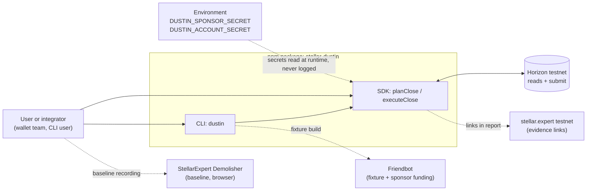
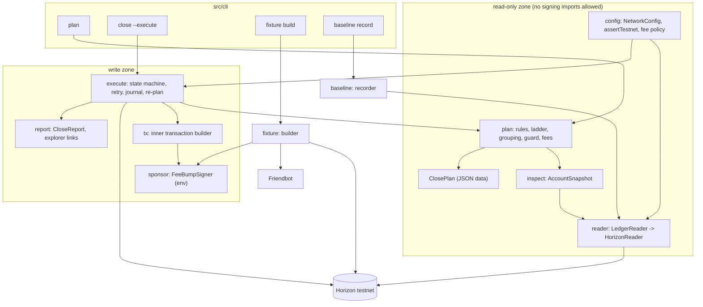
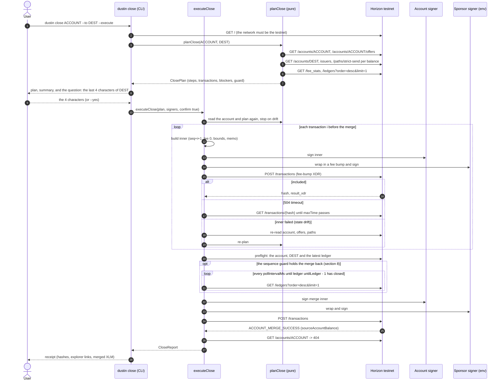

# Dustin Architecture

Dustin is a TypeScript SDK and CLI that closes messy Stellar classic (`G...`) accounts on testnet. It is deliberately boring technology: one npm package, one external dependency that matters (`@stellar/stellar-sdk`), one network (testnet), no server, no smart contract, no UI. Everything interesting lives in two places: the **ordering rules** that turn an account snapshot into a close plan, and the **fee-bump sponsor layer** that lets an account with zero spendable XLM pay for nothing.

This document is written for the builder and for AI agents implementing stories against it. Where a sentence states a protocol fact, it carries a reference number `[Fn]` that resolves in section 2 and in `## Sources`. Where a claim could not be verified it is marked **unverified**. Anything not in the accepted SOW is marked **stretch (outside SOW)**.

## 1. Scope recap

| Deliverable | What ships | Where it lives in this design |
|---|---|---|
| D1 `planClose()` | Read-only planner: ordered close plan, minimum transactions, reason and fee estimate per step, dry-run by default, can never mutate | Inspector, Planner, Ladder resolver, Plan data model (sections 4, 5, 6) |
| D2 `executeClose()` | Live close on testnet, every transaction fee-bumped by a sponsor, disposal ladder, sponsored trustline unwinding, `ACCOUNT_MERGE_SEQNUM_TOO_FAR` guard, retry and failure recovery | Transaction builder, Sponsor layer, Executor, Reporter (sections 4, 7, 8) |
| D3 | Fixture account (3 trustlines with dust, 2 open offers, 1 data entry, 1 sponsored trustline, zero spendable XLM), a deliberately illiquid asset, recorded baseline of the existing tool, test matrix | Fixture builder, Baseline recorder, ADR-0005 |
| D4 | README, integration notes, ordering-rules write-up, 60 s demo, evidence package, npm package | Reporter output, `docs/`, `evidence/` (section 9) |

Out of scope (SOW): mainnet, contract (`C...`) accounts, liquidity-pool share withdrawal, raised-threshold multisig automation, claimable-balance cleanup, production key management, wallet UI, third-party wallet integration. Dustin **detects and reports** the first four so that nothing fails silently.

Binary success metric (SOW Appendix B): one testnet account with zero spendable XLM, at least 3 trustlines with non-zero balances, at least 1 open offer and at least 1 data entry is fully closed and merged; every transaction is fee-bumped by the sponsor; the account no longer exists on a public explorer; the transaction chain is linkable from the evidence package.

## 2. Verified protocol facts the design rests on

Every rule in sections 5 to 8 is derived from one of these. Values were checked on 2026-09-25 against the linked sources; live observations are labelled as such.

| Ref | Fact | Source |
|---|---|---|
| F1 | A transaction bundles 1 to 100 operations and is atomic: if one operation fails, none are applied. Operations run for the transaction source unless an operation-level source is set. | [S1] |
| F2 | The network minimum fee is 100 stroops per operation; the effective fee is the per-operation fee times the operation count. Testnet shows surge pricing: `fee_stats` on 2026-09-25 reported `last_ledger_base_fee=100`, `fee_charged.p50=17075`, `p90=212857`, `p99=2760015` stroops. | [S2], [S3], live observation |
| F3 | Fee-bump validity: the fee must be at least the network minimum for (inner operations + 1); it must also be at least the inner transaction's fee; the fee account must exist, hold enough XLM and sign the outer envelope. The inner fee may be below the minimum (CAP-0015). Replace-by-fee of a queued transaction needs 10x the fee bid. Results are `txFEE_BUMP_INNER_SUCCESS` / `txFEE_BUMP_INNER_FAILED`. | [S4], [S5] |
| F4 | JS SDK: `TransactionBuilder.buildFeeBumpTransaction(feeSource, baseFee, innerTx, networkPassphrase)`; `baseFee` is per operation and the total is `baseFee * (innerOps + 1)`; the SDK rejects a `baseFee` below `BASE_FEE` or below the inner inclusion fee, and requires time bounds on the inner transaction when it has to convert a v0 envelope (Dustin always sets them). | [S6] |
| F5 | `AccountMerge` is a high-threshold operation. It fails with `ACCOUNT_MERGE_HAS_SUB_ENTRIES` while trustlines, offers or data entries remain (signers are removed automatically), `ACCOUNT_MERGE_IMMUTABLE_SET` if `AUTH_IMMUTABLE` is set on the merged account, `ACCOUNT_MERGE_IS_SPONSOR` if the account sponsors reserves (`numSponsoring > 0`), `ACCOUNT_MERGE_SEQNUM_TOO_FAR` if the account sequence number is not below `ledgerSeq << 32`, `ACCOUNT_MERGE_NO_ACCOUNT` if the destination does not exist, `ACCOUNT_MERGE_DEST_FULL`, `ACCOUNT_MERGE_MALFORMED` (self-merge). | [S7], [S8], [S9] |
| F6 | In stellar-core the merge check is `sourceAccount.seqNum >= getStartingSequenceNumber(header)` where the starting sequence number of a ledger is `ledgerSeq << 32`; the source account entry is removed with `removeEntryWithPossibleSponsorship`, so an account whose own reserve is sponsored can still be merged and the sponsor's `numSponsoring` is decremented. The merge result carries `sourceAccountBalance`. | [S9] |
| F7 | `ChangeTrust` with `limit=0` fails with `CHANGE_TRUST_INVALID_LIMIT` while balance or buying liabilities remain, `CHANGE_TRUST_CANNOT_DELETE` while a liquidity pool references the trustline, `CHANGE_TRUST_NOT_AUTH_MAINTAIN_LIABILITIES` on a deauthorized trustline. Medium threshold. | [S7], [S10] |
| F8 | `Payment` and `PathPaymentStrictSend` fail with `*_SRC_NOT_AUTHORIZED` when the sender's trustline is not authorized; a trustline in `AUTHORIZED_TO_MAINTAIN_LIABILITIES` state may keep and delete offers but cannot send (CAP-0018). Full deauthorization removes the account's offers for that asset. | [S7], [S11] |
| F9 | `PathPaymentStrictSend`: `destMin` bounds slippage (`UNDER_DESTMIN`), `TOO_FEW_OFFERS` when no path exists, `OFFER_CROSS_SELF` when the path would cross the sender's own offer. stellar-core has no rule rejecting `destination == source`; only own-offer crossing is rejected. | [S7], [S12] |
| F10 | Clawback: `TRUSTLINE_CLAWBACK_ENABLED_FLAG` is fixed at trustline creation from the issuer's `AUTH_CLAWBACK_ENABLED`; the issuer can clear it later but cannot set it; `Clawback` burns from a trustline without the holder's signature; the issuer must also have `AUTH_REVOCABLE`. | [S13] |
| F11 | Sponsored reserves: minimum balance is `(2 + numSubEntries + numSponsoring - numSponsored) * baseReserve + liabilities.selling`. When a sponsored entry is removed, `numSponsoring` on the sponsor and `numSponsored` on the owner both decrease, so the reserve unlocks on the sponsor, never on the owner. `RevokeSponsorship` fails with `LOW_RESERVE` when the new payer cannot afford the entry and `ONLY_TRANSFERABLE` for claimable balances. | [S14], [S15] |
| F12 | Base reserve is 0.5 XLM; an account needs 2 base reserves (1 XLM) plus 1 per subentry. | [S16] |
| F13 | SEP-29: an account marks itself memo-required with data entry `config.memo_required` = `1`; clients must refuse `PAYMENT`, both path payments and `ACCOUNT_MERGE` to such a destination without a memo. The JS SDK's `submitTransaction` performs this check (unwrapping a `FeeBumpTransaction` to its inner transaction) and throws `AccountRequiresMemoError`; `skipMemoRequiredCheck` disables it. | [S17], [S18] |
| F14 | Horizon rate limiting is per IP, `PER_HOUR_RATE_LIMIT` default 3600 requests/hour, HTTP 429 when exceeded; streaming updates count as requests. The exact limit configured on the SDF public testnet instance is **unverified** (no rate-limit headers were observed on 2026-09-25). | [S19], live observation |
| F15 | Horizon `POST /transactions` returns HTTP 504 (`timeout`) when inclusion is not confirmed in time; the transaction may still be included later and the documented remedy is to resubmit the same transaction with the same sequence number. `POST /transactions_async` returns `tx_status` in `PENDING`, `DUPLICATE`, `TRY_AGAIN_LATER`, `ERROR`. Failed submissions expose `extras.result_codes.transaction`, `.inner_transaction` (fee bumps) and `.operations`. The SDK's submit timeout defaults to 60 s. | [S20], [S21], [S22], [S18] |
| F16 | Horizon account resource exposes `sequence`, `sequence_ledger`, `sequence_time`, `subentry_count`, `sponsor`, `num_sponsoring`, `num_sponsored`, `thresholds`, `flags` (incl. `auth_immutable`), `signers[].sponsor`, `data`, and per-balance `sponsor`, `limit`, `buying_liabilities`, `selling_liabilities`, `is_authorized`, `is_authorized_to_maintain_liabilities`, `is_clawback_enabled`, `liquidity_pool_id`. `GET /accounts/{id}/offers`, `GET /accounts/{id}/data/{key}` (404 when absent) and `GET /paths/strict-send` (`destination_account` xor `destination_assets`) exist on testnet. | [S23], [S22], [S24], live observation |
| F17 | Stellar RPC `getLedgerEntries` reads Account, Trustline, Offer and Data entries by exact `LedgerKey` (max 200 per call); keys must be known in advance, there is no enumeration. `LedgerEntry.ext.v1.sponsoringID` carries entry-level sponsorship. | [S25], [S26] |
| F18 | Testnet: Horizon `https://horizon-testnet.stellar.org`, RPC `https://soroban-testnet.stellar.org`, Friendbot funds 10,000 XLM, passphrase `Test SDF Network ; September 2015`; resets 2 to 4 times per year at 17:00 UTC (next announced: 2026-12-16) wiping all ledger entries and history; SDF does not guarantee availability. Ledgers close every ~5 s (observed 5 s cadence on 2026-09-25). | [S27], [S28], live observation |
| F19 | `@stellar/stellar-sdk` 17.1.0 is npm `latest` (2026-09-14), `engines.node >= 22.12.0`, ESM-first with a CJS build. | [S29] |
| F20 | The existing tool (StellarExpert Account Demolisher) is MIT-licensed client code inside the explorer monorepo: every transaction is sourced from and paid by the closed account (`fee: this.baseFee`, 100 to 200 stroops), order is data entries, offers, sell assets, trustlines (unsold balances returned to issuer), merge; the final merge is sent to a server endpoint for approval; no sponsorship, liquidity-pool or claimable-balance handling; no preview step; secret keys are pasted into the browser. The server-side approval rule (the SOW's "declines to co-sign below 1 XLM") is not visible in the public repository, but it was confirmed behaviourally on 2026-09-25 by a black-box probe of the testnet co-sign endpoint (payouts of 0.5 and 0.9999999 XLM were rejected with HTTP 400 "Transaction is invalid", payouts of 1 and 5 XLM were signed), see docs/analysis/competitive-landscape.md; the server code stays private, so the rule is inferred from behaviour. | [S30], [S31], [S32] |

## 3. System context



No other runtime dependency exists. Stellar RPC is not on the critical path (ADR-0004). There is no database: the ledger is the only state of record, and an optional local journal file only accelerates resume and feeds the evidence package. As built, there is no journal and no resume option: running a close again is the resume, and the CLI's `--report` file and the SDK's `onReport` copies keep the hashes for the evidence (PRD decision D-2).

## 4. Components

Each component is a module with one public surface. Module boundaries are enforced with ESLint `no-restricted-imports` so that read-only modules cannot reach signing or submission code (section 6.3).

### 4.1 Network configuration and guards (`src/config`)

- Single `NetworkConfig` for testnet: Horizon URL, passphrase `Test SDF Network ; September 2015`, Friendbot URL, explorer base URL [F18].
- `assertTestnet()` runs on every public entry point. Any passphrase other than testnet, and any Horizon URL outside the allowlist (`horizon-testnet.stellar.org` plus an explicit `DUSTIN_HORIZON_URL` override that must still answer the testnet passphrase on `GET /`), raises `MainnetRefusedError`. There is no override flag in SOW scope.
- Fee policy defaults (policy, not protocol): `baseFee = clamp(max(fee_stats.last_ledger_base_fee, fee_stats.fee_charged.p80), 100, maxBaseFeeStroops=1_000_000)`; `sponsorBudgetStroops = 50_000_000` (5 XLM) per close; inner time bounds 120 s. The p80 pick is a heuristic against the surge pricing observed on testnet [F2]; the budget cap is what makes a runaway retry loop impossible.

### 4.2 Inspector (`src/inspect`)

Turns Horizon responses into an immutable `AccountSnapshot`. It depends only on a `LedgerReader` interface:

```ts
interface LedgerReader {
  account(id: string): Promise<HorizonAccount | null>;       // GET /accounts/{id}
  offers(id: string): Promise<HorizonOffer[]>;              // GET /accounts/{id}/offers (paged)
  dataEntry(id: string, key: string): Promise<string | null>; // GET /accounts/{id}/data/{key}
  strictSendPaths(src: Asset, amount: string, dest: string | Asset[]): Promise<PathRecord[]>;
  claimableBalancesSponsoredBy(id: string): Promise<number>; // GET /claimable_balances?sponsor=
  liquidityPool(id: string): Promise<HorizonPool | null>;   // GET /liquidity_pools/{id}
  feeStats(): Promise<FeeStats>;                             // GET /fee_stats
  latestLedger(): Promise<{ sequence: number; closedAt: string }>;
}
```

What the snapshot contains and why:

| Field | Source | Used by |
|---|---|---|
| `sequence`, `sequenceLedger`, `sequenceTime` | account [F16] | sequence guard (section 8), inner tx numbering |
| `subentryCount`, `numSponsoring`, `numSponsored`, `sponsor` | account [F16] | merge blockers, reserve accounting |
| `thresholds`, `signers[]` (weight, sponsor), `masterWeight` | account [F16] | signing-authority check (medium for cleanup ops, high for merge [F5], [F7]) |
| `flags.authImmutable` | account [F16] | `ACCOUNT_MERGE_IMMUTABLE_SET` blocker [F5] |
| `balances[]`: asset, balance, limit, liabilities, `isAuthorized`, `isAuthorizedToMaintainLiabilities`, `isClawbackEnabled`, `sponsor`, `liquidityPoolId` | account [F16] | ladder, ordering, reserve accounting, LP detection |
| `offers[]`: id, selling, buying, amount, price | offers endpoint [F16] | cancel steps, liabilities reasoning |
| `data{}`: key, base64 value | account [F16] | remove-data steps |
| `issuerAccounts{}`: flags, exists, memoRequired | one account read per distinct issuer | ladder rung 2 |
| `destination`: exists, memoRequired, trustlines (asset, `isAuthorized`, free capacity `limit - balance - buying_liabilities`) | account + data reads [F13], [F16] | merge preflight, ladder rung 3 |
| `quotes{}`: strict-send path to XLM for every non-native, non-pool balance | paths endpoint [F16] | ladder rung 1 |
| `feeStats`, `ledger` | fee_stats, ledgers | fee estimate, guard ETA |

Data-entry sponsorship is not exposed by the Horizon account resource. For the SOW the inspector infers it from `num_sponsored` minus the visible sponsored balances, signers and (if `sponsor` is set on the account) the two account reserves; per-entry precision through RPC `getLedgerEntries` (`LedgerEntry.ext.v1.sponsoringID`) [F17] is **stretch (outside SOW)**. This only affects the reserve-attribution line of the report, never correctness of the close: removing a data entry is legal regardless of who sponsors it.

Request budget: a full snapshot costs 1 (account) + ceil(offers/200) + 1 per distinct issuer + 2 (destination + memo key) + 1 per non-native balance (paths) + 2 (fee_stats, ledgers). For the SOW fixture that is 10 to 12 requests, versus a 3600/hour default budget [F14]. A single close, including re-plans, stays well under 100 requests.

### 4.3 Planner (`src/plan`)

Pure function: `plan(snapshot, options) -> ClosePlan`. No I/O, no clock, no randomness, no keys. It runs the rules of section 5 in this order:

1. **Blockers** (section 5.3): things that make a full close impossible today. Each blocker has a code from ADR-0006, a human reason and a remedy. If any blocker is permanent, `outcome = "blocked"`; the plan still lists every safe cleanup step so the user can shrink the account.
2. **Signing authority**: with the signer set the user will provide (default: master key only), compute whether medium and high thresholds are reachable. Raised thresholds are reported, never automated (SOW).
3. **Step synthesis** per subentry: cancel-offer, dispose-balance (through the ladder, section 4.4), remove-trustline, remove-data, and finally merge.
4. **Dependency edges** (section 5.1) and **grouping** (section 5.2) into transactions.
5. **Fee estimate** per step and per transaction, **recovery projection**, **sequence guard** evaluation (section 8).

The planner is the single place where ordering knowledge lives. The executor never reorders; it only re-plans from fresh chain state.

### 4.4 Disposal-ladder resolver (`src/plan/ladder.ts`)

For each non-native balance `b > 0` the ladder picks the first rung whose preconditions hold in the snapshot. The SOW fixes the rung order.

| Rung | Method | Preconditions checked in the snapshot | Protocol failure it avoids |
|---|---|---|---|
| 1 | `pathPaymentStrictSend(sendAsset=b.asset, sendAmount=b.balance, destination=self, destAsset=XLM, destMin=quote*(1-slippage))` | trustline `isAuthorized`; Horizon returned at least one path with `destination_amount >= 0.0000001`; no hop of the quoted path could use one of the account's own offers, which the plan cancels first (edge case B-24) | `SRC_NOT_AUTHORIZED`, `TOO_FEW_OFFERS`, `UNDER_DESTMIN`, `OFFER_CROSS_SELF` [F8], [F9] |
| 2 | `payment(destination=issuer, amount=b.balance)` (burn) | trustline `isAuthorized` (auth-required assets can only be moved by authorized holders); if the issuer is SEP-29 memo-required the transaction carries a memo [F13]. The issuer account does not have to exist: a payment to an issuer that was merged away succeeds and burns the balance (day-1 experiment 4, `docs/progress-log.md`; `docs/README.md` open question 3, resolved 2026-09-26) | `PAYMENT_SRC_NOT_AUTHORIZED` [F8] |
| 3 | `payment(destination=merge destination, amount=b.balance)` | destination holds a trustline for the asset, `isAuthorized`, free capacity `limit - balance - buying_liabilities >= amount` | `PAYMENT_NO_TRUST`, `PAYMENT_NOT_AUTHORIZED`, `PAYMENT_LINE_FULL` [F7] |
| 4 | **unclosable** | none of the above | reported with the concrete reason from every rung, e.g. `NO_PATH` + `ISSUER_NOT_AUTHORIZED` + `DEST_NO_TRUSTLINE` |

Design choices worth stating:

- Rung 1 sends the proceeds to the **closing account itself**. stellar-core has no rule against `destination == source` [F9]; native XLM needs no trustline; the proceeds then leave through the merge. This keeps one delivery to the destination (the merge), one SEP-29 memo consideration, and one "recovered XLM" number. Sending proceeds straight to the destination is a one-line change if an integrator prefers it.
- Slippage default 1%; `destMin` is never below 1 stroop. A best quote below 1 stroop rules rung 1 out and the balance falls to rung 2, because the protocol cannot deliver less than one stroop. As built, the inspector keeps such a quote and the ladder rules the sale out with its own reason, "the best strict-send quote pays less than 1 stroop of XLM for the full balance", and the fix "wait for a market that pays at least 1 stroop of XLM for <balance> <code>", so the plan no longer says that Horizon found no path (closing review CP-5). A quote whose path may use one of the account's own offers, which the plan cancels first, is not trusted either; its fix says to cancel that offer with a `--partial` run and plan again (edge case B-24; closing review CP-6).
- `is_authorized_to_maintain_liabilities` without `is_authorized` cannot send anything [F8]: rungs 1 to 3 are all skipped and the reason says so.
- Clawback-enabled trustlines change nothing in the ladder [F10]; they are flagged in the plan because the issuer can change the balance between plan and execution, which is exactly what the re-plan loop handles.
- Liquidity-pool shares (`liquidity_pool_id` set): a non-zero share balance is a blocker (withdrawal is out of scope) and additionally blocks removal of the two constituent trustlines (`CHANGE_TRUST_CANNOT_DELETE`) [F7]; a zero-balance pool-share trustline is just a trustline and is removed normally. When Horizon does not return the pool (404), the planner derives its two assets from the pool id (the SHA-256 of the constant-product parameters, tried over every pair of XLM and the account's trustline assets); if no pair matches, every credit trustline is kept as `POOL_ASSET_TRUSTLINE`, so no transaction can fail on `CHANGE_TRUST_CANNOT_DELETE` (review finding R13).

### 4.5 Transaction builder (`src/tx`)

Turns a `PlannedTransaction` (an ordered list of step ids) into an unsigned inner `Transaction`:

- Source = the closing account; sequence = `snapshot.sequence + txIndex + 1` (every inner transaction consumes one sequence number of the closing account [F1]).
- `fee = baseFee` per operation (the SDK multiplies by operation count) [F4]. The closing account never pays it (F3), but the SDK requires the outer `baseFee` to be at least the inner inclusion fee, so both use the same `baseFee`.
- Time bounds `maxTime = now + 120 s` (always set: the SDK needs them for v0 envelope conversion [F4], and they are the basis of safe rebuilds, section 7.3). Optional `ledgerbounds` are not used.
- Memo: the user's memo if given; otherwise none. If the destination or an issuer in the plan is memo-required and no memo was given, the plan carries a `DESTINATION_REQUIRES_MEMO` blocker rather than inventing one, because custodial memos identify the beneficiary [F13]. The SDK-level check stays enabled as a second line of defence [F13].
- Operation mapping: `cancel-offer -> manageSellOffer({selling, buying, amount: "0", price: "1", offerId})` using the offer's own assets (an `OfferEntry` records no buy/sell origin [S26]; the matrix contains a case for an offer created with `manageBuyOffer`); `dispose-balance -> pathPaymentStrictSend | payment`; `remove-trustline -> changeTrust({asset, limit: "0"})` (also for `LiquidityPoolAsset`); `remove-data -> manageData({name, value: null})`; `merge -> accountMerge({destination})`.
- Hard limit: at most 100 operations per transaction [F1]; the builder throws if the planner ever hands it more, as a defence in depth.

### 4.6 Sponsor / fee-bump layer (`src/sponsor`)

```ts
interface FeeBumpSigner {
  publicKey(): string;
  signFeeBump(innerXdr: string, baseFeeStroops: number): Promise<string>; // returns signed fee-bump XDR
}
```

- `EnvSponsor` reads `DUSTIN_SPONSOR_SECRET` once, keeps a `Keypair` in memory, and never serialises it. This is the SOW's "env key".
- Construction: `TransactionBuilder.buildFeeBumpTransaction(sponsorPublicKey, baseFee, innerTx, passphrase)` then `feeBump.sign(sponsorKeypair)` [F4]. Total fee `= baseFee * (ops + 1)`; the sponsor pays all of it; the inner source pays nothing [F3].
- Preconditions asserted before signing: the inner transaction hash matches one the executor built in this run (the sponsor never signs foreign content); projected cumulative fees `<= sponsorBudgetStroops`; sponsor balance minus its own minimum balance `>=` this fee [F11], [F12].
- Fee escalation: if a submission expires unincluded, the executor rebuilds the inner transaction (same sequence, fresh time bounds) and wraps it at `min(baseFee * 2, maxBaseFeeStroops)`. It never tries to replace a still-queued transaction, which would need 10x [F3]; it waits for the time bound to pass instead.
- The interface exists so that a hosted sponsor can be dropped in later. That service is **stretch (outside SOW)** and its abuse controls are specified in ADR-0002.

### 4.7 Executor (`src/execute`)

A small state machine. States as built: `Approval -> Inspect -> Plan (drift check) -> Submit(i) -> Confirm(i) -> [next | Replan | Stop] -> PreMerge -> Submit(merge) -> Verify -> Report`. `Approval` happens once, before anything is signed and outside the executor: the CLI shows the fresh plan and a summary and asks the user to type the last four characters of the destination address (canonical decision 4; `--yes` replaces the question), and an SDK caller passes `confirm: true` after its own approval. There is no second confirmation before the merge. What runs is what was approved because the executor plans again and stops on drift (`onDrift: "abort"` by default), including a lower recovered amount (review finding BH-7). `PreMerge` is the merge preflight (`src/execute/preflight.ts`); when the sequence guard is the only check that fails, the executor waits there for the ledger before it submits the merge (section 8).

Per transaction `i`:

1. Build inner (4.5), sign with the account signer(s), wrap and sign with the sponsor (4.6), record `{planHash, i, innerHash, outerHash, submittedAt}` in the journal.
2. `POST /transactions` via `Horizon.Server.submitTransaction(feeBump)` (SEP-29 check on) [F13].
3. Outcomes (mapping in ADR-0006):
   - **Success**: read `result_xdr`; for the merge read `sourceAccountBalance` [F6] as the recovered amount.
   - **HTTP 504 / network error**: poll `GET /transactions/{outerHash}` every ~2 s until the inner `maxTime` plus one ledger has passed [F15]. If found: success path. If not: rebuild with fresh time bounds and escalated fee, same sequence.
   - **`tx_bad_seq`**: either the transaction was applied after all (poll by hash), or the account moved (re-plan).
   - **`tx_too_late` / `tx_insufficient_fee`**: rebuild (fresh bounds, escalated fee).
   - **`tx_fee_bump_inner_failed` with operation codes** [F15]: classify. State drift (`op_underfunded`, `op_offer_not_found`, `op_invalid_limit`, `op_too_few_offers`, `op_under_dest_min`, `op_cross_self`, `op_src_not_authorized`, `op_line_full`, `op_no_trust`, ...) means the snapshot is stale or the ladder rung is no longer viable: re-inspect and re-plan (max `maxReplans = 3`). The new plan naturally omits everything already applied and moves a failed rung-1 asset to rung 2, and so on. Permanent errors stop the run with a partial report.
   - **Budget exceeded / `MainnetRefused` / signer errors**: stop immediately.
4. "Step 3 of 5 fails" therefore never leaves the executor guessing: transactions 1 and 2 are on the ledger, transaction 3 was atomic and did nothing [F1], and the next plan is computed from what the ledger says now. Resume after a crash is the same thing: run again; the journal contributes the hashes of transactions 1 and 2 to the evidence package, the ledger contributes the truth. (As built, the report copies published through `onReport`, and the CLI's `--report` file, play the journal's part; there is no resume option, PRD decision D-2.)

Idempotency argument: an inner transaction is pinned to one sequence number, so the same signed envelope can be submitted any number of times and applies at most once [F1], [S5]; a rebuilt envelope for the same sequence can only apply if the earlier one expired unapplied (time bounds). Concurrency is not supported: two executors on one account race on sequence numbers; the CLI takes a lock file per account (**stretch**: none needed for the SOW).

### 4.8 Reporter (`src/execute/report.ts`, `src/render/`)

As built (PRD decision D-18 synced this document with the code): there is no `src/report` module; the `CloseReport` is built by the executor (`src/execute/report.ts`, `src/execute/summary.ts`) and rendered for people by `src/render/report-text.ts`, the plan by `src/render/plan-text.ts`; the links come from the configured explorer base.

`CloseReport` (JSON, safe to publish): plan hash, network, account, destination, per-transaction `{outerHash, innerHash, ledger, opCount, feePaidStroops, explorerUrl}`, sponsor total, recovered XLM (from the merge result), reserves released to each sponsor, unclosable items with reasons, blockers, and the final account state (`GET /accounts/{id}` -> 404 proves the merge). Explorer links use `https://stellar.expert/explorer/testnet/tx/{outerHash}` and `/account/{id}` (both resolve on 2026-09-25; the explorer is a single-page app, so link resolution was observed rather than documented). Because a testnet reset erases everything [F18], the evidence package also stores the Horizon JSON of every transaction, the envelope and result XDR, and screenshots.

### 4.9 CLI (`src/cli`)

`dustin` (bin of the `stellar-dustin` package). The commands and options listed here are the ones that are built (PRD decision D-13); PRD section 6 has the exit codes of each.

- `dustin plan <G...> --to <G...> [--sponsor <G...>] [--prefer-destination] [--memo m] [--base-fee n] [--json]` reads only; prints the plan as a table and, with `--json`, the exact `ClosePlan` document (`schemas/plan-schema.json`). No secret is read and `.env` is never opened.
- `dustin close <G...> --to <G...> [--execute] [--yes] [--partial] [--sponsor <G...>] [--prefer-destination] [--memo m] [--base-fee n] [--json] [--report file]`. Without `--execute` it behaves like `plan`. With it, it requires `DUSTIN_ACCOUNT_SECRET` and `DUSTIN_SPONSOR_SECRET`, from the environment, else from `.env` in the working directory, else from a hidden prompt when standard input and standard error are terminals and `--json` is not given (canonical decision 4; PRD decision D-11): the readline interface writes to a stream that drops everything, so nothing typed is echoed, and it keeps no history. There is one typed confirmation, before anything is signed (canonical decision 4): after the fresh plan and a summary (the destination and the XLM it receives, the sponsor, the bid and the close budget), the user types the last four characters of the destination address. It is asked only when standard input, standard error and standard output are terminals; otherwise, or on a wrong answer, nothing is signed and the command exits 3. `--yes` replaces the question for scripts and the demo recording, is honoured only with `--execute`, and is printed loudly. There is no second confirmation before the merge. `--report` keeps the close report as JSON in a file, updated as the run goes (`schemas/receipt-schema.json`). An account Horizon answers 404 for asks nothing: the executor records the 404 in the report and the command exits 3 (review AA-13).
- Machine mode, `--json` on `plan` and `close` (review AA-10): standard output carries one JSON document (the plan, or the close report once the executor has one), standard error NDJSON only, one object per line with a `type`: the executor's events (the `plan` event compact: hash, round, status, counts), `notice` lines and one `error` line (`code`, `message`, `remedy`, `exitCode`) for the error or stop the command ends with; when standard output was closed early, the document follows on standard error as one `document` line after a `notice`. Nothing is asked: `close --execute --json` needs `--yes` (else `CONFIRMATION_REQUIRED`, exit 3). All output goes through one writer, `src/cli/channel.ts`, which redacts every line. `--verbose` (global) adds an error's full detail: stage, verdict, Horizon's result codes, details, cause chain (story E4-S2).
- Signals (review CL-1; Epic 4 review EX-9): `close --execute` handles SIGINT and SIGTERM from its start (https://nodejs.org/api/process.html#signal-events: a listener replaces the default exit). Before the executor runs, nothing is signed: a signal ends the command at its next step with the error code `INTERRUPTED` and exit 3, and a second signal exits 3 at once. While the executor runs, a signal is an abort of `ExecuteOptions.signal`: the executor, which checks it right before every submission, stops at its next safe point and returns its report with the stop `INTERRUPTED`, which is printed and kept; the exit code follows the report (3 nothing submitted, 5 otherwise, 0 if the close had completed). A second signal then writes the latest report copy synchronously and exits 5; with `--json` it prints the one document. While the hidden prompt or the typed confirmation waits, the handlers step aside, so Ctrl-C is that prompt's answer. The handlers are removed when the command ends; the signal source and the exit are injected (`CliDeps.signals`, `CliDeps.exit`), so tests send no real signal.
- `dustin fixture create [--profile messy|edge] [--dir path] [--out file] [--json]` builds the D3 accounts (4.10) and writes the public manifest, the keys (mode 600, gitignored) and the recorded Horizon JSON under `--dir` (default `.fixture`).
- `dustin fixture verify <manifest> [--snapshot file] [--json]` re-checks a fixture against SOW Appendix B, read-only; a file that is not a manifest is `MANIFEST_INVALID` (exit 2), and a testnet reset is `RESET_SUSPECTED` (exit 3) when none of the manifest's accounts exists and either Horizon's latest ledger is more than 120 ledgers behind the recorded one or none of them has history.
- `--to` is canonical, `--destination` its alias; the global options are `--network testnet`, `--verbose` and `--no-color` (accepted, and it changes nothing), with `--help` and `--version`. Output is plain ASCII, never coloured (`docs/ux-design.md` principle P6), wrapped at 120 columns with hashes and URLs whole. A usage error prints the command's help, then `dustin: USAGE_ERROR: ...` and its remedy. An explorer base (`DUSTIN_EXPLORER_BASE`) that names another network is refused (`MAINNET_REFUSED`, exit 2), and the check that Horizon serves the testnet retries as the read client does. Exit codes and every error and stop code: `docs/errors.md`. The baseline recording is a manual protocol (`evidence/baseline/README.md`, section 4.11), not a command.

### 4.10 Fixture builder (`src/fixture`)

Builds deterministic testnet accounts from a friendbot-funded sponsor. Profile `messy` (success-metric fixture):

- Sponsor creates the fixture inside a `beginSponsoringFutureReserves / endSponsoringFutureReserves` sandwich so the account entry reserve is sponsored; `startingBalance` is set so that after all entries are added the balance equals the minimum balance exactly (zero spendable). A `--literal-zero` variant sponsors every entry so the minimum balance is 0 and the account literally holds 0 XLM [F11].
- Three throwaway issuers: `LIQ` (a market exists: the sponsor posts a standing XLM bid so rung 1 works), `RET` (no market, issuer accepts returns: rung 2), `SPN` (held through a sponsored trustline, sponsor = the sponsor account: rung 2 with the reserve unlocking on the sponsor). Dust amounts such as `0.0000123`.
- Two open offers selling `LIQ` and `RET` for XLM at absurd prices (never filled; they create selling liabilities, so the ordering rule "offers before balances" is exercised). One created with `manageBuyOffer` to cover the cancellation mapping.
- One data entry `dustin.fixture = 1`.
- Profile `edge` adds the deliberately illiquid and unreturnable asset `ILLQ`: throwaway issuer with `AUTH_REQUIRED | AUTH_REVOCABLE`, trustline funded then deauthorised with `setTrustLineFlags`; no market; destination holds no trustline. This asset must exit through rung 4. It also adds a `bumpSequence` variant for the sequence guard, a clawback-enabled asset, a pool-share trustline with a non-zero balance, and a raised-threshold variant (`setOptions` high threshold above master weight).

Every fixture transaction is itself fee-bumped by the sponsor, so the same layer is exercised before the first close. The builder writes `fixture.json` (public keys, asset codes, issuers, offer ids); secrets stay in memory or in a `.env` file that is git-ignored.

As built (PRD decision D-18): the recipe differs from the design above. The `messy` fixture (`src/fixture/messy.ts`, `src/fixture/builder.ts`) is built by a fee sponsor from Friendbot with one issuer of four assets, DUSTA (sold to a market maker's standing bid: rung 1), DUSTB and DUSTC (returned to the issuer: rung 2) and SPTA (held through a trustline whose reserve a separate reserve sponsor pays), two open offers, one data entry `dustin.fixture`, and a drain to exactly the minimum balance; the `edge` fixture (`src/fixture/edge.ts`, `src/fixture/edge-builder.ts`) is one throwaway account per edge case, thirteen variants from one Friendbot call. Every key is new, from `Keypair.random()`; `dustin fixture create` writes the public `manifest.json`, the recorded Horizon JSON and `keys.json` (mode 600) under `.fixture/<id>/`, which git ignores. Integrators reach the same builders, their checks and a reader over the recorded responses through `stellar-dustin/testing` (`src/testing.ts`).

### 4.11 Baseline recording

The Demolisher is a browser tool [F20]; the baseline is a recorded manual run. As built there is no `src/baseline` module and no `dustin baseline record` command (PRD decision D-13): the protocol is `evidence/baseline/README.md`, and `dustin fixture verify --snapshot` snapshots the fixture before and after. The protocol names the exact steps and the expected stopping point (the closed account cannot pay the first transaction's fee: `tx_insufficient_balance` or an equivalent client-side error, since its transactions are sourced from and paid by that account [F20]). Two identical `messy` fixtures are built so the baseline run and the Dustin run start from the same state.

### 4.12 Component diagram



### 4.13 Sequence of a full close



As built there is one confirmation, before anything is signed (canonical decision 4); the merge runs without a second question once the preflight passes (section 4.7).

## 5. Ordering rules and transaction grouping

### 5.1 Dependency rules

| Rule | Statement | Why (protocol) |
|---|---|---|
| R1 | Cancel every offer before disposing of any balance and before removing any trustline. | Offers create selling liabilities (a payment of the full balance would be `UNDERFUNDED`) and buying liabilities (`CHANGE_TRUST_INVALID_LIMIT`) [F7]; a path payment that crosses the account's own offer fails with `OFFER_CROSS_SELF` [F9]; offers are subentries that block the merge [F5]. |
| R2 | Dispose of a balance before removing its trustline; the disposal must leave exactly zero. | `CHANGE_TRUST_INVALID_LIMIT` when balance remains [F7]. Strict-send with `sendAmount = balance` and a full-balance `payment` both leave exactly zero when they succeed, so the removal may follow in the same transaction. |
| R3 | Remove the trustline of a sponsored asset exactly like any other; do not `revokeSponsorship`. | The owner may remove its own sponsored entry; the sponsor's `numSponsoring` is decremented and its reserve unlocks [F11]. A `revokeSponsorship` by the owner would fail (`NOT_SPONSOR`) and by the sponsor could fail with `LOW_RESERVE` because the owner cannot afford the reserve [F11]. |
| R4 | Data entries may be removed at any point before the merge. | `manageData` with a null value has no dependency on balances or offers; it is a subentry that blocks the merge [F5]. |
| R5 | Signers are left alone. | The merge removes signers automatically; only trustlines, offers and data entries count as blocking subentries [F5]. |
| R6 | Pool-share trustlines with a balance are blockers; their constituent asset trustlines cannot be removed while the pool reference exists. | Withdrawal is out of scope; `CHANGE_TRUST_CANNOT_DELETE` [F7]. |
| R7 | The merge is the last operation of the last transaction and is preceded by a fresh preflight: `subentry_count == 0` after the earlier operations, `num_sponsoring == 0`, no `auth_immutable`, destination exists and is not the account, destination memo requirement satisfied, sequence guard passes. | Every `ACCOUNT_MERGE_*` failure code [F5], SEP-29 [F13]. |
| R8 | The sequence guard is evaluated for the sequence number the account will have when the merge applies, against the earliest ledger it can land in. | Section 8; [F5], [F6]. |
| R9 | An operation with a market dependency (rung 1) is never batched with operations of other assets. | Fault isolation: a failed path payment rolls back the whole transaction [F1] and changes the ladder outcome for exactly one asset; isolating it keeps the other cleanup on the ledger and makes the re-plan minimal. |

Rung 2 and rung 3 payments are deterministic given the snapshot (no market), so they belong to the deterministic phase together with offer cancellations, data removals and trustline removals.

### 5.2 Grouping algorithm

"Minimum number of transactions" is defined as the minimum subject to three constraints: the 100-operation limit [F1], fault isolation of market-dependent steps (R9), and a fresh preflight before the merge (R7).

1. **Phase U (unwind, deterministic)**: all cancel-offer, remove-data, rung-2 and rung-3 payments, and every trustline removal whose balance is zero in the snapshot or becomes zero inside phase U. Order inside the phase: offers, payments, trustline removals, data (any position). Packed into `ceil(n / 100)` transactions without breaking a payment/removal pair across the boundary.
2. **Phase C (convert, market-dependent)**: one transaction per rung-1 asset: `[pathPaymentStrictSend(full balance -> XLM, self), changeTrust(limit 0)]`.
3. **Phase M (merge)**: if phase C is empty and the last phase-U transaction has fewer than 100 operations, the merge is appended to it and a simple messy account closes in **one** fee-bumped transaction. Otherwise the merge is its own final transaction, because a phase-C failure changes the plan and the merge must follow a fresh inspection. `separateMerge: true` forces a separate merge transaction for integrators who want a distinct confirmation step on the ledger.

Worked example, SOW `messy` fixture (assets `LIQ` rung 1, `RET` rung 2, `SPN` rung 2 sponsored; offers o1, o2; data k):

| Tx | Phase | Operations | Fee at `baseFee=100` |
|---|---|---|---|
| 0 | U | cancel o1, cancel o2, remove data k, payment RET -> issuer, changeTrust RET 0, payment SPN -> issuer, changeTrust SPN 0 (reserve unlocks on the sponsor) | 7 ops + 1 bump = 800 stroops |
| 1 | C | pathPaymentStrictSend LIQ -> XLM (self), changeTrust LIQ 0 | 2 ops + 1 bump = 300 stroops |
| 2 | M | accountMerge -> destination | 1 op + 1 bump = 200 stroops |

Sponsor total 1,300 stroops (0.00013 XLM); the closed account pays nothing; recovered XLM = its whole balance (the reserve it held) plus the LIQ proceeds. Surge pricing scales all three numbers by the same `baseFee` [F2].

Why some steps are separate transactions, precisely: not because a path payment's result is needed before the trustline removal (a successful strict-send of the full balance leaves exactly zero, so the removal is legal in the same transaction, [F7], [F9]) but because a path payment is the only step that can fail for reasons outside the account's control, and atomicity would take the deterministic cleanup down with it [F1].

### 5.3 Blockers (full close impossible today)

| Code | Condition in snapshot | Permanent? | Remedy shown |
|---|---|---|---|
| `AUTH_IMMUTABLE_SET` | `flags.auth_immutable` on the closing account | yes | none; the account can only be emptied, never merged [F5] |
| `IS_SPONSOR` | `num_sponsoring > 0` (includes claimable balances it sponsors) | yes for SOW | revoke or transfer those sponsorships from the sponsored accounts' side (`ONLY_TRANSFERABLE` for claimable balances) [F11] |
| `LP_SHARES_HELD` | pool-share balance > 0 | yes for SOW | withdraw from the pool, then rerun |
| `RAISED_THRESHOLDS` / `MASTER_KEY_DISABLED` | reachable weight < medium or high threshold, or master weight 0 | yes for SOW | supply the additional signers (out of scope) |
| `DESTINATION_MISSING` / `DESTINATION_IS_SELF` | destination 404 or equals the account | yes | fund the destination first; Dustin never creates it (it would need sponsor XLM and change the sponsor's blast radius) |
| `DESTINATION_REQUIRES_MEMO` | SEP-29 entry present, no memo supplied | no | pass `--memo` [F13] |
| `SEQNUM_TOO_FAR` | guard fails (section 8) | no | wait; ETA printed |
| `UNCLOSABLE_BALANCE` | any rung-4 asset | no | reasons per rung; typically the issuer must authorise the trustline again, or claw the balance back when the trustline is clawback-enabled (as built, the codes are `TRUSTLINE_NOT_AUTHORIZED`, `MAINTAIN_LIABILITIES_ONLY` and `NO_DISPOSAL_ROUTE`, and the clawback is offered only for a clawback-enabled trustline, closing review CP-7) |

## 6. The plan as data

### 6.1 Shape

`ClosePlan` is plain JSON: strings for every amount and sequence number (no floating point, no `bigint` at the boundary), ids for cross references, and no functions, class instances or keys. It is stable under `JSON.parse(JSON.stringify(plan))` and hashed (`sha256` of the canonical JSON) into `planHash` so a report can prove which plan it executed.

```jsonc
{
  "schemaVersion": 1,
  "network": "testnet",
  "networkPassphrase": "Test SDF Network ; September 2015",
  "account": "G...FIXTURE",
  "destination": "G...DEST",
  "observed": { "ledger": 4865197, "closedAt": "2026-09-25T15:19:32Z", "sequence": "20895230100701184", "horizon": "https://horizon-testnet.stellar.org" },
  "feePolicy": { "baseFeeStroops": 100, "basis": "max(last_ledger_base_fee, fee_charged.p80)", "maxBaseFeeStroops": 1000000, "sponsorBudgetStroops": 50000000 },
  "authority": { "signersAssumed": ["master"], "mediumReachable": true, "highReachable": true },
  "outcome": "full-close",
  "blockers": [],
  "steps": [
    { "id": "s1", "kind": "cancel-offer", "offerId": "9182", "selling": "LIQ:G...I1", "buying": "native",
      "reason": "Open offer holds LIQ selling liabilities; balances cannot be moved and the trustline cannot be removed while it exists; own offers would also fail a path payment (OFFER_CROSS_SELF).",
      "dependsOn": [], "tx": 0, "feeStroops": 100, "threshold": "medium" },
    { "id": "s4", "kind": "dispose-balance", "asset": "LIQ:G...I1", "amount": "0.0000123", "method": "path-payment",
      "quote": { "destinationAmount": "0.0000009", "destMin": "0.0000008", "path": [] },
      "ladder": [{ "rung": 1, "viable": true }],
      "reason": "Horizon returned a strict-send path to XLM; proceeds stay in the account and leave through the merge.",
      "dependsOn": ["s1"], "tx": 1, "feeStroops": 100, "threshold": "medium" },
    { "id": "s5", "kind": "remove-trustline", "asset": "LIQ:G...I1", "sponsor": null, "reserveUnlocksOn": "account",
      "reason": "Balance is zero after s4; trustline is a subentry blocking the merge.", "dependsOn": ["s4"], "tx": 1, "feeStroops": 100, "threshold": "medium" },
    { "id": "s8", "kind": "remove-trustline", "asset": "SPN:G...I3", "sponsor": "G...SPONSOR", "reserveUnlocksOn": "sponsor",
      "reason": "Sponsored trustline: removal decrements the sponsor's numSponsoring; 0.5 XLM unlocks on G...SPONSOR, not on this account.", "dependsOn": ["s7"], "tx": 0, "feeStroops": 100, "threshold": "medium" },
    { "id": "s10", "kind": "merge", "destination": "G...DEST", "memo": null,
      "guard": { "ok": true, "sequenceAtMerge": "20895230100701187", "earliestLedger": 4865198, "maxAllowedExclusive": "20895866298564608", "unblocksAtLedger": null, "etaSeconds": null },
      "reason": "All subentries removed by earlier operations; account is not a sponsor; destination exists; AUTH_IMMUTABLE not set.",
      "dependsOn": ["s5", "s8", "..."], "tx": 2, "feeStroops": 100, "threshold": "high" }
  ],
  "transactions": [
    { "index": 0, "phase": "unwind", "steps": ["s1", "s2", "s3", "s6", "s7", "s8", "s9"], "opCount": 7, "innerFeeStroops": 700, "sponsorFeeStroops": 800,
      "reason": "Deterministic cleanup with no market dependency, grouped into one transaction (limit 100 operations)." },
    { "index": 1, "phase": "convert", "steps": ["s4", "s5"], "opCount": 2, "innerFeeStroops": 200, "sponsorFeeStroops": 300,
      "reason": "Market-dependent disposal isolated with its own trustline removal so a failed path payment cannot roll back the rest." },
    { "index": 2, "phase": "merge", "steps": ["s10"], "opCount": 1, "innerFeeStroops": 100, "sponsorFeeStroops": 200,
      "reason": "Merge follows a fresh preflight because transaction 1 could change the plan." }
  ],
  "unclosable": [],
  "recovery": { "nativeBalanceNow": "2.5000000", "projectedProceedsXlm": "0.0000009", "projectedMergeAmountXlm": "2.5000009",
    "reservesUnlockedOnSponsors": [{ "sponsor": "G...SPONSOR", "xlm": "1.5" }], "sponsorFeeTotalStroops": 1300 },
  "warnings": ["Trustline RET:G...I2 is clawback-enabled: the issuer can change this balance before execution; the executor re-plans if that happens."]
}
```

### 6.2 Recovery accounting, stated honestly

Reserves are never "released into" the closing account: they stop being locked, and the merge then transfers the whole balance [F6], [F11]. So `projectedMergeAmountXlm = nativeBalanceNow + projectedProceedsXlm` (no fee deduction, the sponsor pays). For a literally-zero account whose reserves are all sponsored, the destination receives 0 XLM and the sponsors get their reserves unlocked; the plan says so instead of implying the user gains anything.

### 6.3 How "dry-run can never mutate" is enforced

1. **Types**: `planClose(accountId: string, opts: PlanOptions): Promise<ClosePlan>`. `PlanOptions` has no field that can hold a secret or a signer; `ClosePlan` has none either. `executeClose(plan: ClosePlan, opts: ExecuteOptions)` is the only public function whose options type contains `Keypair`/`FeeBumpSigner`.
2. **Interfaces**: the inspector and planner see only `LedgerReader`, whose methods are all reads. `HorizonReader` is the only implementation and it does not expose `submitTransaction`.
3. **Module boundaries**: ESLint `no-restricted-imports` forbids `src/inspect/**` and `src/plan/**` from importing `src/tx`, `src/sponsor`, `src/execute`, `Keypair` or `Horizon.Server`. A CI test greps the built `plan` chunk for the string `submitTransaction` and `transactions_async` and fails if present.
4. **Behavioural test**: unit tests run the planner against a `RecordingReader` that throws on any method not in the read set and asserts the exact request list, so a new write path cannot appear unnoticed (ADR-0005).
5. **CLI**: `dustin plan` never reads secret environment variables; `dustin close` without `--execute` is `plan`.

## 7. Failure recovery details

### 7.1 Classification

ADR-0006 defines the taxonomy. The executor needs only three verdicts: `retry-same` (429, network, 504 while within time bounds), `rebuild-same-sequence` (expired unapplied, `tx_too_late`, `tx_insufficient_fee`), `replan` (any inner operation failure that means the ledger differs from the snapshot), `stop` (blockers, budget, refused network, signer problems).

### 7.2 Re-plan loop

`maxReplans = 3` by default. Each re-plan starts from a fresh snapshot, so steps already applied vanish and the ladder re-evaluates with the failed rung marked non-viable for that asset (`ladder[].viable=false, cause=<op code>`). If the third re-plan still fails, the report carries the partial state and every hash.

### 7.3 Time bounds as the safety mechanism

An inner transaction always carries `maxTime = now + 120 s` (section 4.5). After a 504 the executor polls until `maxTime + ~5 s` (one ledger [F18]); after that point the old envelope can never apply, so rebuilding for the same sequence number cannot double-apply. This is what makes "resubmit the same transaction" [F15] and "rebuild with a higher fee" coexist safely.

## 8. Sequence-number guard (`ACCOUNT_MERGE_SEQNUM_TOO_FAR`)

Rule (verified): the merge fails when the merged account's sequence number is `>= ledgerSeq << 32` at the ledger where the merge applies; the docs phrase it as "must be less than `(ledgerSeq << 32)`" [F5], [F6]. New accounts start at `ledgerOfCreation << 32`, so this only bites after `bumpSequence` to a far-future value, or when the account was created in the very same ledger.

Guard computation in the planner:

```
sequenceAtMerge     = observed.sequence + (index of the merge transaction among inner transactions) + 1
earliestLedger      = observed.ledger + 1                      // the earliest ledger the merge can land in
maxAllowedExclusive = earliestLedger << 32
ok                  = sequenceAtMerge < maxAllowedExclusive
unblocksAtLedger    = ok ? null : (sequenceAtMerge >> 32) + 1
etaSeconds          = ok ? null : (unblocksAtLedger - observed.ledger) * 5   // ~5 s ledgers, observed
```

When the guard fails, the planner compares the wait with `maxWaitLedgers` (default 120 ledgers, about 10 minutes): within it, the merge moves into its own last transaction and the plan warns that the executor waits; beyond it, the plan gets the blocker `SEQNUM_TOO_FAR` with the ledger and the ETA, and no merge.

The executor re-evaluates the same formula in the merge preflight against the then-latest ledger (story E3-S4, review finding R8; `src/execute/executor.ts`, `src/execute/preflight.ts`). The preflight runs before a merge that follows other transactions of the run, whenever the plan's `sequenceGuard.ok` is false (so a merge that is the plan's only transaction is checked too), and before every rebuild of a merge envelope. When the guard is the only failing check, the executor waits:

- **When to submit.** A merge with sequence number `s` applies only from ledger `(s >> 32) + 1`, the `untilLedger` of the wait, and a transaction submitted now lands at the earliest in the ledger after the latest closed one. So the executor submits once ledger `untilLedger - 1` has closed, not when `untilLedger` itself has.
- **How.** It emits `{ type: "wait", reason: "sequence", state: "start", index, untilLedger, currentLedger }`, polls `GET /ledgers?order=desc&limit=1` every `pollIntervalMs` (default 2000 ms, at least 200 ms) with the injected pause, then emits the `end` event, runs the preflight again and submits. The preflight after the wait goes by the later of its own reading and the ledger the wait saw (`knownLedger`), so a Horizon instance that lags the one that answered the wait cannot hold the merge back again.
- **Two bounds.** First, `untilLedger - latestLedger <= maxWaitLedgers` of the plan, the planner's own rule, so a plan the planner made closable is waited for and one it blocked never reaches a merge. Second, a local-clock limit, `ledgerWaitLimitMs(n) = 2 × (n + 2) × 5 s` for the `n` ledgers to wait for: the ledgers decide when the wait is over, and the limit only ends a wait on a network that closes ledgers far slower than usual. Beyond either bound the run stops before the merge with `SEQNUM_TOO_FAR`, `verdict: "replan"` and `unblocksAtLedger`; the stop's detail says to run the close again at or after that ledger.
- **`op_seq_num_too_far` on the ledger** (the sequence number moved between the preflight and the merge): the executor reads the account again and recomputes the guard. Within the bound it re-plans, and the new merge waits in its preflight; beyond the bound, or on a second such failure, it stops with `SEQNUM_TOO_FAR`.

Nothing can lower a sequence number, so waiting is the only remedy. The live tests (`test/testnet/sequence-guard.test.ts`, matrix row S-04) bump a fresh fixture's sequence number three ways. To `(currentLedger + 16) << 32`, the executor waits and merges: on 2026-09-28 it waited 60 s (12 ledgers) and the merge applied in `untilLedger` itself. To `(currentLedger + 720) << 32`, about an hour, the plan is blocked with the ETA and nothing waits. To `(currentLedger + 10) << 32`, for the boundary: a merge posted into ledger `untilLedger - 1` failed with `op_seq_num_too_far`, and the executor's merge applied in `untilLedger`, in both runs of the story (`docs/stories/3-4-seqnum-too-far-guard.md`).

## 9. Key decisions

| Decision | Choice | Rationale | ADR |
|---|---|---|---|
| Classic reads | Horizon, public testnet instance | The close needs enumeration of trustlines, offers and data, path finding, fee stats and a submit endpoint with SEP-29 checking; RPC reads only exact keys [F17] and has no path finding. RPC is optional for entry-level sponsorship (stretch). | ADR-0004 |
| Package shape | Single package `stellar-dustin` (the bare npm name `dustin` is taken by an unrelated 2022 package), bin `dustin`, subpath exports `stellar-dustin` (SDK) and `stellar-dustin/testing` (fixture helpers); as built also `stellar-dustin/schemas/*` (the JSON schemas, PRD decision D-17), with the two code entries sharing their modules in both ESM and CommonJS (D-18) | One consumer, one release cadence, one test runner; a monorepo would add tooling with no second package to justify it (rule of three). | this doc |
| Language and toolchain | TypeScript 5.9.x (`strict`), `tsup` 8.x building ESM + CJS + `.d.ts`, `vitest` 5.x, `commander` 15.x, ESLint | `@stellar/stellar-sdk` 17.1.0 is ESM-first with a CJS build and needs Node >= 22.12 [F19]; wallets still consume CJS, so ship both. TypeScript 7.0.2 (native compiler) is `latest` on npm as of 2026-09-25; it is not adopted until the `tsup` declaration pipeline is verified against it. | this doc |
| Node | `engines.node >= 22.12.0`; CI matrix 22 and 24 | Minimum imposed by the SDK, `vitest` and `commander` [F19]. | this doc |
| Fee payer | Fee-bump every transaction; sponsor is the fee-bump source only | SOW mandate and a strictly smaller blast radius than sponsor-as-transaction-source. | ADR-0003 |
| Proceeds destination | Path-payment proceeds go to the closing account, then leave through the merge | One delivery, one memo consideration, one recovered number; legal per [F9]. | this doc |
| Merge placement | Appended to the deterministic transaction when no market step exists; otherwise last and alone | Literal minimum where safe; fresh preflight where needed. | this doc |
| State of record | The ledger; optional local journal for resume speed and evidence (as built: report copies through `onReport` and `--report`, no resume option, PRD decision D-2) | No database, no server. | ADR-0002 |
| Contract | None | Every needed capability is a classic operation; contracts cannot source classic transactions, sign for `G` accounts or pay fee bumps. | ADR-0001 |
| Tests | Offline unit tests on recorded Horizon JSON; testnet integration with a fresh fixture per run; deterministic illiquid asset | Reviewer can run both. | ADR-0005 |
| Errors | One taxonomy with codes, `retryable`, `stage`, plus Horizon result-code mapping | Integrators branch on codes, not on strings. | ADR-0006 |

## 10. Project structure

```
stellar-dustin/
  package.json            # name stellar-dustin, bin dustin; exports ".", "./testing", "./schemas/*", "./package.json";
                          # files dist, schemas, CHANGELOG.md; type module; engines.node >= 22.12.0
  tsconfig.json           # strict, NodeNext, target ES2022 (src, test, scripts)
  tsup.config.ts          # SDK entries src/index.ts and src/testing.ts (ESM + CJS + .d.ts, shared chunks); CLI src/cli/main.ts (ESM)
  vitest.config.ts        # projects: unit (default), testnet (DUSTIN_TESTNET=1)
  eslint.config.js        # typed rules; the read-only zone (plan, inspect, reader) cannot import signing or submission
  .env.example            # DUSTIN_ACCOUNT_SECRET=, DUSTIN_SPONSOR_SECRET= (never committed with values)
  schemas/                # plan-schema.json (ClosePlan), receipt-schema.json (CloseReport); shipped in the package
  src/
    index.ts              # the SDK: planClose, executeClose, verifyClosed, the renderers, config, errors, types
    testing.ts            # stellar-dustin/testing: fixture builders, checks, manifests, recorded readers
    amounts.ts            # BigInt stroop arithmetic
    canonical-json.ts     # the canonical JSON the plan and snapshot hashes are taken over
    config/               # network.ts (testnet only, the Horizon check), fees.ts, pauses.ts
    reader/               # horizon-json.ts (GET client with retries), ledger-reader.ts (LedgerReader over Horizon)
    inspect/              # inspect.ts, snapshot.ts, reserve.ts, address.ts, horizon-types.ts
    plan/                 # plan-close.ts (entry), plan.ts, order.ts (R1-R9), ladder.ts, grouping.ts, guard.ts,
                          # fees.ts, blockers.ts, claimable.ts, recovery.ts, model.ts (ClosePlan)
    tx/                   # build-inner.ts (steps -> operations), operations.ts
    sponsor/              # signer.ts (Signer, keypairSigner), fee-bump.ts, sponsor.ts (budget and balance)
    execute/              # executor.ts, attempt.ts, submit.ts, classify.ts, result-codes.ts, preflight.ts, replan.ts,
                          # abort.ts, events.ts, options.ts, report.ts (CloseReport), summary.ts, verify.ts
    render/               # plan-text.ts, report-text.ts
    errors/               # dustin-error.ts (DustinError and its codes), redact.ts, remedies.ts
    fixture/              # builder.ts and messy.ts (messy), edge.ts and edge-builder.ts (edge), verify.ts,
                          # edge-verify.ts, manifest.ts, reset.ts
    cli/                  # main.ts, program.ts, run.ts, commands/{plan,close,fixture}.ts, exit-codes.ts, secrets.ts,
                          # env.ts, prompt.ts, output.ts, channel.ts, version.ts
  test/
    unit/                 # the offline tier: every module, the CLI on a fake ledger, the scripts, the testing entry
    testnet/              # the live tier: fresh fixtures from Friendbot in every file
    fixtures/horizon/     # recorded Horizon JSON: messy, edge, edge-e4, pool-share, reset
    helpers/, setup/      # the fake ledger and recorded Horizon; the network block of the offline tier, the testnet gate
  examples/               # close-with-sponsor.ts, plan-a-fixture.ts: type-checked against dist in CI
  scripts/                # check-package.mjs, evidence-check.mjs, evidence-cli.mjs, evidence-plan.mjs,
                          # baseline-b03.mjs, remap-commit-hashes.mjs, demo/ (make-demo.mjs, explorer-shots.mjs, take.exp)
  docs/                   # this planning package, adr/, write-up.md, integration-notes.md, errors.md, test-matrix.md,
                          # runbooks/, reviews/, stories/
  evidence/               # the evidence package: runs/, tests/, baseline/, demo/, plan/
```

As built (PRD decision D-18, 2026-09-30): the tree above is the repository's; the design's `src/report`, `src/baseline`, `cli/commands/{baseline,doctor}`, `docs/ordering-rules.md` and `docs/integration.md` were not built (the write-up is `docs/write-up.md`, the integration notes `docs/integration-notes.md`; PRD decision D-13 for the commands).

Mapping to deliverables, as built: D1 = `config`, `reader`, `inspect`, `plan`, `render/plan-text.ts`, `cli/commands/plan.ts`; D2 = `tx`, `sponsor`, `execute`, `render/report-text.ts`, `cli/commands/close.ts`; D3 = `fixture`, `testing.ts`, `test/**`, `evidence/baseline/` and `scripts/baseline-b03.mjs`; D4 = `docs/`, `evidence/`, `examples/`, `schemas/`, the README.

## 11. Security and safety

| Concern | Control |
|---|---|
| Secrets in logs | Secrets are read only from environment variables or stdin, never from argv (visible in process listings). A single `redact()` wraps every log and error path and replaces anything matching the StrKey secret-seed pattern (`S` followed by 55 base32 characters) with `S...REDACTED`. `Keypair` instances are never placed on plan, report or journal objects; a unit test serialises every public type with a secret in scope and asserts it does not appear. |
| Sponsor budget | `sponsorBudgetStroops` per close (default 5 XLM) checked before every signature; fee escalation is capped by `maxBaseFeeStroops`; the sponsor signs only fee-bump envelopes whose inner hash the executor built in this run. The sponsor never signs an inner transaction and never is an operation source, so its worst-case loss is the budget. |
| Mainnet | `assertTestnet()` on every entry point; passphrase and Horizon URL allowlist; the constant `Networks.PUBLIC` is not referenced anywhere in `src/`, and a CI grep enforces that. |
| Confirmation | Dry run by default. As built (canonical decision 4) there is one typed confirmation, before anything is signed: `--execute` plus the last four characters of the destination address, asked only when standard input, standard error and the stream that carried the plan are terminals (otherwise nothing is signed, exit 3); `--yes` replaces it, is honoured only with `--execute`, and is printed loudly in the output. There is no second confirmation before the merge. The SDK has no approval callbacks: `executeClose` requires `confirm: true`, which the caller passes after its own approval, and it plans again and stops on drift, so what runs is what was approved (`onDrift: "abort"` by default). |
| Irreversibility | The merge is the only irreversible operation for the user (everything else can be recreated); it is always the last operation, always preceded by the preflight, and the report keeps the merge amount from the ledger result [F6]. |
| Malicious destination | It may be memo-required (SEP-29 blocker rather than a silent wrong memo) [F13]; it may not exist (blocker, never auto-created); it may be the sponsor or an issuer (allowed, warned); it may be an `M...` muxed address (allowed for the merge; SEP-29 excludes muxed destinations [F13]); it cannot be a `C...` address (StrKey validation rejects it, contract accounts are out of scope). A destination cannot steal anything beyond what the user chose to send it. |
| Malicious or careless issuer | Between plan and execution it can claw back (`AUTH_CLAWBACK_ENABLED`) [F10], deauthorise (`AUTH_REVOCABLE`) [F8], or mark itself memo-required. All three surface as inner-operation failures, trigger a re-plan, and end either in a different rung or in an `UNCLOSABLE_BALANCE` with the issuer named. No path lets an issuer extract XLM from the account or the sponsor: rung 2 payments only ever send the issuer its own asset, which burns. |
| DEX manipulation | Rung 1 uses `destMin` from the Horizon quote minus slippage (default 1%) [F9]; an adversarial book yields `UNDER_DESTMIN` and a fall-through, never a bad fill. Dust proceeds below 1 stroop are not attempted. |
| Front-running of offers | Cancelling an offer that has just been filled returns `MANAGE_SELL_OFFER_NOT_FOUND` (state drift -> re-plan); the new snapshot reflects the changed balances. |
| Third-party code | Two runtime dependencies (`@stellar/stellar-sdk`, `commander`); `npm audit` in CI; lockfile committed. |
| Testnet reset | The evidence package stores Horizon JSON, envelope and result XDR and screenshots because the ledger and the explorer will be wiped at the next reset [F18]. |

## 12. Frontend, backend, contract: the verdict

Does Dustin need a frontend, a backend, or a contract for the 30-day SOW? **No, no, and no.**

- **No frontend.** The SOW names the CLI as the interface and places wallet UI with the integrator. The plan is JSON and the CLI renders it; a UI would add a build pipeline, a browser signing story and a hosting concern with zero effect on the success metric. Everything in the demo is a terminal recording.
- **No backend.** The two things a server usually provides here are a fee sponsor and a secret store. The SOW puts the sponsor key in an environment variable and excludes production key management, and the ledger itself is the state store: the executor re-plans from chain state, so no database is required for resume. The Demolisher's server-side co-signing step is precisely the piece the SOW criticises as opaque [F20]. ADR-0002 specifies the hosted sponsor as stretch.
- **No contract.** Every operation Dustin needs (`manageSellOffer`, `pathPaymentStrictSend`, `payment`, `changeTrust`, `manageData`, `accountMerge`, fee bumps, sponsored reserves) is a classic operation or envelope feature [F1], [F3], [F11]. A Soroban contract cannot be the source of a classic operation, cannot sign for a `G` account, cannot be the fee source of a fee-bump (`feeSource` is an account [S5]) and cannot merge an account. ADR-0001 records that no contract would help even after the SOW.

Post-SOW shape, all **stretch (outside SOW)**: a hosted fee-bump relay with abuse controls (ADR-0002), a wallet integration where the wallet signs the inner transactions and the relay wraps them (the fee-bump split in ADR-0003 is what makes this a drop-in), mainnet with a managed sponsor key (KMS/HSM) and mainnet-grade fee policy, liquidity-pool withdrawal and claimable-balance handling, and RPC-based entry-level sponsorship attribution. None of these change the planner.

## 13. SOW assumptions found technically wrong or risky

1. **"0 XLM" fixture versus "zero spendable XLM" success metric.** An account can hold literally 0 XLM only if its account entry and every subentry are sponsored (minimum balance formula, [F11]); with 3 trustlines of which only 1 is sponsored the minimum is 2.5 XLM. Resolution: the success-metric fixture holds exactly its minimum balance (zero spendable, cannot pay any fee); a `--literal-zero` variant with all reserves sponsored demonstrates the extreme case. Both close identically under fee bumps.
2. **The "deliberately illiquid asset that exits through the unclosable path" cannot live on the account that must be fully merged** (SOW week 3): an unclosable balance leaves a subentry, and the merge fails with `ACCOUNT_MERGE_HAS_SUB_ENTRIES` [F5]. Resolution: two fixtures. `messy` (all balances disposable, including an asset with no DEX market that returns to its issuer) satisfies the binary metric; `edge` carries the truly stuck asset and proves the unclosable path with a stated reason and a blocked merge.
3. **The Demolisher "below 1 XLM" server rule is not visible in public code** but was confirmed behaviourally on 2026-09-25 by a black-box probe of the testnet co-sign endpoint (payouts of 0.5 and 0.9999999 XLM were rejected with HTTP 400 "Transaction is invalid", payouts of 1 and 5 XLM were signed), see docs/analysis/competitive-landscape.md; the server code stays private, so the rule is inferred from behaviour; the client side is MIT and does confirm account-paid fees, no sponsorship handling, no preview and browser-pasted secrets [F20]. The baseline recording should still show the refusal happening rather than assert it.
4. **Testnet resets** (next announced 2026-12-16) will erase the transaction chain and the "account no longer exists" proof [F18]. The evidence package must be self-contained (JSON, XDR, screenshots) and the ambassador review should happen before the reset.
5. **The npm name `dustin` is taken** (unrelated package, 2022). The package publishes as `stellar-dustin` with the `dustin` bin.
6. **"No programmatic interface exists" is dated**: LumenWipe (Apache-2.0) ships a web app, an API and an SDK package, converts balances through Soroswap and SDEX, and lists sponsored fees as a roadmap item [S33]. Dustin's differentiators are the plan-first dry run, fee-bump sponsorship for zero-XLM accounts, sponsored-reserve accounting and being a library with no server. The write-up should say so.
7. **Surge pricing exists on testnet** (`fee_charged.p90` about 0.02 XLM per operation on 2026-09-25) [F2]. A fixed 100-stroop fee would stall; hence the fee policy, escalation and budget in 4.1 and 4.6.
8. **"Minimum number of transactions"** conflicts with fault isolation; the definition in 5.2 resolves it and the write-up should state it, so a reviewer does not expect a single transaction for the fixture.
9. **Sponsored trustline "unwinding" needs no sponsor action**; the SOW phrasing could be read as requiring `revokeSponsorship`, which would be wrong (R3) [F11]. Conversely, if the closing account is itself a sponsor, the close is blocked and that case is out of scope; it is detected.
10. **Signers never block a merge** [F5]; "raised multisig thresholds" matter only for who must sign. Detection is about signing authority, not about subentries.

## Assumptions

- The builder runs Node 22 or 24 and has network access to `horizon-testnet.stellar.org` and `friendbot.stellar.org`; SDF availability is best-effort [F18].
- The public testnet Horizon rate limit is at least the documented default of 3600 requests per hour per IP; a close uses under 100.
- Ledger close time is about 5 seconds for ETA estimates only; nothing depends on it for correctness.
- The user provides the closing account's master key (or a signer set reaching medium and high thresholds); raised thresholds are reported, not solved.
- The sponsor account is funded by Friendbot (10,000 XLM) and holds enough above its own minimum balance to cover the budget.
- The merge destination exists before the run.
- `manageSellOffer` with `amount=0` cancels an offer created by `manageBuyOffer` when the offer's own `selling`/`buying` assets are supplied (the `OfferEntry` stores no origin); this is exercised by the test matrix rather than assumed silently.
- A trustline with zero balance can be removed even if the issuer account no longer exists: verified on 2026-09-26 by day-1 experiment 4, which also showed that a payment to the merged-away issuer succeeds and burns the balance (`docs/progress-log.md`; `docs/README.md` open question 3).
- Horizon can look up a fee-bump transaction by its inner hash as well as its outer hash: **unverified**; the executor uses the outer hash.
- Explorer URL patterns `https://stellar.expert/explorer/testnet/tx/{hash}` and `/account/{id}` were observed to resolve on 2026-09-25.
- TypeScript 7 compatibility with the `tsup` declaration pipeline is unverified; TypeScript 5.9 is pinned.
- Version numbers (SDK 17.1.0, tsup 8.5.1, vitest 5.0.2, commander 15.0.0, TypeScript 5.9.3 / 7.0.2) are as published on npm on 2026-09-25.

## Sources

- [S1] Operations and transactions (1 to 100 operations, atomicity, operation source, sequence numbers, time bounds): https://developers.stellar.org/docs/learn/fundamentals/transactions/operations-and-transactions
- [S2] Base fee (network minimum 100 stroops per operation): https://developers.stellar.org/docs/learn/glossary#base-fee and https://developers.stellar.org/docs/learn/fundamentals/fees-resource-limits-metering#inclusion-fee
- [S3] Horizon fee stats endpoint (live values observed 2026-09-25): https://horizon-testnet.stellar.org/fee_stats
- [S4] Fee-bump transactions guide (validity rules, replace-by-fee, SDK example): https://developers.stellar.org/docs/build/guides/transactions/fee-bump-transactions
- [S5] CAP-0015 Fee-Bump Transactions: https://github.com/stellar/stellar-protocol/blob/master/core/cap-0015.md
- [S6] JS SDK `TransactionBuilder` source (`buildFeeBumpTransaction`, options, `setTimeout`): https://github.com/stellar/js-stellar-sdk/blob/main/src/base/transaction_builder.ts
- [S7] List of operations (thresholds, result codes, `(ledgerSeq << 32)` rule, sponsorship and signer notes for Account Merge): https://developers.stellar.org/docs/learn/fundamentals/transactions/list-of-operations
- [S8] Horizon result codes for Account Merge: https://developers.stellar.org/docs/data/apis/horizon/api-reference/errors/result-codes/operation-specific/account-merge
- [S9] stellar-core `MergeOpFrame.cpp` (`isSeqnumTooFar`, `getStartingSequenceNumber`, `removeEntryWithPossibleSponsorship`, `ACCOUNT_MERGE_IS_SPONSOR` checks, `sourceAccountBalance`): https://github.com/stellar/stellar-core/blob/master/src/transactions/MergeOpFrame.cpp
- [S10] Horizon result codes for Change Trust: https://developers.stellar.org/docs/data/apis/horizon/api-reference/errors/result-codes/operation-specific/change-trust
- [S11] CAP-0018 Fine-Grained Control of Authorization (maintain-liabilities semantics): https://github.com/stellar/stellar-protocol/blob/master/core/cap-0018.md
- [S12] stellar-core `PathPaymentOpFrameBase.cpp` (own-offer crossing, issuer bypass, no self-destination rule): https://github.com/stellar/stellar-core/blob/master/src/transactions/PathPaymentOpFrameBase.cpp
- [S13] CAP-0035 Asset Clawback: https://github.com/stellar/stellar-protocol/blob/master/core/cap-0035.md
- [S14] CAP-0033 Sponsored Reserve (minimum balance formula, `numSponsoring` accounting, `RevokeSponsorship` codes, `ACCOUNT_MERGE_IS_SPONSOR`): https://github.com/stellar/stellar-protocol/blob/master/core/cap-0033.md
- [S15] Sponsored reserves guide (effect on minimum balance, removal accounting): https://developers.stellar.org/docs/build/guides/transactions/sponsored-reserves#effect-on-minimum-balance
- [S16] Lumens: minimum balance and base reserve: https://developers.stellar.org/docs/learn/fundamentals/lumens#minimum-balance
- [S17] SEP-0029 Account Memo Requirements: https://github.com/stellar/stellar-protocol/blob/master/ecosystem/sep-0029.md
- [S18] JS SDK Horizon `Server` source (`submitTransaction`, `checkMemoRequired` incl. fee-bump unwrapping, `strictSendPaths`, `feeStats`, 60 s submit timeout): https://github.com/stellar/js-stellar-sdk/blob/main/src/horizon/server.ts
- [S19] Horizon rate limiting: https://developers.stellar.org/docs/data/apis/horizon/api-reference/structure/rate-limiting
- [S20] Horizon timeout error (504, resubmit same transaction): https://developers.stellar.org/docs/data/apis/horizon/api-reference/errors/http-status-codes/horizon-specific/timeout
- [S21] Horizon submit transaction asynchronously: https://developers.stellar.org/docs/data/apis/horizon/api-reference/submit-async-transaction
- [S22] Horizon protocol structs (`TransactionResultCodes.inner_transaction`, `Balance` fields incl. `liquidity_pool_id`, `AsyncTransactionSubmissionResponse.tx_status`): https://github.com/stellar/go/blob/master/protocols/horizon/main.go
- [S23] Horizon account resource: https://developers.stellar.org/docs/data/apis/horizon/api-reference/resources/accounts/object
- [S24] Horizon strict-send payment paths: https://developers.stellar.org/docs/data/apis/horizon/api-reference/list-strict-send-payment-paths
- [S25] Stellar RPC `getLedgerEntries` (key types, 200-key limit, keys known in advance): https://developers.stellar.org/docs/data/apis/rpc/api-reference/methods/getLedgerEntries
- [S26] Stellar XDR ledger entries (`OfferEntry`, `LedgerEntryExtensionV1.sponsoringID`, `TrustLineFlags`, `AccountFlags`, `AccountEntryExtensionV2`, `LedgerKey`): https://github.com/stellar/stellar-xdr/blob/curr/Stellar-ledger-entries.x
- [S27] Networks (testnet endpoints, passphrase, Friendbot 10,000 XLM, reset schedule, availability disclaimer): https://developers.stellar.org/docs/networks
- [S28] Ledger close time about 5 seconds (as used in official docs): https://developers.stellar.org/docs/tools/cli/cookbook/extend-contract-instance
- [S29] `@stellar/stellar-sdk` on npm (17.1.0, `engines.node >= 22.12.0`, ESM + CJS) and `package.json` on `main`: https://www.npmjs.com/package/@stellar/stellar-sdk and https://github.com/stellar/js-stellar-sdk/blob/main/package.json
- [S30] StellarExpert explorer repository (MIT, contains the Demolisher client): https://github.com/stellar-expert/stellar-expert-explorer
- [S31] Demolisher transaction builder: https://github.com/stellar-expert/stellar-expert-explorer/blob/master/business-logic/demolisher/demolisher-tx-builder.js
- [S32] Demolisher view (secret-key form, server approval endpoint): https://github.com/stellar-expert/stellar-expert-explorer/blob/master/views/demolisher/account-demolisher-view.js
- [S33] LumenWipe (related work): https://github.com/LumenWipe/lumenwipe
- [S34] js-stellar-wallets issue 98 (open since 2019-08-12; repository archived 2024-02-08): https://github.com/stellar/js-stellar-wallets/issues/98
- [S35] Horizon live probes on 2026-09-25: `GET /accounts/{id}/offers` (200), `GET /accounts/{id}/data/config.memo_required` (404 when absent), `GET /paths/strict-send` (200), `GET /ledgers?order=desc&limit=3` (5 s cadence), `POST /transactions_async` (400 on malformed body, endpoint present)
