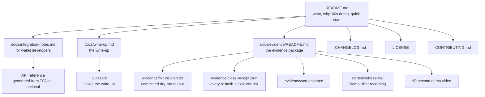

# Dustin documentation plan

This plan is the information architecture of the public repository. It says which documents exist, who each one is for, what each section must contain, and how the reviewer checks them. It is a plan, not the documents themselves: the README, integration notes and write-up are written in Week 4 from these outlines.

Three people read the repository, and they read it in a different order.

| Reader | Arrives with | Reads first | Needs to leave with |
|---|---|---|---|
| The reviewer (Ambassador Chapter Lead, minimal technical expertise) | The SOW and the evidence package link | `docs/evidence/README.md`, then the video | A filled SOW section 6.2 checklist: evidence present, partial or missing per deliverable |
| A wallet developer | A user who cannot close an account | `README.md` quick start, then `docs/integration-notes.md` | A working `planClose` -> render -> confirm -> `executeClose` flow in their codebase |
| A stranded holder or curious contributor | A testnet account they want to close | `README.md`, then `dustin plan` | A plan they can read before anything is signed |

## Document map



Everything the reviewer needs is reachable in two clicks from the README. Nothing in the reviewer path requires running code.

## 1. README outline

The README is the front door. It has to work for the reviewer (who will not run anything) and for the wallet developer (who will), so it front-loads the video and the plain-language summary and pushes code below the fold.

### 1.1 Badges

One row, in this order:

1. npm version (`dustin` package, once published; see Assumptions).
2. CI status of the default branch (lint, typecheck, unit tests).
3. License: MIT.
4. A static "Testnet only" badge. This is not decorative: the SDK refuses any network passphrase other than `Test SDF Network ; September 2015`.

### 1.2 What and why, in three sentences

Draft to adapt (each sentence carries one idea):

1. Dustin closes messy Stellar testnet accounts: it cancels offers, disposes of leftover balances, removes trustlines and data entries, and merges the account to a destination you choose.
2. Every transaction is fee-bumped by a sponsor, so an account holding zero spendable XLM, which cannot pay for its own teardown, can still be closed.
3. `planClose()` shows the whole ordered plan before anything is signed, so a wallet can put account closure in front of a user without sending them to a web form.

Directly under this: one line stating that the existing StellarExpert Account Demolisher sources and pays every transaction from the account being closed and has no fee-bump or sponsored-reserve handling (verified in its public client source, see Sources), which is the gap Dustin fills.

### 1.3 60-second demo embed

- A clickable thumbnail (GitHub READMEs do not autoplay video) that links to the hosted video.
- Directly under the thumbnail, the same three explorer links the video shows: the closed account, the first fee-bump transaction, the destination account.
- Caption: "Fixture account closed on testnet on `<date UTC>`; evidence package: `docs/evidence/README.md`."

### 1.4 Quick start: CLI

```
npm install -g dustin            # or: npx dustin
export DUSTIN_SPONSOR_SECRET=S...   # a funded testnet account, from friendbot
dustin plan  G<ACCOUNT> --to G<DESTINATION>          # read-only, prints the plan
export DUSTIN_ACCOUNT_SECRET=S...   # the account being closed
dustin close G<ACCOUNT> --to G<DESTINATION>         # asks for confirmation, then executes
```

Under the block, four bullets: `plan` never signs or submits anything; `close` prints one line per transaction with the hash and an explorer link; `--json` for machines, `--yes` to skip the confirmation; exit codes (copy the table from `docs/ux-design.md` section 2.9 verbatim once the numbering discrepancy noted in Assumptions is resolved). Resolved: canonical decision 5 in `docs/README.md`, widened on 2026-09-28 by PRD decision D-6 (a sponsor or budget refusal is exit code 3); the README table follows `src/cli/exit-codes.ts`.

### 1.5 Quick start: SDK

A single runnable snippet with `planClose` followed by `executeClose`, using the exact option names exported from `src/sdk` (the names in `docs/ux-design.md` section 3.1 are the working draft: `account`, `sponsor`, `destination`, `onEvent`). As built, the names are those of PRD section 7, exported from `src/index.ts` (PRD decision D-2): `account`, `destination`, `feeSponsor` for `planClose`, and `confirm`, `onEvent`, `onReport` for `executeClose`. Show the plan being rendered before `executeClose` is called; never show a snippet that executes without a plan in between.

### 1.6 Safety model

Five short statements, each one line:

1. Dry run by default. `planClose()` only reads from Horizon.
2. The merge is always the last operation and is only submitted after every pre-merge check passes (subentries gone, sequence number guard, sponsor check, destination exists).
3. The account being closed signs the inner transactions; the sponsor signs only the fee-bump envelopes. The sponsor cannot move the account's assets.
4. Secrets come from environment variables only and never appear in output, receipts or `--json`.
5. Testnet only. Mainnet passphrases are refused.

### 1.7 What is not handled

Copy the SOW "Out of Scope" list verbatim as a bullet list, then add the protocol-level limits in one sentence each (liquidity pool shares are detected and reported, not withdrawn; deauthorized balances cannot be moved by the holder; illiquid balances with no issuer path exit as "unclosable" with a reason). Link to the write-up for detail.

### 1.8 Evidence links

A four-row table mirroring SOW section 6.1: deliverable, evidence type, link. This is the same table as `docs/evidence/README.md`; the README copy exists so the reviewer never has to leave the front page to find it.

### 1.9 Footer

Links to the integration notes, the write-up, the CHANGELOG, CONTRIBUTING, LICENSE and the SOW summary (scope and success metric only, no contact details).

## 2. Integration notes outline (`docs/integration-notes.md`)

Audience: a wallet developer who has ten minutes. Written as one flow, top to bottom, with the code they will paste.

1. **Install and runtime.** `npm install dustin`; Node.js version pinned to what `@stellar/stellar-sdk` 17.x requires; ESM and CommonJS both supported; TypeScript types shipped.
2. **The flow in one diagram.** A Mermaid sequence diagram: Wallet -> `planClose` -> Horizon (read) -> plan; Wallet renders plan; user confirms; Wallet -> `executeClose` -> inner tx signed by account, fee-bump signed by sponsor -> Horizon (submit) -> events -> receipt. This diagram earns its place because the two-signer split is the thing integrators get wrong.
3. **Step 1: `planClose`.** Inputs (account, destination, optional Horizon URL), output shape (`ClosePlan`: ordered transactions, steps with `disposal` (the rung) and `reason`, totals, `blockers[]`; names as in PRD section 7, decision D-2), and the rule that a plan with non-empty `blockers` will not fully close.
4. **Step 2: render the plan.** What a wallet should show the user, in priority order: XLM arriving at the destination, reserves going to sponsors instead of the user, the count of unclosable items with reasons, the number of transactions. Guidance only, no UI component.
5. **Step 3: confirm.** The confirmation must restate the destination address and the phrase "this cannot be undone". Dustin's CLI does this; a wallet must do the same.
6. **Step 4: `executeClose` with a sponsor.** How the sponsor is supplied (a signer function, so custodial setups can plug in), what the sponsor pays (every fee-bump fee; the inner transactions carry a declared fee the sponsor covers), how much XLM the sponsor should hold, and that the sponsor's key never touches the account's assets.
7. **Events.** The event union of PRD section 7 as the code emits it (PRD decision D-2; it replaces the draft in `docs/ux-design.md` section 3.3): `plan`, `drift`, `preflight`, `tx:building`, `tx:submitted`, `tx:confirmed`, `tx:failed`, `verified`, `done`; there is no `tx:signing` or `tx:submitting`. One table: event, when it fires, fields, what to show the user.
8. **Error handling.** Three classes: blockers (returned in the plan, nothing submitted), per-step failures (a transaction failed; `resultCode` mapped to a message; whether Dustin retries), and transport errors (Horizon timeouts: Dustin polls the hash before resubmitting, so a wallet must not resubmit on its own). Continuing after a stop: there is no resume option (PRD decision D-2); plan again and execute the new plan, which holds only what is left, because the ledger is the source of truth.
9. **Unclosable reasons.** The stable codes: as built, the `BlockerCode` and `UnclosableCode` lists of PRD section 7 (PRD decision D-2), which replace the draft identifiers of `docs/ux-design.md` section 3.2; the draft's `ISSUER_GONE` does not exist, because a payment to an issuer that was merged away still burns the balance (day-1 experiment 4; `docs/README.md` open question 3). Also the per-balance ladder exits, each with: what it means in one sentence, whether the user can fix it, and the suggested remedy text. Wallets localize from the code, not the message.
10. **Testnet only.** The passphrase check, the Horizon URL default (`https://horizon-testnet.stellar.org`), the friendbot funding note (10,000 XLM per new account), and the reminder that testnet resets 2 to 4 times a year, which deletes every account including fixtures.
11. **Integration checklist.** Ten checkboxes a wallet team ticks before shipping a closure screen.

## 3. Write-up plan: "Ordering rules and known limits"

File: `docs/write-up.md` (the name in story E4-S5; first version 2026-09-28). Skeleton with placeholders: `docs/write-up-outline.md`. The reviewer reads this without running code, so every rule is one sentence of plain language followed by the protocol fact that forces it, with a link.

### 3.1 Section-by-section plan

1. **Why closing an account is an ordered teardown.** An account cannot be merged while it holds trustlines, offers or data entries; a trustline cannot be removed while it holds a balance or has buying liabilities; the reserves stay locked until the teardown finishes.
2. **The ordering rules** (the exact rules to state, numbered R1 to R16 below).
3. **The disposal ladder**, as a Mermaid decision diagram with the four exits.
4. **Fee sponsorship**: who signs what, who pays what, with the fee arithmetic.
5. **Sponsored reserves**: where the released reserve goes.
6. **The sequence number guard**.
7. **Known limits**: out of scope by SOW, and out of reach by protocol.
8. **The fixture and the baseline**: what the fixture holds, where the Demolisher stops, with links.
9. **Evidence**: the transaction chain, with placeholders for hashes.
10. **Glossary** (verified definitions, see `docs/write-up-outline.md`).

### 3.2 The exact rules to state

| # | Rule (plain language) | Protocol fact behind it |
|---|---|---|
| R1 | Plan first, sign nothing. `planClose()` only reads. | Closing is irreversible: AccountMerge "removes the source account from the ledger". |
| R2 | Every submitted transaction is an inner transaction sourced from the account being closed, wrapped in a fee-bump paid by the sponsor. | Fee-bump transactions let a fee account pay for an existing transaction; the fee-bump counts as one extra operation, and its fee must be at least the network minimum for (inner operations + 1) and at least the inner fee. |
| R3 | Cancel every open offer before touching any trustline. | Offers create liabilities; a trustline cannot be removed unless the limit can hold the balance and satisfy its buying liabilities (`CHANGE_TRUST_INVALID_LIMIT`). Deleting an offer means setting its amount to 0 with the existing offer ID. |
| R4 | Dispose of every non-XLM balance before removing its trustline: sell via path payment, else return to the issuer, else send to the destination if it holds an authorized trustline with room, else report unclosable with a reason. | A trustline can only be removed (limit 0) when its balance is zero. |
| R5 | A deauthorized or unauthorized balance is unclosable by the holder. | With `AUTH_REQUIRED` the issuer must approve the account before it can hold the asset; a revoked trustline freezes the asset, and the holder cannot transfer or trade it. Only the issuer can act. |
| R6 | Clawback-enabled trustlines close through the normal ladder; the flag is reported, not acted on. | Clawback is an issuer power (burn from a holder), not a holder constraint. |
| R7 | Remove data entries with a manage-data operation that carries no value. | "If not present then the existing Name will be deleted." |
| R8 | Remove trustlines last, after offers and balances are gone, with limit 0. | Change Trust with limit 0 deletes the trustline. |
| R9 | A sponsored trustline is removed the same way, but its reserve returns to the sponsor, not to the account. | When a sponsored entry is removed, `numSponsoring` decreases on the sponsor and `numSponsored` on the sponsored account. The plan must attribute the reserve accordingly. |
| R10 | Group operations into the minimum number of transactions that respect R3 to R8, never more than 100 operations per inner transaction. | Transactions can have up to 100 operations. |
| R11 | Before the merge, check that the account's sequence number is below `(ledgerSeq << 32)`; if it is not, do not submit, and report which ledger to wait for. | `ACCOUNT_MERGE_SEQNUM_TOO_FAR`: "It must be less than (ledgerSeq << 32)". |
| R12 | Before the merge, check that the account sponsors nothing. | `ACCOUNT_MERGE_IS_SPONSOR`: an account sponsoring reserves cannot be merged. Revoking sponsorships is out of scope, so this is a reported blocker. |
| R13 | Before the merge, check the account is not `AUTH_IMMUTABLE`. | `ACCOUNT_MERGE_IMMUTABLE_SET`. Nothing can fix this; report it. |
| R14 | Before the merge, check the destination exists, is not the account itself, and can receive the balance. | `ACCOUNT_MERGE_NO_ACCOUNT`, `ACCOUNT_MERGE_MALFORMED`, `ACCOUNT_MERGE_DEST_FULL`. |
| R15 | The merge is always the last operation of the last transaction. | Merging transfers the whole XLM balance, including the account's own two base reserves, and deletes the account; nothing can run after it. Signers do not block it (they are removed automatically). |
| R16 | Liquidity pool shares, raised multisig thresholds and claimable balances are detected and reported, never acted on. | SOW out-of-scope list; a pool share trustline holds 2 base reserves and needs a Liquidity Pool Withdraw first. |

### 3.3 Known limits to state

- By SOW: mainnet; contract (C) accounts; liquidity pool share withdrawal; multisig with raised thresholds; claimable balance cleanup; production key management; wallet UI; third-party wallet integration.
- By protocol: deauthorized balances (R5); balances with no market whose issuer requires a memo that was not given and that the destination cannot take (`NO_DISPOSAL_ROUTE`); accounts with `AUTH_IMMUTABLE` (R13); accounts that sponsor others (R12). A missing issuer is not a limit: a payment to an issuer that was merged away still burns the balance (day-1 experiment 4; `docs/README.md` open question 3), so the draft code `ISSUER_GONE` does not exist.
- By environment: testnet resets 2 to 4 times a year and delete every account, transaction and history record, so evidence links have a shelf life (see section 6 of `docs/evidence/evidence-package-template.md`).

## 4. CHANGELOG and versioning

- `CHANGELOG.md` in Keep a Changelog format (Unreleased, then one section per version, each with Added / Changed / Fixed / Removed).
- Semantic Versioning. `0.1.0` is the first npm publish (Week 4). While the major is 0, minor bumps may change the API; the integration notes say so.
- One git tag per release (`v0.1.0`), created only when the user asks; the npm version and the tag always match.
- Weekly entries under Unreleased during the sprint, so the CHANGELOG doubles as a progress log the reviewer can read.

## 5. LICENSE and CONTRIBUTING

- `LICENSE`: MIT, copyright line `Copyright (c) 2026 0xsimoneth`. No other names anywhere in the repository.
- `CONTRIBUTING.md`, kept to one screen: testnet only, never add mainnet configuration; how to run unit tests offline and the testnet suite with a sponsor key; never commit a secret (`.env` is ignored, `.env.example` is the template); English only; conventional commit subjects; one PR per story; the safety model in section 1.6 is a hard constraint, not a preference.

## 6. Docs style rules

1. CommonMark only. One H1 per file; sentence-case headings; no HTML except the video thumbnail link in the README.
2. Mermaid diagrams only where they carry signal: the ordering dependency graph, the disposal ladder decision, the two-signer sequence diagram. No diagrams for lists.
3. Code blocks always carry a language tag (`bash`, `ts`, `json`). Plan output is pasted as plain text blocks exactly as the CLI prints it.
4. Every protocol claim links to developers.stellar.org. Every SDK claim links to the exported type in `src/sdk`.
5. Addresses: full 56-character keys in evidence files and tables; truncated (`GDME...7Q2K`) only in prose.
6. XLM amounts with seven decimals in evidence (`4.0000000 XLM`); rounded in prose.
7. Timestamps in ISO 8601 UTC. Every evidence file states the capture date and the testnet reset window it predates.
8. Never a secret key, never a `.env` value, never a local file path, never a personal name. The builder is "the builder"; the reviewer is "the reviewer". Other projects are cited by project name and URL; prose never names a third-party user or organisation handle (canonical decision 15).
9. Every document ends with `## Assumptions` and `## Sources`.
10. Explorer links use `https://stellar.expert/explorer/testnet/...` first and `https://horizon-testnet.stellar.org/...` as the raw, machine-checkable second link.

## 7. Review checklist for the non-technical reviewer

This is the reviewer's copy of SOW section 6.2, expanded into plain-language checks. It ships as the first section of `docs/evidence/README.md`.

| Deliverable | Open this | You should see | Tick |
|---|---|---|---|
| D1 `planClose()` | `evidence/fixture-plan.txt` in the repo | A numbered list of steps ending in "AccountMerge", with a reason and a fee next to each, and a summary that says how much XLM goes to the destination. Nothing about this file was submitted to the network. | Present / Partial / Missing |
| D2 Live close | The transaction links in `docs/evidence/README.md`, then the closed account link | Each transaction page shows "fee bump" with the sponsor as the fee account. The account page shows the merge as the last operation; the Horizon link answers "Not Found". | Present / Partial / Missing |
| D3 Edge cases | The test screenshot, then the baseline recording | A green test run naming the seven edge cases. A recording of the existing tool stopping on the same account, with the point where it stops called out. | Present / Partial / Missing |
| Docs, demo, evidence | The README, the write-up, the video | The video shows the same close as the links, start to finish, in 60 seconds. The write-up lists the ordering rules and what is not handled. | Present / Partial / Missing |

## 8. Week 4 production order

1. Freeze CLI output and SDK option names (docs cannot be finished before this).
2. Run the final fixture close; capture the receipt, screenshots and Horizon JSON the same hour.
3. Record the demo (script: `docs/demo-video-script.md`).
4. Fill `docs/evidence/README.md` from the template.
5. Write README and integration notes from sections 1 and 2.
6. Write the write-up from `docs/write-up-outline.md`.
7. CHANGELOG `0.1.0`, npm publish, tag.
8. Reviewer dry run: someone who did not build Dustin follows section 7 and reports every step where they got lost.

## Assumptions

1. The public repository URL is `https://github.com/0xsimoneth/dustin` and the npm package name is `dustin`. Neither was verified as available; if `dustin` is taken on npm, a scoped name is used and every doc is updated in one pass.
2. CLI command names (`dustin plan`, `dustin close`), option names, environment variable names (`DUSTIN_ACCOUNT_SECRET`, `DUSTIN_SPONSOR_SECRET`), event names and blocker codes are taken from `docs/epics-and-stories.md` and `docs/ux-design.md` as the working draft. No source code exists yet; the documents are corrected to match the implementation when it lands.
3. `docs/epics-and-stories.md` (UX-DR4) gives exit code 2 for "blockers prevent a full close" while `docs/ux-design.md` section 2.9 gives exit code 4 for PARTIAL. The README copies whichever the implementation ships; this plan does not decide it. Resolved by canonical decision 5 (blockers without `--partial` exit 3, a partial close exits 4), widened on 2026-09-28 by PRD decision D-6 (an over-budget refusal and an underfunded sponsor also exit 3).
4. The SOW statement that the Demolisher's server "declines to co-sign a merge that pays out less than 1 XLM" is server-side behaviour and could not be verified from the public client source; the README states only what the client source shows (transactions sourced and paid by the account being closed, no fee-bump, no sponsorship handling). The baseline recording is what demonstrates the actual stop point.
5. StellarExpert testnet URL patterns are used as verified by indexed examples; the site is client-rendered, so the reviewer walkthrough tells the reviewer what the page shows rather than quoting it.
6. This session is non-interactive; no questions were asked of the builder, and no files other than the four planned documents were written.

## Sources

1. Accepted Statement of Work: `SUCCESSFUL_SOW.md` (sections 3, 4.1, 4.2, 5.1, 6.1, 6.2, Appendix B).
2. Requirements inventory and package layout: `docs/epics-and-stories.md`.
3. CLI surface, exit codes, events and blocker codes: `docs/ux-design.md` sections 2.1, 2.9, 3.2, 3.3.
4. Account Merge, Change Trust, Manage Data, Manage Sell Offer, Path Payment (operation semantics and result codes): https://developers.stellar.org/docs/learn/fundamentals/transactions/list-of-operations
5. Account Merge result codes (`ACCOUNT_MERGE_HAS_SUB_ENTRIES`, `ACCOUNT_MERGE_SEQNUM_TOO_FAR`, `ACCOUNT_MERGE_IS_SPONSOR`, `ACCOUNT_MERGE_IMMUTABLE_SET`, `ACCOUNT_MERGE_DEST_FULL`, `ACCOUNT_MERGE_NO_ACCOUNT`, `ACCOUNT_MERGE_MALFORMED`): https://developers.stellar.org/docs/data/apis/horizon/api-reference/errors/result-codes/operation-specific/account-merge
6. Fee-bump transactions (CAP-15; fee account pays; inner operations + 1; minimum fee rules; `buildFeeBumpTransaction`): https://developers.stellar.org/docs/build/guides/transactions/fee-bump-transactions
7. Sponsored reserves (minimum balance formula `(2 + numSubEntries + numSponsoring - numSponsored) * baseReserve`; counters decrease when a sponsored entry is removed; begin/end in one transaction): https://developers.stellar.org/docs/build/guides/transactions/sponsored-reserves
8. Base reserve 0.5 XLM, minimum balance, what counts as a subentry, 1,000 subentry cap: https://developers.stellar.org/docs/learn/fundamentals/lumens and https://developers.stellar.org/docs/learn/fundamentals/stellar-data-structures/accounts#base-reserves-and-subentries
9. Base fee 100 stroops per operation; up to 100 operations per transaction: https://developers.stellar.org/docs/learn/glossary#base-fee and https://developers.stellar.org/docs/learn/fundamentals/fees-resource-limits-metering#inclusion-fee
10. Authorization flags and clawback: https://developers.stellar.org/docs/tokens/control-asset-access
11. Pool share trustlines require 2 base reserves; Liquidity Pool Withdraw: https://developers.stellar.org/docs/learn/fundamentals/liquidity-on-stellar-sdex-liquidity-pools#trustlines
12. Testnet: no real money; resets 2 to 4 times per year at 17:00 UTC with at least two weeks' notice, clearing all ledger entries, transactions and history; friendbot 10,000 XLM; Horizon `https://horizon-testnet.stellar.org`; passphrase `Test SDF Network ; September 2015`: https://developers.stellar.org/docs/networks
13. Horizon single account and single transaction endpoints, and the 404 "Not Found" status: https://developers.stellar.org/docs/data/apis/horizon/api-reference/retrieve-an-account , https://developers.stellar.org/docs/data/apis/horizon/api-reference/retrieve-a-transaction , https://developers.stellar.org/docs/data/apis/horizon/api-reference/errors/http-status-codes/standard
14. JavaScript SDK package `@stellar/stellar-sdk`: https://developers.stellar.org/docs/tools/sdks/client-sdks
15. StellarExpert Account Demolisher, public tool: https://stellar.expert/demolisher/public/ ; client source in the MIT-licensed explorer repository (files `business-logic/demolisher/demolisher-tx-builder.js` and `views/demolisher/account-demolisher-view.js`; no fee-bump or sponsorship handling; transactions built on the source account with the account's own base fee): https://github.com/stellar-expert/stellar-expert-explorer
16. The open, uncommented 2019 request for a callable close helper in an archived repository: https://github.com/stellar/js-stellar-wallets/issues/98
17. StellarExpert testnet explorer root and URL scheme (`/explorer/testnet/tx/<hash>`, `/explorer/testnet/account/<address>`): https://stellar.expert/explorer/testnet/
18. Keep a Changelog: https://keepachangelog.com/en/1.1.0/ ; Semantic Versioning: https://semver.org/spec/v2.0.0.html
