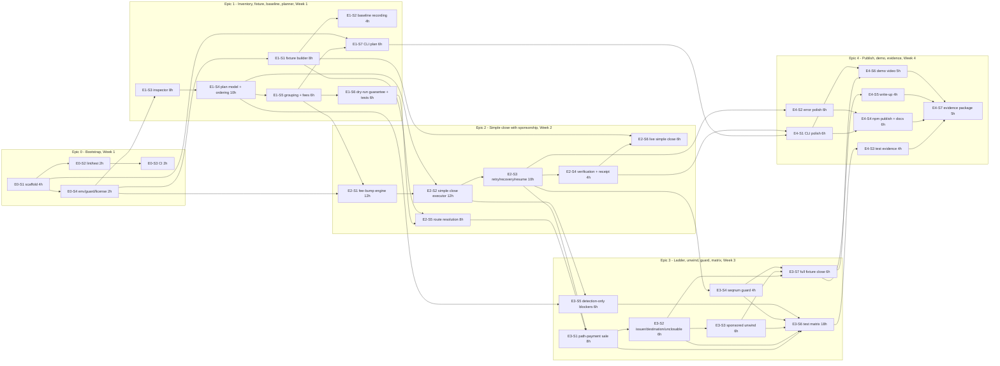

# Dustin - Epic Breakdown

## Overview

This document provides the complete epic and story breakdown for Dustin, the JS/TS SDK and CLI that closes messy Stellar classic (G) accounts on testnet with fee-bumped, sponsor-paid transactions. It decomposes the accepted 30-day, USD 5,000 Stellar Instawards Statement of Work (the SOW, 200 engineering hours) into five epics and 31 implementable stories.

No PRD, architecture document or UX specification exists in the planning folder, so the SOW is used as the PRD. Architecture-level decisions that the SOW leaves open are recorded as additional requirements below and flagged in the Assumptions section at the end.

**Reading guide.** Story IDs are `E<epic>-S<story>`; acceptance criteria are `AC-E<epic>-S<story>-<n>`. Every story names the SOW deliverable it serves (D1 planner, D2 live close, D3 edge cases and tests, D4 docs/demo/evidence) and the evidence artifact it produces. Hours are budgeted so that each deliverable's total equals the SOW budget table (D1 60 h, D2 80 h, D3 40 h, D4 20 h; total 200 h).

## Requirements Inventory

### Functional Requirements

Extracted from SOW sections 3, 4.1, 4.2, 5.1, 6.1 and Appendix B.

- FR1: `planClose()` inspects any classic G account on testnet and returns an ordered close plan as a dry run by default; it never signs or submits anything (SOW 4.1 D1).
- FR2: The account inspector covers every subentry type and merge blocker: XLM balance and reserves, trustlines (balance, limit, liabilities, authorization and clawback flags, sponsor), open offers, data entries, signers and thresholds, account flags, `num_sponsoring` / `num_sponsored`, liquidity pool share balances and the sequence number (SOW 4.2 D1 row).
- FR3: The plan lists every open offer to cancel (SOW 4.1 D1).
- FR4: The plan lists every non-zero non-native balance together with the disposal route chosen for it: path payment sale, return to issuer, transfer to the destination account, or unclosable with a stated reason (SOW 4.1 D1 and D2).
- FR5: The plan lists every trustline and data entry to remove (SOW 4.1 D1).
- FR6: The plan states how much XLM will be recovered to the destination and, separately, which reserves are released to sponsors rather than to the account holder (SOW 4.1 D1 and D2).
- FR7: The plan ends with an AccountMerge to a destination chosen by the caller (SOW 3, 4.1 D1).
- FR8: Plan steps are grouped into the minimum number of transactions that respect ordering constraints and the protocol limit of 100 operations per transaction (SOW 4.1 D1).
- FR9: Every step carries a human-readable reason and a fee estimate; the plan carries the total fee the sponsor will pay (SOW 4.1 D1).
- FR10: A CLI renders the plan for any testnet account; the plan output for the fixture account is committed to the repository (SOW 5.1 Week 1, 6.1 D1).
- FR11: `executeClose()` executes a plan against a real testnet account; every submitted transaction is an inner transaction sourced from the account being closed, wrapped in a fee-bump transaction paid by a sponsor account, so a zero-XLM account can be closed and never pays a fee (SOW 4.1 D2, Appendix B).
- FR12: The sponsor signing key is read from an environment variable; the key of the account being closed is supplied by the caller (SOW 4.1 Out of Scope: production key management).
- FR13: The disposal ladder is applied in this order for each leftover balance: sell via path payment; if there is no path, send back to the issuer; if the issuer cannot receive it, send to the destination account when it holds the trustline; otherwise report the item as unclosable with a stated reason and a remediation hint (SOW 4.1 D2).
- FR14: Sponsored trustlines are unwound; the released reserve is attributed to the sponsor, not to the account holder, in both the plan and the receipt (SOW 4.1 D2).
- FR15: An `ACCOUNT_MERGE_SEQNUM_TOO_FAR` guard checks, before any merge is submitted, that the account's next sequence number is below `(ledgerSeq << 32)`; if it is not, the plan reports the ledger to wait for and the executor does not submit a merge that will fail (SOW 4.1 D3, 4.2 D2).
- FR16: Transaction submission has retry and failure recovery: transient Horizon errors are retried with backoff, result codes are mapped to per-step outcomes, execution re-plans from live ledger state and is resumable, and no transaction is ever double-submitted (SOW 4.2 D2).
- FR17: Blockers that are out of scope to fix are detected and reported with reasons, never acted on: liquidity pool shares, raised multisig thresholds, the `AUTH_IMMUTABLE` account flag, and active sponsoring (`num_sponsoring > 0`) (SOW 4.1 D3, Out of Scope).
- FR18: Authorization-required trustlines that are authorized close through the normal ladder; trustlines that are unauthorized or authorized-to-maintain-liabilities only are reported as unclosable with a stated reason. Clawback-enabled trustlines close through the normal ladder and the flag is reported (SOW 4.1 D3).
- FR19: A fixture builder script constructs the messy fixture account on testnet: at least 3 trustlines with dust balances, 2 open offers, 1 data entry, 1 sponsored trustline, a deliberately illiquid asset, and zero spendable XLM; it writes a manifest of public addresses (SOW 4.2 D3, Appendix B).
- FR20: A recorded baseline run of the StellarExpert Account Demolisher against the same fixture shows where it stops (SOW 4.1 D3, 6.1 D3).
- FR21: An edge-case test matrix covers: illiquid leftover balance, sponsored trustlines, `ACCOUNT_MERGE_SEQNUM_TOO_FAR`, authorization-required trustlines, clawback-enabled trustlines, liquidity pool shares, and raised multisig thresholds (SOW 4.1 D3, 4.2 D3).
- FR22: After a close, the SDK verifies that the account no longer exists and produces a receipt with every transaction hash and a public testnet explorer link (SOW 3 success metric, 6.1 D2).
- FR23: The repository is public and published as an npm package with a README and integration notes (SOW 4.2 docs row, 5.1 Week 4).
- FR24: A write-up covers the ordering rules and the known limits (SOW 4.2 docs row, 6.1 docs row).
- FR25: A 60-second demo video shows the full close from the CLI, start to finish (SOW 6.1 D2 and docs row).
- FR26: An evidence package links the full transaction chain and the closed account's non-existence on a public testnet explorer (SOW 6.1, Appendix B).
- FR27: The CLI exposes `plan` (dry run) and `close` (execute) commands with an explicit confirmation step, progress output per transaction, JSON output and meaningful exit codes (SOW 4.1 Out of Scope: CLI demo is the interface).

### NonFunctional Requirements

- NFR1: Testnet only. The network passphrase is pinned to `Test SDF Network ; September 2015`; any other network is refused (SOW 4.1 Out of Scope: Mainnet).
- NFR2: Classic G accounts only. Contract (C) addresses and muxed (M) addresses are rejected with a clear error (SOW 4.1 Out of Scope: Contract accounts).
- NFR3: Safety. `planClose()` can never mutate ledger state; `executeClose()` requires explicit confirmation; the irreversible merge is always the last operation and is only submitted after all pre-merge checks pass (SOW 4.1 D1 rationale).
- NFR4: Secrets. Keys are read from environment variables only, never written to logs, plan output, receipts or the repository; `.env` is gitignored and `.env.example` is committed (SOW 4.1 Out of Scope: production key management).
- NFR5: Verifiability. Every transaction hash is printed with an explorer link; the evidence must be checkable by the Ambassador Chapter Lead with minimal technical expertise (SOW 6).
- NFR6: Quality. The planner is unit-tested offline against recorded Horizon responses; the executor is integration-tested against the testnet fixture; CI is green on the default branch (SOW 4.1 D3 rationale).
- NFR7: Budget and time. 200 hours over 30 calendar days; the hours ledger in this document matches the SOW budget table exactly (SOW 4.2).
- NFR8: Licensing and language. MIT license, English-only code and documentation, public repository (repository rules; SOW 6.1).
- NFR9: Runtime. Node.js >= 22.12 (required by `@stellar/stellar-sdk` 17.x), TypeScript in strict mode, ESM and CommonJS builds, typed public API.
- NFR10: Reliability. Idempotent re-planning from live state; bounded retries; Horizon timeouts handled by polling the transaction hash before any resubmission.
- NFR11: Determinism. Plan JSON is stable and sorted so the committed fixture output is diffable across runs.
- NFR12: Fees. Estimates use the live network base fee; the fee-bump fee is at least the network minimum for the inner operation count plus one, and at least the inner transaction fee; a configurable cap prevents runaway surge bids.

### Additional Requirements

No architecture document exists. The following decisions are derived from the SOW and the caller's brief and are treated as architecture inputs (see Assumptions).

- Starter template: none. Epic 0 bootstraps a single npm package from scratch (TypeScript toolchain, lint, test runner, CI, environment handling, MIT license, testnet configuration) and is sized to fit inside Week 1.
- Package layout: `src/sdk` (`planClose`, `executeClose`, types), `src/cli` (`dustin plan`, `dustin close`), `scripts/fixture` (fixture builder and helpers), `test/unit` (offline), `test/testnet` (live), `evidence/` (committed plan output, receipts, screenshots, recordings), `docs/` (write-up, integration notes).
- Data and submission endpoint: Horizon testnet (`https://horizon-testnet.stellar.org`) for account, offers, paths and submission; Stellar RPC is not required because the scope is classic operations only.
- SDK: `@stellar/stellar-sdk` ^17.1.0 (published 2026-09-14, Apache-2.0, `engines.node >= 22.12.0`).
- Tooling: `tsup` build, `vitest` tests, `eslint` + `prettier`, GitHub Actions (lint, typecheck, unit tests on every push; testnet integration job dispatched manually and gated on a repository secret).
- Evidence links use the StellarExpert testnet explorer (`https://stellar.expert/explorer/testnet/...`), with Stellar Lab as the fallback explorer.
- Fixture secrets live in a gitignored local file; only public addresses and transaction hashes are committed.
- Testnet resets 2 to 4 times per year with two weeks' notice; the fixture builder must be re-runnable so the fixture and evidence can be recreated after a reset.

### UX Design Requirements

There is no UX document and no wallet UI in scope. The CLI is the interface, so these CLI output requirements stand in for UX requirements.

- UX-DR1: `dustin plan` prints a table with one row per operation: transaction index, operation, target (asset, offer id or data name), route, reason, estimated fee.
- UX-DR2: The plan ends with a summary block: XLM recovered to the destination, reserves released to sponsors, total fee paid by the sponsor, number of transactions, and a list of blockers with reasons and remediation hints.
- UX-DR3: `dustin close` prints per-transaction progress (submitted, confirmed, failed) with the hash and an explorer link, then the final "account no longer exists" verification.
- UX-DR4: Both commands support `--json`; `close` supports `--yes` to skip the interactive confirmation; exit code 0 on success, 2 when blockers prevent a full close, 1 on failure.
- UX-DR5: Secrets are never echoed; public keys may be printed in full.

### FR Coverage Map

See the traceability tables in the "Traceability" section after the epics: they map every FR, every SOW deliverable and every SOW 6.1 evidence item to story IDs.

## Epic List

Sprint calendar (funds received 2026-09-22, final deadline 2026-10-22):

| Sprint week | Dates | SOW expected output |
|---|---|---|
| Day 1 | 2026-09-22 | Funds received; sprint clock starts |
| Week 1 | 2026-09-22 to 2026-09-28 | Fixture built, Demolisher baseline recorded, planClose() dry run printed |
| Week 2 | 2026-09-29 to 2026-10-05 | Zero-XLM account closed end to end with sponsored fees |
| Week 3 | 2026-10-06 to 2026-10-12 | Disposal ladder, sponsored unwind, sequence guard, test matrix, messy fixture closed |
| Week 4 | 2026-10-13 to 2026-10-19 | npm publish, 60-second demo, evidence package, write-up |
| Buffer | 2026-10-20 to 2026-10-22 | Review fixes; **final deadline 2026-10-22** |

Five epics. Epics 1 to 4 are the four weeks of the SOW execution plan (section 5.1); each week's "Expected Output" is that epic's definition of done. Epic 0 is the repository bootstrap the SOW leaves implicit; it is sized to fit inside Week 1 and charged to D1 because the planner ships in the repository it creates. Each epic is standalone: every epic leaves the CLI in a demonstrable state, and no epic depends on a later one.

### Epic 0: Repository Bootstrap

An integrator can clone the public repository, install it with one command, build it, lint it and run its tests; CI enforces the same on every push; secrets are handled through environment variables only and the tool refuses to talk to any network other than testnet.
**FRs covered:** FR12 (sponsor key from environment). **NFRs covered:** NFR1, NFR4, NFR6, NFR8, NFR9.
**Week:** 1 (days 1-2). **SOW deliverable:** D1 (repository and CLI surface). **Budget:** 10 h.
**Definition of done:** `npm install && npm run build && npm run lint && npm test` succeed locally and in CI on a fresh clone; `.env.example`, `LICENSE` (MIT) and a README skeleton are committed.

### Epic 1: Inventory, Fixture, Baseline and Read-Only Planner

A wallet integrator or reviewer can point `dustin plan` at any testnet account and read an ordered, fee-estimated close plan that changes nothing; the messy fixture account exists on testnet; and a recorded baseline shows the existing tool stopping on that same account.
**FRs covered:** FR1, FR2, FR3, FR4 (route field and unclosable reporting in the plan model; route resolution logic is completed in Epic 2), FR5, FR6, FR7, FR8, FR9, FR10, FR17 (detection), FR19, FR20.
**Week:** 1. **SOW deliverables:** D1 (planner, CLI) and D3 (fixture, baseline). **Budget:** 48 h (D1 36 h, D3 12 h).
**Definition of done (SOW Week 1):** `planClose()` returns a correct ordered plan for the fixture, as a dry run, printed in the CLI; nothing is submitted; a recorded baseline shows the existing tool failing on the same account.

### Epic 2: Simple Close, End to End, with Sponsorship

A user with a zero-XLM account holding only offers, data entries and zero-balance trustlines can close it to a destination of their choice with every fee paid by a sponsor, and hand a reviewer the transaction hashes and the explorer page showing the account is gone.
**FRs covered:** FR11, FR12, FR16, FR22, FR27 (first version), and the planner-side route resolution for FR4 and FR13 (prepared here so Epic 3 can execute it).
**Week:** 2. **SOW deliverables:** D2 (executor, sponsorship, retry) and D1 (route planning). **Budget:** 52 h (D2 44 h, D1 8 h).
**Definition of done (SOW Week 2):** a zero-XLM account is closed end to end on testnet with sponsored fees, with verifiable transaction hashes and the account gone from the explorer.

### Epic 3: Leftover Balance Ladder, Sponsored Unwind, Sequence Guard and Test Matrix

A user whose account holds dust, illiquid tokens, a sponsored trustline or a bumped sequence number gets each item sold, returned, transferred or reported unclosable with a stated reason, the sponsor gets its reserve back, and the full messy fixture is closed; another team can run the edge-case test matrix and see it pass.
**FRs covered:** FR6 (sponsor attribution), FR13, FR14, FR15, FR17, FR18, FR21.
**Week:** 3. **SOW deliverables:** D2 (ladder, unwind, guard, fixture close) and D3 (test matrix, detection-only cases). **Budget:** 54 h (D2 30 h, D3 24 h).
**Definition of done (SOW Week 3):** the messy fixture is closed; tests pass, including the deliberately illiquid asset that exits through the unclosable path with a stated reason.

### Epic 4: Publish, Demo and Evidence

An integrator can `npm install` the package and follow the integration notes; the Ambassador Chapter Lead can watch the 60-second demo, open every transaction in the evidence package, read the write-up on ordering rules and known limits, and tick every box in SOW section 6.2 and Appendix B.
**FRs covered:** FR10 (final committed output), FR16 (error-handling polish), FR23, FR24, FR25, FR26, FR27 (output polish).
**Week:** 4. **SOW deliverables:** D4 (docs, demo, evidence), D1 and D2 polish, D3 test evidence. **Budget:** 36 h (D4 20 h, D1 6 h, D2 6 h, D3 4 h).
**Definition of done (SOW Week 4):** 60-second demo, evidence package with explorer links, write-up published in the repo; D1, D2 and D3 closed.

### Epic Budget Ledger

| Epic | Week | D1 (60 h) | D2 (80 h) | D3 (40 h) | D4 (20 h) | Epic total |
|---|---|---|---|---|---|---|
| Epic 0 | 1 | 10 | 0 | 0 | 0 | 10 |
| Epic 1 | 1 | 36 | 0 | 12 | 0 | 48 |
| Epic 2 | 2 | 8 | 44 | 0 | 0 | 52 |
| Epic 3 | 3 | 0 | 30 | 24 | 0 | 54 |
| Epic 4 | 4 | 6 | 6 | 4 | 20 | 36 |
| **Total** | | **60** | **80** | **40** | **20** | **200** |

Weekly load: Week 1 58 h, Week 2 52 h, Week 3 54 h, Week 4 36 h. Week 4 is deliberately lighter to absorb slippage from the live-network weeks.

### FR Coverage Map (FR to Epic)

- FR1: Epic 1 - read-only `planClose()`.
- FR2: Epic 1 - account inspector across all subentry types.
- FR3: Epic 1 - offers to cancel in the plan.
- FR4: Epic 1 (plan model) and Epic 2 (route resolution) - disposal route per balance.
- FR5: Epic 1 - trustlines and data entries to remove.
- FR6: Epic 1 (recovered XLM) and Epic 3 (sponsor attribution) - recovery accounting.
- FR7: Epic 1 - merge to caller-chosen destination.
- FR8: Epic 1 - grouping into minimum transactions.
- FR9: Epic 1 - reasons and fee estimates per step.
- FR10: Epic 1 (CLI `plan`, committed fixture output) and Epic 4 (final committed output).
- FR11: Epic 2 - fee-bumped execution.
- FR12: Epic 0 (environment handling) and Epic 2 (sponsor signing).
- FR13: Epic 2 (route planning) and Epic 3 (ladder execution).
- FR14: Epic 3 - sponsored trustline unwind.
- FR15: Epic 3 - sequence number guard.
- FR16: Epic 2 (retry, recovery, resume) and Epic 4 (error-handling polish).
- FR17: Epic 1 (detection in inspector) and Epic 3 (blocker reporting and tests).
- FR18: Epic 3 - authorization-required and clawback-enabled trustlines.
- FR19: Epic 1 - fixture builder.
- FR20: Epic 1 - baseline recording.
- FR21: Epic 3 - edge-case test matrix.
- FR22: Epic 2 - post-close verification and receipt.
- FR23: Epic 4 - npm publish, README, integration notes.
- FR24: Epic 4 - write-up.
- FR25: Epic 4 - demo video.
- FR26: Epic 4 - evidence package.
- FR27: Epic 2 (first `close` command) and Epic 4 (output polish).

## Story Format

Each story below follows the template (user story, Given/When/Then acceptance criteria) extended with the fields the SOW needs for tracking: technical notes, dependencies, an estimate in hours, the evidence artifact the story produces (mapped to SOW 6.1) and the SOW deliverable it serves. Story keys used by `docs/stories/sprint-status.yaml` are given in parentheses after the title.

## Epic 0: Repository Bootstrap

An integrator can clone the public repository, install, build, lint and test it; CI enforces the same; secrets come from environment variables only; the tool refuses any network other than testnet. Week 1, days 1-2. Budget 10 h, charged to D1.

### Story 0.1 (E0-S1): TypeScript package scaffold with typed API and CLI entry point (`0-1-package-scaffold`)

As an integrator,
I want a buildable TypeScript package with a typed public API and a `dustin` CLI entry point,
So that I can install Dustin in my project and call it from code or from the terminal.

**Acceptance Criteria:**

- AC-E0-S1-1: **Given** a fresh clone on Node.js >= 22.12, **When** `npm install && npm run build` runs, **Then** `dist/` contains ESM, CommonJS and `.d.ts` outputs, **And** `package.json` `exports` resolves `import { planClose, executeClose } from "<package>"` (stubs that throw `NotImplementedError` are acceptable in this story).
- AC-E0-S1-2: **Given** the build, **When** `npx dustin --help` runs, **Then** usage for the `plan` and `close` subcommands is printed and the exit code is 0.
- AC-E0-S1-3: **Given** `tsconfig.json`, **Then** `strict` is true, `module` is `NodeNext`, target is ES2022, **And** `npm run typecheck` passes.
- AC-E0-S1-4: **Given** `package.json`, **Then** `engines.node` is `>=22.12.0`, `license` is `MIT`, `files` excludes tests, evidence and any local fixture keys, **And** `@stellar/stellar-sdk` `^17.1.0` is a dependency.

**Technical notes:** `tsup` for the dual build; `bin: { "dustin": "dist/cli.js" }`; `commander` for argument parsing; source layout `src/index.ts`, `src/sdk/`, `src/cli/`. The npm package name is confirmed at publish time (see Assumptions). `@stellar/stellar-sdk` 17.1.0 requires Node >= 22.12.0 (npm registry metadata, 2026-09-14).
**Dependencies:** none. **Estimate:** 4 h. **Evidence:** public repository (SOW 6.1, D1 "Public repo"). **SOW deliverable:** D1.

### Story 0.2 (E0-S2): Lint, format and test runner (`0-2-lint-format-test-runner`)

As a contributor,
I want lint, formatting and a test runner wired to npm scripts,
So that every change is checked the same way locally and in CI.

**Acceptance Criteria:**

- AC-E0-S2-1: **Given** the repository, **When** `npm run lint` and `npm run format:check` run, **Then** both pass on a clean tree, **And** an intentionally unused variable fails `npm run lint`.
- AC-E0-S2-2: **Given** `vitest` configuration, **When** `npm test` runs, **Then** only `test/unit/**` executes with no network access and a smoke test passes.
- AC-E0-S2-3: **Given** `DUSTIN_TESTNET=1`, **When** `npm run test:testnet` runs, **Then** `test/testnet/**` executes; without the variable those files are skipped with a printed reason.
- AC-E0-S2-4: **Then** `npm run coverage` produces a text and lcov report.

**Technical notes:** `eslint` with `typescript-eslint`, `prettier`, `vitest` with two projects (unit, testnet). Testnet tests get a 120 s timeout.
**Dependencies:** E0-S1. **Estimate:** 2 h. **Evidence:** public repository. **SOW deliverable:** D1.

### Story 0.3 (E0-S3): Continuous integration with a gated testnet job (`0-3-continuous-integration`)

As a reviewer,
I want CI to prove that lint, typecheck, build and unit tests pass on every push, and to let the builder run the testnet suite on demand,
So that the repository state I am asked to trust is checked by a machine.

**Acceptance Criteria:**

- AC-E0-S3-1: **Given** `.github/workflows/ci.yml`, **When** a push or pull request lands, **Then** install, lint, typecheck, build and unit tests run on Node 22, **And** a lint or test failure fails the job.
- AC-E0-S3-2: **Given** `.github/workflows/testnet.yml`, **When** dispatched manually, **Then** it runs `npm run test:testnet` with `DUSTIN_SPONSOR_SECRET` from repository secrets, **And** it never runs automatically on push.
- AC-E0-S3-3: **Then** the README shows the CI status badge.
- AC-E0-S3-4: **Then** no secret value appears in any workflow log (masking verified by echoing a redacted marker).

**Technical notes:** GitHub Actions, `actions/setup-node` with npm cache. Testnet job uploads `evidence/`-style artifacts as workflow artifacts for inspection.
**Dependencies:** E0-S2. **Estimate:** 2 h. **Evidence:** public repository, CI run links (used by E4-S3). **SOW deliverable:** D1.

### Story 0.4 (E0-S4): Environment handling, testnet-only guard, MIT license and README skeleton (`0-4-env-testnet-guard-license`)

As a sponsor operator,
I want configuration read from environment variables with safe defaults, a hard testnet-only guard and a redaction helper,
So that my sponsor key is never logged and the tool cannot touch a network with real value.

**Acceptance Criteria:**

- AC-E0-S4-1: **Given** `.env.example`, **Then** it documents `DUSTIN_SPONSOR_SECRET`, `DUSTIN_HORIZON_URL` (default `https://horizon-testnet.stellar.org`), `DUSTIN_NETWORK_PASSPHRASE` (default `Test SDF Network ; September 2015`) and `DUSTIN_EXPLORER_BASE` (default `https://stellar.expert/explorer/testnet`), **And** `.env` and `.fixture/` are gitignored.
- AC-E0-S4-2: **Given** any passphrase other than the testnet passphrase, **When** `loadConfig()` runs, **Then** it throws `NetworkNotAllowedError` before any network call.
- AC-E0-S4-3: **Given** an error message or log line containing a secret seed (`S...` 56 chars), **When** it passes through `redact()`, **Then** the seed is replaced by `S****` and a unit test proves it for thrown errors, `console` output and JSON receipts.
- AC-E0-S4-4: **Then** `LICENSE` (MIT) exists, **And** the README skeleton contains the SOW's problem statement, install steps, a "Status" section and the safety model (dry run by default, sponsor pays, testnet only).

**Technical notes:** `dotenv` loaded only by the CLI, never by the SDK; SDK takes a config object. Testnet passphrase, Horizon URL and friendbot behaviour per the Stellar networks page (see Sources).
**Dependencies:** E0-S1. **Estimate:** 2 h. **Evidence:** public repository. **SOW deliverable:** D1.

## Epic 1: Inventory, Fixture, Baseline and Read-Only Planner

A wallet integrator or reviewer can run `dustin plan` against any testnet account and read an ordered, fee-estimated plan that changes nothing; the messy fixture exists; the baseline recording exists. Week 1. Budget 48 h (D1 36 h, D3 12 h).

### Story 1.1 (E1-S1): Build the messy fixture account on testnet (`1-1-messy-fixture-builder`)

As the builder,
I want a re-runnable script that constructs the messy fixture account exactly as the SOW describes it,
So that the planner, the baseline recording, the test matrix and the live close all run against the same reproducible account.

**Acceptance Criteria:**

- AC-E1-S1-1: **Given** a sponsor funded by friendbot, **When** `npm run fixture:build` runs, **Then** a new account exists on Horizon with `subentry_count` 7 (4 trustlines, 2 offers, 1 data entry) and `num_sponsored` 1, **And** all 4 trustlines hold a non-zero balance.
- AC-E1-S1-2: **Then** the account's XLM balance equals its minimum balance to the stroop, so spendable XLM is 0, **And** the script prints balance, minimum balance and spendable balance.
- AC-E1-S1-3: **Then** `evidence/fixture/manifest.json` is written with public keys, asset descriptors, construction transaction hashes and explorer links, **And** no secret appears in it or in any committed file (secrets go to the gitignored `.fixture/keys.json`).
- AC-E1-S1-4: **Given** the deliberately illiquid asset ILQ, **Then** Horizon lists no offers in any pair involving ILQ, **And** `GET /accounts/{ILQ issuer}` returns 404 because the issuer merged itself away after issuing, **And** the drain account already holds an ILQ trustline created before the issuer merged.
- AC-E1-S1-5: **Given** the sponsored trustline SPN, **Then** its `sponsor` field is the fixture sponsor account, **And** that account's `num_sponsoring` is 1.
- AC-E1-S1-6: **Given** SOW Appendix B, **When** `npm run fixture:verify` runs, **Then** it prints PASS for: zero spendable XLM, at least 3 trustlines with non-zero balances, at least 1 open offer, at least 1 data entry, and FAIL otherwise.
- AC-E1-S1-7: **Given** `--fresh`, **Then** new keypairs are generated and a new manifest written, so the fixture can be recreated after a testnet reset, **And** `--profile simple|seqnum|authreq|clawback|lp|multisig` builds the variant accounts used by later stories (only `simple` must exist in this story; other profiles are added by the stories that need them).

**Technical notes:** Accounts: `fixture` (closed later), `drain` (merge destination and excess-XLM sink), `fixtureSponsor` (third-party sponsor of SPN), `marketMaker`, issuers for LIQ, RET, ILQ, SPN. Assets: LIQ has a live bid from `marketMaker` (path-payment route); RET has no market and a live issuer (issuer-return route); ILQ has no market and no issuer (destination-transfer route, or unclosable when the destination does not trust it); SPN is sponsored through a `beginSponsoringFutureReserves` / `changeTrust` / `endSponsoringFutureReserves` sandwich signed by both accounts. Offers: O1 sells LIQ for XLM far above market; O2 sells RET for LIQ. Data entry `dustin.fixture = "v1"`. Minimum balance = (2 + 7 - 1) x 0.5 = 4.0 XLM (base reserve read from the latest ledger, not hard-coded); the final drain payment is fee-bumped by the sponsor (built directly with the SDK in this story; the reusable engine arrives in E2-S1) so the account lands exactly on its minimum balance. Deleting a trustline does not require the issuer to exist, but creating one does (`CHANGE_TRUST_NO_ISSUER`), which is why the drain's ILQ trustline is created before the issuer merges. Trustlines with liabilities cannot be removed, which is why offers exist on the dust assets.
**Dependencies:** E0-S4. **Estimate:** 8 h. **Evidence:** fixture manifest and construction hashes (SOW 6.1, D3 "public repo"; Appendix B rows 1-4). **SOW deliverable:** D3.

### Story 1.2 (E1-S2): Record the baseline run of the existing tool (`1-2-baseline-recording`)

As a reviewer,
I want a recording of StellarExpert's Account Demolisher run against a copy of the fixture,
So that the gap Dustin closes is something I can watch rather than take on trust.

**Acceptance Criteria:**

- AC-E1-S2-1: **Given** a fixture clone built with `fixture:build --fresh` (so the primary fixture stays intact), **When** the Demolisher testnet page is driven with that account, **Then** a screen recording of the whole session is stored at `evidence/baseline/` (file, or a link if too large for git) with a `README.md` timeline.
- AC-E1-S2-2: **Then** the baseline README states where the tool stopped (the exact message shown), the account state after the run (Horizon snapshot JSON), and which fixture items remained.
- AC-E1-S2-3: **Then** the baseline README links the tool's URL, source location and license, **And** repeats the SOW's claims about the tool (fees paid by the closed account, refusal below 1 XLM, no sponsorship handling, no preflight) only where the recording or source confirms them; anything not confirmed is marked "not reproduced".

**Technical notes:** Tool URL `https://stellar.expert/demolisher/testnet`. The StellarExpert GitHub organisation has no repository named after the tool; the source is expected inside `stellar-expert/stellar-expert-explorer` and the exact path is recorded in the baseline README. Expected stopping point: the account cannot pay fees for the intermediate transactions and the merge payout is below the tool's minimum.
**Dependencies:** E1-S1. **Estimate:** 4 h. **Evidence:** baseline recording (SOW 6.1, D3 "baseline recording"). **SOW deliverable:** D3.

### Story 1.3 (E1-S3): Account inspector across all subentry types (`1-3-account-inspector`)

As an integrator,
I want `inspectAccount(accountId)` to return a complete, typed inventory of everything on an account that affects closing,
So that the planner and my own UI share one source of truth.

**Acceptance Criteria:**

- AC-E1-S3-1: **Given** a G address, **When** it is inspected, **Then** the result includes XLM balance, minimum balance, spendable balance (balance minus minimum balance minus XLM selling liabilities), `sequence`, `subentry_count`, `num_sponsoring`, `num_sponsored`, account `sponsor`, flags, thresholds, signers (weight, type, sponsor), data entry names, trustlines (asset, balance, limit, buying and selling liabilities, `is_authorized`, `is_authorized_to_maintain_liabilities`, `is_clawback_enabled`, sponsor), liquidity pool share balances (`liquidity_pool_id`, balance) and open offers (id, selling, buying, amount, price), **And** offers are fetched through all pages.
- AC-E1-S3-2: **Given** a C or M address or malformed input, **Then** `UnsupportedAccountError` is thrown before any network call.
- AC-E1-S3-3: **Given** an account that does not exist, **Then** `AccountNotFoundError` is thrown carrying the Horizon status.
- AC-E1-S3-4: **Given** recorded Horizon JSON for the fixture stored in `test/fixtures/horizon/`, **Then** unit tests assert every field above without network access, **And** a live test against the fixture matches the manifest.
- AC-E1-S3-5: **Then** minimum balance is computed as (2 + subentries + num_sponsoring - num_sponsored) x base reserve with the base reserve read from the latest ledger.

**Technical notes:** `Horizon.Server` from `@stellar/stellar-sdk`; `GET /accounts/{id}`, `GET /accounts/{id}/offers`, `GET /ledgers?order=desc&limit=1`. Field semantics per the Horizon account resource (see Sources).
**Dependencies:** E0-S4. **Estimate:** 8 h. **Evidence:** unit tests in the public repository. **SOW deliverable:** D1.

### Story 1.4 (E1-S4): Close plan model and ordering engine (`1-4-plan-model-ordering-engine`)

As an integrator,
I want `planClose({ account, destination })` to produce an ordered plan whose steps respect the ledger's dependency rules,
So that the plan can be executed top to bottom without any step being blocked by a later one.

**Acceptance Criteria:**

- AC-E1-S4-1: **Given** the fixture inventory, **When** it is planned, **Then** the step order is: every cancel-offer step, then every delete-data step, then per-asset dispose-balance and remove-trustline pairs, then the merge, **And** a unit test asserts that no remove-trustline step precedes the cancellation of an offer that sells or buys that asset.
- AC-E1-S4-2: **Given** an account with a blocker (pool shares, `num_sponsoring > 0`, `auth_immutable`, master weight below the high threshold, or a non-zero trustline that is not authorized), **Then** `plan.blockers[]` has entries with `code`, `reason` and `remediation`, the merge step is marked `blocked`, **And** `plan.closable` is false.
- AC-E1-S4-3: **Given** a trustline with zero balance and no liabilities, **Then** exactly one remove-trustline step is planned with the reason "balance is zero; removing releases 0.5 XLM of reserve" or, when sponsored, "reserve returns to sponsor <G...>".
- AC-E1-S4-4: **Given** a destination equal to the account, a destination that does not exist, or a destination that is not a G address, **Then** planning fails with a typed error before any step is produced.
- AC-E1-S4-5: **Given** a plan, **Then** it round-trips through `JSON.stringify`/`JSON.parse` unchanged, **And** two consecutive plans of an unchanged account are identical except for `createdAt` and `ledger`.
- AC-E1-S4-6: **Then** `recovery.xlmToDestination` equals the account's XLM balance (all of its own reserves are released by the merge) and `recovery.reservesReleasedToSponsors` lists sponsored entries per sponsor; for the fixture: 4.0 XLM to the destination and 1 entry (0.5 XLM) to the fixture sponsor.
- AC-E1-S4-7: **Given** a non-zero balance in this story (route resolution arrives in E2-S5), **Then** the dispose-balance step carries `route: "pending-resolution"` and the plan is still ordered and complete.

**Technical notes:** Ordering rules (these become the write-up): (1) cancel offers first because liabilities block both trustline removal and disposal; (2) delete data entries; (3) dispose each non-zero balance; (4) remove trustlines whose balance is zero, sponsored ones included (the owner needs no sponsor signature; the sponsor's `num_sponsoring` decrements); (5) pre-merge checks: no non-signer subentries, `num_sponsoring` 0, not `auth_immutable`, sequence guard, destination exists and differs from the account, master weight meets the high threshold; (6) `accountMerge` last. Merge preconditions and result codes per the operations reference and `MergeOpFrame.cpp` (see Sources). Types: `ClosePlan { account, destination, steps, transactions, recovery, blockers, fees, closable, createdAt, ledger }` and `PlanStep { id, kind, target, route?, reason, feeStroops, txIndex, status }`.
**Dependencies:** E1-S3. **Estimate:** 10 h. **Evidence:** unit tests; plan JSON. **SOW deliverable:** D1.

### Story 1.5 (E1-S5): Transaction grouping, fee estimation and reason strings (`1-5-grouping-fee-estimation`)

As a sponsor operator,
I want the plan grouped into the fewest fee-bumped transactions with a fee estimate per step and in total,
So that I know what a close will cost before I pay for it.

**Acceptance Criteria:**

- AC-E1-S5-1: **Given** a plan with no dispose steps (a simple close), **Then** `transactions.length` is 1 and its operation order is cancel-offer, delete-data, remove-trustline, merge.
- AC-E1-S5-2: **Given** N assets with dispose steps, **Then** the transactions are: one for offers and data entries (if any), one per asset holding its dispose step and its remove-trustline step, and one final transaction with the remaining removals and the merge.
- AC-E1-S5-3: **Given** a synthetic account with 150 zero-balance trustlines, **Then** no transaction exceeds 100 operations and the merge is the last operation of the last transaction.
- AC-E1-S5-4: **Given** the base fee B from `GET /fee_stats`, **Then** each transaction has `feeEstimate = { innerStroops: B x ops, feeBumpStroops: B x (ops + 1) }`, the plan total is the sum of `feeBumpStroops`, **And** an unavailable `fee_stats` falls back to 100 stroops with a warning.
- AC-E1-S5-5: **Then** every step has a non-empty reason string and the fixture's reasons are snapshot-tested.

**Technical notes:** Per-asset transactions isolate route failures so one illiquid asset cannot roll back the whole close. Protocol limits: 100 operations per transaction; network minimum 100 stroops per operation; a fee-bump counts one extra operation (see Sources).
**Dependencies:** E1-S4. **Estimate:** 6 h. **Evidence:** unit tests; plan JSON. **SOW deliverable:** D1.

### Story 1.6 (E1-S6): Dry-run guarantee and planner test suite (`1-6-dry-run-guarantee-tests`)

As a wallet developer,
I want proof that `planClose()` can never mutate ledger state,
So that I can expose it in my UI without a confirmation step.

**Acceptance Criteria:**

- AC-E1-S6-1: **Given** the planner modules under `src/sdk/plan/`, **Then** an ESLint restriction forbids importing any signing or submission API there, **And** a unit test stubs the Horizon client and asserts that only GET requests occur during planning.
- AC-E1-S6-2: **Given** the fixture's recorded Horizon responses, **Then** a snapshot test asserts the complete plan (steps, grouping, recovery, fees at a fixed base fee) and the snapshot is committed.
- AC-E1-S6-3: **Given** a live run against the real fixture, **Then** the plan's step kinds and targets equal the snapshot's, **And** the fixture's `sequence` and `subentry_count` are identical before and after.
- AC-E1-S6-4: **Then** synthetic cases cover: empty account (merge only), data entry only, one offer plus one trustline, sponsored trustline, pool shares (blocked), raised thresholds (blocked).

**Dependencies:** E1-S5. **Estimate:** 6 h. **Evidence:** unit tests in the public repository. **SOW deliverable:** D1.

### Story 1.7 (E1-S7): CLI `dustin plan` and committed fixture plan output (`1-7-cli-plan-command`)

As a reviewer,
I want to run `dustin plan <account> --destination <G...>` and read the plan, or read the committed plan for the fixture,
So that I can verify Deliverable 1 without writing code.

**Acceptance Criteria:**

- AC-E1-S7-1: **Given** the fixture, **When** `dustin plan <fixture> --destination <drain>` runs, **Then** a table per UX-DR1 and a summary per UX-DR2 are printed, **And** the exit code is 0, or 2 when blockers exist.
- AC-E1-S7-2: **Given** `--json`, **Then** the exact `ClosePlan` JSON is written to stdout and nothing else.
- AC-E1-S7-3: **Then** `evidence/plan/fixture-plan.txt` and `evidence/plan/fixture-plan.json` are committed with the command line and date at the top, **And** `npm run evidence:plan` regenerates them.
- AC-E1-S7-4: **Given** no `--destination`, **Then** the CLI exits 1 with a usage error; **Given** a non-testnet passphrase, **Then** it exits 1 with `NetworkNotAllowedError`.
- AC-E1-S7-5: **Then** the README "Try it" section shows the command and a trimmed example output.

**Dependencies:** E1-S5, E0-S1. **Estimate:** 6 h. **Evidence:** CLI output committed for the fixture (SOW 6.1, D1 "CLI output"). **SOW deliverable:** D1.

## Epic 2: Simple Close, End to End, with Sponsorship

A user with a zero-XLM account holding only offers, data entries and zero-balance trustlines can close it to a destination of their choice with every fee paid by a sponsor, and hand a reviewer the hashes and the explorer page showing the account is gone. Week 2. Budget 52 h (D2 44 h, D1 8 h).

### Story 2.1 (E2-S1): Sponsor-paid fee-bump submission engine (`2-1-fee-bump-submission-engine`)

As a sponsor operator,
I want every transaction Dustin submits to be an inner transaction from the closed account wrapped in a fee bump that I pay,
So that a zero-XLM account can be closed without ever paying a fee.

**Acceptance Criteria:**

- AC-E2-S1-1: **Given** a planned transaction, **When** it is submitted, **Then** Horizon reports success for a fee-bump envelope whose `fee_account` is the sponsor and whose inner `source_account` is the closed account, **And** the receipt records the outer hash, the inner hash, the ledger and `fee_charged`.
- AC-E2-S1-2: **Given** the closed account holds exactly its minimum balance, **Then** submission still succeeds and the account's XLM balance changes only by reserve releases, never by a fee.
- AC-E2-S1-3: **Given** `maxFeeBumpBaseStroops`, **Then** the outer base fee bid never exceeds it, **And** an error is raised when the network minimum exceeds the cap.
- AC-E2-S1-4: **Given** the account's signature is supplied through a `sign(tx)` callback instead of a raw secret, **Then** the engine works with no account secret in memory (unit test with a mock signer).
- AC-E2-S1-5: **Given** a non-testnet passphrase, **Then** submission is refused before anything is signed.

**Technical notes:** Inner transaction built with `TransactionBuilder(account, { fee: baseFee, networkPassphrase })` plus a 180 s timeout, signed by the account; outer via `TransactionBuilder.buildFeeBumpTransaction(sponsorKeypair, bumpBaseFee, inner, networkPassphrase)`, signed by the sponsor; submitted through Horizon. Fee rules: the fee-bump fee must be at least the network minimum for the inner operation count plus one and at least the inner transaction's fee; the fee account, not the inner source, is charged (see Sources). The sponsor account is funded by friendbot (10,000 test XLM).
**Dependencies:** E0-S4, E1-S5. **Estimate:** 12 h. **Evidence:** transaction hashes with `fee_account` = sponsor (SOW 6.1, D2). **SOW deliverable:** D2.

### Story 2.2 (E2-S2): Execute a simple close (`2-2-simple-close-executor`)

As a user,
I want `executeClose()` to cancel my offers, delete my data entries, remove my zero-balance trustlines and merge my account to the destination,
So that a clean but broke account is closed and its reserves reach my destination.

**Acceptance Criteria:**

- AC-E2-S2-1: **Given** a testnet account with 1 open offer, 1 data entry, 2 zero-balance trustlines and 0 spendable XLM, **When** it is executed, **Then** exactly one fee-bumped transaction is submitted with the operations cancel offer, delete data, changeTrust(0), changeTrust(0), accountMerge in that order, **And** `GET /accounts/{id}` returns 404 afterwards.
- AC-E2-S2-2: **Then** the destination's XLM balance increases by exactly the account's pre-close XLM balance.
- AC-E2-S2-3: **Given** `confirm` is not `true`, **Then** `executeClose` throws `ConfirmationRequiredError` and submits nothing.
- AC-E2-S2-4: **Given** `plan.closable` is false, **Then** `executeClose` refuses unless `allowPartial: true`, in which case it executes every non-blocked transaction, stops before the merge and returns `status: "partial"` with the blockers.
- AC-E2-S2-5: **Given** a buy offer and a sell offer, **Then** each is cancelled with the matching operation type and offer id (asserted on the built XDR).
- AC-E2-S2-6: **Given** a sponsored zero-balance trustline, **Then** it is removed with a plain changeTrust(0) signed only by the account, **And** the sponsor's `num_sponsoring` decrements (live test).

**Technical notes:** Operation builders: `manageSellOffer`/`manageBuyOffer` with amount 0 and the offer id; `manageData` with a null value; `changeTrust` with limit "0"; `accountMerge`. Before each transaction the executor re-inspects the account and verifies the transaction's preconditions still hold; in this story a mismatch fails fast with a typed error (E2-S3 adds the recovery loop). `executeClose` accepts either a plan or `{ account, destination }`.
**Dependencies:** E2-S1, E1-S4. **Estimate:** 12 h. **Evidence:** transaction hashes and the closed account's 404 (SOW 6.1, D2). **SOW deliverable:** D2.

### Story 2.3 (E2-S3): Retry, failure recovery and resumable execution (`2-3-retry-recovery-resume`)

As a sponsor operator,
I want failed or timed-out submissions handled safely,
So that a close never double-submits, never leaves me guessing what happened, and can be resumed after a crash.

**Acceptance Criteria:**

- AC-E2-S3-1: **Given** Horizon returns a 504 timeout for a transaction that was actually included, **When** recovery runs, **Then** the executor finds the transaction by hash, marks it confirmed and does not resubmit (mock test).
- AC-E2-S3-2: **Given** `tx_bad_seq`, **Then** the transaction is rebuilt with a fresh sequence number and resubmitted once; a second `tx_bad_seq` aborts with `SequenceConflictError`.
- AC-E2-S3-3: **Given** `tx_insufficient_fee`, **Then** the outer fee bid is raised stepwise up to the cap, then aborts with `FeeCapExceededError`.
- AC-E2-S3-4: **Given** an operation failure code, **Then** the receipt records the step, the code and a human explanation, execution re-plans from live state, **And** a step that fails twice is reported as a blocker and execution stops before the merge.
- AC-E2-S3-5: **Given** a crash after transaction 1 of 3, **When** the close is rerun for the same account, **Then** the executor re-plans, skips work already done and completes (unit test with recorded state).
- AC-E2-S3-6: **Then** every submission attempt is appended to `receipt.json` as it happens, not only at the end.

**Technical notes:** The ledger is the source of truth, so resuming is re-planning. Result codes mapped: `op_invalid_limit`, `op_no_destination`, `op_src_not_authorized`, `op_too_few_offers`, `op_under_dest_min`, `op_line_full`, `op_seq_num_too_far`, `op_has_sub_entries`, `op_is_sponsor`, `op_immutable_set`. Exponential backoff, maximum 5 attempts. A transaction whose inclusion is unknown is never resubmitted while its time bounds are unexpired.
**Dependencies:** E2-S2. **Estimate:** 10 h. **Evidence:** receipts; unit tests. **SOW deliverable:** D2.

### Story 2.4 (E2-S4): Post-close verification and receipt with explorer links (`2-4-verification-receipt`)

As a reviewer,
I want a receipt listing every transaction hash with an explorer link and a final proof that the account no longer exists,
So that I can verify a close without technical help.

**Acceptance Criteria:**

- AC-E2-S4-1: **Given** a completed close, **Then** `verifyClosed(accountId)` polls Horizon until `GET /accounts/{id}` returns 404 (30 s maximum), **And** the receipt gets `closed: true` and `verifiedAtLedger`.
- AC-E2-S4-2: **Then** the receipt contains, per transaction: outer hash, inner hash, explorer URL, ledger, fee charged to the sponsor and an operations summary, plus explorer URLs for the account and the destination.
- AC-E2-S4-3: **Then** `dustin close` prints the summary per UX-DR3 and writes `receipt-<account>-<date>.json` to `--out` (default `./evidence/receipts/`).
- AC-E2-S4-4: **Given** a partial close, **Then** `closed` is false and the blockers section lists reasons and remediations.

**Dependencies:** E2-S3. **Estimate:** 4 h. **Evidence:** receipt with hashes and links (SOW 6.1, D2 "Transaction hashes (links)"). **SOW deliverable:** D2.

### Story 2.5 (E2-S5): Live disposal-route resolution in the planner (`2-5-disposal-route-resolution`)

As an integrator,
I want the plan to say, for every leftover balance, which ladder route will be used and why,
So that the user can read what happens to their dust before they sign anything.

**Acceptance Criteria:**

- AC-E2-S5-1: **Given** LIQ with a market, **Then** the dispose step has `route: "path-payment"`, the quoted destination amount, the path assets and the reason text.
- AC-E2-S5-2: **Given** RET (no path, issuer exists, trustline authorized), **Then** `route: "issuer-return"` with the reason "no DEX path found; returning the balance to the issuer burns it".
- AC-E2-S5-3: **Given** ILQ (no path, issuer does not exist) and a destination that trusts ILQ, **Then** `route: "destination-transfer"`; **Given** a destination that does not trust ILQ, **Then** `route: "unclosable"`, `plan.closable` is false, and the reason lists all three failed routes with the remediation "the issuer no longer exists, so no new trustline for ILQ can be created; choose a destination that already trusts ILQ".
- AC-E2-S5-4: **Given** a non-zero trustline with `is_authorized` false or authorized-to-maintain-liabilities only, **Then** `route: "unclosable"` with the reason "trustline is not authorized to send, not even to the issuer; only the issuer can re-authorize it or claw the balance back".
- AC-E2-S5-5: **Then** route resolution issues only GET requests (the E1-S6 dry-run test still passes), **And** the fixture plan snapshot is updated with resolved routes.

**Technical notes:** Route 1 uses `GET /paths/strict-send` with the full balance as `source_amount` and XLM at the destination account as the target; it is chosen only when the quoted destination amount is at least 1 stroop. Route 2 requires the issuer account to exist and the trustline to be authorized. Route 3 requires the destination to hold an authorized trustline with enough limit. Route 4 enumerates why each route failed and computes a remediation. Source authorization is checked by the protocol regardless of the destination, so an unauthorized balance cannot be burned by its holder (`PathPaymentOpFrameBase.cpp`, see Sources).
**Dependencies:** E1-S6, E1-S1. **Estimate:** 8 h. **Evidence:** committed fixture plan with routes (SOW 6.1, D1). **SOW deliverable:** D1.

### Story 2.6 (E2-S6): First live end-to-end simple close on testnet with evidence (`2-6-live-simple-close`)

> Decision (2026-09-28, builder): the deviations recorded in `docs/stories/2-6-live-simple-close.md` are accepted. Fresh `messy` fixtures replace the `simple` profile, `evidence/runs/<UTC stamp>/` replaces `evidence/closes/simple-<date>/`, and `test/testnet/execute-close.test.ts` replaces `simple-close.test.ts` (PRD decision D-4).

As the builder,
I want a recorded, verifiable simple close on testnet,
So that Week 2's expected output is met and the D2 evidence chain starts.

**Acceptance Criteria:**

- AC-E2-S6-1: **Given** a "simple" account built by `fixture:build --profile simple` (1 offer, 1 data entry, 2 zero-balance trustlines, 0 spendable XLM), **When** `dustin close --yes` runs, **Then** the account is closed in one fee-bumped transaction and the explorer shows the sponsor as fee account.
- AC-E2-S6-2: **Then** `evidence/closes/simple-<date>/` contains the receipt, the CLI transcript, the pre-close Horizon snapshot and the post-close 404 response.
- AC-E2-S6-3: **Then** `test/testnet/simple-close.test.ts` builds, closes and verifies such an account end to end and passes in the manual CI job.
- AC-E2-S6-4: **Then** the README "Status" section links the receipt and the explorer transaction.

**Dependencies:** E2-S4, E1-S1. **Estimate:** 6 h. **Evidence:** transaction hashes and closed-account link (SOW 6.1, D2). **SOW deliverable:** D2.

## Epic 3: Leftover Balance Ladder, Sponsored Unwind, Sequence Guard and Test Matrix

A user whose account holds dust, illiquid tokens, a sponsored trustline or a bumped sequence number gets each item sold, returned, transferred or reported unclosable with a stated reason; the sponsor gets its reserve back; the full messy fixture is closed; another team can run the edge-case matrix and see it pass. Week 3. Budget 54 h (D2 30 h, D3 24 h).

### Story 3.1 (E3-S1): Ladder execution, path-payment sale (`3-1-ladder-path-payment`)

> Note (2026-09-28, review findings AA-14 and BH-7 of `docs/reviews/2026-09-27-e2-integration-review.md`): AC-E3-S1-1 and the technical note said the sale pays the destination directly. The code, architecture section 4.4 and both E2-S6 evidence runs send the proceeds to the closing account itself, and the merge then moves its whole balance, proceeds included, to the destination: one delivery to the destination, one SEP-29 memo consideration, one recovered amount (`recovery.mergedXlm`). The code is kept and both texts are corrected below. AC-E3-S1-4's option name and default are met as a documented deviation: the SDK keeps `slippageBps`, default 100 (1%), under PRD decision D-2; see `docs/stories/3-1-ladder-path-payment.md`.

As a user,
I want leftover balances that have a market sold for XLM in the same transaction that removes their trustline,
So that my dust becomes XLM that reaches my destination.

**Acceptance Criteria:**

- AC-E3-S1-1: **Given** LIQ in the fixture with a live bid, **When** executed, **Then** one transaction contains pathPaymentStrictSend(LIQ to XLM, to the closing account itself) followed by changeTrust(LIQ, 0) and succeeds, the proceeds reach the closing account, **And** the merge then moves its whole balance, proceeds included, to the destination, whose XLM increases by the merged amount that the receipt records as `recovery.mergedXlm` (corrected 2026-09-28, see the note above).
- AC-E3-S1-2: **Given** the market disappears between planning and execution (the market maker cancels its bid in the test), **Then** the transaction fails with `op_too_few_offers`, the executor re-plans and the asset takes the issuer-return route on the next attempt, **And** the receipt shows both attempts.
- AC-E3-S1-3: **Given** a balance too small to buy 1 stroop of XLM, **Then** the planner already routes it to issuer return (unit test).
- AC-E3-S1-4: **Then** `destMin` is never below 1 stroop and slippage is configurable (`maxSlippageBps`, default 500).

**Technical notes:** Proceeds go to the closing account itself (architecture section 4.4; day-1 experiment 14) and leave with the merge, so the destination receives them in the merged amount (corrected 2026-09-28, see the note above). The quote is refreshed at execution time: before anything is signed, a fresh plan that sends less XLM to the destination than the approved plan is drift (review finding BH-7). `op_too_few_offers` and `op_under_dest_min` trigger a re-plan of that asset only, thanks to per-asset transactions.
**Dependencies:** E2-S5, E2-S3. **Estimate:** 8 h. **Evidence:** transaction hashes (SOW 6.1, D2). **SOW deliverable:** D2.

### Story 3.2 (E3-S2): Ladder execution, issuer return, destination transfer and unclosable reporting (`3-2-ladder-issuer-destination-unclosable`)

> Decision D-1 (2026-09-25, approved): implement `--prefer-destination` / `preferDestination` as an optional rung order (destination before issuer, burn as fallback), default unchanged. Budget: 1 to 2 h inside this story.

> Note (2026-09-28): day-1 experiment 4 (`docs/progress-log.md`, row 4; `docs/README.md` open question 3, resolved) showed that a payment to an issuer whose account was merged away succeeds and burns the balance. An asset whose issuer is gone (ILQ) is therefore returned to the issuer like any other, never transferred to the destination by default and never unclosable. AC-E3-S2-2 and AC-E3-S2-3 are reworded below for the cases that reach those rungs: the destination transfer is reached with `--prefer-destination`, or when the return to issuer is ruled out, which in practice is a SEP-29 memo-required issuer without a memo; an item is unclosable when, in addition, the destination does not trust the asset. The technical note's `op_no_destination` mapping is corrected for the same reason. In AC-E3-S2-3, `--allow-partial` and exit code 2 are superseded by canonical decisions 4 (`--partial`) and 5 (a partial close exits 4); the story record marks this as a documented deviation (`docs/stories/3-2-ladder-issuer-destination-unclosable.md`).

As a user,
I want balances that cannot be sold returned to the issuer, or sent to my destination when it trusts the asset, and everything else reported with a clear reason,
So that nothing silently blocks my close.

**Acceptance Criteria:**

- AC-E3-S2-1: **Given** RET, **Then** payment to the issuer followed by changeTrust(0) succeeds in one transaction, **And** the receipt notes that the balance was burned.
- AC-E3-S2-2: **Given** a balance with no market whose asset the destination trusts, **When** the destination transfer is reached (with `--prefer-destination`, or because the return to issuer is ruled out, for example by a memo-required issuer without a memo), **Then** payment to the destination followed by changeTrust(0) succeeds, **And** the destination's balance of that asset increases by the dust amount (reworded 2026-09-28, see the note above).
- AC-E3-S2-3: **Given** a balance no rung can dispose of (no market, the return to issuer ruled out, for example by a memo-required issuer without a memo, and a destination that does not trust the asset), **When** `dustin close --allow-partial` runs, **Then** everything else is closed, the merge is not attempted, the exit code is 2, **And** the receipt lists the item as unclosable with the three failed routes and the remediation text (reworded 2026-09-28; flag and exit code superseded by canonical decisions 4 and 5, see the note above).
- AC-E3-S2-4: **Given** a destination payment fails with `op_line_full`, **Then** the step is reported as unclosable with the remediation "raise the destination's trustline limit for <asset>".

**Technical notes:** Sending an asset to its issuer burns it (clawback guide, see Sources); it works even when the issuer account was merged away (day-1 experiment 4). Failure mapping, corrected 2026-09-28: a failed disposal re-plans from the ledger (`src/execute/classify.ts`), and the fresh plan decides the rung. `op_no_destination` cannot come from a return to an issuer that is gone; on a transfer it means the destination account is gone. `op_line_full`, `op_no_trust` and `op_not_authorized` on the destination transfer rule rung 3 out, so the balance falls back to the burn, or, with no rung left, becomes `NO_DISPOSAL_ROUTE` with a remedy that names the fix (for `op_line_full`, "raise the destination's trustline limit for <asset>"). `op_src_not_authorized` makes the balance `TRUSTLINE_NOT_AUTHORIZED`, since an unauthorized trustline cannot send even to its issuer (day-1 experiment 13).
**Dependencies:** E3-S1. **Estimate:** 6 h. **Evidence:** transaction hashes; partial-close receipt. **SOW deliverable:** D2.

### Story 3.3 (E3-S3): Sponsored trustline unwind with reserve attribution (`3-3-sponsored-trustline-unwind`)

> Implementation (2026-09-28): see `docs/stories/3-3-sponsored-trustline-unwind.md`. The report records what Horizon showed for each reserve sponsor before the first submission and after the final check (`recovery.sponsorsObserved`), and the receipt prints "Reserves released to sponsors" with the planned and the observed figures. Deviations awaiting the builder's acceptance: in the messy fixture the sponsored trustline is SPTA and its sponsor is the reserve sponsor, not "SPN" and "the fixture sponsor" (canonical decision 3); AC-E3-S3-2's field is `recovery.reservesReturnedToSponsors` and its `entries` lists the entries (PRD decision D-2); AC-E3-S3-4's line is in the plan's summary block and in the receipt, not in the four-fact summary printed right before the typed confirmation.

As a sponsor of someone else's trustline,
I want the close to release my reserve back to me and say so,
So that the user is not told they will receive XLM that is actually mine.

**Acceptance Criteria:**

- AC-E3-S3-1: **Given** SPN sponsored by the fixture sponsor, **When** closed, **Then** the fixture sponsor's `num_sponsoring` decreases by 1 and its minimum balance by 0.5 XLM (asserted live before and after), **And** its XLM balance is unchanged.
- AC-E3-S3-2: **Then** the plan's `recovery.reservesReleasedToSponsors` contains `{ sponsor: <fixture sponsor>, entries: 1, xlm: "0.5" }`, `xlmToDestination` excludes it, **And** the receipt repeats it.
- AC-E3-S3-3: **Given** the account entry itself is sponsored (synthetic unit case), **Then** the plan reports 2 base reserves released to that sponsor on merge.
- AC-E3-S3-4: **Then** the CLI summary shows "Reserves released to sponsors" as its own line (UX-DR2).

**Technical notes:** No XLM moves when a sponsored entry is removed; `num_sponsoring` and `num_sponsored` are decremented and the sponsor's minimum balance drops (sponsored reserves guide, see Sources). The SPN dust is disposed first through the ladder, then the trustline is removed by the account alone.
**Dependencies:** E3-S2. **Estimate:** 6 h. **Evidence:** sponsor account before/after snapshots in the evidence folder. **SOW deliverable:** D2.

### Story 3.4 (E3-S4): `ACCOUNT_MERGE_SEQNUM_TOO_FAR` guard (`3-4-seqnum-too-far-guard`)

> Implementation (2026-09-28): see `docs/stories/3-4-seqnum-too-far-guard.md`. The executor waits for the sequence guard before the merge (review finding R8), bounded by the plan's `maxWaitLedgers` (default 120 ledgers), and emits a `wait` event that the CLI prints. Deviations awaiting the builder's acceptance: the bound is the plan option `maxWaitLedgers`, not `waitForSequence.maxMinutes`, and the ledger is `unblocksAtLedger`, not `readyAtLedger` (PRD FR-14, decision D-2); AC-E3-S4-1's blocker applies only when the wait exceeds that bound, since a guard within it is waited for (AC-E3-S4-2); AC-E3-S4-3's `partial` holds for a guard beyond the bound when planned, with `--partial`, while a run the guard stops part-way (the wait runs out, the sequence number moved beyond the bound during the run) ends `failed` with the stop `SEQNUM_TOO_FAR` and `unblocksAtLedger`, CLI exit 5. The technical note's protocol-19 "age-based check" is, in stellar-core, a check of the highest sequence number among the account's transactions in the same ledger; it cannot trigger for Dustin, which sends one transaction at a time.

As a user whose account once had its sequence number bumped,
I want Dustin to tell me when the merge cannot happen yet and how long to wait,
So that the close does not end in a confusing failure.

**Acceptance Criteria:**

- AC-E3-S4-1: **Given** an account where `sequence + 1 >= latestLedger << 32`, **When** planned, **Then** the merge step is `blocked` with code `SEQNUM_TOO_FAR`, `readyAtLedger` and an ETA in minutes, **And** the executor submits no merge.
- AC-E3-S4-2: **Given** `waitForSequence.maxMinutes` at or above the ETA, **Then** the executor polls ledgers and submits the merge once the guard passes; the live test uses a bumped variant account and completes within a few minutes.
- AC-E3-S4-3: **Given** the ETA exceeds `maxMinutes`, **Then** execution stops before the merge with `status: "partial"` and the receipt says when to rerun.
- AC-E3-S4-4: **Then** unit tests cover the boundary: `sequence = (L << 32) - 2` passes, `sequence = (L << 32) - 1` is blocked.

**Technical notes:** `MergeOpFrame.cpp` fails with `ACCOUNT_MERGE_SEQNUM_TOO_FAR` when the source account's sequence number at apply time is at or above `getStartingSequenceNumber(header)` (`ledgerSeq << 32`); the transaction has already consumed one sequence number by then, hence the `+ 1`. Ledgers to wait = ceil((sequence + 1) / 2^32) - latestLedger, at roughly 5 s per ledger. The `seqnum` fixture profile uses `bumpSequence` to `(latestLedger + 40) << 32`. Protocol 19 added a further age-based check; the guard reports it if triggered.
**Dependencies:** E2-S3. **Estimate:** 4 h. **Evidence:** live test transcript in the evidence folder. **SOW deliverable:** D2.

### Story 3.5 (E3-S5): Detection-only blockers: pool shares, raised thresholds, AUTH_IMMUTABLE, active sponsoring (`3-5-detection-only-blockers`)

> Implementation (2026-09-28): see `docs/stories/3-5-detection-only-blockers.md`. Deviations awaiting the builder's acceptance: the codes are `THRESHOLD_UNMET` and `AUTH_IMMUTABLE_SET`, as PRD section 7 lists them (decision D-2), not `RAISED_THRESHOLDS` and `AUTH_IMMUTABLE`; the live pool-share test runs on the `pool-share` variant of the `edge` profile (canonical decision 3), not on an `lp` profile.

As an integrator,
I want out-of-scope situations detected and reported with a reason, never acted on,
So that my users are not led into a close that cannot complete.

**Acceptance Criteria:**

- AC-E3-S5-1: **Given** a pool share trustline (`asset_type: liquidity_pool_shares`), **Then** blocker `LIQUIDITY_POOL_SHARES` is reported with the remediation "withdraw from pool <id> first (LiquidityPoolWithdraw); Dustin does not withdraw", no changeTrust is planned for it, **And** a live test on the `lp` profile confirms it.
- AC-E3-S5-2: **Given** a master key weight below the high threshold or additional required signers, **Then** blocker `RAISED_THRESHOLDS` explains which threshold blocks which step (merge needs high; changeTrust, manageData, payments and offers need medium; bumpSequence needs low).
- AC-E3-S5-3: **Given** `flags.auth_immutable`, **Then** blocker `AUTH_IMMUTABLE` is reported because the merge would fail with `ACCOUNT_MERGE_IMMUTABLE_SET`.
- AC-E3-S5-4: **Given** `num_sponsoring > 0`, **Then** blocker `IS_SPONSOR` is reported with the remediation "revoke or transfer your sponsorships first".
- AC-E3-S5-5: **Then** with `allowPartial` the executor still performs the safe steps and stops before the merge; without it, it refuses.

**Technical notes:** Pool share trustlines cost 2 base reserves and cannot be transferred; asset trustlines referenced by a pool cannot be deleted (`CHANGE_TRUST_CANNOT_DELETE`). Threshold categories per the Horizon account resource.
**Dependencies:** E1-S4, E2-S2. **Estimate:** 6 h. **Evidence:** test results (SOW 6.1, D3). **SOW deliverable:** D3.

### Story 3.6 (E3-S6): Edge-case test matrix (`3-6-edge-case-test-matrix`)

> Implementation (2026-09-28): see `docs/stories/3-6-edge-case-test-matrix.md` and `docs/test-matrix.md` (all 32 rows of the D3 matrix, which the documents call 31). The profiles `authreq`, `clawback`, `lp` and `multisig` are variants of the one `edge` profile, one account each (`dustin fixture create --profile edge`; canonical decision 3). Deviation awaiting the builder's acceptance: AC-E3-S6-3's forced payment is a negative probe plus a trustline revoked after planning, because the planner never plans a payment it knows will fail. AC-E3-S6-2 is met for five of the seven SOW cases; S-03 and S-04 wait for their live tests (E3-S3, E3-S4).

As another team evaluating Dustin,
I want a test matrix I can run myself that covers the cases that break naive implementations,
So that I can inspect the close flow before adopting it.

**Acceptance Criteria:**

- AC-E3-S6-1: **Then** `npm test` runs every offline matrix case in under 60 s with no network, **And** `npm run test:testnet` runs the live cases against variant accounts it builds itself with fresh keys.
- AC-E3-S6-2: **Then** each SOW-named case (illiquid leftover balance, sponsored trustline, sequence number too far, authorization-required trustline, clawback-enabled trustline, liquidity pool shares, raised multisig thresholds) has at least one live test and one offline test named after its matrix row.
- AC-E3-S6-3: **Then** the deauthorized authorization-required case asserts the plan is unclosable before any submission and, when forced with `allowPartial`, that the payment to the issuer fails with `op_src_not_authorized` and is reported.
- AC-E3-S6-4: **Then** the clawback case asserts `is_clawback_enabled` is surfaced by the inspector and that the issuer-return route succeeds.
- AC-E3-S6-5: **Then** `docs/test-matrix.md` maps each row to its test files and last result.

**Technical notes:** Matrix rows: (1) illiquid leftover balance, unclosable and closable variants; (2) sponsored trustline; (3) sequence number too far; (4) authorization-required, authorized; (5) authorization-required, deauthorized (authorized-to-maintain-liabilities); (6) clawback-enabled; (7) liquidity pool shares; (8) raised multisig thresholds; (9) simple close regression; (10) dust below a 1-stroop quote. Fixture profiles `authreq`, `clawback`, `lp`, `multisig` are added to the builder here.
**Dependencies:** E3-S1, E3-S2, E3-S3, E3-S4, E3-S5. **Estimate:** 18 h. **Evidence:** passing test matrix (SOW 6.1, D3 "Test results screenshot + public repo"). **SOW deliverable:** D3.

### Story 3.7 (E3-S7): Full messy fixture close on testnet, recorded (`3-7-full-fixture-close`)

As the Ambassador Chapter Lead,
I want the messy fixture account closed and merged with a linkable transaction chain,
So that the binary success metric is met.

**Acceptance Criteria:**

- AC-E3-S7-1: **Given** the fixture verified by `fixture:verify` immediately before, **When** `dustin plan` runs with the drain destination, **Then** the plan shows 2 offer cancellations, 1 data deletion, LIQ path-payment, RET issuer-return, ILQ destination-transfer, SPN issuer-return, 4 trustline removals (one sponsored) and the merge; **And** `dustin plan` with a destination that does not trust ILQ shows ILQ as unclosable; both outputs are committed under `evidence/plan/`.
- AC-E3-S7-2: **When** `dustin close --yes` runs, **Then** every transaction succeeds, every one is a fee bump with the sponsor as fee account, **And** `GET /accounts/{fixture}` returns 404.
- AC-E3-S7-3: **Then** the drain account received 4.0 XLM plus the LIQ proceeds, the fixture sponsor's `num_sponsoring` is 0, **And** the receipt, the CLI transcript and explorer links are stored in `evidence/closes/fixture-<date>/`.
- AC-E3-S7-4: **Then** Appendix B rows 5 to 7 (all fees sponsored, account gone, chain linkable) are checked in `evidence/README.md` with links.

**Dependencies:** E3-S2, E3-S3, E3-S4. **Estimate:** 6 h. **Evidence:** transaction chain and closed-account link (SOW 6.1, D2; Appendix B). **SOW deliverable:** D2.

## Epic 4: Publish, Demo and Evidence

An integrator can install the package and follow the integration notes; the Ambassador Chapter Lead can watch the demo, open every transaction, read the write-up and tick every box in SOW 6.2 and Appendix B. Week 4. Budget 36 h (D4 20 h, D1 6 h, D2 6 h, D3 4 h).

### Story 4.1 (E4-S1): CLI output polish (`4-1-cli-output-polish`)

As a reviewer,
I want the plan and close output to be readable at a glance and stable for machines,
So that the demo and the committed evidence are clear.

**Acceptance Criteria:**

- AC-E4-S1-1: **Then** tables wrap at 80 columns, colours honour `--no-color` and `NO_COLOR`, amounts print with 7 decimals and assets as `CODE:G...xxxx`.
- AC-E4-S1-2: **Then** `--json` output validates against `docs/plan-schema.json` and `docs/receipt-schema.json`.
- AC-E4-S1-3: **Then** exit codes follow UX-DR4 and `dustin --version` prints the package version.
- AC-E4-S1-4: **Then** CLI output is snapshot-tested for the fixture plan and a receipt.

**Dependencies:** E1-S7, E2-S4. **Estimate:** 6 h. **Evidence:** CLI output (SOW 6.1, D1). **SOW deliverable:** D1.

### Story 4.2 (E4-S2): Error handling and failure-mode polish (`4-2-error-handling-polish`)

As an integrator,
I want every failure surfaced as a typed error with a code, a message and a remediation,
So that my wallet can show users what to do instead of a stack trace.

**Acceptance Criteria:**

- AC-E4-S2-1: **Then** every error thrown by the SDK is a `DustinError` subclass with `code`, `message`, `remediation` and `cause`, **And** Horizon failures carry the transaction and operation result codes.
- AC-E4-S2-2: **Then** the CLI prints a one-line summary by default and full detail with `--verbose`, with secrets redacted (test).
- AC-E4-S2-3: **Then** no unhandled promise rejection can escape the CLI (harness test), **And** `docs/errors.md` lists every code with its remediation.

**Dependencies:** E2-S3. **Estimate:** 6 h. **Evidence:** public repository. **SOW deliverable:** D2.

### Story 4.3 (E4-S3): Test evidence and reproducibility (`4-3-test-evidence-reproducibility`)

As the Ambassador Chapter Lead,
I want a screenshot of the passing matrix and instructions to run it myself,
So that Deliverable 3 can be checked rather than taken on trust.

**Acceptance Criteria:**

- AC-E4-S3-1: **Then** `evidence/tests/` contains screenshots of a full green `npm test` and `npm run test:testnet` run with the date, plus the CI run link.
- AC-E4-S3-2: **Then** the README "Run the tests yourself" section covers clone, `.env`, `fixture:build`, `test:testnet` and takes a fresh machine under 15 minutes.
- AC-E4-S3-3: **Then** `docs/test-matrix.md` shows the last run date and result per row.

**Dependencies:** E3-S6. **Estimate:** 4 h. **Evidence:** test results screenshot (SOW 6.1, D3). **SOW deliverable:** D3.

### Story 4.4 (E4-S4): npm publish, README and integration notes (`4-4-npm-publish-readme-integration-notes`)

As a wallet developer,
I want to `npm install` Dustin and follow integration notes,
So that I can offer account closure to my users without sending them to a web form.

**Acceptance Criteria:**

- AC-E4-S4-1: **Then** version 0.1.0 is published to the npm registry under the name recorded in the README, **And** `npm install <package>` in an empty directory followed by the README's 10-line example runs `planClose` against the fixture.
- AC-E4-S4-2: **Then** the README covers: what it does, install, CLI usage, SDK usage, safety model (dry run by default, sponsor pays, testnet only), status and evidence links, license.
- AC-E4-S4-3: **Then** `docs/integration-notes.md` explains the wallet flow: call `planClose`, show the plan, collect the user's signature through the signer callback, call `executeClose` with the wallet's sponsor, and how to fund and protect the sponsor.
- AC-E4-S4-4: **Then** the package tarball contains no tests, evidence or fixture keys (`npm pack --dry-run` checked).

**Dependencies:** E4-S1, E4-S2. **Estimate:** 6 h. **Evidence:** public repository and npm page (SOW 6.1, docs row). **SOW deliverable:** D4.

### Story 4.5 (E4-S5): Write-up on ordering rules and known limits (`4-5-write-up`)

As a reviewer,
I want a short write-up of the ordering rules and what is not handled,
So that I understand both what Dustin does and where it stops.

**Acceptance Criteria:**

- AC-E4-S5-1: **Then** `docs/write-up.md` explains why closing is ordered (subentries block the merge, balances block trustline removal, liabilities block both), the six ordering rules, the grouping rules, the disposal ladder with its failure mapping, sponsorship accounting and the sequence guard math, each with a citation.
- AC-E4-S5-2: **Then** the known limits section covers pool shares, raised thresholds, claimable balances, contract accounts, mainnet, key management and each unclosable class, with the reason and what a user can do.
- AC-E4-S5-3: **Then** a prior-art section covers the StellarExpert Demolisher, the archived js-stellar-wallets issue 98 and the other open-source demolisher repositories found during planning, stating what differs.

**Dependencies:** E3-S7. **Estimate:** 4 h. **Evidence:** write-up (SOW 6.1, docs row). **SOW deliverable:** D4.

### Story 4.6 (E4-S6): 60-second demo video (`4-6-demo-video`)

As the Ambassador Chapter Lead,
I want a 60-second video of a full close from the CLI,
So that I can see the tool work start to finish.

**Acceptance Criteria:**

- AC-E4-S6-1: **Then** the video is at most 60 seconds and shows `dustin plan` on a freshly rebuilt messy fixture, the confirmation, `dustin close`, the receipt and the explorer page returning "account not found".
- AC-E4-S6-2: **Then** it is published (unlisted is acceptable) and linked from the README and `evidence/README.md`.
- AC-E4-S6-3: **Then** `evidence/demo/script.md` contains the shot list and exact commands so it can be re-recorded after a testnet reset.

**Dependencies:** E3-S7, E4-S1. **Estimate:** 5 h. **Evidence:** 60-second video (SOW 6.1, D2 and docs row). **SOW deliverable:** D4.

### Story 4.7 (E4-S7): Evidence package and SOW tracker (`4-7-evidence-package`)

As the Ambassador Chapter Lead,
I want one page that maps every SOW evidence row to a link,
So that I can complete the verification checklist by clicking.

**Acceptance Criteria:**

- AC-E4-S7-1: **Then** `evidence/README.md` maps every SOW 6.1 row and every Appendix B row to artifacts with links: repository, committed plan output, receipts with hashes to explorer pages, the closed account's explorer page, the baseline recording, test screenshots, the write-up and the demo.
- AC-E4-S7-2: **Then** the Appendix A tracker is reproduced with status and evidence links for D1 to D4.
- AC-E4-S7-3: **Then** `npm run evidence:check` verifies every link resolves and every listed hash exists on Horizon.

**Dependencies:** E4-S3, E4-S4, E4-S5, E4-S6. **Estimate:** 5 h. **Evidence:** evidence package (SOW 6.1, all rows). **SOW deliverable:** D4.

## Traceability

### SOW deliverable to stories (hours ledger)

| SOW deliverable | Budget | Stories | Hours |
|---|---|---|---|
| D1 `planClose()` read-only planner + CLI dry run | 60 h | E0-S1 (4), E0-S2 (2), E0-S3 (2), E0-S4 (2), E1-S3 (8), E1-S4 (10), E1-S5 (6), E1-S6 (6), E1-S7 (6), E2-S5 (8), E4-S1 (6) | 60 |
| D2 `executeClose()` fee-sponsored close on testnet | 80 h | E2-S1 (12), E2-S2 (12), E2-S3 (10), E2-S4 (4), E2-S6 (6), E3-S1 (8), E3-S2 (6), E3-S3 (6), E3-S4 (4), E3-S7 (6), E4-S2 (6) | 80 |
| D3 Edge cases, fixture, baseline recording, test matrix | 40 h | E1-S1 (8), E1-S2 (4), E3-S5 (6), E3-S6 (18), E4-S3 (4) | 40 |
| D4 README, integration notes, write-up, demo, evidence package | 20 h | E4-S4 (6), E4-S5 (4), E4-S6 (5), E4-S7 (5) | 20 |
| **Total** | **200 h** | 31 stories | **200** |

### SOW 6.1 evidence item to stories

| SOW 6.1 row | Evidence type | Produced by |
|---|---|---|
| Deliverable 1: `planClose()` | Public repo | E0-S1, E0-S2, E0-S3, E0-S4, E1-S3, E1-S4, E1-S5, E1-S6 |
| Deliverable 1: `planClose()` | CLI output (run it yourself, or read the committed fixture output) | E1-S7, E2-S5, E3-S7 (both fixture plan outputs), E4-S1 |
| Deliverable 2: Live close on testnet | Transaction hashes (links) | E2-S1, E2-S4 (receipt with explorer links), E2-S6 (simple close), E3-S1, E3-S2, E3-S3, E3-S4, E3-S7 (full fixture close), E4-S7 |
| Deliverable 2: Live close on testnet | 60-second video | E4-S6 |
| Deliverable 3: Edge cases and tests | Test results screenshot | E3-S6, E4-S3 |
| Deliverable 3: Edge cases and tests | Public repo (clone and run against the fixture) | E1-S1, E3-S5, E3-S6, E4-S3 |
| Deliverable 3: Edge cases and tests | Baseline recording | E1-S2 |
| Documentation, demo and evidence | Public repo | E4-S4 |
| Documentation, demo and evidence | Write-up | E4-S5 |
| Documentation, demo and evidence | 60-second video | E4-S6 |
| Appendix A tracker and Appendix B checklist | Evidence package | E1-S1 (Appendix B rows 1-4 via `fixture:verify`), E3-S7 (rows 5-7), E4-S7 (tracker and links) |

### FR to stories

| FR | Stories | FR | Stories |
|---|---|---|---|
| FR1 | E1-S4, E1-S6, E1-S7 | FR15 | E3-S4 |
| FR2 | E1-S3 | FR16 | E2-S3, E4-S2 |
| FR3 | E1-S4, E2-S2 | FR17 | E1-S4, E3-S5 |
| FR4 | E1-S4, E2-S5 | FR18 | E2-S5, E3-S6 |
| FR5 | E1-S4 | FR19 | E1-S1 |
| FR6 | E1-S4, E3-S3 | FR20 | E1-S2 |
| FR7 | E1-S4, E2-S2 | FR21 | E3-S6 |
| FR8 | E1-S5 | FR22 | E2-S4 |
| FR9 | E1-S5 | FR23 | E4-S4 |
| FR10 | E1-S7, E4-S1 | FR24 | E4-S5 |
| FR11 | E2-S1, E2-S2 | FR25 | E4-S6 |
| FR12 | E0-S4, E2-S1 | FR26 | E2-S6, E3-S7, E4-S7 |
| FR13 | E2-S5, E3-S1, E3-S2 | FR27 | E1-S7, E2-S4, E4-S1 |
| FR14 | E2-S2, E3-S3 | | |

### NFR and UX-DR to stories

| Requirement | Stories |
|---|---|
| NFR1 testnet only | E0-S4, E1-S7, E2-S1 |
| NFR2 G accounts only | E1-S3 |
| NFR3 safety | E1-S6, E2-S2 |
| NFR4 secrets | E0-S3, E0-S4, E4-S2 |
| NFR5 verifiability | E2-S4, E4-S7 |
| NFR6 quality | E0-S2, E0-S3, E1-S6, E3-S6 |
| NFR7 budget and time | Epic budget ledger and the deliverable ledger above |
| NFR8 licensing and language | E0-S4, E4-S4 |
| NFR9 runtime | E0-S1 |
| NFR10 reliability | E2-S3 |
| NFR11 determinism | E1-S4 |
| NFR12 fees | E1-S5, E2-S1 |
| UX-DR1 plan table | E1-S7, E4-S1 |
| UX-DR2 summary block | E1-S7, E3-S3 |
| UX-DR3 close progress | E2-S4 |
| UX-DR4 flags and exit codes | E1-S7, E4-S1 |
| UX-DR5 no secrets echoed | E0-S4, E4-S2 |

## Dependency Graph

### Critical path

The longest dependency chain by estimated hours is E0-S1 (4) -> E0-S4 (2) -> E1-S3 (8) -> E1-S4 (10) -> E1-S5 (6) -> E2-S1 (12) -> E2-S2 (12) -> E2-S3 (10) -> E3-S1 (8) -> E3-S2 (6) -> E3-S3 (6) -> E3-S6 (18) -> E4-S3 (4) -> E4-S7 (5): 111 h of the 200 h budget. The demo branch E3-S7 (6) -> E4-S6 (5) runs in parallel with the test matrix and joins at E4-S7. The fixture branch E1-S1 -> E1-S2 is off the critical path in Week 1 but gates E2-S5, E2-S6 and E3-S7, so E1-S1 should be finished by day 3.

## Risk Register

Likelihood and impact are rated Low, Medium or High. Owner is the builder for every entry.

### Epic 0

| ID | Risk | L | I | Mitigation / trigger |
|---|---|---|---|---|
| R0-1 | The intended npm package name is taken | M | L | Check availability in E0-S1 and fall back to a scoped name; the README records the final name. |
| R0-2 | `@stellar/stellar-sdk` 17.x requires Node >= 22.12 and CI or an integrator runs an older Node | M | M | Pin `engines`, run CI on Node 22, document the requirement in the README. |
| R0-3 | A sponsor secret leaks through CI logs or a committed `.env` | L | H | Repository secret with masking, `.env` gitignored, redaction tests in E0-S4, testnet-only keys with no real value. |

### Epic 1

| ID | Risk | L | I | Mitigation / trigger |
|---|---|---|---|---|
| R1-1 | A testnet reset (2 to 4 per year, announced two weeks ahead) wipes the fixture and invalidates explorer links mid-sprint | M | H | Check the reset calendar at sprint start; `fixture:build --fresh` recreates everything; evidence folders store Horizon JSON and screenshots next to links; artifacts are dated. |
| R1-2 | Zero-spendable arithmetic is off by a fee, a liability or a base-reserve change, so the fixture does not meet Appendix B | M | M | Base reserve read from the ledger, drain payment fee-bumped, `fixture:verify` gate before every evidence run. |
| R1-3 | The Demolisher behaves differently from the SOW's description (for example it partially closes the account) | M | M | Record honestly; the baseline README and the write-up state only what the recording confirms. |
| R1-4 | Horizon rate limits slow inspection and tests | L | L | Backoff; unit tests run on recorded responses. |
| R1-5 | Routes shown as `pending-resolution` in the Week 1 plan are read as incomplete | M | L | The SOW's Week 1 scope is inspector and ordering; the committed Week 1 output labels routes as resolved in Week 2, and E2-S5 updates the committed plan. |

### Epic 2

| ID | Risk | L | I | Mitigation / trigger |
|---|---|---|---|---|
| R2-1 | Surge pricing or fee minimum changes make fee bumps fail with `tx_insufficient_fee` | L | M | Fee read from `fee_stats`, stepwise bid increase up to a cap (E2-S3). |
| R2-2 | A Horizon timeout hides an included transaction and a naive retry double-submits | M | H | Hash polling before any resubmission, no resubmission while time bounds are live (E2-S3). |
| R2-3 | The account's sequence number changes concurrently (user's wallet submits in parallel) | L | M | `tx_bad_seq` handling with one rebuild, then abort with a clear error. |
| R2-4 | A single failing operation in an all-in-one transaction rolls back the whole close | M | M | Deterministic operations grouped together; per-asset transactions isolate disposal failures; result codes mapped to steps. |
| R2-5 | Sponsor account runs out of testnet XLM during long test runs | L | L | Friendbot top-up script; balance check before execution. |
| R2-6 | The destination cannot receive the merged balance (`ACCOUNT_MERGE_DEST_FULL`) | L | L | Pre-merge check of the destination's balance headroom; practically impossible on testnet. |

### Epic 3

| ID | Risk | L | I | Mitigation / trigger |
|---|---|---|---|---|
| R3-1 | The illiquid-asset design (issuer merged away) fails in practice, for example trustline deletion needing the issuer | L | H | Verified against `ChangeTrustOpFrame.cpp` (no issuer check on deletion) and exercised live in E3-S2 early in Week 3; fallback is the deauthorized-asset variant for the unclosable demonstration. |
| R3-2 | Removing a sponsored trustline turns out to need the sponsor's signature | L | H | Verified live in E2-S2 (AC-E2-S2-6) before Week 3; fallback is a sponsor-signed `revokeSponsorship` step, documented as a limit. |
| R3-3 | The market maker's bid for LIQ is consumed by another testnet actor before execution | M | L | Re-quote at execution, per-asset transaction, automatic fall-through to issuer return (E3-S1). |
| R3-4 | The sequence guard live test takes too long or the bumped account cannot be reused | L | L | Bump by 40 ledgers (about 3 to 4 minutes); the profile builds a fresh account per run. |
| R3-5 | The 18 h test matrix overruns | M | M | The seven SOW-named rows come first; rows 9 and 10 are regression extras and can slip to Week 4 without affecting D3. |
| R3-6 | The liquidity pool profile is fiddly to build (pool creation, deposit, two authorized trustlines) | M | L | Minimal pool between two builder-controlled assets; detection only, no withdrawal needed. |

### Epic 4

| ID | Risk | L | I | Mitigation / trigger |
|---|---|---|---|---|
| R4-1 | npm publish is blocked (2FA, name, provenance) on the last days | M | M | Dry-run publish (`npm pack`, `npm publish --dry-run`) in Week 3; scoped name fallback. |
| R4-2 | The demo cannot fit in 60 seconds in real time | M | L | Scripted shot list, light speed-up with on-screen labels, rehearsed on a freshly rebuilt fixture. |
| R4-3 | Evidence links die after a testnet reset before review | M | H | Every link is paired with an archived Horizon response and a screenshot; `evidence:check` reports dead links so they can be regenerated. |
| R4-4 | Slippage from Weeks 2 and 3 eats the Week 4 buffer | M | M | Week 4 is planned at 36 h; the evidence page (E4-S7) and write-up (E4-S5) are done before polish stories if time is short. |
| R4-5 | Prior art discovered during planning (a TypeScript SCF RFP MVP with a mandatory dry-run preview, another closure tool with Soroban support) reduces perceived novelty | M | M | The write-up positions Dustin on the SOW's differentiators: fee-bumped closes for zero-XLM accounts, sponsorship accounting, per-item unclosable reasons with remediation, and the recorded baseline. |

## Validation Record

- FR coverage: FR1 to FR27 each map to at least one story with acceptance criteria that address the requirement (table above). NFR1 to NFR12 and UX-DR1 to UX-DR5 are covered.
- Starter template: none specified; Epic 0 sets up only what Week 1 needs and is charged to D1.
- Story quality: every story has a user story, numbered testable acceptance criteria, technical notes, dependencies, an estimate, an evidence artifact and a deliverable. Every dependency points to an earlier story; the only cross-week forward need (the fixture builder's fee-bumped drain payment before the E2-S1 engine exists) is resolved by using the SDK directly in E1-S1.
- Epic independence: Epic 1 delivers a usable dry-run planner without Epic 2; Epic 2 closes simple accounts without Epic 3; Epic 3 completes the ladder without Epic 4; Epic 4 packages what exists.
- File churn: the planner (`src/sdk/plan`) is touched in Epics 1, 2 (route resolution) and 3 (sponsor attribution, guard). The split is kept because each week has a genuine feedback loop with live testnet behaviour and the SOW fixes the weekly outputs.
- Hours: deliverable totals 60/80/40/20 = 200 match SOW 4.2; weekly loads 58/52/54/36.
- Workflow steps: 1 (requirements), 2 (epic design), 3 (stories), 4 (validation) completed non-interactively; every menu was auto-continued and the interactive help step at the end was skipped, as instructed by the caller.

## Assumptions

1. The SOW is the PRD. No PRD, architecture or UX document existed in the planning folder; the additional requirements section records the architecture decisions made here (single package, Horizon testnet, SDK 17.x, tsup/vitest/eslint, GitHub Actions).
2. This document is written to `docs/epics-and-stories.md` at the caller's request instead of the skill's default `docs/epics.md`; the sprint status file is `docs/stories/sprint-status.yaml` per the project's `implementation_artifacts` setting.
3. Epic 0 exists because the caller asked for a bootstrap epic sized to fit inside Week 1; the skill discourages technical-layer epics, so it is kept to 10 h and charged to D1.
4. Fixture composition: "3 trustlines with dust, 2 open offers, 1 data entry, 1 sponsored trustline, 0 XLM" is read as four trustlines (three self-reserved, one sponsored), all holding dust, and "0 XLM" as zero spendable XLM, because an account cannot exist below its minimum balance. With 7 subentries and 1 sponsored entry the minimum balance is 4.0 XLM at the current 0.5 XLM base reserve.
5. "Deliberately illiquid asset" is implemented as an asset with no DEX market whose issuer account has merged itself away. It exits through the unclosable path with a stated reason in the dry run and in the test matrix (destination does not trust it), and through the destination-transfer route in the live close (the drain account trusts it), so the SOW's Week 3 output and the binary success metric are both satisfiable. If the reviewer prefers the fixture's live close itself to stop on an unclosable item, the same fixture supports that by choosing a destination that does not trust the asset, at the cost of the binary metric.
6. Path-payment proceeds are sent directly to the destination account rather than to the account being closed.
7. The fee sponsor (Dustin's sponsor, key in the environment) is distinct from the fixture's third-party trustline sponsor, so reserve attribution can be observed on a separate account.
8. In Week 1 the plan marks disposal routes as `pending-resolution`; live route resolution is Week 2 work (E2-S5) because the SOW's Week 1 scope is the inspector and the ordering logic and the ladder is Week 3 work.
9. The npm package name is confirmed at publish time (an unscoped name if available, otherwise a scoped name); version 0.1.0.
10. Node.js >= 22.12 is required by `@stellar/stellar-sdk` 17.1.0; the builder's machine runs Node 24.
11. The Demolisher's source is assumed to live inside the StellarExpert explorer monorepo; E1-S2 records the exact location and license.
12. Removing a sponsored trustline needs only the sponsored account's signature; this is verified live in E2-S2 before Week 3 depends on it.
13. Hour estimates assume the builder works alone at the SOW's flat rate; weekly loads of 58/52/54/36 hours are uneven by design so that Week 4 absorbs slippage.
14. Explorer links use the StellarExpert testnet explorer; Stellar Lab is the fallback.
15. If a testnet reset happens during the sprint, the fixture and evidence are regenerated with the scripts; archived Horizon responses and screenshots keep pre-reset evidence reviewable.
16. "Raised multisig thresholds" means any configuration where the master key's weight alone does not meet the threshold an operation needs.

## Sources

Accessed 2026-09-25 unless noted.

1. `SUCCESSFUL_SOW.md` (repository root): deliverables, budget table, weekly plan, evidence table, Appendix A and B. Source of truth for scope and hours.
2. Stellar developer docs, List of operations: https://developers.stellar.org/docs/learn/fundamentals/transactions/list-of-operations - Account Merge preconditions and result codes (`ACCOUNT_MERGE_SEQNUM_TOO_FAR` "must be less than (ledgerSeq << 32)", `HAS_SUB_ENTRIES`, `IS_SPONSOR`, `IMMUTABLE_SET`, `DEST_FULL`), Change Trust (limit 0 removes; `CHANGE_TRUST_INVALID_LIMIT`, `CHANGE_TRUST_CANNOT_DELETE`), Manage Data (absent value deletes), Manage Sell/Buy Offer (amount 0 deletes), Path Payment result codes, sponsorship operations and thresholds, Bump Sequence, Liquidity Pool Withdraw.
3. Stellar developer docs, Fee-bump transactions: https://developers.stellar.org/docs/build/guides/transactions/fee-bump-transactions - fee account pays; fee must be at least the network minimum for the inner operation count plus one and at least the inner fee; replace-by-fee at 10x; `TransactionBuilder.buildFeeBumpTransaction(feeKeypair, baseFee, innerTransaction, networkPassphrase)`.
4. Stellar developer docs, Sponsored reserves: https://developers.stellar.org/docs/build/guides/transactions/sponsored-reserves - Begin/End sandwich and signatures, `numSponsoring`/`numSponsored` decrement on removal, minimum balance `(2 + numSubEntries + numSponsoring - numSponsored) * baseReserve`, revoke semantics.
5. Stellar developer docs, Lumens: https://developers.stellar.org/docs/learn/fundamentals/lumens - two base reserves minimum (1 XLM), 0.5 XLM per subentry, subentry types, 1,000 subentry cap, available balance formula.
6. Stellar developer docs, Fees, resource limits and metering: https://developers.stellar.org/docs/learn/fundamentals/fees-resource-limits-metering - 100 stroops minimum per operation, inclusion fee formula, 100 operations per transaction, fee bump adds one operation, surge pricing.
7. Stellar developer docs, Control access to an asset: https://developers.stellar.org/docs/tokens/control-asset-access - issuer flags, `AUTHORIZED` and `AUTHORIZED_TO_MAINTAIN_LIABILITIES` trustline flags and what each permits.
8. Stellar developer docs, Clawbacks: https://developers.stellar.org/docs/build/guides/transactions/clawbacks - CAP-35, `TRUSTLINE_CLAWBACK_ENABLED_FLAG`, sending an asset to its issuer burns it, clawback requires `AUTH_REVOCABLE`.
9. Stellar developer docs, Liquidity on Stellar (SDEX and liquidity pools): https://developers.stellar.org/docs/learn/fundamentals/liquidity-on-stellar-sdex-liquidity-pools - pool share trustlines need 2 base reserves, cannot be transferred, authorization derived from the asset trustlines, Horizon `liquidity_pool_shares` representation.
10. Stellar developer docs, Networks: https://developers.stellar.org/docs/networks - testnet passphrase `Test SDF Network ; September 2015`, Horizon `https://horizon-testnet.stellar.org`, RPC `https://soroban-testnet.stellar.org`, friendbot funds 10,000 test XLM, resets 2 to 4 times per year announced two weeks ahead.
11. Horizon API reference, Account object: https://developers.stellar.org/docs/data/apis/horizon/api-reference/resources/accounts/object - field semantics including thresholds (merge needs high; payments, path payments, manage data need medium; bump sequence needs low), sponsorship counters, balance and signer fields.
12. Horizon API reference, Account Merge result codes: https://developers.stellar.org/docs/data/apis/horizon/api-reference/errors/result-codes/operation-specific/account-merge - `op_seq_num_too_far`.
13. stellar-core source, `MergeOpFrame.cpp`: https://raw.githubusercontent.com/stellar/stellar-core/master/src/transactions/MergeOpFrame.cpp - `sourceAccount.seqNum >= getStartingSequenceNumber(header)` check, subentry, sponsor and immutable checks, balance transfer.
14. stellar-core source, `ChangeTrustOpFrame.cpp`: https://raw.githubusercontent.com/stellar/stellar-core/master/src/transactions/ChangeTrustOpFrame.cpp - no issuer-existence check when deleting a trustline; issuer required when creating or modifying; `CHANGE_TRUST_INVALID_LIMIT` and `CHANGE_TRUST_CANNOT_DELETE` conditions.
15. stellar-core source, `PathPaymentOpFrameBase.cpp`: https://raw.githubusercontent.com/stellar/stellar-core/master/src/transactions/PathPaymentOpFrameBase.cpp - source trustline must be authorized regardless of destination (`SRC_NOT_AUTHORIZED`).
16. npm registry metadata for `@stellar/stellar-sdk` via `npm view`: version 17.1.0, Apache-2.0, `engines.node >= 22.12.0`, modified 2026-09-14.
17. GitHub issue stellar/js-stellar-wallets#98 "Add helper that closes a user's account": https://github.com/stellar/js-stellar-wallets/issues/98 - opened 2019-08-12, still open, repository archived 2024-02-08.
18. GitHub search API for repositories matching "demolisher stellar" and the StellarExpert organisation repository listing (api.github.com): prior-art repositories noted in R4-5; no repository named after the Demolisher in the StellarExpert organisation.
19. StellarExpert Account Demolisher (testnet): https://stellar.expert/demolisher/testnet - the baseline tool's live URL (page content is client-rendered; behaviour claims come from the SOW and are verified in E1-S2).
20. stellar-build skill `create-epics-and-stories` (steps 1 to 4 and `templates/epics-template.md`) and skill `dev-story` (`development_status` schema and story key pattern for `sprint-status.yaml`).
