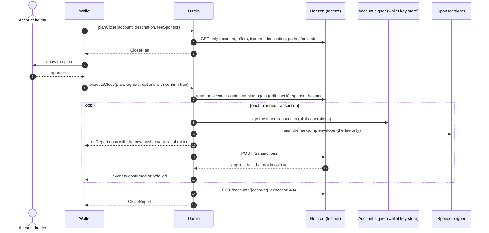

# Wallet integration notes

> Status: final for release 0.1.0, written on 2026-09-28 and updated on 2026-09-29 for the fixes of the Epic 4 review (story E4-S4, PRD FR-26). The API below is what `src/index.ts` exports on the main branch on that date, with the names of PRD section 7 (PRD decision D-2). The package `stellar-dustin` 0.1.0 is prepared; publishing it to npm is the builder's action and still pending, so section 1 also gives the from-source path. While the version starts with 0, a minor release may still change the API.

These notes are for a wallet developer who wants to offer "close this account" to users: plan the close, show it, get the account holder's approval, execute it with the wallet's own signer and a sponsor that pays every fee, and handle what can go wrong. Why the steps come in the order they do is in the [write-up](write-up.md).

## 1. Install and runtime

- Node.js 22.12 or newer (the minimum of the Stellar JavaScript SDK 17.1.0 that Dustin builds on). ESM and CommonJS entry points and TypeScript declarations are included: `stellar-dustin` (the SDK), `stellar-dustin/testing` (fixtures for your own tests, section 17) and `stellar-dustin/schemas/*` (the JSON schemas). The two runtime dependencies are the Stellar JavaScript SDK and `commander` (for the CLI).
- Testnet only (section 14).
- Once 0.1.0 is on npm (pending, the builder's action): `npm install stellar-dustin`.
- Until then, build a tarball from a clone and install it in your project:

```bash
git clone https://github.com/0xsimoneth/dustin.git
cd dustin
npm ci
npm pack        # builds dist/, checks the package and writes stellar-dustin-<version>.tgz
cd ../your-wallet
npm install ../dustin/stellar-dustin-<version>.tgz
```

The JSON documents the SDK and the CLI produce are described by [plan-schema.json](../schemas/plan-schema.json) (the `ClosePlan`) and [receipt-schema.json](../schemas/receipt-schema.json) (the `CloseReport`), both JSON Schema draft 2020-12. Both ship in the npm package (PRD decision D-17) and resolve through it: `require.resolve("stellar-dustin/schemas/plan-schema.json")`, or `import planSchema from "stellar-dustin/schemas/plan-schema.json" with { type: "json" }` in an ES module. They allow properties they do not list, so a later minor version may add fields; the offline tests validate every plan and report of the fixtures against them in a strict mode (story E4-S1).

## 2. The flow in one diagram

The two signers are the part integrators most often get wrong: the account's key signs every operation, the sponsor's key signs only the fee.



## 3. Step 1: plan the close

```ts
import { planClose } from "stellar-dustin";

const plan = await planClose({
  account: "G...", // the account to close
  destination: "G...", // receives the XLM through the merge; must exist; a G... or M... address
  feeSponsor: "G...", // optional: the account that will pay every fee
});
```

`planClose()` sends GET requests only: Horizon's root (to check that it serves the testnet), the account, its offers, each issuer the account holds a balance of, the destination, one strict-send path search per non-zero authorized balance, the fee statistics, the latest ledger, and the claimable balances that name the account as a claimant (`/claimable_balances?claimant=`, at most ten pages of 200); plus the claimable balances the account sponsors when it sponsors something, and pools when it holds pool shares. The snapshot's `claimableBalancesClaimable` tells the three cases apart: absent when nothing was asked (a custom `LedgerReader` without `claimableBalancesClaimableBy`), `null` when the read failed, which costs only a warning in the plan and never the inspection, and otherwise the list. Every request is retried after a network error, HTTP 429 or 5xx (three retries, with pauses of 1, 2 and 4 s), Horizon's root check included. It takes no secret and cannot sign or submit anything.

| `PlanCloseInput` field | Default | Meaning |
|---|---|---|
| `account` | required | The `G...` account to close. |
| `destination` | required | The merge destination, `G...` or `M...`; it must exist. |
| `feeSponsor` | none | The fee payer named in the plan. When set, `executeClose` requires the sponsor signer to be this account. |
| `memo` | none | At most 28 bytes; required when the destination (or an issuer the ladder pays) is memo-required under SEP-29. It goes on every transaction of the close. |
| `preferDestination` | `false` | Try the transfer to the destination before the return to the issuer (PRD decision D-1). |
| `slippageBps` | `100` | Slippage bound of each path payment, in basis points; it sets `destMin`. |
| `baseFeeStroops` | from `fee_stats` | Fee bid per operation instead of max(last ledger base fee, `fee_charged` p80); at least 100. |
| `maxBaseFeeStroops` | `1000000` | Cap on the bid per operation (0.1 XLM). |
| `budgetStroops` | `50000000` | The sponsor's budget for the whole close (5 XLM). |
| `maxWaitLedgers` | `120` | Longest sequence-guard wait the plan absorbs by separating the merge (about 10 minutes); beyond it the plan has a `SEQNUM_TOO_FAR` blocker. |
| `maxOpsPerTransaction` | `100` | At most 100, at least 2. |

Choosing `slippageBps`: the default of 100 (1%) is the builder's choice (PRD decision D-9). Each sale is quoted by Horizon's strict-send path finder right before the plan is made and again before signing, and `destMin` is the quote minus the bound, rounded up to a whole stroop and never below 1 stroop (`src/plan/ladder.ts`). A tighter bound makes a sale fail on the ledger when the book moves by a stroop, and the executor then re-plans the asset down the ladder (return to issuer, then the destination). A looser bound lets more sales through on a thin book, at a worse price. The bound is recorded in `plan.options.slippageBps`, is passed on to every re-plan, and is part of the plan hash when it differs from the default.

The second argument, `PlanCloseOptions`, takes `config` (`horizonUrl`, `networkPassphrase`, `explorerBaseUrl`) and `reader` (your own `LedgerReader`). `inspectAccount(account, { destination })` returns the snapshot on its own, and `planFromSnapshot(snapshot, options)` is the pure planner over it.

`planClose()` throws a `DustinError` only for input it cannot plan with: `INVALID_ADDRESS` (a malformed address, no destination, a fee sponsor equal to the account), `CONTRACT_ACCOUNT` (a `C...` address), `CONFIG_INVALID` (an option out of range), `MAINNET_REFUSED` (a Horizon that does not serve the testnet, or an explorer base URL that names another network, such as `https://stellar.expert/explorer/public`), `HORIZON_UNAVAILABLE` (Horizon unreachable after its retries; `retryable` is true) and `LEDGER_DATA_INVALID` (Horizon answered data that breaks the protocol's rules, for example an amount that is not a Stellar amount). Everything else is data in the plan: an account that does not exist is a plan with status `blocked` and the blocker `ACCOUNT_MISSING`.

What a `ClosePlan` holds:

| Field | What it tells you |
|---|---|
| `status` | `closable`: the plan ends in the merge. `partial`: some items cannot be disposed of; everything else can run with `allowPartial`, and the account stays open. `blocked`: the merge is impossible today (see `blockers`); cleanup steps, if any, can still run with `allowPartial`. |
| `steps[]` | In execution order: `id`, `kind` (`cancel_offer`, `dispose_balance`, `remove_trustline`, `remove_data`, `merge`), `txIndex`, `subject`, `reason`, `dependsOn`, `threshold`, `operation`, and for disposals `disposal` (`rung`, `amount`, `to`, `quotedXlm`, `destMinXlm`, `fallbackRungs`, `ruledOut`); for removals `reserveReleasedTo`. |
| `transactions[]` | `index`, `phase` (`cleanup`, `convert`, `merge`), `stepIds`, `opCount`, `innerFeeStroops` (always 0), `feeBumpFeeStroops` (the sponsor's bid), `reason`. |
| `unclosable[]`, `blockers[]` | `code`, `reason`, `remedy` (and `permanent` for blockers): what keeps the account open and what the user can do (section 12). |
| `warnings[]` | For example a clawback-enabled trustline, a merge that has to wait for the sequence guard, a pool derived from its id, or claimable balances that name the account as a claimant: "This account is a claimant of N claimable balances: ...; The merge does not touch them: they stay on the ledger, and after the merge this account can no longer claim them unless it is created again; any other claimant their predicates allow can still claim them." with how to keep them (`src/plan/claimable.ts`; matrix row X-03). Such balances block nothing, and the plan stays closable. When the claimant read failed, the warning says that Dustin could not tell whether there are any; when the read reached its limit of 2000, it says "at least". |
| `recovery` | `xlmToDestination` (the balance now plus the quoted proceeds of path payments), `nativeBalance`, `quotedProceedsXlm`, `reservesReturnedToSponsors`, `feesPaidByAccount` (always `"0"`). |
| `fees` | `baseFeeStroops`, `basis`, `maxBaseFeeStroops`, `perTransactionStroops`, `totalStroops` (the bids), `budgetStroops`, `withinBudget`, `payer`. |
| `sequenceGuard` | `ok`, `unblocksAtLedger`, `etaSeconds` for the merge; `null` when the plan has no merge. |
| `planHash`, `snapshotHash` | The plan's structure (steps, order, grouping, rungs, blockers; no fees and no quotes; and not the sequence guard's `unblocksAtLedger`, its wait estimate or the regrouping of the merge they cause, PRD decision D-10) and the account state it was made from (the claimable balances naming the account are not part of it). |

Amounts are decimal strings with seven decimals; fees are whole stroops.

## 4. Step 2: show the plan

Either print it or build a screen from it.

- `renderPlan(plan)` returns the plain-text plan the CLI prints: ASCII, at most 120 columns, a reason for every step. Its options are `heading` (the first line) and `next` (a closing hint).
- For your own screen, show in this order:
  1. what arrives where: `recovery.xlmToDestination` at `destination`, noting that `quotedProceedsXlm` depends on the market;
  2. who pays: the sponsor pays every fee (`fees.payer`, bids up to `fees.totalStroops`), the account pays nothing (`recovery.feesPaidByAccount`);
  3. reserves that go back to reserve sponsors and never to the user (`recovery.reservesReturnedToSponsors`);
  4. what stays on the account: `unclosable[]` and `blockers[]` with their `reason` and `remedy`; translate from `code`, never from the English text;
  5. the steps, each with its `reason`, and the number of transactions;
  6. `warnings[]`.
- Offer "Close account" only when `status` is `closable` and `fees.withinBudget` is true. For `partial` or `blocked`, show what stays and why, and offer a partial run only as a separate, explicit choice (section 9).

## 5. Step 3: collect the account holder's approval

- Show the destination in full and say that the merge cannot be undone. The CLI makes the user type the last four characters of the destination; a wallet can use its own confirmation (PIN, biometrics, a hardware button) as long as the destination is unmistakable.
- Call `executeClose` with `confirm: true` only after that approval. Anything but the literal `true` throws `CONFIRMATION_REQUIRED` before anything is read or signed.
- Pass the plan the user approved. `executeClose` plans again from the ledger and compares the two (section 8).
- The plan hash leaves out market quotes, so `executeClose` also compares what the approved plan and its fresh plan recover: the balance plus the quoted sales. A lower amount (a sale's quote got worse while the user decided) is drift, and by default nothing is signed (`XLM_TO_DESTINATION_FELL`). Show the user the amount you pass in, since that is the one checked.

## 6. Step 4: execute the close

```ts
import { Keypair } from "@stellar/stellar-sdk";
import { executeClose, keypairSigner, renderReport } from "stellar-dustin";

// `ui`, `store`, `sponsorSecret` and `accountSigner` (section 6.1) are the wallet's own.
const stop = new AbortController(); // optional: ui.onCancel(() => stop.abort())
const report = await executeClose(
  plan,
  { account: accountSigner, feeSponsor: keypairSigner(Keypair.fromSecret(sponsorSecret)) },
  {
    confirm: true,
    signal: stop.signal, // optional: cancels the run (section 6.3)
    onEvent: (event) => ui.progress(event), // section 7
    onReport: (copy) => store.save(`close:${copy.account}:${copy.startedAt}`, copy), // section 7
  },
);
if (report.status === "closed" && report.verification?.accountExists === false) {
  ui.closed(report); // the account is gone: Horizon answered 404
}
console.log(renderReport(report, { plans: [plan] })); // the text receipt the CLI prints
```

`signal` is optional; section 6.2 says what an aborted signal does.

### 6.1 Signers

`Signers` is `{ account: Signer, feeSponsor: Signer }`, and a `Signer` is any object with `publicKey(): string` and `sign(tx): void | Promise<void>` that adds its signature to the transaction it receives. The account signer receives every inner transaction, which carries all the operations; the sponsor signer receives only fee-bump envelopes. `keypairSigner(keypair)` wraps a `Keypair` in a closure. A wallet plugs in its own key store:

```ts
import { TransactionBuilder } from "@stellar/stellar-sdk";
import type { Signer } from "stellar-dustin";

// A key store or device that signs the 32-byte transaction hash (keyStore is your own API).
const accountSigner: Signer = {
  publicKey: () => accountPublicKey,
  sign: async (tx) => {
    const signatureBase64 = await keyStore.signHash(tx.hash());
    tx.addSignature(accountPublicKey, signatureBase64); // the SDK verifies the signature
  },
};

// A wallet that signs transaction XDR and returns signed XDR (wallet is your own API).
const walletSigner: Signer = {
  publicKey: () => accountPublicKey,
  sign: async (tx) => {
    const signedXdr = await wallet.signTransaction(tx.toXdr(), tx.networkPassphrase);
    const signed = TransactionBuilder.fromXdr(signedXdr, tx.networkPassphrase);
    for (const signature of signed.signatures) tx.addDecoratedSignature(signature);
  },
};
```

`tx.hash()`, `addSignature`, `addDecoratedSignature`, `toXdr` and `TransactionBuilder.fromXdr` are methods of the Stellar JavaScript SDK 17.1.0. A signer that throws stops the run; the error carries the report (section 11).

Before anything is read, `executeClose` checks that the account signer's key is the plan's account (`WRONG_SIGNER`), that the sponsor is a different account (`INVALID_ADDRESS`), and, when the plan names a fee sponsor, that the sponsor signer is that account (`WRONG_SIGNER`).

### 6.2 What happens, in order

1. The options are checked (`CONFIG_INVALID` for a value out of range) and the plan's network must be the testnet.
2. Horizon must prove it serves the testnet (`GET /`).
3. The account is read again and planned again with the approved plan's options (round 0). A different plan hash, or less XLM recovered than the approved plan promised, is drift (section 8).
4. The run ends before anything is signed, with status `aborted`, in these cases:
   - the account no longer exists (`ACCOUNT_MISSING`, with Horizon's 404 recorded in `verification`);
   - the plan changed and `onDrift` is `"abort"` (`PLAN_CHANGED`, or `XLM_TO_DESTINATION_FELL` when only the amount fell);
   - the fresh plan cannot end in a merge and `allowPartial` is not set (`PLAN_NOT_CLOSABLE`);
   - it has nothing to execute (`NOTHING_TO_EXECUTE`);
   - it bids more than the budget (`OVER_BUDGET`).

   It throws `SPONSOR_UNDERFUNDED`, carrying the aborted report, when the sponsor cannot spend at least the budget. Just before the first submission the executor reads each reserve sponsor the plan names (section 6.4).
5. Each planned transaction is built, signed by the account signer, wrapped and signed by the sponsor, recorded in the report, then posted. A merge runs after a fresh preflight when it follows other transactions, and also when its plan says the sequence guard does not hold yet.
6. The sequence-guard wait. When the guard is all that holds the merge back, the executor emits `wait` with `state: "start"`, reads the latest ledger every `pollIntervalMs`, and emits `wait` with `state: "end"` once the ledger before `untilLedger` has closed. It then checks again and submits the merge. The wait has two bounds: the plan's `maxWaitLedgers` (default 120 ledgers, about 10 minutes) counted from the latest ledger, and a limit on the local clock of twice the time of the ledgers to wait for plus two more, at about 5 s per ledger. Beyond either bound nothing more is signed and the run stops with `SEQNUM_TOO_FAR` and `stop.unblocksAtLedger` (section 10). Live, through the CLI: [the wait and the merge in the unblocking ledger](../evidence/runs/20260928T125223Z-e3s4-wait/summary.md).
7. Failures are retried, rebuilt or planned again from the ledger as the [write-up](write-up.md) describes (sections 4 and 5).
8. Horizon is asked for the account; after a merge the executor waits up to `verifyTimeoutMs` for the 404. It then reads the reserve sponsors again.

When `signal` is aborted, the run stops at the next safe point and posts nothing after it: an envelope already posted is looked up once more and settled, or recorded as `unknown`; a wait (for an outcome, for the sequence guard) ends at once. The report ends with the stop `INTERRUPTED` (verdict `replan`) and is returned, not thrown; its status is `aborted` when nothing was submitted, `failed` after a submission, or `closed` when a merge of the run had applied. When an envelope's outcome was still open, the stop names it with `hash` and `maxTime`, as for `OUTCOME_UNKNOWN`; a string reason such as `"SIGINT"` is named in the stop's detail. Running the close again continues from the ledger (section 10).

### 6.3 Options

| `ExecuteOptions` field | Default | Meaning |
|---|---|---|
| `confirm` | required | The literal `true`. |
| `allowPartial` | `false` | Run everything but the merge when the plan cannot end in one (section 9). |
| `onDrift` | `"abort"` | What to do when the ledger differs from the approved plan: stop, or continue with the fresh plan (section 8). |
| `onEvent` | none | Progress events (section 7). |
| `onReport` | none | A copy of the report after every change (section 7). |
| `signal` | none | An `AbortSignal`; aborting it ends the run at the next safe point with the stop `INTERRUPTED` (section 6.2). The CLI aborts it on SIGINT and SIGTERM. Anything but an `AbortSignal` is `CONFIG_INVALID`. |
| `config`, `reader` | testnet defaults | As for `planClose`. |
| `budgetStroops` | the plan's (5 XLM) | The sponsor's budget for this close. |
| `maxBaseFeeStroops` | the plan's (1,000,000) | Cap on the bid per operation, also for fee escalation. |
| `timeoutSeconds` | `120` | Validity of each inner transaction, from 1 to 3600 seconds. |
| `maxAttemptsPerTransaction` | `5` | Envelopes per planned transaction, the first one included. |
| `maxReplans` | `3` | Re-plans after operations failed on the ledger. |
| `maxRateLimitRetries` | `5` | Posts of one envelope after HTTP 429. |
| `pollIntervalMs` | `2000` | Pause between lookups, and between reads of the latest ledger during the sequence-guard wait; from 200 ms (never 0, PRD decision D-5) to 2^31 - 1 ms, Node's timer limit. |
| `backoffMs` | `1000` | First pause after a 429, doubled each time; from 200 to 2^31 - 1 ms. |
| `graceSeconds` | `10` | How long to keep looking for an unconfirmed envelope after its time bound; from 0 to 3600 seconds. |
| `ledgerWaitSeconds` | `60` | How long to wait beyond that for a ledger closed after the bound; from 0 to 3600 seconds. |
| `verifyTimeoutMs` | `30000` | How long the final check waits for Horizon to answer 404 after a merge; from 0 to 3,600,000 ms (one hour). |
| `sleep`, `now` | a timer, `Date.now` | Injected in tests; a test that must not wait passes a `sleep` that returns at once, never a pause of 0. |

Every numeric option is checked before anything is read or signed; a value out of its range throws `CONFIG_INVALID` (stage `config`). Every pause of a bounded wait is `pollIntervalMs` but never longer than the time left in that wait, and never below 200 ms. A custom `submitter` is also accepted; it is internal and not documented for 0.1.0.

### 6.4 The report

`executeClose` returns a `CloseReport` ([receipt-schema.json](../schemas/receipt-schema.json)):

| Field | Meaning |
|---|---|
| `status` | `closed` (a merge of this run applied), `partial` (everything possible ran; the account still exists), `aborted` (nothing was submitted), `failed` (stopped after something was submitted, with no merge of this run applied; run again to continue). Copies published during a run carry `running`. |
| `stop` | Why the run stopped or did not start: `code`, `stage`, `verdict`, `detail`, and where relevant `txIndex`, `hash`, `stepId`, `resultCodes`, `unblocksAtLedger`, `maxTime`, and `xlmToDestination` (`{ approved, fresh }`). `null` when the run did everything it could. |
| `message` | The same in one sentence. |
| `transactions[]` | Every envelope submitted: `hash` (the fee bump's, the one explorers show), `innerHash`, `sequence`, `baseFeeStroops`, `ledger`, `feeChargedStroops`, `feeAccount`, `result` (`pending`, `applied`, `failed`, `rejected`, `unknown`), `resultCodes`, `explanation`, both envelopes as XDR, `explorerUrl`, `horizonUrl` (`GET /transactions/{hash}` on the run's Horizon) and `operations`: one `OperationSummary` per operation, in the order of `stepIds`, with `stepId`, `kind`, `type` (the Stellar operation), `subject`, `summary` (the receipt's words) and, where they apply, `offerId`, `asset`, `dataName`, `poolId`, and for a disposal `amount`, `rung` and `to` (the merge's `to` is the destination). An envelope whose outcome is `unknown` also carries `mayStillApply`, `sequenceUsed` and `lookupError`. Reports written before story E4-S1, among them the ones committed under `evidence/runs/`, lack `horizonUrl`, `operations` and `links`. |
| `steps[]` | Each step of the plan the run started with: `status` (`applied`, `failed`, `not_run`), `txHash`, and `rung` for a disposal, which after a fall down the ladder differs from the plan. |
| `replans[]` | Each re-plan with its trigger, the assets demoted from the path payment and any drift. |
| `unclosable[]`, `blockers[]` | What still keeps the account open, including `STEP_FAILED_TWICE` found during the run. |
| `recovery` | `mergedXlm` (read from the merge result), `reservesReturnedToSponsors`, `feesPaidByAccount` (`"0"`), `feesPaidBySponsorStroops`, and `sponsorsObserved`: for each reserve sponsor the plans name, a `SponsorObservation` `{ sponsor, before, after }`, each side a `SponsorState` `{ numSponsoring, balance, minimumBalance, ledger }` as Horizon showed it, or null when that read failed. |
| `verification` | `accountExists`, `horizonStatus`, `checkedAt`, `accountUrl`, `ledger`. |
| `links` | `{ account, destination }`, each an `AccountLinks` `{ explorer, horizon }`: the account's explorer page and its Horizon resource; a muxed destination is linked through its G account. |

A merge of this run that applied always gives `status: "closed"`:

- a verified close is `closed` with `verification.accountExists === false` and no `stop`;
- when Horizon still returns the account at the final check, the report is `closed` with the stop `ACCOUNT_STILL_EXISTS`, and the CLI exits 5. Look at the account on the explorer before doing anything else;
- `closed` with `verification` null means the merge applied but the run was interrupted before the final check: call `verifyClosed(account)`. It returns `{ accountExists, horizonStatus, checkedAt, ledger, accountUrl }` and looks again every `intervalMs` (default 2 s) until Horizon answers 404 or `timeoutMs` (default 30 s) has passed.

The account being gone proves a close only after this run posted a merge envelope that could have applied. When the run's merge was refused or failed on the ledger, or can never apply, and someone else removed the account, the run keeps its stop: `failed`, CLI exit 5; running the close again then finds the account gone (`ACCOUNT_MISSING`, nothing submitted).

What the live metric close of 2026-09-28 recorded ([report](../evidence/runs/20260928T112252Z-e3-cli/report.json)): `status` `closed`, three transactions each with `feeAccount` the sponsor and `feeChargedStroops` 1,000, 300 and 200, `recovery.mergedXlm` `"4.0000007"`, `feesPaidBySponsorStroops` 1,500, and a reserve sponsor observed at `numSponsoring` 1 and a minimum balance of 1.5 XLM before, 0 and 1.0 XLM after, with its balance unchanged.

## 7. Progress events and persisted copies

`onEvent` receives, in order:

| `type` | When | Fields | Show |
|---|---|---|---|
| `plan` | The fresh plan before anything is signed (`round` 0), and each re-plan | `plan`, `round` | "Checking the account" or "Plan updated" |
| `drift` | The ledger differs from the approved plan | `action` (`abort` or `replan`), `previousPlanHash`, `planHash`, and `xlmToDestination` (`{ approved, fresh }`) when the fresh plan recovers less | "The account changed" or "The amount fell" |
| `preflight` | Before a merge that follows other transactions or whose plan says the sequence guard does not hold yet | `index`, `ok`, `detail` | Only on failure |
| `wait` | The sequence-guard wait before a merge begins (`state: "start"`) and ends (`state: "end"`) | `reason` (`"sequence"`), `state`, `index`, `untilLedger`, `currentLedger` | "Waiting for ledger N (about S s)" |
| `tx:building` | An envelope is being built; a rebuild raises `attempt` | `index`, `phase`, `opCount`, `attempt`, `round` | "Transaction n of m" |
| `tx:submitted` | Signed and recorded in the report, about to be posted | `index`, `hash`, `explorerUrl`, `attempt`, `round` | The hash and the explorer link |
| `tx:confirmed` | Applied on the ledger | `index`, `hash`, `ledger`, `feeChargedStroops` | "Confirmed" |
| `tx:failed` | Failed on the ledger, refused, or not known yet | `index`, `hash`, `result` (`failed`, `rejected`, `unknown`), `detail` | The `detail` sentence |
| `verified` | The final check | `accountExists` | "The account no longer exists" |
| `done` | The run finished | `status` | The outcome |

`index` is 0-based within the plan of its `round`.

**The NDJSON form.** With `--json`, `dustin plan` and `dustin close` are in machine mode (PRD section 6). Standard output carries exactly one JSON document once the plan was shown: the close report once the executor has one, otherwise the plan (for a dry run, and for a run refused or failed before the executor's first report). Standard error carries NDJSON only, one JSON object per line with a `type`, and never human text:

| `type` | Fields |
|---|---|
| `drift`, `preflight`, `wait`, `tx:building`, `tx:submitted`, `tx:confirmed`, `tx:failed`, `verified`, `done` | The `CloseEvent` above, with the same names and fields |
| `plan` | A compact form: `round`, `planHash`, `status`, `counts` (`steps`, `transactions`, `unclosable`, `blockers`); the whole plan is the standard output document when a run is refused, and the report names every round's hash |
| `notice` | `message`: a note, among them the skipped confirmation, the `--report` file written or not, and a signal received |
| `document` | `document`: the one JSON document, when standard output was closed early (`| head`, EPIPE); a `notice` line says so first, and the document follows on standard error on one line |
| `error` | `code`, `message`, `remedy`, `exitCode`: the error or the stop the command ends with. `code` is a `DustinErrorCode`, a `StopCode` (`INTERRUPTED` also for a signal before anything was signed), or one of the CLI's own `USAGE_ERROR` and `UNEXPECTED_ERROR`; with `--verbose` the line also has `stage`, `verdict`, `retryable`, `details`, `horizon` and `causes`. A run that ends with a stop ends with such a line (its `remedy` is the receipt's "Next" line), and so does a refusal before anything is signed; a partial close ends with the `done` line |

Hashes and addresses are full in every line, and every line is redacted. `plan --json` and the dry-run `close --json` print no line on standard error unless there is a note or an error. Machine mode never asks anything: `close --execute --json` without `--yes` is refused with `CONFIRMATION_REQUIRED` (exit 3, the plan on standard output), and a secret that is in neither the environment nor `.env` is not prompted for (`MISSING_ACCOUNT_SECRET` or `MISSING_SPONSOR_SECRET`, exit 2). A script reads standard error line by line and standard output as one document.

`onReport` receives a copy of the report whenever it changes: when it is created, before each post, after each outcome and re-plan, at the end, and right before an error is thrown. Save every copy. An envelope's hash is in the report before its POST starts, so a crash, a closed tab or a lost connection cannot lose a submitted hash. Copies of an unfinished run carry `running`; the last copy carries the final status. An observer that throws does not stop the run: its error becomes a warning in the report. `renderReport` on a copy saved while the run is going says "not run yet" for a step that has not run, "attributed when the run ends" for the reserves and "not read yet" for the sponsor reading after the run.

## 8. Drift

Drift is a difference between the ledger and the plan the user approved. Dustin looks for it in three places:

- at the start, when the fresh plan's hash differs from the approved plan's;
- at the start, when the fresh plan recovers less XLM than the approved plan: the account's balance plus the quoted proceeds of its sales (`recovery.nativeBalance` plus `recovery.quotedProceedsXlm`, compared in stroops). A higher amount is not drift;
- after every mid-run re-plan, when the re-plan found a new offer, trustline, data entry or pool share, a larger balance, an asset moving up the ladder, or a merge the approved plan did not have.

Steps that already applied disappearing, and balances falling down the ladder, are not drift. Nor is a sequence guard that clears, or starts to hold, while the user decides: its `unblocksAtLedger`, its wait estimate and the regrouping of the merge they cause are not part of the plan hash (PRD decision D-10), so the run follows the fresh plan and the report carries a warning that names the old and the new transaction of the merge. A plan that gains or loses its merge is drift.

- `onDrift: "abort"` (default): the run stops with `PLAN_CHANGED`, or with `XLM_TO_DESTINATION_FELL` when only the amount fell; both amounts are in `stop.xlmToDestination` and on the `drift` event. A stop at the start has submitted nothing (`aborted`; the CLI exits 3). A stop mid-run leaves the transactions already applied on the ledger (`failed`; the CLI exits 5).
- `onDrift: "replan"`: the run continues with the fresh plan without asking anyone; a fallen amount then adds a warning that names both amounts. A fresh plan without the merge goes on only with `allowPartial`.

A wallet should keep the default, show the new plan (`planClose` again) and ask the user again.

## 9. Partial closes

A plan with status `partial` or `blocked` cannot end in a merge. With `allowPartial: true`, `executeClose` runs every transaction except the merge: offers are cancelled, balances are sold or burned, trustlines and data entries are removed, and the account stays open with the items that could not be handled. The report ends `partial` and lists them in `unclosable` and `blockers`. Without `allowPartial` the run ends before anything is signed (`PLAN_NOT_CLOSABLE`).

Because a partial run burns or sells balances on an account that will remain, offer it only as a separate choice that says so. The CLI's equivalent is `--partial`. Two live runs through the CLI on 2026-09-28 show both paths: a trustline frozen by its issuer ([`edge-frozen`](../evidence/runs/20260928T125414Z-edge-frozen/summary.md)) and two balances with no route because their issuer requires a memo ([`e3s2-partial`](../evidence/runs/20260928T125528Z-e3s2-partial/summary.md)). Without `--partial` each exited 3 and the account's sequence number did not move; with it each exited 4, ran everything else, submitted no merge, and the receipt listed the items under "Not closed" with their reason and remedy.

## 10. Continuing a stopped run

There is no resume option (PRD decision D-2): the ledger is the source of truth, so continuing is running the close again. Call `planClose` again, show the new plan, and call `executeClose` with it. The new plan contains only what is left. Calling `executeClose` again with the old plan does not continue: the steps that applied are gone, so its hash no longer matches and the run ends `aborted` with `PLAN_CHANGED` (unless `onDrift: "replan"`).

Some stops say when to come back:

| `stop.code` | Run again when |
|---|---|
| `OUTCOME_UNKNOWN` | A ledger has closed after `stop.maxTime`: until then the envelope `stop.hash` may still apply. |
| `SEQNUM_TOO_FAR` with `stop.unblocksAtLedger` | At or after that ledger. The executor already waits within the plan's `maxWaitLedgers`; this stop means the wait would have been longer, or ran out, or the merge failed with `op_seq_num_too_far` twice, or no re-plan or budget was left. |
| `MERGE_PREFLIGHT_FAILED` | The cause in `stop.detail` is gone: a subentry left, a sponsorship, or a destination that is missing or now requires a memo. |
| `XLM_TO_DESTINATION_FELL`, `PLAN_CHANGED` | The user has seen and approved the new plan (section 8). |
| `RETRY_LIMIT`, `FEE_LIMIT`, `OVER_BUDGET` | Network fees fall, or with a larger `budgetStroops` or `maxBaseFeeStroops`. |
| `STEP_FAILED_TWICE`, `OPERATION_FAILED`, `TRANSACTION_REJECTED`, `REPLAN_LIMIT` | The cause in `stop.detail` is resolved, or has settled. `allowPartial` does not skip a step that failed twice. |
| `SEQUENCE_CONFLICT` | No other client is submitting for the account. |
| `INTERRUPTED` (the `signal` was aborted) | At once, unless the stop names `maxTime`: then only after a ledger has closed past it, since that envelope may still apply. |
| `ACCOUNT_MISSING` | Never: Horizon answered 404, so if an earlier run merged the account, the close is complete. `verification` records the 404; the CLI asks nothing, signs nothing, says in the receipt that a close by an earlier run is complete, and exits 3. |

Keep the reports of earlier runs: each holds the hashes of its own transactions.

## 11. Errors

Every error and stop code, with its meaning, stage, exit code and remedy, is listed in [docs/errors.md](errors.md). They fall in three classes:

1. **Blockers in the plan.** Returned as data, never thrown: `plan.blockers[]` and `plan.unclosable[]`, each with a `code`, a `reason` and a `remedy` (section 12). Nothing is submitted while they hold, unless a partial close was allowed.
2. **Per-step failures.** A transaction failed on the ledger or was refused. The report records its `resultCodes` and an `explanation`, and the executor decides from the first failed operation's code whether to re-plan (for example `op_too_few_offers` moves the asset down the ladder), rebuild or stop ([write-up](write-up.md), section 4). The run ends with a `stop` whose `code` says what happened; the table in section 10 says when to run again.
3. **Transport errors.** Horizon timeouts, 5xx and lost connections are Dustin's to handle: every read, and the check of Horizon's root, is retried three times with pauses of 1, 2 and 4 s; after a 504 on a submission Dustin looks the transaction up by hash and never sends a second envelope while the first may still apply. Do not submit Dustin's envelopes yourself, and do not submit other transactions for the account while a close runs. When Horizon stays unreachable the run throws `HORIZON_UNAVAILABLE` (`retryable` true) with the report so far.

Expected outcomes are returned, not thrown ([ADR-0006](adr/ADR-0006-error-taxonomy.md)). `executeClose` throws a `DustinError` for configuration errors found before anything is read or signed, and for the unexpected. An error thrown after the report exists carries it in `error.report`, so no submitted hash is lost; check `error.report?.transactions` before treating a thrown error as "nothing happened".

A `DustinError` has `code` (stable; branch on it, never on the message), `stage`, `retryable`, `verdict` (`retry-same`, `rebuild-same-sequence`, `replan`, `stop`), `remedy` (one sentence a person can act on, where the raising code knows a specific one), `details`, `horizon` (the result codes), the underlying error as `cause`, and `report`. `remedyOf(error)` returns the error's own remedy or, when it has none, the default remedy of its code (`DEFAULT_REMEDIES`, both exported); the CLI prints it under every error. Every text field is redacted: nothing shaped like a secret key survives in it.

| `DustinError` code | When | What to do |
|---|---|---|
| `CONFIRMATION_REQUIRED` | `confirm` is not the literal `true` | Get the approval first. |
| `CONFIG_INVALID` | An option out of range, a pause below 200 ms, a bad Horizon URL | Fix the option. |
| `MAINNET_REFUSED` | A network other than the testnet | Use the testnet. |
| `INVALID_ADDRESS`, `CONTRACT_ACCOUNT` | A malformed address, a missing destination, a sponsor equal to the account, a `C...` address | Fix the input. |
| `WRONG_SIGNER` | A signer that does not match the plan's account or fee sponsor; its remedy names the signer argument (`signers.account` or `signers.feeSponsor`) | Pass a signer of the plan's account as `signers.account` and one of its fee sponsor as `signers.feeSponsor`, or plan again with the right `feeSponsor`. |
| `HORIZON_UNAVAILABLE` | Horizon unreachable or failing after the retries | Retry later; if `error.report` holds submitted transactions, continue as in section 10. |
| `LEDGER_DATA_INVALID` | A value from Horizon, or from a snapshot or plan built from it, breaks the protocol's rules: an amount that is not a Stellar amount, a liquidity pool whose assets do not hash to its id, an operation the SDK cannot encode | Run again: one Horizon instance may have answered wrongly. |
| `SPONSOR_UNDERFUNDED` | The sponsor cannot spend at least the budget | Fund the sponsor (section 13). |
| `SPONSOR_BUDGET_EXCEEDED` | A signature would take the close over its budget | Raise the budget or wait for fees to fall. |
| `SPONSOR_REFUSED`, `TOO_MANY_OPERATIONS` | Safety checks before signing; they indicate a bug | Report it with `error.report`. |
| `EXECUTION_INTERRUPTED` | Any unexpected error during a run, wrapped with its cause | Read `error.report` and continue as in section 10. |

The CLI adds its own codes for its input (`SECRET_IN_ARGV`, `MISSING_ACCOUNT_SECRET`, `MISSING_SPONSOR_SECRET`, `CONFIRMATION_DECLINED`) and the fixture commands theirs (`FRIENDBOT_FAILED` and `FIXTURE_STEP_FAILED`, exit 1 before a build submitted anything and 5 after; `FIXTURE_INVALID`; `MANIFEST_INVALID`, exit 2; `RESET_SUSPECTED`, exit 3); `DustinErrorCode` in `src/errors/dustin-error.ts` is the full list. Three more codes appear only in the CLI's output and are never thrown by the SDK: `USAGE_ERROR` (a command line that cannot be parsed, exit 2; people see the command's help, then `dustin: USAGE_ERROR: ...` and the remedy), `UNEXPECTED_ERROR` (something that is not a `DustinError`, exit 1, or 5 after a submission) and `INTERRUPTED` for a signal before anything was signed (exit 3; the stop code of the same name covers an interruption of the executor).

The report's `stop.code` is one of `PLAN_CHANGED`, `XLM_TO_DESTINATION_FELL`, `PLAN_NOT_CLOSABLE`, `NOTHING_TO_EXECUTE`, `ACCOUNT_MISSING`, `OVER_BUDGET`, `OPERATION_FAILED`, `STEP_FAILED_TWICE`, `REPLAN_LIMIT`, `TRANSACTION_REJECTED`, `SEQUENCE_CONFLICT`, `FEE_LIMIT`, `RETRY_LIMIT`, `OUTCOME_UNKNOWN`, `MERGE_PREFLIGHT_FAILED`, `SEQNUM_TOO_FAR`, `ACCOUNT_STILL_EXISTS`, `INTERRUPTED` (`StopCode` in `src/execute/report.ts`), or the code of the `DustinError` that interrupted a run which then threw. Its `verdict` is `replan` when running the close again is the remedy and `stop` when something must change first.

## 12. Unclosable and blocker codes

The two lists the SDK exports (`UnclosableCode` and `BlockerCode`, `src/plan/model.ts`). Localize from the code, never from the English `reason`; the `remedy` string of each item is the planner's own and names the accounts involved.

`UnclosableCode`: an item that stays on the account; everything else can run with `allowPartial`, and the account stays open.

| Code | Meaning | Remedy |
|---|---|---|
| `TRUSTLINE_NOT_AUTHORIZED` | The issuer has not authorized the trustline, or revoked it; the balance cannot move, not even back to the issuer. | Ask the issuer to authorize the trustline again (SetTrustLineFlags), then plan again; for a clawback-enabled trustline, the issuer can also claw the balance back. |
| `MAINTAIN_LIABILITIES_ONLY` | The issuer limited the trustline to maintaining liabilities; the balance cannot be sent. | The same as above. |
| `NO_DISPOSAL_ROUTE` | No path to XLM (or one paying less than 1 stroop, or one through the account's own offer), an issuer that requires a memo that was not given, and a destination that cannot take the asset. | Open one route: a market that buys the asset; the memo the issuer requires (`memo`); or a `CODE:ISSUER` trustline with room on the destination. |
| `LIQUIDITY_POOL_SHARES` | An empty pool-share trustline whose pool neither Horizon nor the account's assets identify. | Check the pool on Horizon (`/liquidity_pools/{id}`) and plan again, or remove the trustline outside Dustin. |
| `POOL_ASSET_TRUSTLINE` | A trustline of a pool's asset while the account holds that pool's shares. | Withdraw from the pool and remove the pool-share trustline first. |

`BlockerCode`: the merge is impossible today; `permanent` says whether anything can change that.

| Code | Meaning | Remedy |
|---|---|---|
| `ACCOUNT_MISSING` | Horizon answers 404: the account was already merged or never existed. | Nothing is left to close. |
| `AUTH_IMMUTABLE_SET` | The account has `AUTH_IMMUTABLE` and can never be merged. | None; with `allowPartial` the rest runs and the account keeps its XLM. |
| `IS_SPONSOR` | The account sponsors reserves of other entries, including claimable balances it created. | Revoke or transfer those sponsorships (a claimable balance's ends when it is claimed or clawed back), then plan again. |
| `MASTER_KEY_DISABLED` | The master key has weight 0. | Sign with the other signers outside Dustin; with none, the account can never be cleaned up or merged. |
| `THRESHOLD_UNMET` | The master key's weight is below the threshold the merge (or the cleanup) needs. | Sign outside Dustin with enough weight, or lower the thresholds; multisig closing is out of scope. |
| `DESTINATION_MISSING` | The destination does not exist. | Fund it first, or choose another; Dustin never creates it. |
| `DESTINATION_IS_SELF` | The destination is the account itself. | Choose another destination. |
| `DESTINATION_REQUIRES_MEMO` | The destination is memo-required under SEP-29 and no memo was given. | Pass the memo it expects (`memo`, CLI `--memo`). |
| `SEQNUM_TOO_FAR` | The sequence number is ahead of the ledger by more than `maxWaitLedgers`. | Wait until the ledger named in the reason and plan again. |
| `LIQUIDITY_POOL_SHARES` | The account holds pool shares. | Withdraw and remove the pool-share trustline outside Dustin. |

A run can add one more blocker, `STEP_FAILED_TWICE` (`RunBlocker` in the report): a step failed on the ledger twice. Resolve the cause and run again. The [write-up](write-up.md) (section 8.2) explains each code with its protocol background.

## 13. The sponsor: funding and protection

- **What the sponsor does.** It is the fee account of every fee bump and pays every fee; the closed account pays none ([fee-bump transactions](https://developers.stellar.org/docs/build/guides/transactions/fee-bump-transactions)). It signs only fee-bump envelopes and never an operation. Before your sponsor signer is called, Dustin refuses an inner transaction sourced by the sponsor, any operation that acts for another account, and any bid that would exceed the budget, so the sponsor's signature can authorize nothing but the fee.
- **The per-close budget and the cap.** `budgetStroops` (default 5 XLM per close) bounds the sum of the bids of one close, counting only the largest bid per sequence number; `maxBaseFeeStroops` (default 1,000,000 stroops, 0.1 XLM per operation) bounds each bid. Both are plan options, and `ExecuteOptions` can override them for one run. The most a sponsor can lose on one close is its budget. The fee actually charged is usually far lower than the bid: the metric close of 2026-09-28 bid 1,262,430 stroops in all and was charged 1,500 ([write-up](write-up.md), section 5).
- **Funding.** The executor refuses to start unless the sponsor can spend at least the budget, over and above its own minimum balance (`SPONSOR_UNDERFUNDED`). On testnet, fund a sponsor from Friendbot (`https://friendbot.stellar.org/?addr=G...`, 10,000 XLM).
- **Several closes at once.** A fee bump does not use the sponsor's sequence number (the sequence number comes from the inner transaction's source), so one sponsor can pay for closes of different accounts at the same time. Each run checks only its own budget against the sponsor's balance, so fund the sponsor for the sum of the budgets that can run at once. Never run two closes of the same account at once.
- **Keys.** Keep the sponsor key in the process or service you trust with fees, or behind a key-management system that signs the fee-bump hash (section 6.1). The sponsor must never be the account being closed; it may be the destination, and the report then carries a warning.

## 14. Testnet only

`resolveConfig()` refuses any network passphrase but `TESTNET_PASSPHRASE` (`Test SDF Network ; September 2015`), and `verifyHorizonIsTestnet(url)` asks Horizon's root which network it serves; `planClose`, `executeClose` and `verifyClosed` refuse anything else before they read any account, and `resolveConfig()` refuses an explorer base URL that names another network (`MAINNET_REFUSED`). The defaults are `DEFAULT_HORIZON_URL` (`https://horizon-testnet.stellar.org`) and `DEFAULT_EXPLORER_BASE` (`https://stellar.expert/explorer/testnet`). Friendbot funds a new testnet account with 10,000 XLM. The testnet is reset about once a quarter, next on 2026-12-16, and a reset deletes every account ([networks](https://developers.stellar.org/docs/networks)); keep the reports if you need a record.

## 15. Integration checklist

- [ ] The plan is shown before anything is signed, and the close button is enabled only for a `closable` plan within budget.
- [ ] The destination is shown in full, and the user confirms knowing the merge cannot be undone.
- [ ] Unclosable items and blockers are shown with their remedy, translated from `code`.
- [ ] Reserves returned to reserve sponsors are shown as not the user's.
- [ ] The account signer is the wallet's own key store; no account secret reaches Dustin as a string.
- [ ] The sponsor runs where its key is safe, with a `budgetStroops` and `maxBaseFeeStroops` you chose, and is funded for every close that can run at once.
- [ ] Every `onReport` copy is saved before the next one arrives.
- [ ] Drift stops the run (`onDrift: "abort"`) and the new plan is shown again.
- [ ] A partial close is a separate, explicit choice.
- [ ] A stopped or cancelled run is continued by planning again, honouring `stop.maxTime` and `stop.unblocksAtLedger`.

## 16. A complete program

[`examples/close-with-sponsor.ts`](../examples/close-with-sponsor.ts) is sections 3 to 11 in one program: `planClose` with `preferDestination`, `renderPlan`, the approval as `dustin close --execute` asks for it (the destination's last four characters), `executeClose` with `allowPartial`, an `AbortSignal` on Ctrl-C and the events, `renderReport`, and `DustinError` handled by its `code` with `remedyOf`, mapped to the CLI's exit codes. CI type-checks it against the package's published types after the build (`npm run typecheck:examples`), so it follows the API as released; it is not run in CI, because it needs two testnet secrets, which it reads from its own environment (the SDK never does).

## 17. Testing your integration: `stellar-dustin/testing`

The package's second entry point builds the fixture accounts of this repository on the testnet and plans offline from their recorded Horizon responses (PRD decision D-18). [`examples/plan-a-fixture.ts`](../examples/plan-a-fixture.ts) uses it, and CI type-checks it the same way:

- `buildMessyFixture()` builds the SOW's metric account (4 trustlines with dust, one of them sponsored by a separate reserve sponsor, 2 offers, 1 data entry, zero spendable XLM) with its sponsor, issuer, market maker and destination; `buildEdgeFixture()` builds one throwaway account per edge case of the test matrix. Every account gets a new key from `Keypair.random()` and is funded by Friendbot; no builder reads a secret from the environment or asks for one, and the new keys reach you through `onKeys` before any account is funded, so a build that stops halfway loses none. Keep them: they are needed to close the fixture later. Testnet only.
- `checkMessyFixture(manifest)` checks a messy fixture against Horizon as `dustin fixture verify` does, SOW Appendix B among its checks, and refuses a testnet reset with `RESET_SUSPECTED`; `verifyFixture` with `loadVerifyInput` or `loadMessyVerifyInput`, and `verifyEdgeFixture` with `loadEdgeVerifyInput`, are its parts; `readManifest` and `readAnyManifest` read the manifests that `dustin fixture create` writes.
- `recordedReader(built.recorded)` is a `LedgerReader` over the Horizon responses a build recorded, for `planClose(input, { reader })` with no network, in unit tests of your own planning code; `recordedFetch` is the same answers as a `fetch`.
- An error these helpers throw is the `DustinError` of `stellar-dustin` itself: the two entry points share one copy of each module, in ES modules and in CommonJS (`npm run check:package` checks it).

## Appendix: the CLI as a reference integration

`dustin close <account> --to <destination> --execute` uses exactly the API above. What it does, in order:

1. Checks the addresses, then reads the two secrets from the environment, else `.env` in the working directory, else a hidden prompt (PRD decision D-11), and checks them: each must be a valid secret key, the account secret must belong to the account being closed, and the sponsor must be a different account. The hidden prompt is asked only when standard input and standard error are terminals and `--json` is not given; nothing typed is echoed, the account's secret is asked and checked first, and Ctrl-C or the end of input counts as a missing secret. A missing, malformed or wrong secret stops the run with exit code 2; its value is never printed.
2. Asks Horizon which network it serves (`GET /`) and refuses anything but the testnet.
3. Reads the account again and prints a fresh plan, with the sponsor as fee payer and the sponsor's per-close budget (5 XLM) next to the fee bid.
4. On an account Horizon answers 404 for (a run after a completed close), it asks nothing and signs nothing: the executor records the 404 in the report (`verification.accountExists === false`, `horizonStatus` 404), the receipt says a close by an earlier run is complete, and the command exits 3. Otherwise it stops before anything is signed, with exit code 3, when there is nothing to execute, when an item cannot be disposed of and `--partial` is not given (with the reason and the remedy for each item), when the fee bid exceeds the budget, or when the sponsor cannot spend at least the budget.
5. Shows what will happen and asks for the last four characters of the destination: the destination and the XLM it receives through the merge; the sponsor, the plan's bid and, on its own "at most" line, the close budget as the most the sponsor can pay; what the sponsor can spend, and the transactions and operations. The question goes to standard error and is asked only when standard input, standard error and standard output (which carried the plan and the summary) are all terminals; otherwise the run ends unconfirmed (`CONFIRMATION_DECLINED`, exit 3) and the message names the stream that is not a terminal. With `--json` it is never asked: without `--yes` the run is refused with `CONFIRMATION_REQUIRED` (exit 3). A wrong answer, an empty answer, the end of input or Ctrl-C also leave everything untouched (exit 3). `--yes` skips the question for scripts and says so; it is honoured only with `--execute`.
6. Runs the plan through `executeClose`, which plans again after the answer. If a quote got worse in the meantime and the close would recover less than the summary said, the run stops with exit code 3 and signs nothing (`XLM_TO_DESTINATION_FELL`). Each transaction prints its hash and explorer link when it is submitted, then its ledger and the fee charged to the sponsor when it is confirmed, or its result codes when it fails. A merge held back by the sequence guard prints the start and the end of its wait. SIGINT and SIGTERM are handled from the start of `close --execute`. Before the executor runs, nothing is signed: a signal ends the command with the error code `INTERRUPTED` and exit 3 (with `--json`, an `error` line and the plan as the document once it was shown), and a second signal exits 3 at once. While the executor runs, a signal aborts its `signal`: the close stops at the next safe point, checked right before every submission, and posts nothing after it; the receipt is printed and `--report` written, and the exit code follows the report: 3 when nothing was submitted, 5 when something was or may have been, 0 if the close had already completed. A second signal then writes the latest copy of the report to `--report` at once and exits 5; with `--json` it prints the one document, the latest copy of the report or, without one, the plan. While the hidden prompt or the typed confirmation waits, the handlers step aside, so Ctrl-C there is that prompt's answer: a missing secret (exit 2) or "not confirmed" (exit 3).
7. Checks the account on Horizon (404 means it no longer exists) and prints a receipt: every transaction with its outer and inner hash, ledger, fee and operations; the XLM merged into the destination; "Reserves released to sponsors" with each reserve sponsor's planned reserve and what Horizon showed before and after; the fees paid by the account (0) and by the sponsor; a Disposals section with what became of each leftover balance; a "Not closed" section with each unclosable item, the rungs ruled out and the remedy; explorer links for the account and the destination. After a partial or failed run a "Next" line says what is left and how to continue.

Details of the options:

- Without `--execute`, `dustin close` prints the same plan as `dustin plan` and changes nothing; `--yes`, `--partial` and `--report` then have no effect, and a note on standard error says so.
- `--sponsor <G...>`: with `--execute` it must be the owner of `DUSTIN_SPONSOR_SECRET` (otherwise `WRONG_SIGNER`, exit 2); leave it out and the sponsor is that owner.
- `--base-fee <stroops>`: with `--execute` it is both the bid and the ceiling; without it, a retry after a fee surge may raise the bid up to the per-operation cap, never beyond the budget.
- `--json`: machine mode, exactly one JSON document on standard output and NDJSON only on standard error (section 7). The exit code stays that of the refusal or the error.
- `--verbose` (a global option): an error's stage, verdict and whether it may be retried, Horizon's result codes, its details and its cause chain, after the one-line summary and the remedy; for an unexpected error, its stack. Secrets are still redacted.
- Without `--json`, the plan, the progress and the receipt go to standard output, and errors and notes to standard error: one line, `dustin: CODE: message`, then the remedy; a usage error prints the command's help first. The output never uses colour, so the global `--no-color` is accepted and changes nothing, and human text wraps at 120 columns; hashes and URLs are never split.
- `--report <file>`: the close report (JSON with public keys, hashes and envelopes; never a secret), rewritten after every change so a stopped run still has every hash. An existing file at that path is kept under a timestamped name; a file named `.env` in any letter case, or any path that is the working directory's `.env` through a link, is refused.
- Standard output closed early (for example `dustin close ... | head`): the rest of the output goes to standard error after one notice, starting with the chunk that hit the broken pipe, so no hash, receipt or report is lost. With `--json`, standard error stays NDJSON: the notice is a `notice` line, `{"type":"notice","message":"standard output was closed; the rest of the output goes to standard error."}`, and the document follows as one `{"type":"document","document":{...}}` line.

`DUSTIN_HORIZON_URL` and `DUSTIN_EXPLORER_BASE` come from the environment only.

## Assumptions

1. Code examples use the Stellar JavaScript SDK 17.1.0; `keyStore`, `wallet`, `ui` and `store` stand for the integrator's own APIs.
2. The CLI appendix describes `src/cli/commands/close.ts` on 2026-09-28, with the non-interactive `--json`, the NDJSON events, the interruption handling, the hidden prompt and `--verbose` of stories E4-S1 and E4-S2 merged the same day.
3. Fee figures quoted from the evidence are those of the metric close of 2026-09-28 (`evidence/runs/20260928T112252Z-e3-cli/`).

## Sources

- Exported API: `src/index.ts`; types in `src/plan/model.ts`, `src/execute/executor.ts`, `src/execute/report.ts`, `src/execute/events.ts`, `src/execute/verify.ts`, `src/sponsor/signer.ts`, `src/errors/dustin-error.ts`; the normative names: [PRD section 7](prd.md)
- Every error and stop code: [errors.md](errors.md); the JSON schemas: [plan-schema.json](../schemas/plan-schema.json), [receipt-schema.json](../schemas/receipt-schema.json); the CLI's machine mode: [PRD section 6](prd.md)
- Decisions: [canonical decisions](README.md); PRD decisions D-1 to D-13 in [prd.md](prd.md)
- Error taxonomy: [ADR-0006](adr/ADR-0006-error-taxonomy.md); fee bumps: [ADR-0003](adr/ADR-0003-fee-bump-every-transaction.md)
- Fee-bump transactions (fee account, validity, sequence number from the inner source): https://developers.stellar.org/docs/build/guides/transactions/fee-bump-transactions
- SEP-29 memo requirement: https://github.com/stellar/stellar-protocol/blob/master/ecosystem/sep-0029.md
- Networks (testnet, Friendbot, resets): https://developers.stellar.org/docs/networks
- The Stellar JavaScript SDK 17.1.0 (`TransactionBase.addSignature`, `addDecoratedSignature`, `toXdr`, `TransactionBuilder.fromXdr`): https://www.npmjs.com/package/@stellar/stellar-sdk/v/17.1.0
