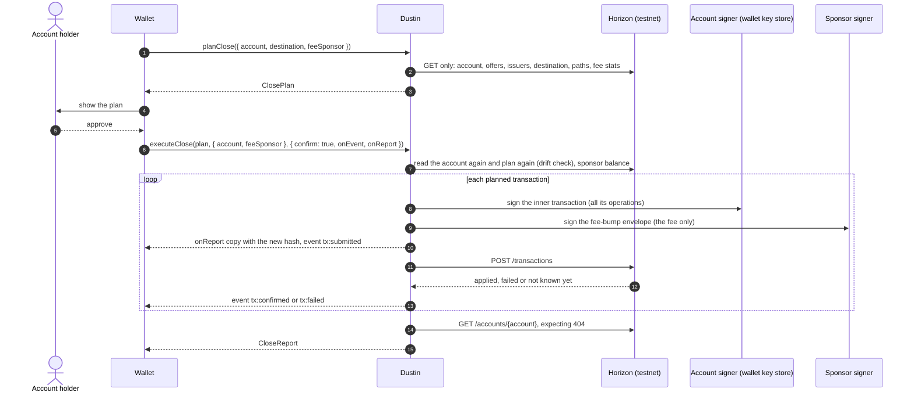

# Wallet integration notes

> Status: first version, 2026-09-28 (story E4-S4, PRD FR-26). The API below is what `src/index.ts` exports on the main branch on that date, with the names of PRD section 7 (rewritten on 2026-09-28, PRD decision D-2). **Not released yet:** the npm package `stellar-dustin` 0.1.0 is planned for week 4; until then, build it from source (section 1). While the version starts with 0, a minor release may still change the API.

These notes are for a wallet developer who wants to offer "close this account" to users: plan the close, show it, get the account holder's approval, execute it with the wallet's own signer and a sponsor that pays every fee, and handle what can go wrong. Why the steps come in the order they do is in the [write-up](write-up.md).

## 1. Install and runtime

- Node.js 22.12 or newer (the minimum of `@stellar/stellar-sdk` 17.1.0). ESM and CommonJS entry points and TypeScript declarations are included. The runtime dependencies are `@stellar/stellar-sdk` and `commander` (for the CLI).
- Testnet only (section 13).
- Not on the npm registry yet (checked on 2026-09-28). Build a tarball from a clone and install it in your project:

```bash
git clone https://github.com/0xsimoneth/dustin.git
cd dustin
npm ci
npm pack        # builds dist/, checks the package and writes stellar-dustin-<version>.tgz
cd ../your-wallet
npm install ../dustin/stellar-dustin-<version>.tgz
```

Once 0.1.0 is published, `npm install stellar-dustin` replaces these steps (pending, story E4-S4).

## 2. The flow in one diagram

The two signers are the part integrators most often get wrong: the account's key signs every operation, the sponsor's key signs only the fee.



## 3. Step 1: plan the close

```ts
import { planClose } from "stellar-dustin";

const plan = await planClose({
  account: "G...", // the account to close
  destination: "G...", // receives the XLM through the merge; must exist; a G... or M... address
  feeSponsor: "G...", // optional: the account that will pay every fee
});
```

`planClose()` sends GET requests only: Horizon's root (to check that it serves the testnet), the account, its offers, each issuer the account holds a balance of, the destination, one strict-send path search per non-zero authorized balance, the fee statistics and the latest ledger (plus claimable balances when the account sponsors something, and pools when it holds pool shares). It takes no secret and cannot sign or submit anything.

| `PlanCloseInput` field | Default | Meaning |
|---|---|---|
| `account` | required | The `G...` account to close. |
| `destination` | required | The merge destination, `G...` or `M...`; it must exist. |
| `feeSponsor` | none | The fee payer named in the plan. When set, `executeClose` requires the sponsor signer to be this account. |
| `memo` | none | At most 28 bytes; required when the destination (or an issuer the ladder pays) is memo-required under SEP-29. It goes on every transaction of the close. |
| `preferDestination` | `false` | Try the transfer to the destination before the return to the issuer (PRD decision D-1). |
| `slippageBps` | `100` | Slippage bound of each path payment, in basis points; it sets `destMin`. |
| `baseFeeStroops` | from `fee_stats` | Fee bid per operation instead of max(last ledger base fee, `fee_charged` p80); at least 100. |
| `maxBaseFeeStroops` | `1000000` | Cap on the bid per operation (0.1 XLM). |
| `budgetStroops` | `50000000` | The sponsor's budget for the whole close (5 XLM). |
| `maxWaitLedgers` | `120` | Longest sequence-guard wait the plan absorbs by separating the merge (about 10 minutes); beyond it the plan has a `SEQNUM_TOO_FAR` blocker. |
| `maxOpsPerTransaction` | `100` | At most 100, at least 2. |

The second argument, `PlanCloseOptions`, takes `config` (`horizonUrl`, `networkPassphrase`, `explorerBaseUrl`) and `reader` (your own `LedgerReader`). `inspectAccount(account, { destination })` returns the snapshot on its own, and `planFromSnapshot(snapshot, options)` is the pure planner over it.

`planClose()` throws a `DustinError` only for input it cannot plan with: `INVALID_ADDRESS` (a malformed address, no destination, a fee sponsor equal to the account), `CONTRACT_ACCOUNT` (a `C...` address), `CONFIG_INVALID` (an option out of range), `MAINNET_REFUSED` (a Horizon that does not serve the testnet) and `HORIZON_UNAVAILABLE` (Horizon unreachable; `retryable` is true). Everything else is data in the plan: an account that does not exist is a plan with status `blocked` and the blocker `ACCOUNT_MISSING`.

What a `ClosePlan` holds:

| Field | What it tells you |
|---|---|
| `status` | `closable`: the plan ends in the merge. `partial`: some items cannot be disposed of; everything else can run with `allowPartial`, and the account stays open. `blocked`: the merge is impossible today (see `blockers`); cleanup steps, if any, can still run with `allowPartial`. |
| `steps[]` | In execution order: `id`, `kind` (`cancel_offer`, `dispose_balance`, `remove_trustline`, `remove_data`, `merge`), `txIndex`, `subject`, `reason`, `dependsOn`, `threshold`, `operation`, and for disposals `disposal` (`rung`, `amount`, `to`, `quotedXlm`, `destMinXlm`, `fallbackRungs`, `ruledOut`); for removals `reserveReleasedTo`. |
| `transactions[]` | `index`, `phase` (`cleanup`, `convert`, `merge`), `stepIds`, `opCount`, `innerFeeStroops` (always 0), `feeBumpFeeStroops` (the sponsor's bid), `reason`. |
| `unclosable[]`, `blockers[]` | `code`, `reason`, `remedy` (and `permanent` for blockers): what keeps the account open and what the user can do. |
| `warnings[]` | For example a clawback-enabled trustline, a merge that has to wait for the sequence guard, or a pool derived from its id. |
| `recovery` | `xlmToDestination` (the balance now plus the quoted proceeds of path payments), `nativeBalance`, `quotedProceedsXlm`, `reservesReturnedToSponsors`, `feesPaidByAccount` (always `"0"`). |
| `fees` | `baseFeeStroops`, `basis`, `maxBaseFeeStroops`, `perTransactionStroops`, `totalStroops` (the bids), `budgetStroops`, `withinBudget`, `payer`. |
| `sequenceGuard` | `ok`, `unblocksAtLedger`, `etaSeconds` for the merge; `null` when the plan has no merge. |
| `planHash`, `snapshotHash` | The plan's structure (steps, order, grouping, rungs, blockers; no fees, no quotes) and the account state it was made from. |

Amounts are decimal strings with seven decimals; fees are whole stroops.

## 4. Step 2: show the plan

Either print it or build a screen from it.

- `renderPlan(plan)` returns the plain-text plan the CLI prints: ASCII, at most 120 columns, a reason for every step. Its options are `heading` (the first line) and `next` (a closing hint).
- For your own screen, show in this order:
  1. what arrives where: `recovery.xlmToDestination` at `destination`, noting that `quotedProceedsXlm` depends on the market;
  2. who pays: the sponsor pays every fee (`fees.payer`, bids up to `fees.totalStroops`), the account pays nothing (`recovery.feesPaidByAccount`);
  3. reserves that go back to reserve sponsors and never to the user (`recovery.reservesReturnedToSponsors`);
  4. what stays on the account: `unclosable[]` and `blockers[]` with their `reason` and `remedy`; translate from `code`, never from the English text;
  5. the steps, each with its `reason`, and the number of transactions;
  6. `warnings[]`.
- Offer "Close account" only when `status` is `closable` and `fees.withinBudget` is true. For `partial` or `blocked`, show what stays and why, and offer a partial run only as a separate, explicit choice (section 9).

## 5. Step 3: collect the account holder's approval

- Show the destination in full and say that the merge cannot be undone. The CLI makes the user type the last four characters of the destination; a wallet can use its own confirmation (PIN, biometrics, a hardware button) as long as the destination is unmistakable.
- Call `executeClose` with `confirm: true` only after that approval. Anything but the literal `true` throws `CONFIRMATION_REQUIRED` before anything is read or signed.
- Pass the plan the user approved. `executeClose` plans again from the ledger and compares the two (section 8).
- The plan hash leaves out market quotes, so a worse quote after the approval is not drift and lowers the merged amount without a stop (review finding BH-7; a check is planned in story E3-S1 and not built yet). If the time between approval and execution is long, call `planClose` again just before executing and ask again when `recovery.xlmToDestination` fell.

## 6. Step 4: execute the close

```ts
import { Keypair } from "@stellar/stellar-sdk";
import { executeClose, keypairSigner, renderReport } from "stellar-dustin";

// `ui`, `store`, `sponsorSecret` and `accountSigner` (section 6.1) are the wallet's own.
const report = await executeClose(
  plan,
  { account: accountSigner, feeSponsor: keypairSigner(Keypair.fromSecret(sponsorSecret)) },
  {
    confirm: true,
    onEvent: (event) => ui.progress(event), // section 7
    onReport: (copy) => store.save(`close:${copy.account}:${copy.startedAt}`, copy), // section 7
  },
);
if (report.status === "closed" && report.verification?.accountExists === false) {
  ui.closed(report); // the account is gone: Horizon answered 404
}
console.log(renderReport(report, { plans: [plan] })); // the text receipt the CLI prints
```

### 6.1 Signers

`Signers` is `{ account: Signer, feeSponsor: Signer }`, and a `Signer` is any object with `publicKey(): string` and `sign(tx): void | Promise<void>` that adds its signature to the transaction it receives. The account signer receives every inner transaction, which carries all the operations; the sponsor signer receives only fee-bump envelopes. `keypairSigner(keypair)` wraps a `Keypair` in a closure. A wallet plugs in its own key store:

```ts
import { TransactionBuilder } from "@stellar/stellar-sdk";
import type { Signer } from "stellar-dustin";

// A key store or device that signs the 32-byte transaction hash (keyStore is your own API).
const accountSigner: Signer = {
  publicKey: () => accountPublicKey,
  sign: async (tx) => {
    const signatureBase64 = await keyStore.signHash(tx.hash());
    tx.addSignature(accountPublicKey, signatureBase64); // the SDK verifies the signature
  },
};

// A wallet that signs transaction XDR and returns signed XDR (wallet is your own API).
const walletSigner: Signer = {
  publicKey: () => accountPublicKey,
  sign: async (tx) => {
    const signedXdr = await wallet.signTransaction(tx.toXdr(), tx.networkPassphrase);
    const signed = TransactionBuilder.fromXdr(signedXdr, tx.networkPassphrase);
    for (const signature of signed.signatures) tx.addDecoratedSignature(signature);
  },
};
```

`tx.hash()`, `addSignature`, `addDecoratedSignature`, `toXdr` and `TransactionBuilder.fromXdr` are `@stellar/stellar-sdk` 17.1.0 methods. A signer that throws stops the run; the error carries the report (section 11).

Before anything is read, `executeClose` checks that the account signer's key is the plan's account (`WRONG_SIGNER`), that the sponsor is a different account (`INVALID_ADDRESS`), and, when the plan names a fee sponsor, that the sponsor signer is that account (`WRONG_SIGNER`).

### 6.2 What happens, in order

1. The options are checked (`CONFIG_INVALID` for a value out of range) and the plan's network must be the testnet.
2. Horizon must prove it serves the testnet (`GET /`).
3. The account is read again and planned again with the approved plan's options (round 0). A different plan hash is drift (section 8).
4. The run ends before anything is signed, with status `aborted`, when the account no longer exists (`ACCOUNT_MISSING`, with Horizon's 404 recorded in `verification`), when the plan changed and `onDrift` is `"abort"` (`PLAN_CHANGED`), when the fresh plan cannot end in a merge and `allowPartial` is not set (`PLAN_NOT_CLOSABLE`), when it has nothing to execute (`NOTHING_TO_EXECUTE`), or when it bids more than the budget (`OVER_BUDGET`). It throws `SPONSOR_UNDERFUNDED`, carrying the aborted report, when the sponsor cannot spend at least the budget.
5. Each planned transaction is built, signed by the account signer, wrapped and signed by the sponsor, recorded in the report, then posted. A merge that follows other transactions first passes a fresh preflight.
6. Failures are retried, rebuilt or planned again from the ledger as the [write-up](write-up.md) describes (sections 4 and 6).
7. Horizon is asked for the account; after a merge the executor waits up to `verifyTimeoutMs` for the 404.

### 6.3 Options

| `ExecuteOptions` field | Default | Meaning |
|---|---|---|
| `confirm` | required | The literal `true`. |
| `allowPartial` | `false` | Run everything but the merge when the plan cannot end in one (section 9). |
| `onDrift` | `"abort"` | What to do when the ledger differs from the approved plan: stop, or continue with the fresh plan (section 8). |
| `onEvent` | none | Progress events (section 7). |
| `onReport` | none | A copy of the report after every change (section 7). |
| `config`, `reader` | testnet defaults | As for `planClose`. |
| `budgetStroops` | the plan's (5 XLM) | The sponsor's budget for this close. |
| `maxBaseFeeStroops` | the plan's (1,000,000) | Cap on the bid per operation, also for fee escalation. |
| `timeoutSeconds` | `120` | Validity of each inner transaction. |
| `maxAttemptsPerTransaction` | `5` | Envelopes per planned transaction, the first one included. |
| `maxReplans` | `3` | Re-plans after operations failed on the ledger. |
| `maxRateLimitRetries` | `5` | Posts of one envelope after HTTP 429. |
| `pollIntervalMs` | `2000` | Pause between lookups; at least 200, never 0 (PRD decision D-5). |
| `backoffMs` | `1000` | First pause after a 429, doubled each time; at least 200, never 0. |
| `graceSeconds` | `10` | How long to keep looking for an unconfirmed envelope after its time bound. |
| `ledgerWaitSeconds` | `60` | How long to wait beyond that for a ledger closed after the bound. |
| `verifyTimeoutMs` | `30000` | How long the final check waits for Horizon to answer 404 after a merge. |
| `sleep`, `now` | a timer, `Date.now` | Injected in tests; a test that must not wait passes a `sleep` that returns at once, never a pause of 0. |

A custom `submitter` is also accepted; it is internal and not documented before 0.1.0.

### 6.4 The report

`executeClose` returns a `CloseReport`:

| Field | Meaning |
|---|---|
| `status` | `closed` (a merge of this run applied), `partial` (everything possible ran; the account still exists), `aborted` (nothing was submitted), `failed` (stopped after something was submitted; run again to continue). Copies published during a run carry `running`. |
| `stop` | Why the run stopped or did not start: `code`, `stage`, `verdict`, `detail`, and where relevant `txIndex`, `hash`, `stepId`, `resultCodes`, `unblocksAtLedger`, `maxTime`. `null` when the run did everything it could. |
| `message` | The same in one sentence. |
| `transactions[]` | Every envelope submitted: `hash` (the fee bump's, the one explorers show), `innerHash`, `sequence`, `baseFeeStroops`, `ledger`, `feeChargedStroops`, `feeAccount`, `result` (`pending`, `applied`, `failed`, `rejected`, `unknown`), `mayStillApply`, `resultCodes`, `explanation`, both envelopes as XDR and `explorerUrl`. |
| `steps[]` | Each step of the plan the run started with: `status` (`applied`, `failed`, `not_run`), `txHash`, and `rung` for a disposal, which after a fall down the ladder differs from the plan. There is no separate fallback status (PRD decision D-2). |
| `replans[]` | Each re-plan with its trigger, the assets demoted from the path payment and any drift. |
| `unclosable[]`, `blockers[]` | What still keeps the account open, including `STEP_FAILED_TWICE` found during the run. |
| `recovery` | `mergedXlm` (read from the merge result), `reservesReturnedToSponsors`, `feesPaidByAccount` (`"0"`), `feesPaidBySponsorStroops`. |
| `verification` | `accountExists`, `horizonStatus`, `checkedAt`, `accountUrl`, `ledger`. |

A verified close is `status === "closed"` with `verification.accountExists === false`. `closed` with `verification` null means the merge applied but the run was interrupted before the final check: call `verifyClosed(account)`, which returns `{ accountExists, horizonStatus, checkedAt, ledger, accountUrl }` and looks again every `intervalMs` (default 2 s) until Horizon answers 404 or `timeoutMs` (default 30 s) has passed.

## 7. Progress events and persisted copies

`onEvent` receives, in order:

| `type` | When | Fields | Show |
|---|---|---|---|
| `plan` | The fresh plan before anything is signed (`round` 0), and each re-plan | `plan`, `round` | "Checking the account" or "Plan updated" |
| `drift` | The ledger differs from the approved plan | `action` (`abort` or `replan`), `previousPlanHash`, `planHash` | "The account changed" |
| `preflight` | Before a merge that follows other transactions | `index`, `ok`, `detail` | Only on failure |
| `tx:building` | An envelope is being built; a rebuild raises `attempt` | `index`, `phase`, `opCount`, `attempt`, `round` | "Transaction n of m" |
| `tx:submitted` | Signed and recorded in the report, about to be posted | `index`, `hash`, `explorerUrl`, `attempt`, `round` | The hash and the explorer link |
| `tx:confirmed` | Applied on the ledger | `index`, `hash`, `ledger`, `feeChargedStroops` | "Confirmed" |
| `tx:failed` | Failed on the ledger, refused, or not known yet | `index`, `hash`, `result` (`failed`, `rejected`, `unknown`), `detail` | The `detail` sentence |
| `verified` | The final check | `accountExists` | "The account no longer exists" |
| `done` | The run finished | `status` | The outcome |

`index` is 0-based within the plan of its `round`.

`onReport` receives a copy of the report whenever it changes: when it is created, before each post, after each outcome and re-plan, at the end, and right before an error is thrown. Save every copy. An envelope's hash is in the report before its POST starts, so a crash, a closed tab or a lost connection cannot lose a submitted hash. Copies of an unfinished run carry `running`; the last copy carries the final status. An observer that throws does not stop the run: its error becomes a warning in the report.

## 8. Drift

Drift is a difference between the ledger and the plan the user approved. Dustin looks for it at the start (the fresh plan's hash differs from the approved plan's) and after every mid-run re-plan (the re-plan found a new offer, trustline, data entry or pool share, a larger balance, an asset moving up the ladder, or a merge the approved plan did not have). Steps that already applied disappearing, and balances falling down the ladder, are not drift.

- `onDrift: "abort"` (default): the run stops with `PLAN_CHANGED`. At the start nothing was submitted (`aborted`); mid-run the transactions already applied stay applied (`failed`).
- `onDrift: "replan"`: the run continues with the fresh plan without asking anyone.

A wallet should keep the default, show the new plan (`planClose` again) and ask the user again.

## 9. Partial closes

A plan with status `partial` or `blocked` cannot end in a merge. With `allowPartial: true`, `executeClose` runs every transaction except the merge: offers are cancelled, balances are sold or burned, trustlines and data entries are removed, and the account stays open with the items that could not be handled. The report ends `partial` and lists them in `unclosable` and `blockers`. Without `allowPartial` the run ends before anything is signed (`PLAN_NOT_CLOSABLE`), and a re-plan that makes the close impossible mid-run stops the same way.

Because a partial run burns or sells balances on an account that will remain, offer it only as a separate choice that says so. The CLI's equivalent is `--partial`.

## 10. Continuing a stopped run

There is no resume option (PRD decision D-2): the ledger is the source of truth, so continuing is running the close again. Call `planClose` again, show the new plan, and call `executeClose` with it. The new plan contains only what is left.

Calling `executeClose` again with the old plan does not continue: the steps that applied are gone, so its hash no longer matches and the run ends `aborted` with `PLAN_CHANGED` (unless `onDrift: "replan"`).

Some stops say when to come back:

| `stop.code` | Run again when |
|---|---|
| `OUTCOME_UNKNOWN` | A ledger has closed after `stop.maxTime`: until then the envelope `stop.hash` may still apply. |
| `MERGE_PREFLIGHT_FAILED` or `SEQNUM_TOO_FAR` with `stop.unblocksAtLedger` | That ledger has closed. The executor's own wait for the sequence guard is in progress (story E3-S4). |
| `RETRY_LIMIT`, `FEE_LIMIT`, `OVER_BUDGET` | Network fees fall, or with a larger `budgetStroops` or `maxBaseFeeStroops`. |
| `STEP_FAILED_TWICE`, `OPERATION_FAILED`, `TRANSACTION_REJECTED`, `REPLAN_LIMIT` | The cause in `stop.detail` is fixed, or with `allowPartial` to leave the item in place. |
| `SEQUENCE_CONFLICT` | No other client is submitting for the account. |
| `ACCOUNT_MISSING` | Never: Horizon answered 404, so if an earlier run merged the account, the close is complete. |

Keep the reports of earlier runs: each holds the hashes of its own transactions.

## 11. Errors

Expected outcomes are returned, not thrown ([ADR-0006](adr/ADR-0006-error-taxonomy.md)): `executeClose` returns a report whose `status` and `stop` say what happened. It throws a `DustinError` for configuration errors found before anything is read or signed, and for the unexpected. An error thrown after the report exists carries it in `error.report`, so no submitted hash is lost; check `error.report?.transactions` before treating a thrown error as "nothing happened".

A `DustinError` has `code` (stable; branch on it, never on the message), `stage`, `retryable`, `verdict` (`retry-same`, `rebuild-same-sequence`, `replan`, `stop`), `remedy` (one sentence a person can act on), `details`, `horizon` (the result codes) and `report`. Every text field is redacted: nothing shaped like a secret key survives in it.

| Code | When | What to do |
|---|---|---|
| `CONFIRMATION_REQUIRED` | `confirm` is not the literal `true` | Get the approval first. |
| `CONFIG_INVALID` | An option out of range, a pause below 200 ms, a bad Horizon URL | Fix the option. |
| `MAINNET_REFUSED` | A network other than the testnet | Use the testnet. |
| `INVALID_ADDRESS`, `CONTRACT_ACCOUNT` | A malformed address, a missing destination, a sponsor equal to the account, a `C...` address | Fix the input. |
| `WRONG_SIGNER` | A signer that does not match the plan's account or fee sponsor | Pass the right signer, or plan again with the right `feeSponsor`. |
| `HORIZON_UNAVAILABLE` | Horizon unreachable or failing | Retry later (`retryable` is true); if `error.report` holds submitted transactions, continue as in section 10. |
| `SPONSOR_UNDERFUNDED` | The sponsor cannot spend at least the budget | Fund the sponsor (section 12). |
| `SPONSOR_BUDGET_EXCEEDED` | A signature would take the close over its budget | Raise the budget or wait for fees to fall. |
| `SPONSOR_REFUSED`, `TOO_MANY_OPERATIONS` | Safety checks before signing; they indicate a bug | Report it with `error.report`. |
| `EXECUTION_INTERRUPTED` | Any unexpected error during a run, wrapped with its cause | Read `error.report` and continue as in section 10. |

The report's `stop.code` is one of `PLAN_CHANGED`, `PLAN_NOT_CLOSABLE`, `NOTHING_TO_EXECUTE`, `ACCOUNT_MISSING`, `OVER_BUDGET`, `OPERATION_FAILED`, `STEP_FAILED_TWICE`, `REPLAN_LIMIT`, `TRANSACTION_REJECTED`, `SEQUENCE_CONFLICT`, `FEE_LIMIT`, `RETRY_LIMIT`, `OUTCOME_UNKNOWN`, `MERGE_PREFLIGHT_FAILED`, `SEQNUM_TOO_FAR`, `ACCOUNT_STILL_EXISTS`, or the code of the `DustinError` that interrupted the run. Its `verdict` is `replan` when running the close again is the remedy and `stop` when something must change first.

Horizon timeouts are Dustin's to handle: after a 504 it looks the transaction up by hash and never sends a second envelope while the first may still apply. Do not submit Dustin's envelopes yourself, and do not submit other transactions for the account while a close runs.

The plan's `unclosable` and `blockers` codes, with their meaning and remedy, are listed in the [write-up](write-up.md), section 8.2.

## 12. The sponsor: funding and protection

- **What the sponsor does.** It is the fee account of every fee bump and pays every fee; the closed account pays none ([fee-bump transactions](https://developers.stellar.org/docs/build/guides/transactions/fee-bump-transactions)). It signs only fee-bump envelopes and never an operation. Before your sponsor signer is called, Dustin refuses an inner transaction sourced by the sponsor, any operation that acts for another account, and any bid that would exceed the budget, so the sponsor's signature can authorize nothing but the fee.
- **Budget and cap.** `budgetStroops` (default 5 XLM per close) bounds the sum of the bids of one close, counting only the largest bid per sequence number; `maxBaseFeeStroops` (default 1,000,000 stroops, 0.1 XLM per operation) bounds each bid. Both are plan options, and `ExecuteOptions` can override them for one run. The most a sponsor can lose on one close is its budget. The fee actually charged is usually far lower than the bid: the week-2 testnet close bid 1,266,510 stroops in all and was charged 1,500 ([summary](../evidence/runs/20260926T125350Z/summary.md)).
- **Funding.** The executor refuses to start unless the sponsor can spend at least the budget, over and above its own minimum balance (`SPONSOR_UNDERFUNDED`). On testnet, fund a sponsor from Friendbot (`https://friendbot.stellar.org/?addr=G...`, 10,000 XLM).
- **Several closes at once.** A fee bump does not use the sponsor's sequence number (the sequence number comes from the inner transaction's source), so one sponsor can pay for closes of different accounts at the same time. Each run checks only its own budget against the sponsor's balance, so fund the sponsor for the sum of the budgets that can run at once. Never run two closes of the same account at once.
- **Keys.** Keep the sponsor key in the process or service you trust with fees, or behind a key-management system that signs the fee-bump hash (section 6.1). The sponsor must never be the account being closed; it may be the destination, and the report then carries a warning.

## 13. Testnet only

`resolveConfig()` refuses any network passphrase but `TESTNET_PASSPHRASE` (`Test SDF Network ; September 2015`), and `verifyHorizonIsTestnet(url)` asks Horizon's root which network it serves; `planClose`, `executeClose` and `verifyClosed` refuse anything else before they read any account. The defaults are `DEFAULT_HORIZON_URL` (`https://horizon-testnet.stellar.org`) and `DEFAULT_EXPLORER_BASE` (`https://stellar.expert/explorer/testnet`). The testnet is reset about once a quarter, next on 2026-12-16, and a reset deletes every account ([networks](https://developers.stellar.org/docs/networks)); keep the reports if you need a record.

## 14. Integration checklist

- [ ] The plan is shown before anything is signed, and the close button is enabled only for a `closable` plan within budget.
- [ ] The destination is shown in full, and the user confirms knowing the merge cannot be undone.
- [ ] Unclosable items and blockers are shown with their remedy, translated from `code`.
- [ ] Reserves returned to reserve sponsors are shown as not the user's.
- [ ] The account signer is the wallet's own key store; no account secret reaches Dustin as a string.
- [ ] The sponsor runs where its key is safe, with a `budgetStroops` and `maxBaseFeeStroops` you chose.
- [ ] Every `onReport` copy is saved before the next one arrives.
- [ ] Drift stops the run (`onDrift: "abort"`) and the new plan is shown again.
- [ ] A partial close is a separate, explicit choice.
- [ ] A stopped run is continued by planning again, honouring `stop.maxTime` and `stop.unblocksAtLedger`.

## Appendix: the CLI as a reference integration

`dustin close <account> --to <destination> --execute` uses exactly the API above. What it does, in order:

1. Checks the addresses, then reads the two secrets and checks them: each must be a valid secret key, the account secret must belong to the account being closed, and the sponsor must be a different account. A missing, malformed or wrong secret stops the run with exit code 2; its value is never printed.
2. Asks Horizon which network it serves (`GET /`) and refuses anything but the testnet.
3. Reads the account again and prints a fresh plan, with the sponsor as fee payer and the sponsor's per-close budget (5 XLM) next to the fee bid.
4. Stops before anything is signed, with exit code 3, when there is nothing to execute, when an item cannot be disposed of and `--partial` is not given (with the reason and the remedy for each item), when the fee bid exceeds the budget, or when the sponsor cannot spend at least the budget.
5. Shows what will happen (the destination, the XLM it receives through the merge, the sponsor and what it can spend, the transactions and operations) and asks for the last four characters of the destination. Anything else, an empty answer, the end of input, Ctrl-C, or a standard input that is not a terminal leaves everything untouched (exit 3). `--yes` skips the question for scripts and says so loudly; it is honoured only with `--execute`.
6. Runs the plan. Every transaction is signed by the account and fee-bumped by the sponsor. Each one prints its hash and explorer link when it is submitted, then its ledger and the fee charged to the sponsor when it is confirmed, or its result codes when it fails.
7. Checks the account on Horizon (404 means it no longer exists) and prints a receipt: every transaction with its outer and inner hash, ledger, fee and operations; the XLM merged into the destination; reserves returned to reserve sponsors; fees paid by the account (0) and by the sponsor; explorer links for the account and the destination. After a partial or failed run it says what is left and how to continue: run the same command again, and Dustin reads the account again and plans only what is left.

Details of three options:

- `--base-fee <stroops>`: with `--execute` it is both the bid and the ceiling: every re-plan keeps it, and a retry after `tx_insufficient_fee` cannot bid above it, so the run stops instead. Without it, a retry after a fee surge may raise the bid up to the per-operation cap, never beyond the 5 XLM budget.
- `--json`: one JSON document on standard output, the plan or, with `--execute`, the final close report; the plan, the question, the progress and the receipt go to standard error. Progress as newline-delimited JSON events, and a non-interactive `--json`, are deferred to story E4-S1 (review finding AA-10).
- `--report <file>`: the close report (JSON with public keys, hashes and envelopes; never a secret), rewritten after every change so a stopped run still has every hash. An earlier file at that path is kept under a timestamped name. A path whose name is `.env` is refused.

The secrets come from `DUSTIN_ACCOUNT_SECRET` and `DUSTIN_SPONSOR_SECRET` in the environment, else from `.env` in the working directory, and only `dustin close --execute` reads them; a value on the command line is refused (exit 2) without being echoed. `DUSTIN_HORIZON_URL` and `DUSTIN_EXPLORER_BASE` come from the environment only.

## Assumptions

1. Code examples use `@stellar/stellar-sdk` 17.1.0; `keyStore` and `wallet` stand for the integrator's own APIs.
2. The CLI appendix describes `src/cli/commands/close.ts` on 2026-09-28; its output wording may change in story E4-S1.
3. Fee figures quoted from the evidence are those of the week-2 testnet close (2026-09-26).

## Sources

- Exported API: `src/index.ts`; types in `src/plan/model.ts`, `src/execute/executor.ts`, `src/execute/report.ts`, `src/execute/events.ts`, `src/execute/verify.ts`, `src/sponsor/signer.ts`, `src/errors/dustin-error.ts`; the normative names: [PRD section 7](prd.md)
- Decisions: [canonical decisions](README.md); PRD decisions D-1 to D-7 in [prd.md](prd.md)
- Error taxonomy: [ADR-0006](adr/ADR-0006-error-taxonomy.md); fee bumps: [ADR-0003](adr/ADR-0003-fee-bump-every-transaction.md)
- Fee-bump transactions (fee account, validity, sequence number from the inner source): https://developers.stellar.org/docs/build/guides/transactions/fee-bump-transactions
- SEP-29 memo requirement: https://github.com/stellar/stellar-protocol/blob/master/ecosystem/sep-0029.md
- Networks (testnet, Friendbot, resets): https://developers.stellar.org/docs/networks
- `@stellar/stellar-sdk` 17.1.0 (`TransactionBase.addSignature`, `addDecoratedSignature`, `toXdr`, `TransactionBuilder.fromXdr`): https://www.npmjs.com/package/@stellar/stellar-sdk/v/17.1.0
