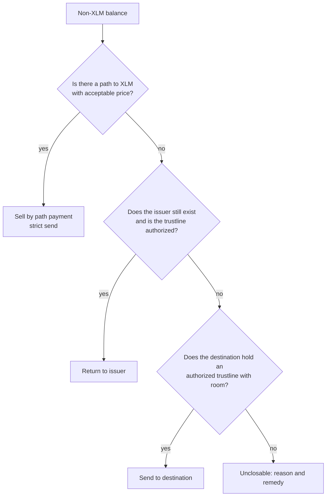

# Ordering rules and known limits

> Skeleton. Every `<placeholder>` is filled from the captured close (`docs/evidence/README.md`). Blockquotes are instructions and are deleted in the final document. Keep each rule to one plain sentence, then the protocol fact that forces it, then a link. The reader may have never used a block explorer.

## Summary

Dustin closed the testnet account `<FIXTURE_G>` on `<DATE UTC>` in `<N>` transactions (`<TX1_HASH_SHORT>`, `<TX2_HASH_SHORT>`, `<TX3_HASH_SHORT>`), every one paid for by the sponsor `<SPONSOR_G>`. The account held `<4.0000000>` XLM and could spend none of it. `<AMOUNT>` XLM reached `<DESTINATION_G>`, `0.5000000` XLM went back to the sponsor that had paid for one of the trustlines, and the account no longer exists. This document explains the order in which that had to happen and what Dustin does not do.

## 1. Why closing an account is an ordered teardown

> Three facts, three sentences, three links.

- An account can only be merged once it holds no trustlines, offers or data entries; signers do not block a merge. (Account Merge, `ACCOUNT_MERGE_HAS_SUB_ENTRIES`.)
- A trustline can only be removed when its balance is zero and nothing is still promised out of it. (Change Trust with limit 0, `CHANGE_TRUST_INVALID_LIMIT`.)
- Each of those items locks 0.5 XLM of reserve, and the account needs 1 XLM on top just to exist, so an account at its minimum balance has nothing spendable and cannot pay the fee to start. (Minimum balance.)

> Optional Mermaid diagram: a dependency graph offers -> balances -> trustlines and data -> merge. Include it only if it reads better than the three bullets above.

## 2. The ordering rules

> One subsection per rule, R1 to R16, in this format:
> **Rn. Plain statement.** Because: protocol fact. Link. In the fixture close: which transaction and step (`tx <n>`, `<HASH>`), or "did not apply".

- **R1. Plan first, sign nothing.** `planClose()` reads the account from Horizon and prints the whole plan; it cannot submit anything. Because: an account merge removes the account from the ledger and cannot be undone. In the fixture close: `evidence/fixture-plan.txt`, produced at ledger `<LEDGER>`.
- **R2. The account signs, the sponsor pays.** Every transaction is an inner transaction sourced from the account being closed, wrapped in a fee-bump transaction paid by the sponsor. Because: fee-bump transactions let a separate fee account pay for an existing transaction; the wrapper counts as one more operation, and its fee must be at least the network minimum for that count and at least the inner fee. In the fixture close: fee account `<SPONSOR_G>` on `<TX1_HASH>`, `<TX2_HASH>`, `<TX3_HASH>`.
- **R3. Cancel every offer before touching any trustline.** Because: offers hold liabilities, and a trustline cannot be removed while the limit cannot cover the balance and its buying liabilities. An offer is deleted by setting its amount to 0 with its existing offer ID. In the fixture close: offers `<OFFER_ID_1>` and `<OFFER_ID_2>`, tx 1.
- **R4. Empty every non-XLM balance before removing its trustline, using the ladder in section 3.** Because: the trustline limit 0 is refused while a balance remains. In the fixture close: `<CODE1>` sold by path payment, `<CODE2>` returned to its issuer, `<CODE3>` sent to the destination, `<CODE4>` `<route>`, all in tx 2.
- **R5. A frozen balance cannot be moved by its holder.** Because: with authorization required, the issuer must approve an account before it can hold the asset, and a revoked trustline freezes the asset so the holder can neither transfer nor trade it. Only the issuer can act. In the fixture close: `<did not apply / applied to CODE, reported as TRUSTLINE_UNAUTHORIZED>`; covered by the test matrix.
- **R6. Clawback-enabled trustlines close normally; the flag is reported.** Because: clawback is a power of the issuer to burn a holder's balance, not a restriction on the holder. In the fixture close: `<did not apply / applied to CODE>`; covered by the test matrix.
- **R7. Delete data entries with a manage-data operation that carries no value.** Because: a manage-data operation with the name and no value deletes the entry. In the fixture close: `<DATA_NAME>`, tx 1.
- **R8. Remove trustlines last, with limit 0.** Because: Change Trust with limit 0 deletes the trustline, and only then is its reserve released. In the fixture close: four trustlines, tx 2.
- **R9. A sponsored trustline is removed the same way, but its reserve returns to the sponsor.** Because: when a sponsored entry is removed, the sponsor's `numSponsoring` and the account's `numSponsored` both decrease, which lowers the sponsor's required balance, not the account's. Dustin attributes the reserve to the sponsor in the plan and the receipt. In the fixture close: `<CODE4>`, sponsor `<TRUSTLINE_SPONSOR_G>`, tx 2.
- **R10. Group steps into the fewest transactions that respect R3 to R8, never more than 100 operations each.** Because: a transaction can carry up to 100 operations. In the fixture close: `<N>` transactions, `<n1>`, `<n2>`, `<n3>` operations.
- **R11. Before merging, check the sequence number is below the current ledger number shifted left by 32 bits; otherwise wait.** Because: the merge fails with `ACCOUNT_MERGE_SEQNUM_TOO_FAR` when the source's sequence number is not less than `(ledgerSeq << 32)`, and a sequence number can only be raised, never lowered, so the only remedy is to wait for the ledger to advance. Dustin reports the earliest ledger that will work. In the fixture close: sequence `<SEQ>` at ledger `<LEDGER>`, guard passed; the test matrix covers the failing case.
- **R12. Before merging, check the account sponsors nothing.** Because: `ACCOUNT_MERGE_IS_SPONSOR`. Revoking sponsorships is out of scope, so this is reported, not fixed. In the fixture close: `num_sponsoring` was 0.
- **R13. Before merging, check the account is not immutable.** Because: `ACCOUNT_MERGE_IMMUTABLE_SET`; nothing can change that flag. In the fixture close: flag not set.
- **R14. Before merging, check the destination exists, is a different account, and can take the balance.** Because: `ACCOUNT_MERGE_NO_ACCOUNT`, `ACCOUNT_MERGE_MALFORMED`, `ACCOUNT_MERGE_DEST_FULL`. In the fixture close: destination `<DESTINATION_G>` checked at ledger `<LEDGER>`.
- **R15. The merge is the last operation of the last transaction.** Because: it transfers the whole XLM balance, including the account's own 1 XLM of base reserve, and deletes the account. In the fixture close: tx 3, `<TX3_HASH>`.
- **R16. Liquidity pool shares, raised signing thresholds and claimable balances are detected and reported, never acted on.** Because: the SOW puts them out of scope; a pool share trustline holds two base reserves and needs a Liquidity Pool Withdraw first. In the fixture close: none present; covered by the test matrix.

## 3. The disposal ladder

> Mermaid decision diagram, then the table. This diagram earns its place: the ladder is the part of Dustin a reader cannot infer from the protocol docs.

| Exit | When | What the user sees | Reason code |
|---|---|---|---|
| Sell | An offer book path from the asset to XLM exists | "sold for `<amount>` XLM" | none |
| Return to issuer | No path, issuer account exists, trustline authorized | "returned to issuer `<G>`" | none |
| Send to destination | No path, issuer gone or cannot receive, destination holds the trustline | "sent to destination" | none |
| Unclosable | None of the above | "unclosable: `<reason>`, remedy: `<text>`" | `<codes as exported by the SDK, e.g. TRUSTLINE_UNAUTHORIZED, ISSUER_GONE>` |

In the fixture close: `<one line per asset with its exit and the transaction hash>`.

## 4. Fee sponsorship

> Who signs what, then the arithmetic with real numbers from the receipt.

- The account being closed signs each inner transaction; it is the source, so its sequence number is consumed.
- The sponsor signs only the fee-bump envelope; it never signs an operation on the account's assets.
- Fee per transaction: (inner operations + 1) x base fee, at least the inner fee. Base fee at capture: `<100>` stroops.
- In the fixture close: tx 1 `<n1>` + 1 operations, `<fee1>` stroops; tx 2 `<n2>` + 1, `<fee2>`; tx 3 1 + 1, `<fee3>`; total `<TOTAL>` stroops = `<TOTAL_XLM>` XLM, all paid by `<SPONSOR_G>`. Fees paid by `<FIXTURE_G>`: 0.

## 5. Sponsored reserves

> Two paragraphs: what a sponsored reserve is (glossary), and what happened to the one in the fixture.

- Minimum balance = (2 + subentries + sponsoring - sponsored) x 0.5 XLM. A sponsored trustline adds one subentry and one to `sponsored`, so it costs the account nothing and the sponsor 0.5 XLM.
- In the fixture close: `<CODE4>` was sponsored by `<TRUSTLINE_SPONSOR_G>`; removing it in tx 2 released 0.5 XLM to that sponsor, and the account's recovered amount excludes it. Plan line: `<quote the plan row>`. Receipt line: `<quote the receipt row>`.

## 6. The sequence number guard

> Plain explanation for the reviewer, then the formula.

Every account carries a sequence number that goes up with each transaction. The network refuses to merge an account whose sequence number has run ahead of what a brand-new account would receive in the current ledger. That sounds exotic, but a sequence number can be bumped on purpose far into the future, and once bumped it can never be lowered. Dustin checks this before the merge and, if the check fails, tells you which ledger to wait for instead of submitting a transaction that will fail. Formula: the merge is possible while `sequence < ledger x 2^32`.

In the fixture close: sequence `<SEQ>`, ledger `<LEDGER>`, `<LEDGER x 2^32>`; guard passed. Test matrix case: `<test name>`.

## 7. Known limits

### 7.1 Out of scope by the SOW

- Mainnet. Testnet only; the network passphrase is checked and anything else is refused.
- Contract (C) accounts. Classic G accounts only.
- Liquidity pool share withdrawal. Detected and reported.
- Multisig accounts with raised thresholds. Detected and reported.
- Claimable balance cleanup.
- Production key management. Environment variables only.
- Wallet UI and third-party wallet integration.

### 7.2 Out of reach by protocol

- Frozen (deauthorized or unauthorized) balances: only the issuer can move them (R5).
- Balances whose issuer no longer exists and for which the destination holds no trustline (`ISSUER_GONE`).
- Accounts with the immutable flag (R13).
- Accounts that sponsor other accounts' reserves (R12).
- A sequence number that has run ahead of the ledger (R11): wait, do not retry.

### 7.3 Limits of the evidence

- Testnet resets 2 to 4 times a year and deletes every account, transaction and history record. The explorer links in this document stop resolving at the next reset; the screenshots, raw Horizon JSON and the receipt in `docs/evidence/` are the durable record, and the fixture can be rebuilt with `<fixture builder command>`.

## 8. The fixture and the baseline

| Item | Fixture `<FIXTURE_G>` before the close |
|---|---|
| XLM balance / spendable | `<4.0000000>` / `0.0000000` |
| Trustlines | `<CODE1>` `<amount>`, `<CODE2>` `<amount>` (deliberately illiquid), `<CODE3>` `<amount>`, `<CODE4>` `<amount>` (sponsored) |
| Open offers | 2 (`<OFFER_ID_1>`, `<OFFER_ID_2>`) |
| Data entries | 1 (`<DATA_NAME>`) |

The existing tool (StellarExpert Account Demolisher) builds every transaction with the account being closed as source and fee payer, and has no fee-bump or sponsored-reserve handling; that is visible in its public client source. Pointed at this fixture it stops at `<step and error>`; recording: `<link>`, still frame: `evidence/screenshots/14-baseline-stop.png`.

## 9. Evidence

| # | Purpose | Hash | Explorer | Horizon |
|---|---|---|---|---|
| 1 | cleanup | `<TX1_HASH>` | `https://stellar.expert/explorer/testnet/tx/<TX1_HASH>` | `https://horizon-testnet.stellar.org/transactions/<TX1_HASH>` |
| 2 | disposal and trustlines | `<TX2_HASH>` | `https://stellar.expert/explorer/testnet/tx/<TX2_HASH>` | `https://horizon-testnet.stellar.org/transactions/<TX2_HASH>` |
| 3 | merge | `<TX3_HASH>` | `https://stellar.expert/explorer/testnet/tx/<TX3_HASH>` | `https://horizon-testnet.stellar.org/transactions/<TX3_HASH>` |

Closed account: `https://stellar.expert/explorer/testnet/account/<FIXTURE_G>` (merge is the last operation) and `https://horizon-testnet.stellar.org/accounts/<FIXTURE_G>` (404). Destination: `https://stellar.expert/explorer/testnet/account/<DESTINATION_G>`. Full package: `docs/evidence/README.md`.

## 10. Glossary

> Written for a reader who has never used Stellar. Each entry: plain meaning, then the official wording, then the link it was checked against on 2026-09-25.

**Subentry.** Each thing an account holds besides its XLM balance: a trustline, an open offer, a data entry, an extra signer. Every subentry locks 0.5 XLM. The official docs: "Account data is stored in subentries, each of which increases an account's minimum balance by one base reserve (0.5 XLM)"; "Subentries include trustlines (for both traditional assets and pool shares), offers, signers, and data entries"; an account cannot have more than 1,000 of them. Sources: https://developers.stellar.org/docs/learn/fundamentals/stellar-data-structures/accounts#base-reserves-and-subentries and https://developers.stellar.org/docs/learn/fundamentals/lumens#minimum-balance

**Base reserve.** The unit of XLM the network locks per account and per subentry. Official: "A unit of measurement used to calculate an account's minimum balance. One base reserve is currently 0.5 XLM." An account needs two of them (1 XLM) to exist. Source: https://developers.stellar.org/docs/learn/glossary#base-reserve and https://developers.stellar.org/docs/learn/fundamentals/lumens#base-reserves

**Minimum balance.** The XLM an account cannot spend because it is locked as reserve. Official: "The smallest permissible balance in lumens for a Stellar account, currently 1 lumen", rising by one base reserve per subentry; formula with sponsorship: (2 + numSubEntries + numSponsoring - numSponsored) x baseReserve. Sources: https://developers.stellar.org/docs/learn/glossary#minimum-balance and https://developers.stellar.org/docs/build/guides/transactions/sponsored-reserves

**Sponsored reserve.** Reserve that another account has agreed to lock on your behalf, so a trustline or even the account itself costs you nothing. Official: a sponsoring account pays the base reserves for a sponsored account; when the sponsored entry is removed, the sponsor's `numSponsoring` and the sponsored account's `numSponsored` both decrease, so the reserve is released to the sponsor. The sponsorship must begin and end inside one transaction. Source: https://developers.stellar.org/docs/build/guides/transactions/sponsored-reserves

**Fee-bump transaction.** A wrapper that lets a different account pay the fee for a transaction somebody else already signed. Official: "Fee-bump transactions were introduced in CAP-15 and enable an account to pay the transaction fees for an existing transaction without having to re-sign the transaction or manage sequence numbers"; the wrapper counts as one more operation for the fee. This is how an account with zero spendable XLM gets closed. Source: https://developers.stellar.org/docs/build/guides/transactions/fee-bump-transactions

**Trustline.** An account's explicit "yes, I will hold this asset from this issuer". It carries the balance, a limit, and any authorization flags, and it locks 0.5 XLM while it exists. Official: "An explicit opt-in for an account to hold a particular asset that tracks liabilities, the balance of the asset, and can also limit the amount of an asset that an account can hold." Removed by a Change Trust operation with limit 0, which fails while a balance remains. Sources: https://developers.stellar.org/docs/learn/glossary#trustline and https://developers.stellar.org/docs/learn/fundamentals/transactions/list-of-operations#change-trust

**Path payment.** A payment that sends one asset and delivers another, converting through the network's order books on the way; Dustin uses it to turn leftover balances into XLM. Official, strict send: "A payment where the asset sent can be different than the asset received; allows the user to specify the amount of the asset to send"; strict receive fixes the amount received instead. Source: https://developers.stellar.org/docs/learn/fundamentals/transactions/list-of-operations#path-payment-strict-send

**Clawback.** An issuer's ability to take an asset back out of a holder's trustline. Official: "An amount of asset from a trustline or claimable balance removed (clawed back) from a recipient's balance sheet"; the Clawback operation "Burns an amount in a specific asset from an account"; with the issuer's clawback-enabled flag set, "any subsequent trustlines established with this account will have clawbacks enabled". It does not stop the holder from closing the trustline once the balance is zero. Sources: https://developers.stellar.org/docs/learn/glossary#clawback and https://developers.stellar.org/docs/tokens/control-asset-access#clawback-enabled-0x8

**Authorization required.** An issuer setting that means you may not hold the asset until the issuer says so. Official: "When AUTH_REQUIRED_FLAG is enabled, an issuer must approve an account before that account can hold its asset." A related flag lets the issuer revoke that approval later, "thereby freezing the asset held by an account"; a frozen holder cannot transfer or trade it, and a holder that is only "authorized to maintain liabilities" can keep or cancel orders but not send. Source: https://developers.stellar.org/docs/tokens/control-asset-access#authorization-required-0x1

**Account merge.** The operation that ends an account: it moves all of its XLM to another account and deletes it. Official: "Transfers the XLM balance of an account to another account and removes the source account from the ledger"; allowed only once no trustlines, offers or data entries remain. Source: https://developers.stellar.org/docs/learn/fundamentals/transactions/list-of-operations#account-merge

**Sequence number.** A counter every account carries so transactions apply in order. Official: "Used to identify and verify the order of transactions with the source account." Source: https://developers.stellar.org/docs/learn/glossary#sequence-number

**Stroop.** The smallest slice of XLM, used for fees. Official: "As cents are to dollars, stroops are to assets: the smallest unit of an asset, one ten-millionth." The base fee is 100 stroops per operation. Sources: https://developers.stellar.org/docs/learn/glossary#stroop and https://developers.stellar.org/docs/learn/glossary#base-fee

**Testnet.** The free practice network where Dustin runs. Official: "The Stellar Test Network is maintained by the Stellar Development Foundation, which developers can use to test applications"; it "doesn't connect to real money" and is reset 2 to 4 times a year. Sources: https://developers.stellar.org/docs/learn/glossary#testnet and https://developers.stellar.org/docs/networks

**Horizon.** The network's public web API; the "raw" links in the evidence package are Horizon links, and a 404 from Horizon means the account is not on the ledger. Sources: https://developers.stellar.org/docs/data/apis/horizon/api-reference/retrieve-an-account and https://developers.stellar.org/docs/data/apis/horizon/api-reference/errors/http-status-codes/standard

## Assumptions

1. Rule numbering R1 to R16 matches `docs/documentation-plan.md` section 3.2; if the implementation adds or drops a rule, both documents change together.
2. The reason codes in section 3 are the working set from `docs/ux-design.md` section 3.2; the final document uses the identifiers exported by the SDK.
3. "A sequence number can only be raised, never lowered" is stated from the Bump Sequence semantics recorded in `docs/research/raven-ground-truth.md` section 6 (stellar-core source) and was not separately re-verified against developers.stellar.org in this session.
4. The statement that the Demolisher stops on the fixture is filled from the baseline recording; this skeleton states only what its public client source shows (transactions sourced and paid by the account being closed; no fee-bump or sponsorship code).
5. The glossary's plain-language sentences are the builder's paraphrases; the quoted sentences are verbatim from the linked pages as fetched on 2026-09-25.

## Sources

1. Accepted Statement of Work: `SUCCESSFUL_SOW.md` (sections 3, 4.1, Out of Scope, 6.1, Appendix B).
2. List of operations (Account Merge, Change Trust, Manage Data, Manage Sell Offer, Path Payment Strict Send and Strict Receive, Clawback, Begin and End Sponsoring Future Reserves, Revoke Sponsorship): https://developers.stellar.org/docs/learn/fundamentals/transactions/list-of-operations
3. Account Merge result codes: https://developers.stellar.org/docs/data/apis/horizon/api-reference/errors/result-codes/operation-specific/account-merge
4. Fee-bump transactions: https://developers.stellar.org/docs/build/guides/transactions/fee-bump-transactions
5. Sponsored reserves: https://developers.stellar.org/docs/build/guides/transactions/sponsored-reserves
6. Lumens, base reserves and minimum balance: https://developers.stellar.org/docs/learn/fundamentals/lumens
7. Accounts, base reserves and subentries: https://developers.stellar.org/docs/learn/fundamentals/stellar-data-structures/accounts#base-reserves-and-subentries
8. Fees and the 100-operation limit: https://developers.stellar.org/docs/learn/fundamentals/fees-resource-limits-metering#inclusion-fee
9. Glossary: https://developers.stellar.org/docs/learn/glossary
10. Controlling access to an asset with flags (authorization required, revocable, immutable, clawback enabled): https://developers.stellar.org/docs/tokens/control-asset-access
11. Liquidity pools, pool share trustlines (2 base reserves), Liquidity Pool Withdraw: https://developers.stellar.org/docs/learn/fundamentals/liquidity-on-stellar-sdex-liquidity-pools#trustlines
12. Networks (testnet, resets, friendbot, Horizon URL, passphrase): https://developers.stellar.org/docs/networks
13. Horizon endpoints and status codes: https://developers.stellar.org/docs/data/apis/horizon/api-reference/retrieve-an-account , https://developers.stellar.org/docs/data/apis/horizon/api-reference/retrieve-a-transaction , https://developers.stellar.org/docs/data/apis/horizon/api-reference/errors/http-status-codes/standard
14. Sequence number guard, stellar-core reading: `docs/research/raven-ground-truth.md` section 6.
15. StellarExpert Account Demolisher tool and client source: https://stellar.expert/demolisher/public/ and https://github.com/stellar-expert/stellar-expert-explorer (`business-logic/demolisher/demolisher-tx-builder.js`, `views/demolisher/account-demolisher-view.js`).
16. The 2019 request for a callable close helper, still open, repository archived 2024: https://github.com/stellar/js-stellar-wallets/issues/98
