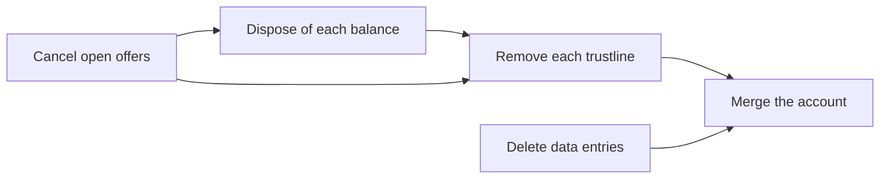
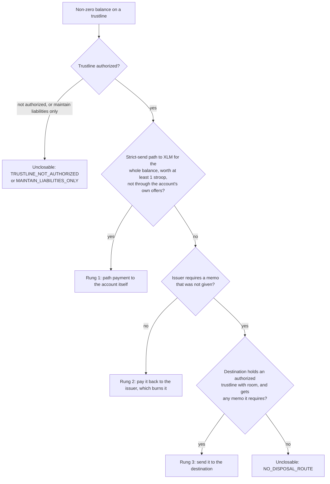

# Ordering rules and known limits

> Status: final for release 0.1.0, written on 2026-09-28 (sprint day 7 of 30) and updated on 2026-09-29 for the metric close recorded on the 0.1.0 code and the fixes of the Epic 4 review. This is the write-up of SOW Deliverable 4 (story E4-S5, PRD FR-27). It describes the code on the main branch on that date and the live runs committed under [`evidence/runs/`](../evidence/runs/README.md); every hash, ledger, fee and amount below is copied from those files. Two pieces of evidence do not exist yet and are marked as pending where they are cited: the recording of the existing tool on the builder's baseline fixture (story E1-S2) and the 60-second video (story E4-S6). Both are the builder's to record.

The chapter lead can read this without running anything; every claim links to the file or the page that shows it. Wallet developers find the API in the [integration notes](integration-notes.md), and the evidence package, SOW row by SOW row, is [evidence/README.md](../evidence/README.md).

## Summary

Dustin closes a Stellar testnet account in a fixed order: it cancels the open offers, disposes of the leftover balances, removes the trustlines and the data entries, and merges the account into a destination. It prints the whole plan before anything is signed. Every transaction it submits is wrapped in a fee bump paid by a sponsor, so an account with no spendable XLM, which cannot pay for its own teardown, pays nothing.

The SOW's binary success metric was met on 2026-09-28 by the metric close (story E3-S7), and the same close was recorded again on the 0.1.0 code on 2026-09-29, each time on a freshly built messy account with the default ladder order. The latest run, through the command line, [`evidence/runs/20260929T111408Z-e4-cli/`](../evidence/runs/20260929T111408Z-e4-cli/summary.md):

| | The CLI metric close |
|---|---|
| Closed account | `GCIVEA6YVJCSYE2Y7V2IUEYATOO36X7GQOAYNOI2MDNOW7HI4LPJVKZT` |
| Before the close | 4.0000000 XLM against a minimum balance of 4.0000000 XLM, so 0 spendable; 4 trustlines with dust (DUSTA 0.0000007, DUSTB 0.0000003, DUSTC 0.0000005, SPTA 0.0000001, the last one sponsored by a separate reserve sponsor); 2 open offers (838443, 838444); 1 data entry (`dustin.fixture`) |
| Transactions | 3, each a fee bump paid by the sponsor `GBDOAFW4WYIOVCBZNVI4CF4QOD2J3HZYMMQZSOF2LOSNZGZCSMVBIGMQ`: cleanup `835457ceff4b0443ec52ebbb408edc8988627e5de8442d28dda85b3331b52a5b` (ledger 4931386), sale `c6c99beddca7685293bdb0e156e320cbb4189e4247e4451578b60e82ba76de61` (4931387), merge `dd56e18f152dc7f15ee370dce9b8ddae556e90f04dd1cd52fe3281df4bf118e2` (4931388) |
| Fees paid by the closed account | 0 |
| Fees paid by the sponsor | 1,500 stroops (0.0001500 XLM) |
| Received by the destination | 4.0000007 XLM: the account's 4.0000000 XLM plus 0.0000007 XLM from selling DUSTA |
| Released to the reserve sponsor | the 0.5 XLM reserve of the SPTA trustline; its `num_sponsoring` went from 1 to 0 and its XLM balance did not move |
| After the close | Horizon answers 404 for the account; `dustin close --execute` exited 0 |

The first recordings, of 2026-09-28 and before the output was polished, are the history of the same close. Through the CLI, [`evidence/runs/20260928T112252Z-e3-cli/`](../evidence/runs/20260928T112252Z-e3-cli/summary.md), `GCPPFHGLKA7GCBWJXBH4EXFXS3OXAMXFLOBAZLU2K3KKMO6JKZORNFW7` closed with the cleanup `0ee9fb5e4bb683519af3190e45c6e0350a0819aa509d65fddb34a247e65dcaac` (ledger 4914209), the sale `f7161ce4667cc9b3457aa6daa948f8b39df847b0576ab73849ac7325ad81f700` (4914210) and the merge `36e53646514a36c673830955b661b91de297842481295f458de8c5911e5c989c` (4914211). Through the SDK, [`evidence/runs/20260928T112239Z-e3/`](../evidence/runs/20260928T112239Z-e3/summary.md), `GCSK3ODHZH7O3PFMV676GEMKRIW34UHUET57HRNTRQV2RSB73JVOPCCT` closed the same way: cleanup `55a12730e24961e27a9e089fc0d542f6416a1d3d0efc125b47b962907a16593f` (ledger 4914192), sale `6e0e882060a280925e2dc23b099182624d63d95b04fcd51bb38eefbff49f6449` (4914193), merge `7335c6225593513ceee297b626eadc03bf1d9ee40256e2162b039edb245faac6` (4914194), 4.0000007 XLM merged, 1,500 stroops paid by the sponsor. The same kind of close first ran in week 2 ([SDK](../evidence/runs/20260926T125350Z/summary.md), [CLI](../evidence/runs/20260927T200015Z-cli/summary.md)). The builder's baseline fixture `messy-20260926T035942Z` was not closed: it is kept for the recording of the existing tool, and closing it with Dustin follows that recording (matrix row B-03).

## 1. Why closing an account is an ordered teardown

Three protocol rules force the order.

- **Subentries block the merge.** An account can be merged only when it holds no trustlines, offers or data entries; signers do not count, they are removed with the account ([list of operations, Account merge](https://developers.stellar.org/docs/learn/fundamentals/transactions/list-of-operations#account-merge)). Otherwise the merge fails with `ACCOUNT_MERGE_HAS_SUB_ENTRIES` ([Account merge result codes](https://developers.stellar.org/docs/data/apis/horizon/api-reference/errors/result-codes/operation-specific/account-merge)).
- **Balances block trustline removal.** Change Trust with limit 0 removes a trustline only if "the limit is sufficient to hold the current balance of the trustline and still satisfy its buying liabilities"; with any balance left it fails with `CHANGE_TRUST_INVALID_LIMIT` ([Change Trust result codes](https://developers.stellar.org/docs/data/apis/horizon/api-reference/errors/result-codes/operation-specific/change-trust)).
- **Liabilities block both.** An open offer is a subentry itself. What it sells is locked as selling liabilities, so a payment of the whole balance fails as underfunded ("does not have enough funds to send amount and still satisfy its selling liabilities", [list of operations, Payment](https://developers.stellar.org/docs/learn/fundamentals/transactions/list-of-operations#payment)); what it buys counts as buying liabilities on the trustline, which the Change Trust rule above must still satisfy.

The account also has to pay for its own teardown, and a zero-spendable account cannot. Its minimum balance is (2 + subentries + entries it sponsors − entries sponsored for it) × 0.5 XLM ([sponsored reserves, effect on minimum balance](https://developers.stellar.org/docs/build/guides/transactions/sponsored-reserves#effect-on-minimum-balance); [minimum balance](https://developers.stellar.org/docs/learn/fundamentals/lumens#minimum-balance)), and spendable XLM is the balance minus that minimum minus XLM selling liabilities. The metric account held 4.0000000 XLM with 7 subentries, 1 of them sponsored: (2 + 7 − 1) × 0.5 = 4.0 XLM, so nothing was spendable ([`fixture-verification.json`](../evidence/runs/20260929T111408Z-e4-cli/fixture-verification.json)). An ordinary transaction from such an account is refused with `tx_insufficient_balance` and consumes nothing; the same operation wrapped in a fee bump paid by another account succeeds ([progress log](progress-log.md), day-1 experiment 1; every fixture build records the refusal again, for example [`fixture-create.txt`](../evidence/runs/20260929T111408Z-e4-cli/fixture-create.txt): "Unbumped transaction from the fixture rejected with tx_insufficient_balance").



## 2. The ordering rules

These are rules R1 to R9 of the [architecture](architecture.md) (section 5.1). The planner applies them in `src/plan/order.ts` and packs the result into transactions in `src/plan/grouping.ts` (section 3). Each rule is one sentence, then the protocol fact that forces it, then where it shows in the latest recorded CLI metric close, on the 0.1.0 code: its step numbers (S01 to S12) are those of the plan in the [transcript](../evidence/runs/20260929T111408Z-e4-cli/transcript.txt), and its transactions are tx 1 (cleanup), tx 2 (sale) and tx 3 (merge).

**R1. Cancel every open offer before disposing of any balance or removing any trustline.**
Because: an offer's selling liabilities make a full-balance payment underfunded ([Payment](https://developers.stellar.org/docs/learn/fundamentals/transactions/list-of-operations#payment)); its buying liabilities make Change Trust fail with `CHANGE_TRUST_INVALID_LIMIT` ([Change Trust result codes](https://developers.stellar.org/docs/data/apis/horizon/api-reference/errors/result-codes/operation-specific/change-trust)); a path payment that would cross the account's own offer fails with `PATH_PAYMENT_STRICT_SEND_OFFER_CROSS_SELF` ([Path payment strict send result codes](https://developers.stellar.org/docs/data/apis/horizon/api-reference/errors/result-codes/operation-specific/path-payment-strict-send)); and an offer is a subentry that blocks the merge. An offer is deleted by a Manage Sell Offer with amount 0 and its own offer ID, which also deletes an offer placed with Manage Buy Offer (day-1 experiment 2).
In the metric close: S01 cancels offer 838443 (it sold DUSTA for XLM) and S02 cancels offer 838444 (it sold DUSTC for DUSTB, so it locked DUSTC and would have blocked the removal of DUSTB), as the first two operations of tx 1.

**R2. Dispose of a balance before removing its trustline, and leave exactly zero.**
Because: `CHANGE_TRUST_INVALID_LIMIT` while any balance remains ([Change Trust result codes](https://developers.stellar.org/docs/data/apis/horizon/api-reference/errors/result-codes/operation-specific/change-trust)). A strict-send path payment of the whole balance and a payment of the whole balance both leave exactly zero, so the removal can follow in the same transaction (day-1 experiments 7 and 14).
In the metric close: S03 returns 0.0000003 DUSTB to its issuer and S04 removes the DUSTB trustline, S05 and S06 do the same for DUSTC and S07 and S08 for SPTA, all in tx 1; S10 sells 0.0000007 DUSTA and S11 removes its trustline, in tx 2. A disposal and its removal are never split across transactions.

**R3. Remove a sponsored trustline like any other trustline, and never revoke the sponsorship.**
Because: the owner may remove its own sponsored entry, and then the sponsor's `numSponsoring` and the owner's `numSponsored` both decrease ([sponsored reserves](https://developers.stellar.org/docs/build/guides/transactions/sponsored-reserves); [CAP-33](https://github.com/stellar/stellar-protocol/blob/master/core/cap-0033.md)). Revoking the sponsorship would move the reserve onto the owner, which a zero-spendable owner cannot pay (`REVOKE_SPONSORSHIP_LOW_RESERVE`). Day-1 experiment 3 confirmed that the owner's signature alone removes the trustline and that adding the reserve sponsor's signature is refused (`tx_bad_auth_extra`).
In the metric close: S08 removes the SPTA trustline with the account's signature only; the plan names `GCKXIJUENGYY2LO6PYVDWIDMJ6XEXZZUOM3NBQR2BCAWODSSP6NNT7BB` as the reserve sponsor whose 0.5 XLM is released, and Horizon then showed its `num_sponsoring` at 0 (section 6).

**R4. Delete data entries at any point before the merge.**
Because: a Manage Data operation without a value deletes the entry; it depends on nothing else, and the entry is a subentry that blocks the merge ([list of operations, Manage data](https://developers.stellar.org/docs/learn/fundamentals/transactions/list-of-operations#manage-data)).
In the metric close: S09 deletes `dustin.fixture`, the last operation of tx 1.

**R5. Leave the signers alone.**
Because: signers do not block a merge, and the merge removes them ([Account merge](https://developers.stellar.org/docs/learn/fundamentals/transactions/list-of-operations#account-merge); stellar-core counts every subentry that is not a signer, [MergeOpFrame.cpp](https://github.com/stellar/stellar-core/blob/master/src/transactions/MergeOpFrame.cpp)). The reserve of a sponsored signer is credited to its sponsor when the merge applies.
In the metric close: there is no step for signers; the account had only its master key (master weight 1, high threshold 0, in the fixture checks). A sponsored signer removed by the merge was shown live in matrix row X-18 (section 6).

**R6. Report liquidity pool shares and never withdraw them; remove an empty pool-share trustline before its pool's asset trustlines.**
Because: withdrawing from pools is out of scope for the SOW; a pool-share trustline costs two base reserves ([liquidity pools, trustlines](https://developers.stellar.org/docs/learn/fundamentals/liquidity-on-stellar-sdex-liquidity-pools#trustlines)); and an asset trustline "still referenced by a liquidity pool" cannot be removed (`CHANGE_TRUST_CANNOT_DELETE`, [list of operations, Change trust](https://developers.stellar.org/docs/learn/fundamentals/transactions/list-of-operations#change-trust)). When Horizon does not return a pool, the planner derives its two assets from the pool id, which is the SHA-256 of the pool's parameters ([CAP-38](https://github.com/stellar/stellar-protocol/blob/master/core/cap-0038.md)); if no pair of the account's assets matches, every credit trustline stays, so no transaction can fail on `CHANGE_TRUST_CANNOT_DELETE`.
In the metric close: did not apply (the fixture checks show no pool shares). Shown live on the `edge` fixture, matrix row S-08: removing a pool asset's trustline while the share trustline existed failed with `op_cannot_delete`, and the partial close removed only the data entry ([test matrix](test-matrix.md)).

**R7. The merge is the last operation, and a merge that follows other work of the run goes out only after a fresh preflight.**
Because: each `ACCOUNT_MERGE_*` failure code names a condition that can change between plan and merge: subentries left, the account sponsoring something (`ACCOUNT_MERGE_IS_SPONSOR`), `AUTH_IMMUTABLE`, a missing destination, a sequence number too far ahead ([Account merge result codes](https://developers.stellar.org/docs/data/apis/horizon/api-reference/errors/result-codes/operation-specific/account-merge)); and a destination that marks itself memo-required under [SEP-29](https://github.com/stellar/stellar-protocol/blob/master/ecosystem/sep-0029.md) must receive a memo. The preflight (`src/execute/preflight.ts`) reads the account, the destination and the latest ledger again and checks that the account exists and sponsors nothing, that the destination exists (for an `M...` address, its base account) and gets any memo it now requires, that the sequence guard holds, and, when the merge runs alone, that no trustline, offer or data entry is left. When the guard is all that fails, the executor waits for it (section 7); if any other check fails, the merge is not submitted.
In the metric close: S12, alone in tx 3, after the line "tx 3/3 merge preflight ok: no subentries left, nothing sponsored, destination exists, sequence guard ok".

**R8. Evaluate the sequence guard for the sequence number the account will have when the merge applies, against the earliest ledger the merge can land in.**
Because: the merge fails with `ACCOUNT_MERGE_SEQNUM_TOO_FAR` when that sequence number is at or above the ledger number shifted left by 32 bits ([MergeOpFrame.cpp](https://github.com/stellar/stellar-core/blob/master/src/transactions/MergeOpFrame.cpp)). Section 7 gives the arithmetic.
In the metric close: the plan re-read before signing printed "sequence guard ok: sequence at merge 21180094349312007 is below ledger 4,931,385 << 32". The account was created in ledger 4931375, so its sequence numbers start at 4931375 << 32, and its merge could land in any ledger from 4931376 on.

**R9. Run each market-dependent step, a path payment, in its own transaction together with its trustline removal.**
Because: a transaction is atomic: "The entire transaction will fail if any operation fails, and all previous operations will be rolled back" ([transaction lifecycle, application](https://developers.stellar.org/docs/learn/fundamentals/transactions/transaction-lifecycle#10-application-validator)). A path payment is the only step that can fail for reasons outside the account (the market moves), and it must not take the deterministic cleanup down with it.
In the metric close: tx 2 holds only the DUSTA sale (S10) and the DUSTA removal (S11).

Order within a kind is stable, so the same account state always gives the same plan and the same `planHash`: offers by id, trustlines by asset code and then issuer, data entries by name.

## 3. Transaction grouping

The SOW asks for the plan to be "grouped into the minimum number of transactions". Dustin reads that as the fewest transactions under three constraints ([canonical decision 6](README.md); architecture section 5.2):

1. A transaction carries at most 100 operations ([operations and transactions](https://developers.stellar.org/docs/learn/fundamentals/transactions/operations-and-transactions#transactions)).
2. A market-dependent step is isolated with its trustline removal (R9).
3. A merge that follows market-dependent steps runs only after a fresh preflight (R7).

The planner therefore builds three kinds of transaction:

- **cleanup**: offer cancellations, returns to issuers, transfers to the destination, removals of emptied trustlines and data deletions, packed in order into transactions of up to 100 operations, never splitting a disposal from its removal;
- **convert**: one transaction per path payment, with that asset's trustline removal;
- **merge**: the merge joins the last cleanup transaction when there is no convert transaction and there is room; otherwise it runs alone and last. It also runs alone when the sequence guard says it has to wait (section 7).

So a messy account without a market step closes in **one** fee-bumped transaction, and one with a sale closes in **three**. The metric close took three: 9 cleanup operations, 2 convert operations and the merge, 12 operations in all ("signs 3 fee-bumped transactions, 12 operations" in the [transcript](../evidence/runs/20260929T111408Z-e4-cli/transcript.txt)). A messy fixture whose market was re-priced below the dust's resolution closed in one: the path finder returned no record for the dust, so every balance went back to its issuer and the cleanup carried the merge (matrix row X-10, [story E3-S1](stories/3-1-ladder-path-payment.md)).

The atomicity consequence: when an operation fails on the ledger, its whole transaction applies nothing, yet the account's sequence number and the sponsor's fee are spent ("the sequence number of the inner transaction is always consumed at apply time", [fee-bump transactions, application](https://developers.stellar.org/docs/build/guides/transactions/fee-bump-transactions#application)). Transactions that applied before it stay applied. The executor then reads the ledger, plans what is left (at most 3 re-plans by default) and continues. Keeping the market step apart means that a moved market costs one small transaction instead of the whole cleanup.

## 4. The disposal ladder

Every non-zero balance on a trustline has to leave before the trustline can go. The ladder is the SOW's order ([canonical decision 8](README.md)): sell it for XLM by path payment; otherwise return it to its issuer; otherwise send it to the destination if the destination holds the trustline; otherwise report it as unclosable with a stated reason. The CLI flag `--prefer-destination` (SDK option `preferDestination: true`, PRD decision D-1) tries the destination before the issuer and keeps the burn as the fallback. The default order is used for the metric close, the demo and the evidence.

Before any rung, the trustline itself is checked. A trustline its issuer has not authorized, or has limited to maintaining liabilities, cannot send anything, not even back to the issuer: revoking authorization "prevents that account from transferring or trading the asset" ([Authorization Revocable](https://developers.stellar.org/docs/tokens/control-asset-access#authorization-revocable-0x2); day-1 experiment 13 saw `op_src_not_authorized` on the payment back to the issuer and `op_invalid_limit` on the removal). Such a balance is unclosable at once.

The ladder as built (`src/plan/ladder.ts`):



With `--prefer-destination` the destination question comes before the issuer question.

| Rung | Operation | Precondition in the plan | Protocol facts |
|---|---|---|---|
| 1, path payment | Path Payment Strict Send of the whole balance to the account itself, destination asset XLM | Horizon's strict-send path search returned a path worth at least 1 stroop that does not rely on one of the account's own offers. `destMin` is the quote minus the slippage bound (default 100 basis points, rounded up), never below 1 stroop. | [strict-send paths](https://developers.stellar.org/docs/data/apis/horizon/api-reference/list-strict-send-payment-paths); a path payment to the sender itself is allowed (day-1 experiment 14); the XLM leaves with the merge |
| 2, return to issuer | Payment of the whole balance to the issuer | The trustline is authorized; an issuer that is memo-required under SEP-29 needs `--memo`. The issuer account does not have to exist. | "To delete, or 'burn', an asset, you must send it back to the account that issued it" ([assets](https://developers.stellar.org/docs/learn/fundamentals/stellar-data-structures/assets#deleting-or-burning-assets)); a payment to an issuer that was merged away still succeeds and burns the balance (day-1 experiment 4; [open question 3](README.md)) |
| 3, send to destination | Payment of the whole balance to the merge destination | The destination exists, is neither the account nor the issuer, gets any memo it requires, and holds an authorized trustline with room: limit minus balance minus buying liabilities is at least the amount. | [Payment](https://developers.stellar.org/docs/learn/fundamentals/transactions/list-of-operations#payment) |
| Unclosable | none | No rung above is possible | The reason names every rung that was ruled out and why; the remedy says what would open a route |

Every `dispose_balance` step records its choice: the rung, the amount, where the balance goes, the quote and `destMin` for a path payment, the later rungs that were also possible (`fallbackRungs`) and every rung ruled out with its reason (`ruledOut`). Rung 1 is ruled out in three ways, each with its own reason and fix: Horizon found no strict-send path ("wait for a market that buys CODE for XLM"); the best quote "pays less than 1 stroop of XLM for the full balance" (the protocol cannot deliver less, so the fix is a market that pays at least 1 stroop); or the quoted path may use one of the account's own offers, which the plan cancels first (the fix is to cancel that offer with a `--partial` run and plan again).

A quote can also move between the plan the user approved and the plan the executor makes right before signing. The plan hash leaves quotes out, so the executor compares what each plan recovers: the account's balance plus the quoted proceeds of its sales. A lower amount is drift, and by default the run stops with nothing signed: stop code `XLM_TO_DESTINATION_FELL`, CLI exit code 3.

A clawback-enabled trustline goes through the same ladder: clawback is a power of the issuer, not a limit on the holder ([Clawback Enabled](https://developers.stellar.org/docs/tokens/control-asset-access#clawback-enabled-0x8)). The plan warns that the issuer can change the balance before execution; if it does, the disposal fails and the executor plans again.

**Failure mapping: which result codes move an asset down the ladder.** The planner chooses from a snapshot, and the ledger can change before the transaction lands. The executor maps the first failed operation's result code (`src/execute/classify.ts`, [ADR-0006](adr/ADR-0006-error-taxonomy.md)):

| Result code of the failed operation | Meaning | What the executor does |
|---|---|---|
| `op_too_few_offers`, `op_under_dest_min`, `op_cross_self` | The market disappeared, moved beyond the slippage bound, or the path would cross the account's own offer | **Moves the asset down the ladder**: plans again with rung 1 dropped for that asset, so the balance falls to the next possible rung (the burn, then the destination) |
| `op_src_not_authorized`, `op_not_aut_maintain_liabilities` | The issuer revoked or limited the authorization after the plan | Plans again from the ledger: the balance is now unclosable, so the run stops before the merge (`PLAN_NOT_CLOSABLE`) unless a partial close was allowed |
| `op_underfunded`, `op_offer_not_found`, `op_src_no_trust`, `op_invalid_limit`, `op_data_name_not_found`, `op_has_sub_entries` | The account changed: a lower balance (a clawback, a fill), an offer or a data entry already gone, a trustline still holding something | Plans again from the ledger |
| `op_no_destination`, `op_no_trust`, `op_not_authorized`, `op_line_full` | The payment's destination is missing, lacks the trustline, is not authorized, or is full. A return to a merged-away issuer never gives `op_no_destination` (day-1 experiment 4) | Plans again from the ledger; a destination transfer that cannot land falls back to the burn |
| `op_cannot_delete`, `op_is_sponsor`, `op_immutable_set`, `op_no_account`, `op_dest_full`, `op_malformed`, `op_low_reserve`, `op_bad_auth` | A condition a person has to change | Stops |
| `op_seq_num_too_far` | Another client moved the sequence number between the preflight and the merge | Reads the account again and waits within the bound (section 7), or stops with `SEQNUM_TOO_FAR` |
| any code not in the mapping | | Stops rather than guess |

Around that mapping: a step that fails twice becomes a `STEP_FAILED_TWICE` blocker and the run stops; at most `maxReplans` re-plans run (default 3); and a re-plan that finds something the approved plan did not have (a new subentry, a larger balance, an asset moving up the ladder) follows `onDrift`, which stops by default. Falling down the ladder and dropping the steps that already applied are not drift. The rung a disposal actually used is recorded on its step outcome (`rung`).

**In the evidence**, live on testnet (stories E3-S1, E3-S2 and E3-S6; the hashes are in those story records and in the [test matrix](test-matrix.md)):

- **Rungs 1 and 2, the metric close.** DUSTA was sold for 0.0000007 XLM by path payment to the account itself in tx 2 (quote 0.0000007, `destMin` 0.0000006). DUSTB, DUSTC and SPTA had no strict-send path and were burned by returning them to their issuer in tx 1. The receipt's "Disposals" section lists each with its transaction.
- **A fall from rung 1.** Twice, the market maker cancelled its bid right before the sale was posted. The sale was included and failed, spending its sequence number and a 300-stroop fee. Horizon listed `op_too_few_offers` for the sale, then `op_invalid_limit` for the trustline removal after it; the executor classifies the first failing code. The re-plan returned DUSTA to its issuer, and the account closed with 4.0000000 XLM merged.
- **Dust below the book's resolution (matrix row X-10).** With the bid re-priced so the dust would buy 0.7 stroop of XLM, Horizon's path finder returned no record at all. A sale forced by hand was included and failed with `op_under_dest_min`. The planner returned the dust to its issuer.
- **Rung 3.** With `--prefer-destination`, DUSTC went to a destination that holds an authorized trustline with room, and the destination's DUSTC balance rose by exactly 0.0000005 (matrix row X-06). Through the CLI, with a memo-required issuer and no memo, DUSTC went to the destination in the default order because the return to its issuer was ruled out ([`e3s2-partial`](../evidence/runs/20260928T125528Z-e3s2-partial/summary.md)).
- **`NO_DISPOSAL_ROUTE`.** In the same CLI run, DUSTB and SPTA had every rung ruled out: no path, an issuer that requires a memo that was not given, and a destination without their trustlines. `dustin close --execute` exited 3 without `--partial`, with the account's sequence number unchanged, and exited 4 with it: the cleanup and the sale applied in ledgers 4915321 and 4915322, no merge was submitted, and the partial-close receipt listed both items with every rung ruled out and the remedy.
- **The unclosable exit on the `edge` fixture**, the SOW's week-3 outcome ([`edge-frozen`](../evidence/runs/20260928T125414Z-edge-frozen/summary.md)). The fixture passed 62 of 62 checks. The plan named the frozen FRZ `TRUSTLINE_NOT_AUTHORIZED` with its issuer and the remedy "Ask the issuer ... to authorize the trustline again (SetTrustLineFlags), then run the plan again."; the close exited 3 without `--partial` with nothing signed, and with it exited 4 after one cleanup transaction (ledger 4915308) burned the illiquid ILQX and removed its trustline and the data entry. The account stayed with only the frozen FRZ trustline and its 2.5 XLM. A payment of the frozen balance forced by hand failed with `op_src_not_authorized` (matrix row S-02); a maintain-liabilities balance stayed while its open offer was cancelled (S-06); a clawback between planning and submission made the planned return fail with `op_underfunded`, and the executor planned again and closed the account (S-07).
- **The account's own offers as the only liquidity (matrix row X-11).** On the `edge` variant `offer-types`, Horizon quoted OFA to XLM only through the account's own offer selling XLM for OFA. The planner ruled the sale out and burned OFA; a sale forced through that offer by hand failed with `op_cross_self` (`971c735d833d716fa214a750f3fbbe10dda2a9832eff624ddf596dcd6d5b2b37`, ledger 4922242), and the variant's close cancelled its buy offer, its passive offer and its offer selling XLM with Manage Sell Offer amount 0 and merged (`2c61a6d5a88e22c4a41f4e02114b3b34204fbf3acef5e2d5d66c80a9cbc75c34`, ledger 4922244; matrix row X-07).
- **An offer taken between plan and execution (matrix row X-08).** On the variant `offer-stale`, a counterparty took the account's whole open offer right before the executor's first post. The cancellation failed with `op_offer_not_found` (`429350606e8144b2a6a650023d12722c61e2570b8b2429bb6bd97407aa728c98`, ledger 4922246); the executor planned again without the offer, with no drift, and closed the account (`3f3ebe7fe73ad2b123ec259cf4bd85e61671a17dc52c0362001b58bd37661558`, ledger 4922247).

## 5. Fee sponsorship

- **Who signs what.** The inner transaction is sourced from and signed by the account being closed, so it uses that account's sequence number; its fee is 0. The sponsor wraps it in a fee bump, signs only that outer envelope and pays the whole fee ([fee-bump transactions](https://developers.stellar.org/docs/build/guides/transactions/fee-bump-transactions); [CAP-15](https://github.com/stellar/stellar-protocol/blob/master/core/cap-0015.md); [ADR-0003](adr/ADR-0003-fee-bump-every-transaction.md)). Before signing, the sponsor refuses an inner transaction sourced by the sponsor itself, any operation that acts for another account, and any bid that would take the close over its budget (`src/sponsor/sponsor.ts`), so its signature authorizes nothing but the fee.
- **The fee rule.** A fee bump's fee must be at least the network minimum for the inner operations plus one, and at least the inner fee ([validity of a fee-bump transaction](https://developers.stellar.org/docs/build/guides/transactions/fee-bump-transactions#validity-of-a-fee-bump-transaction)). Dustin bids a base fee per operation, so a transaction of n operations bids base × (n + 1).
- **The bid.** The base fee is max(last ledger base fee, `fee_charged` p80) from Horizon's [fee stats](https://developers.stellar.org/docs/data/apis/horizon/api-reference/retrieve-fee-stats), at least 100 stroops and at most `maxBaseFeeStroops` (default 1,000,000 stroops, 0.1 XLM per operation), or an explicit override (`--base-fee`, `baseFeeStroops`) clamped the same way. A fixed 100 stroops is not enough: testnet has real surge pricing, with a `max_fee` p50 of 204,000 stroops observed on 2026-09-25 ([canonical decision 7](README.md)). The ledger charges its clearing fee, usually far below the bid ([fees](https://developers.stellar.org/docs/learn/fundamentals/fees-resource-limits-metering#inclusion-fee)).
- **The budget.** Each close has a sponsor budget, default 5 XLM (`budgetStroops` 50,000,000). Before anything is signed, Dustin refuses a plan whose bids exceed the budget and a sponsor that cannot spend at least the budget; the CLI exits with code 3, "nothing executed", in both cases (canonical decision 5, PRD decision D-6). A re-plan during the run must fit what is left of the budget, so the most a sponsor can lose on one close is its budget.

The arithmetic of the latest CLI metric close, from the plan it signed (the re-read plan at the top of its [transcript](../evidence/runs/20260929T111408Z-e4-cli/transcript.txt)), its [report](../evidence/runs/20260929T111408Z-e4-cli/report.json) and Horizon's records of the three transactions ([`tx-1.json`](../evidence/runs/20260929T111408Z-e4-cli/tx-1.json), [`tx-2.json`](../evidence/runs/20260929T111408Z-e4-cli/tx-2.json), [`tx-3.json`](../evidence/runs/20260929T111408Z-e4-cli/tx-3.json)):

| Transaction | Inner operations | Operations counted (inner + 1) | Bid: 30,853 × counted (Horizon `max_fee`) | Charged (Horizon `fee_charged`) | Inner `max_fee` | Fee account |
|---|---|---|---|---|---|---|
| tx 1, cleanup | 9 | 10 | 308,530 stroops | 1,000 stroops | 0 | the sponsor |
| tx 2, sale | 2 | 3 | 92,559 stroops | 300 stroops | 0 | the sponsor |
| tx 3, merge | 1 | 2 | 61,706 stroops | 200 stroops | 0 | the sponsor |
| **Total** | 12 | 15 | **462,795 stroops (0.0462795 XLM)** | **1,500 stroops (0.0001500 XLM)** | 0 | |

- The bid of 30,853 stroops per operation came from the fee stats when the executor planned again before signing; the dry-run plan printed a few seconds earlier bid 41,763 ([`plan.txt`](../evidence/runs/20260929T111408Z-e4-cli/plan.txt)). The total bid was within the 5 XLM budget, as the plan's "Budget" line says.
- The ledger charged 100 stroops per counted operation, 1,500 stroops in all, a little over a thousandth of the bid.
- The fee sponsor's balance went from 9865.9997200 to 9865.9995700 XLM, down by exactly 0.0001500 XLM ([`balances.json`](../evidence/runs/20260929T111408Z-e4-cli/balances.json)).
- The closed account paid nothing: every inner `max_fee` is 0, and its whole 4.0000000 XLM plus the 0.0000007 XLM of the sale reached the destination (10.0000000 to 14.0000007 XLM).

The first recordings of 2026-09-28 bid 84,162 stroops per operation through the CLI (1,262,430 stroops in all; [`tx-1.json`](../evidence/runs/20260928T112252Z-e3-cli/tx-1.json) to `tx-3.json`) and 28,758 through the SDK (431,370 in all; [summary](../evidence/runs/20260928T112239Z-e3/summary.md)), and each was charged the same 1,500 stroops: the bid follows the fee stats of the moment, the charge follows the ledger.

**Retries never pay twice.** A 504, a 5xx or a lost connection is followed by lookups of the transaction's hash until its time bound (120 seconds) has passed and a ledger has closed after it ([Horizon timeout](https://developers.stellar.org/docs/data/apis/horizon/api-reference/errors/http-status-codes/horizon-specific/timeout)); no second envelope goes out while the first may still apply. An envelope refused with `tx_too_late`, or not found after its time bound, is rebuilt for the same sequence number with fresh time bounds, and the bid is raised after an expiry. `tx_insufficient_fee` is rebuilt with the bid doubled, up to the cap and within the budget. The budget counts only the largest bid per sequence number, because a sequence number is consumed once whichever envelope carries it. Dustin never relies on replace-by-fee, which needs a tenfold bid ([replace-by-fee](https://developers.stellar.org/docs/build/guides/transactions/fee-bump-transactions#replace-by-fee)); an envelope whose outcome cannot be known stops the run (`OUTCOME_UNKNOWN`) with its time bound, and running again is safe once a ledger has closed after that bound. Pauses between requests to Horizon are at least 200 ms and never 0 (PRD decision D-5).

## 6. Sponsored reserves

Two different sponsors appear in a close:

- the **fee sponsor** pays every transaction fee through fee bumps (section 5);
- a **reserve sponsor** paid the base reserve of one of the account's entries; in the messy fixture it sponsors the SPTA trustline.

A sponsored trustline adds one subentry and one sponsored entry to the account, so it costs the account nothing and costs the reserve sponsor 0.5 XLM of its own minimum balance. When the owner removes it, "numSponsoring is decreased on the sponsoring account and numSponsored is decreased on the sponsored account" ([sponsored reserves](https://developers.stellar.org/docs/build/guides/transactions/sponsored-reserves)). No XLM moves: the reserve sponsor's minimum balance falls by 0.5 XLM, and that is the whole release.

Dustin therefore never counts a sponsored reserve as recovered XLM:

- The plan's `recovery.xlmToDestination` is the account's XLM balance now plus the quoted proceeds of its path payments. Reserves are not paid out; removing an entry lowers the minimum balance, and the merge moves the whole balance (architecture section 6.2).
- The plan's `recovery.reservesReturnedToSponsors` lists every reserve sponsor with the XLM and the entries: one base reserve per trustline, offer and signer, two per pool-share trustline, and two for the account entry itself when the account's own reserve is sponsored. Signers and the account entry are credited only when the merge applies.
- The report recomputes the same list from the steps that actually applied, reads the merged amount from the merge result (`recovery.mergedXlm`), and records what Horizon showed for each reserve sponsor before the first submission and after the final check: its `num_sponsoring`, XLM balance and minimum balance, with the ledger of each read (`recovery.sponsorsObserved`, story E3-S3). A read that fails leaves its figure empty, adds a warning, and never changes the outcome of the close.

The observed release in the latest CLI metric close, as the receipt prints it under "Reserves released to sponsors" ([transcript](../evidence/runs/20260929T111408Z-e4-cli/transcript.txt)):

| Reserve sponsor `GCKXIJUENGYY2LO6PYVDWIDMJ6XEXZZUOM3NBQR2BCAWODSSP6NNT7BB` | Before (ledger 4931384) | After (ledger 4931388) |
|---|---|---|
| `num_sponsoring` | 1 | 0 |
| Minimum balance | 1.5000000 XLM = (2 + 1 sponsored entry) × 0.5 | 1.0000000 XLM = 2 × 0.5 |
| XLM balance | 10.0000000 | 10.0000000 (unchanged) |

The 0.5 XLM was released to the reserve sponsor, never to the closed account, and the destination received exactly the account's balance plus the sale, 4.0000007 XLM. The first recordings of 2026-09-28 show the same for their reserve sponsors: `GCFMPHR7TIPDOYD2UHXSE2PLWIMFYIEWC2NQ3N4RKLSSDVXODU5REILD` through the CLI ([report](../evidence/runs/20260928T112252Z-e3-cli/report.json)) and `GBTG2YJPCWRPXSRQBPHWJS2QR6AIR2BCFWFJCZLSVGDLUTQWCB6CZJVH` through the SDK ([report](../evidence/runs/20260928T112239Z-e3/report.json)), each 1 to 0 and 1.5 to 1.0 XLM with its balance unchanged. The live test of story E3-S3 showed the same for matrix row S-03, and for row X-18, a sponsored signer that the merge removed: the reserve sponsor's `num_sponsoring` went from 2 to 0 and its minimum balance from 2.0 to 1.0 XLM, and the merge transaction shows `signer_sponsorship_removed` ([story record](stories/3-3-sponsored-trustline-unwind.md)). The live test of matrix row X-16 went further: an account created with 0.0000000 XLM whose own entry and one trustline were sponsored. Its plan returned 1.5 XLM of reserves to the reserve sponsor, the close merged 0 XLM in one fee bump (`95424179b0cdc79691dd4c6d3a9799a367e54ab1db1184c38cf326af6b6f369d`, ledger 4922213), and the reserve sponsor's `num_sponsoring` fell by 3 (the account entry's 2 and the trustline's 1) with its XLM unchanged ([test matrix](test-matrix.md)).

If the closed account itself sponsors anything, including claimable balances it created, the merge is impossible (section 8.2, `IS_SPONSOR`).

## 7. The sequence-number guard

Every account carries a sequence number that grows by one with each of its transactions. A new account starts at the number of the ledger that created it shifted left by 32 bits, so an ordinary account stays far below the limit. The limit bites only after a Bump Sequence pushed the number far ahead, and Bump Sequence only "bumps forward" ([list of operations, Bump sequence](https://developers.stellar.org/docs/learn/fundamentals/transactions/list-of-operations#bump-sequence)): nothing can lower a sequence number, so waiting for the ledger to catch up is the only remedy.

The rule, from stellar-core: the merge fails with `ACCOUNT_MERGE_SEQNUM_TOO_FAR` ("Source account sequence number is too high", [Account merge result codes](https://developers.stellar.org/docs/data/apis/horizon/api-reference/errors/result-codes/operation-specific/account-merge)) when `sourceAccount.seqNum >= getStartingSequenceNumber(header)`, and the starting sequence number of a ledger is `ledgerSeq << 32` ([MergeOpFrame.cpp](https://github.com/stellar/stellar-core/blob/master/src/transactions/MergeOpFrame.cpp), [TransactionUtils.cpp](https://github.com/stellar/stellar-core/blob/master/src/transactions/TransactionUtils.cpp); [raven ground truth](research/raven-ground-truth.md), section 6).

The planner's arithmetic ([canonical decision 10](README.md); `src/plan/guard.ts`):

```text
sequenceAtMerge  = sequence + (index of the merge transaction) + 1
earliestLedger   = observed ledger + 1
ok               = sequenceAtMerge < earliestLedger << 32
unblocksAtLedger = (sequenceAtMerge >> 32) + 1          when not ok
etaSeconds       = (unblocksAtLedger - observed ledger) x 5
```

Each earlier transaction of the close uses one sequence number, hence the merge index. The 5 seconds per ledger is an observation (32 ledgers in 160 seconds on 2026-09-26), used for the estimate only.

What the plan does with it: when the guard passes, nothing more ("sequence guard ok"). When it fails with a wait of at most `maxWaitLedgers` (default 120 ledgers, about 10 minutes), the merge moves into its own last transaction, the earlier work runs first, and a warning says the merge must wait until ledger N and that the executor waits before submitting it. When the wait is longer, the plan gets the blocker `SEQNUM_TOO_FAR` with the ledger and the minutes, has no merge, and its status is `blocked`.

What the executor does (story E3-S4; `src/execute/executor.ts`, `src/execute/preflight.ts`): the merge preflight evaluates the guard again against the latest ledger. When the guard is all that holds the merge back, the executor emits a `wait` event and reads the latest ledger every `pollIntervalMs`. A merge fails in every ledger before `untilLedger`, and a transaction submitted now lands at the earliest in the ledger after the latest closed one, so the executor submits once the ledger before `untilLedger` has closed. The wait has two bounds: `untilLedger` at most `maxWaitLedgers` after the latest ledger, and a local-clock limit of twice the time of the ledgers to wait for plus two more, at about 5 seconds per ledger. Beyond either bound the run stops before the merge with `SEQNUM_TOO_FAR` and the ledger at which to run the close again. After `op_seq_num_too_far` on the ledger (another client bumped the sequence number), the executor reads the account again and waits within the bound, or stops.

**The recorded wait, through the CLI** ([`e3s4-wait`](../evidence/runs/20260928T125223Z-e3s4-wait/summary.md), 2026-09-28):

| Quantity | Value | Where it comes from |
|---|---|---|
| Sequence number after the BumpSequence | (4915280 + 12) << 32 = 21111018390290432 | setup transaction `cb474fdf5f1b37d015e7c4007c34b83ef58ad5ca3e35a331bca3be516ecd2964`, ledger 4915281, fee-bumped by the sponsor ([`setup.json`](../evidence/runs/20260928T125223Z-e3s4-wait/setup.json)) |
| `sequenceAtMerge` | 21111018390290432 + 3 = 21111018390290435 (the cleanup, the sale, then the merge) | the plan ([`plan.json`](../evidence/runs/20260928T125223Z-e3s4-wait/plan.json)) |
| `unblocksAtLedger` | (21111018390290435 >> 32) + 1 = 4915292 + 1 = 4915293 | the plan: "the merge must wait until ledger 4915293" |
| Why 4915293 | 4915292 << 32 = 21111018390290432 is not above the merge's sequence number, 4915293 << 32 = 21111022685257728 is | the rule above |
| Estimate | (4915293 − 4915282) × 5 = 55 s, from the latest ledger 4915282 when the close re-read the plan | [transcript](../evidence/runs/20260928T125223Z-e3s4-wait/transcript.txt): "about 55 s" |
| What ran first | the cleanup in ledger 4915284, the sale in ledger 4915285 | transactions `61cc1a588651b1e9af4dc884cc9f6be175f434538ea807fc4c3ba6770632b153` and `998011faedb03175f2f6808f24e8c6241e6bb0988534dad93311120cb33f6311` |
| The wait | "tx 3/3 waiting for the sequence guard: the merge can land from ledger 4,915,293", "the latest ledger is 4,915,285, about 40 s to go", then "ledger 4,915,292 has closed" | the transcript |
| The merge | `f66c93cbd27d397f6c3e683a455b32bb150f0c51334fd955b2db5fa5838456e9`, applied in ledger 4915293, the unblocking ledger itself; the sale's ledger closed at 12:53:32Z and the merge's at 12:54:12Z, 8 ledgers in 40 s | [`tx-3.json`](../evidence/runs/20260928T125223Z-e3s4-wait/tx-3.json) |
| Outcome | no merge refused with `op_seq_num_too_far`; exit code 0; Horizon 404 for the account; 1,500 stroops paid by the sponsor | the summary |

The boundary itself was shown by the live tests of story E3-S4 ([story record](stories/3-4-seqnum-too-far-guard.md)): a merge built by hand and posted into the ledger before the first valid one failed with `op_seq_num_too_far` (`9fd107b2edf0b0cdced1704652a95387782a44fcc4bb9b689b2f425e2214a102`, ledger 4913988), and the executor's merge applied in the next ledger, 4913989 (`560e951c84250a5365b8f8e296f9db04f37e586f3c8ce1e0553a3ca0cc052c1e`); a second run repeated it in ledgers 4914107 and 4914108 (`ca26868fb79cfe7b4b9ed1b75ecdefa20280270538b052c562aefc1adca2fe8c`, `5c7c80f8e6e84d557f3a027bb3f799d3d009d3f3b4969fc912a18256fa2a689b`). A bump of 720 ledgers, about an hour, gave a `blocked` plan; with `allowPartial` the cleanup ran and no merge was submitted. A merge with sequence number s applies only from ledger (s >> 32) + 1, as the rule says.

## 8. Known limits

### 8.1 By the SOW

| Limit (SOW wording) | What Dustin does | What a user can do |
|---|---|---|
| Mainnet. Testnet only, no real value. | Refuses any network passphrase but testnet, and any Horizon that does not serve the testnet, before the first read (`MAINNET_REFUSED`). | Nothing in this release; the mainnet gate is described in [mainnet readiness](next-steps/mainnet-readiness.md). |
| Contract accounts (C addresses). Classic G address accounts only. | Refuses a `C...` account or destination (`CONTRACT_ACCOUNT`, CLI exit code 2). | Nothing with Dustin: a contract account is managed through its contract. |
| Liquidity pool share withdrawal. Detected and reported, not automated. | Blocker `LIQUIDITY_POOL_SHARES`; the pool's asset trustlines are `POOL_ASSET_TRUSTLINE`; an empty pool-share trustline is removed. | Withdraw from the pool (Liquidity Pool Withdraw) and remove the pool-share trustline outside Dustin, then plan again. |
| Multisig accounts with raised thresholds. Detected and reported, not automated. | Assumes the master key alone; blocker `THRESHOLD_UNMET` or `MASTER_KEY_DISABLED`, naming the weight needed. | Collect the other signatures outside Dustin. |
| Claimable balance cleanup. | An account that created claimable balances sponsors their reserves ([claimable balances](https://developers.stellar.org/docs/build/guides/transactions/sponsored-reserves#effect-on-claimable-balances)); blocker `IS_SPONSOR`. Claimable balances that name the account as a claimant are read too (`/claimable_balances?claimant=`) and do not block the merge; the plan warns that they stay on the ledger and that after the merge the account can no longer claim them unless it is created again, while any other claimant their predicates allow still can (matrix row X-03). A read that fails leaves the plan as it is and adds a warning that Dustin could not tell whether there are any; the read stops after ten pages of 200, and a list that long is named as "at least" that many. | Have the claimable balances it created claimed or clawed back, and claim the ones that name it before the close (ClaimClaimableBalance, sourced by the account). |
| Production key management. The sponsor uses an env key for this scope. | The CLI reads the two secrets only for `dustin close --execute`: from the environment, else `.env`, else a hidden prompt that is asked only when standard input and standard error are terminals and `--json` is not given (PRD decision D-11); the SDK takes signer objects and never reads a secret. | Keep keys in your own key store and pass a `Signer` ([integration notes](integration-notes.md)). |
| Wallet UI. Third-party wallet integration work. | None; the CLI is the interface of this scope. | Build the screens from the plan and the report ([integration notes](integration-notes.md)). |

Within that scope, this release also leaves out:

- **Other signers.** Only the master key signs. A `Signer` may be a wallet or a device, but the planner checks thresholds against the master key's weight.
- **Two closes of one account at once.** They compete for its sequence numbers, and a run refused with `tx_bad_seq` twice stops with `SEQUENCE_CONFLICT`.
- **A second amount check.** The amount check runs once, when the executor plans again before signing: it stops when the fresh plan recovers less than the approved one (`XLM_TO_DESTINATION_FELL`), and with `onDrift: "replan"` a lower amount is only a warning. A re-plan later in the run, after a sale failed and fell down the ladder, lowers the amount by design and is not compared with the approved plan.
- **A plan that gains or loses its merge while the user decides.** The sequence guard's time-dependent fields (`unblocksAtLedger`, the wait estimate and the regrouping of the merge they cause) are not part of the plan hash (PRD decision D-10), so a near guard that clears while the typed confirmation waits is not drift. A plan that gains or loses its merge is still drift on purpose, because the user confirmed a plan with or without the irreversible step; the run stops with `PLAN_CHANGED`, nothing signed (CLI exit code 3), and running the command again shows the new plan.
- **An interruption undoes nothing.** `dustin close --execute` handles SIGINT and SIGTERM from its start. Before anything is signed, a signal ends the command with the error code `INTERRUPTED` and exit 3, and a second one exits 3 at once. While the transactions run, a signal stops the run at the next safe point, which the executor checks right before every submission, and nothing is posted after it; the transactions that applied before it stay applied. The CLI then prints the receipt, writes `--report` and exits 3 when nothing was submitted, 5 when something was or may have been, and 0 when the close had already completed; a second signal writes the latest copy of the report at once and exits 5. While the hidden prompt or the typed confirmation waits, Ctrl-C is that prompt's answer instead. The SDK's equivalent is an aborted `ExecuteOptions.signal`, which ends the run with the stop `INTERRUPTED`; when an envelope's outcome was still open, the stop names it with its `maxTime`, and the close is run again only after a ledger has closed past that bound ([errors](errors.md)).

### 8.2 By the protocol

Every unclosable code and blocker code the SDK exports (`UnclosableCode` and `BlockerCode` in `src/plan/model.ts`), with the remedy the planner prints. An unclosable item stays on the account, its trustline stays, and the plan has no merge; with `--partial` (SDK `allowPartial: true`) everything else runs and the account remains open (CLI exit code 4). A partial run never moves native XLM: the account keeps its balance, and the proceeds of any sale stay on it too. Every error and stop code of the SDK and the CLI, with its stage, exit code and remedy, is listed in [docs/errors.md](errors.md).

| Code | Kind | Meaning | What a user can do |
|---|---|---|---|
| `TRUSTLINE_NOT_AUTHORIZED` | unclosable | The issuer has not authorized the trustline, or revoked it; the balance cannot move, not even to the issuer. | Ask the issuer to authorize the trustline again (SetTrustLineFlags), then plan again. For a clawback-enabled trustline the remedy also offers a clawback by the issuer; only a trustline created after its issuer set `AUTH_CLAWBACK_ENABLED` has that flag ([clawbacks](https://developers.stellar.org/docs/build/guides/transactions/clawbacks#set-trust-line-flag)). |
| `MAINTAIN_LIABILITIES_ONLY` | unclosable | The issuer limited the trustline to maintaining liabilities; the balance cannot be sent. | The same as above. |
| `NO_DISPOSAL_ROUTE` | unclosable | Every rung is ruled out: rung 1 (no path, a best quote below 1 stroop, or a path through the account's own offer), rung 2 (the issuer requires a memo that was not given) and rung 3 (the destination cannot take the asset). | Open one route; the remedy gives one fix per rung: a market that buys the asset, or pays at least 1 stroop for the balance, or cancelling the account's own offer with a `--partial` run; the memo the issuer requires; or a `CODE:ISSUER` trustline on the destination account (the G account behind an M address), a higher limit, or its authorization. |
| `LIQUIDITY_POOL_SHARES` | blocker | The account holds pool shares. | Withdraw and remove the pool-share trustline outside Dustin. |
| `LIQUIDITY_POOL_SHARES` | unclosable | An empty pool-share trustline whose pool neither Horizon nor the account's assets identify. | Check the pool on Horizon (`/liquidity_pools/{id}`) and plan again, or remove the trustline outside Dustin. |
| `POOL_ASSET_TRUSTLINE` | unclosable | A trustline of a pool's asset while the account holds that pool's shares (or an unidentified pool). | Withdraw from the pool and remove the pool-share trustline first. |
| `IS_SPONSOR` | blocker | The account sponsors reserves of other entries, including claimable balances it created (`ACCOUNT_MERGE_IS_SPONSOR`). | Revoke or transfer those sponsorships, then plan again. A claimable balance's sponsorship can only be transferred, or ends when the balance is claimed or, if it holds a clawback-enabled asset, clawed back by that asset's issuer. |
| `AUTH_IMMUTABLE_SET` | blocker | The account has the `AUTH_IMMUTABLE` flag and can never be merged (`ACCOUNT_MERGE_IMMUTABLE_SET`). | None: the flag cannot be cleared. With `--partial` the plan's other transactions still run, but the account stays on the ledger and keeps its XLM. |
| `THRESHOLD_UNMET` | blocker | The master key's weight is below the threshold the merge needs, or the one the cleanup needs when the account has something to clean up. | Sign outside Dustin with enough weight, or have the signers lower the thresholds (SetOptions, which needs the high threshold); multisig closing is out of scope. When every signer together stays below the weight the merge needs, the account can never be closed, and the remedy says so. |
| `MASTER_KEY_DISABLED` | blocker | The master key has weight 0, so it cannot sign anything. | Sign with the account's other signers outside Dustin. With no other signer, no key can ever sign for the account, and the remedy says it can never be cleaned up or merged. |
| `DESTINATION_MISSING` | blocker | The destination does not exist (`ACCOUNT_MERGE_NO_ACCOUNT`). | Fund the destination first, or choose another; Dustin never creates it. |
| `DESTINATION_IS_SELF` | blocker | The destination is the account itself (`ACCOUNT_MERGE_MALFORMED`). | Choose another destination. |
| `DESTINATION_REQUIRES_MEMO` | blocker | The destination is memo-required under SEP-29 and no memo was given. | Pass the memo it expects (`--memo`, SDK `memo`). |
| `SEQNUM_TOO_FAR` | blocker | The sequence number is ahead of the ledger by more than the wait the plan accepts (section 7). | Wait until the ledger named in the reason and plan again; the remedy names what can run now with `--partial` when the plan runs something before its merge. |
| `ACCOUNT_MISSING` | blocker | Horizon answers 404: the account was already merged or never existed. | Nothing is left to close. `dustin close --execute` on such an account asks nothing and signs nothing: the report records Horizon's 404, the receipt says a close by an earlier run is complete, and the exit code is 3. |
| `STEP_FAILED_TWICE` | found during a run | A step failed on the ledger twice; when the two failures had different codes, both are named. | Find out on the explorer why it keeps failing, resolve that or wait until it settles, then run the close again. `--partial` does not skip it: the next plan includes the step again. |

A missing issuer is not a limit: a payment to an issuer that was merged away still burns the balance (day-1 experiment 4), so there is no `ISSUER_GONE` code. A sequence number that has run ahead of the ledger (R8) is a limit only in time: wait, do not retry.

### 8.3 By the evidence

- **The testnet reset.** The testnet is reset to genesis about once a quarter; the next reset is scheduled for 2026-12-16 17:00 UTC and deletes every account, transaction and explorer page ([networks](https://developers.stellar.org/docs/networks); canonical decision 12). Every explorer and Horizon link in this write-up and in the evidence package stops resolving then.
- **What survives.** The reports (with both envelopes of every transaction as XDR), the Horizon JSON of every transaction and account, the CLI transcripts and the plans are committed under [`evidence/runs/`](../evidence/runs/README.md) and remain the record ([what survives a reset](../evidence/README.md#what-survives-a-testnet-reset)). A fee-bump envelope decoded from a report shows its fee source and inner source offline. `dustin fixture create --profile messy` rebuilds a messy fixture in one command, and `node scripts/evidence-cli.mjs metric` records a fresh metric close. After a reset, `dustin fixture verify` says so instead of failing its checks: it stops with `RESET_SUSPECTED` (exit 3) when none of the fixture's accounts exists and either Horizon's latest ledger is more than 120 ledgers behind the one the manifest records or none of the missing accounts has any history on Horizon. Without a reset, a fixture account that was merged keeps its history and is reported as closed, with its merge, and an account without history while others exist is reported as never funded or merged before the oldest ledger Horizon keeps (matrix row X-15).
- **The explorer's words.** StellarExpert renders its pages in the browser and has its own wording for a merged account; the Horizon 404 is the check that does not depend on a third-party site.
- **Fresh fixtures, not the baseline fixture.** The metric close ran on fresh messy fixtures built from the recipe of the baseline fixture. The recording of the existing tool on the baseline fixture (matrix rows B-01 and B-02) and Dustin's close of the rebuilt baseline fixtures (B-03) are pending: they are the builder's to record.
- **`--yes` in the recorded CLI closes.** The CLI metric closes were recorded by a script, so they ran with `--yes` and their transcripts say "CONFIRMATION SKIPPED". The typed confirmation is covered by the offline CLI tests (`cli/close-execute` › asks for the last four characters of the destination and closes on the exact answer); the independent review of 2026-09-29 typed it on a pseudo-terminal and closed a fixture with it ([review](reviews/2026-09-29-e4-review.md), step 2); and the 60-second video, which is pending, shows it.
- **Two fixtures for week 3.** The SOW's week-3 wording asks for the illiquid asset to exit through the unclosable path while the fixture is closed; that cannot hold on one account, because an undisposable balance blocks the merge (canonical decision 3). The `messy` fixture carries the metric, and the `edge` fixture carries the unclosable exit ([`edge-frozen`](../evidence/runs/20260928T125414Z-edge-frozen/summary.md)). The chapter lead's written acknowledgement of this reading is pending.

## 9. Prior art

Dustin is not the first tool that closes Stellar accounts, and not the only project working on accounts that cannot pay their own fees. What follows was verified on 2026-09-25 ([competitive landscape](analysis/competitive-landscape.md); canonical decisions 13, 14 and 15); the repositories named may have changed since.

- **StellarExpert Account Demolisher** ([the tool](https://stellar.expert/demolisher/public/); its client is MIT-licensed inside the [explorer repository](https://github.com/stellar-expert/stellar-expert-explorer), live since 2019). It deletes data entries, cancels offers, sells leftover assets on the DEX, returns unsold balances to their issuers, removes trustlines and merges through a mediator whose server co-signs the merge. Every transaction is sourced from and paid by the account being closed; there is no fee bump, no sponsorship logic and no preview, and the secret key is pasted into the browser. A black-box probe of the testnet co-signer on 2026-09-25 saw payouts of 0.5 and 0.9999999 XLM refused and payouts of 1 and 5 XLM signed; the server code is private, so the rule is inferred from behaviour. On an account at its minimum balance its first transaction is expected to be refused for lack of a fee (`tx_insufficient_balance`). **What differs:** Dustin fee-bumps every transaction with a sponsor, so a zero-spendable account closes; it prints a plan before anything is signed; it attributes sponsored reserves; it is a library and a CLI. **Pending:** the recording of the tool on the baseline fixture, which is what will show where it stops (story E1-S2, protocol in [evidence/baseline](../evidence/baseline/README.md)): `<pending: builder records the Demolisher baseline, evidence/baseline/demolisher-<date>.mp4 or link>`, stopping at `<pending: the message and the time in the recording>`.
- **js-stellar-wallets issue 98**, "Add helper that closes a user's account" ([issue](https://github.com/stellar/js-stellar-wallets/issues/98)): opened on 2019-08-12, never commented on, still open, in a repository archived on 2024-02-08. **What differs:** `planClose()` and `executeClose()` are that helper, as an embeddable library.
- **The two SCF #44 awardees** of the "Account Demolisher" RFP ([round recap](https://medium.com/stellar-community/scf-44-round-recap-b5e8acd87045), 2026-07-24):
  - **LumenWipe** ([repository](https://github.com/LumenWipe/lumenwipe)): a web app, a hosted API and a thin SDK client that talks to the hosted API over HTTP and builds no transactions itself. A hosted fee-bump sponsor endpoint for reserve-locked accounts was merged on 2026-09-08 ([pull request 216](https://github.com/LumenWipe/lumenwipe/pull/216); API key required, sponsored fee capped at 0.1 XLM per transaction), while its README still lists sponsored fees on the roadmap; whether it is enabled in production is not known. **What differs:** Dustin builds and signs in the integrator's own process with the integrator's own sponsor key, under a budget the integrator sets, with no hosted API, API key or mediator; it guards `ACCOUNT_MERGE_SEQNUM_TOO_FAR` instead of mapping the error after the fact.
  - **Account Demolisher** (demolisher.app; [SCF submission](https://communityfund.stellar.org/submissions/recqvIs2iRu34ESGo)): a web app that rejects fee-bump envelopes, so the account being closed pays its own fees; it is not published as a library and has no CLI. **What differs:** the fee-bumped close of zero-spendable accounts, and the library and CLI.
- **scf-account-demolisher** ([repository](https://github.com/bleu/scf-account-demolisher)), an unfunded response to the same RFP: a single commit of 2026-05-30, not on npm; a standalone TypeScript planner with a mandatory dry-run preview, merge preconditions including the sequence-number bound, a packer of at most 100 operations and a dry-run CLI. It has no signing, submission, fee bump or sponsorship unwinding. It is prior art for Dustin's planner (Deliverable 1). **What differs:** Dustin executes its plan (Deliverable 2), with an automatic disposal ladder that states a reason per rung, the sponsored-trustline unwind instead of a blocker, and a published test matrix.
- **Two more repositories** found by the same search on 2026-09-25 ([edge cases, U5](edge-cases-and-test-matrix.md)): **Stellar-Account-Demolisher** ([repository](https://github.com/AlphaTechini/Stellar-Account-Demolisher)), a README-only repository that describes a planned web front end and back end with no code, and **account-demolisher** ([repository](https://github.com/bytemaster333/account-demolisher)), which was not reviewed during planning, so nothing is claimed about it here.

What Dustin adds, and how to check each point:

1. An embeddable library and CLI with no backend: no hosted API, API key, mediator or co-signing server. Check: the package's two runtime dependencies in `package.json` (the Stellar JavaScript SDK and `commander`).
2. Plan first: `planClose()` only reads from Horizon, and every step carries a reason and a fee estimate. Check: the [committed plan](../evidence/plan/fixture-plan.txt) and the offline dry-run tests.
3. A fee-bumped close of zero-spendable accounts with the integrator's own sponsor key, within a budget the integrator sets. Check: section 5 and the metric close, where Horizon shows the sponsor as `fee_account` and an inner `max_fee` of 0 for every transaction.
4. Sponsored-reserve accounting: a sponsored entry's reserve is attributed to its sponsor, never counted as recovered. Check: section 6 and the reports.
5. A published fixture, a test matrix and a baseline recording. The fixture builder (`dustin fixture create`, profiles `messy` and `edge`) and the [test matrix](test-matrix.md) are built; the baseline recording is pending (the builder's).

## 10. Evidence, now and pending

| Claim | Evidence in the repository | Pending |
|---|---|---|
| The planner reads and never writes | The plan the 0.1.0 code printed for the metric account, [`plan.txt`](../evidence/runs/20260929T111408Z-e4-cli/plan.txt); the [committed plan, text](../evidence/plan/fixture-plan.txt) and [JSON](../evidence/plan/fixture-plan.json) of the baseline fixture (2026-09-26); the plan of each run (`plan.txt`, `plan.json` in the run directories) | |
| A zero-spendable account closed with sponsor-paid fee bumps (the metric) | The metric close on the 0.1.0 code of 2026-09-29, [CLI](../evidence/runs/20260929T111408Z-e4-cli/summary.md); the first recordings of 2026-09-28, [SDK](../evidence/runs/20260928T112239Z-e3/summary.md) and [CLI](../evidence/runs/20260928T112252Z-e3-cli/summary.md); the week-2 closes, [SDK](../evidence/runs/20260926T125350Z/summary.md) and [CLI](../evidence/runs/20260927T200015Z-cli/summary.md) | Dustin on the rebuilt baseline fixtures, after the recording (matrix row B-03) |
| Protocol facts behind the rules | Day-1 experiments in the [progress log](progress-log.md) and the [raw results](research/day1-experiments-2026-09-26.json) | |
| Where the existing tool stops | [Recording protocol](../evidence/baseline/README.md) | `<pending: builder records the Demolisher baseline (E1-S2, matrix B-01 and B-02)>` |
| The disposal ladder and the unclosable exit | The story records [E3-S1](stories/3-1-ladder-path-payment.md) and [E3-S2](stories/3-2-ladder-issuer-destination-unclosable.md); the `edge` fixture's partial closes in the [test matrix](test-matrix.md); through the CLI, with exit codes 3 and 4 and the receipts: [`edge-frozen`](../evidence/runs/20260928T125414Z-edge-frozen/summary.md) and [`e3s2-partial`](../evidence/runs/20260928T125528Z-e3s2-partial/summary.md) | |
| The sponsored unwind | The reserve sponsor's figures in every metric close; the 0.0000000 XLM account of matrix row X-16; the live S-03 and X-18 cases in the [story record](stories/3-3-sponsored-trustline-unwind.md) | |
| The sequence-guard wait | The wait through the CLI, [`e3s4-wait`](../evidence/runs/20260928T125223Z-e3s4-wait/summary.md); the near, far and boundary runs in the [story record](stories/3-4-seqnum-too-far-guard.md) | |
| The test matrix | The [test matrix](test-matrix.md), every row with its offline and live tests (27 of 32 rows green); the complete output of the latest green run of the offline tier (124 files and 1231 tests, commit `97454bf`, 2026-09-30) and of the live tier (11 files and 58 tests: in CI on the 0.1.0 code, run 36560464977, with its complete log, and locally on `049274f`), with an image of each summary, in [evidence/tests/](../evidence/tests/README.md) | |
| The demo | The rehearsal script, [demo-video-script.md](demo-video-script.md); the take of 2026-09-29, [evidence/demo/](../evidence/demo/README.md) | `<pending: builder approves and hosts the 60-second video (E4-S6)>` |
| One page for the chapter lead | The [evidence package](../evidence/README.md), with SOW 6.1, 6.2, Appendix A and Appendix B row by row | |

## Glossary

- **Subentry**: a trustline, offer, signer or data entry on an account; each raises the minimum balance by one base reserve, and every subentry but a signer blocks a merge ([accounts](https://developers.stellar.org/docs/learn/fundamentals/stellar-data-structures/accounts)).
- **Base reserve**: 0.5 XLM, the unit of the minimum balance; an account needs two of them to exist ([lumens](https://developers.stellar.org/docs/learn/fundamentals/lumens#minimum-balance)).
- **Spendable XLM**: the balance minus the minimum balance minus XLM selling liabilities. "Zero spendable" means nothing is left for a fee.
- **Sponsored reserve**: a reserve another account pays on your behalf; when the entry goes, the reserve is released to that sponsor ([sponsored reserves](https://developers.stellar.org/docs/build/guides/transactions/sponsored-reserves)).
- **Fee-bump transaction**: a wrapper that lets a fee account pay for a transaction another account already signed; the wrapper counts as one extra operation ([fee-bump transactions](https://developers.stellar.org/docs/build/guides/transactions/fee-bump-transactions)).
- **Trustline**: an account's permission to hold one asset of one issuer, with its balance and limit ([list of operations, Change trust](https://developers.stellar.org/docs/learn/fundamentals/transactions/list-of-operations#change-trust)).
- **Path payment**: a payment that sends one asset and delivers another through the order books; Dustin uses the strict-send form to sell dust for XLM ([Path payment strict send](https://developers.stellar.org/docs/learn/fundamentals/transactions/list-of-operations#path-payment-strict-send)).
- **Burn**: sending an asset back to its issuer, which removes it from circulation ([glossary, Burn](https://developers.stellar.org/docs/learn/glossary#burn)).
- **Account merge**: the operation that moves an account's whole XLM balance to another account and deletes the account ([Account merge](https://developers.stellar.org/docs/learn/fundamentals/transactions/list-of-operations#account-merge)).
- **Sequence number**: the counter that orders an account's transactions; each transaction uses the next one ([operations and transactions](https://developers.stellar.org/docs/learn/fundamentals/transactions/operations-and-transactions)).
- **Stroop**: 0.0000001 XLM, the unit of fees ([glossary, Stroop](https://developers.stellar.org/docs/learn/glossary#stroop)).
- **Horizon**: the network's public HTTP API; a 404 for an account means it is not on the ledger ([retrieve an account](https://developers.stellar.org/docs/data/apis/horizon/api-reference/retrieve-an-account)).

## Assumptions

1. The rules are numbered as in the architecture (R1 to R9, section 5.1). Story E4-S5's criterion speaks of "six ordering rules"; the architecture is the source and has nine, and the builder decided so (PRD decision D-14). The sixteen draft rules of the [documentation plan](documentation-plan.md) (section 3.2) are all covered: plan first in the summary and section 10; "the account signs, the sponsor pays" in section 5; offers first in R1; the ladder, frozen balances and clawback in R2 and section 4; data entries in R4; trustline removal in R2; sponsored trustlines in R3; grouping in section 3; the sequence guard in R8 and section 7; the merge checks and "merge last" in R7; detect and report in R6 and section 8.
2. Figures from the evidence (fees, ledgers, amounts, hashes) are those committed in `evidence/runs/` and in the progress log on the dates given there. The fee arithmetic of section 5 multiplies the plan's per-operation bid by the counted operations and matches Horizon's `max_fee` of each transaction.
3. Prior-art statements are as verified on 2026-09-25; the repositories named may have changed since. Third parties are named by project name, with their handles only in the URLs (canonical decision 15).
4. The ledger close time of about 5 seconds is an observation used only for estimates; nothing depends on it for correctness.
5. The statements about the hidden prompt, the interruption, the plan hash and the sequence guard (PRD decision D-10), a run on an account already gone, the claimant warning and the reset detection describe stories E4-S1 to E4-S3 and the fixes of the Epic 4 review, merged on 2026-09-28 and 2026-09-29, and were checked against that code.

## Sources

Stellar documentation (developers.stellar.org):

- List of operations: Account merge, Bump sequence, Change trust, Manage data, Payment, Path payment strict send: https://developers.stellar.org/docs/learn/fundamentals/transactions/list-of-operations
- Account merge result codes: https://developers.stellar.org/docs/data/apis/horizon/api-reference/errors/result-codes/operation-specific/account-merge
- Change Trust result codes: https://developers.stellar.org/docs/data/apis/horizon/api-reference/errors/result-codes/operation-specific/change-trust
- Path payment strict send result codes: https://developers.stellar.org/docs/data/apis/horizon/api-reference/errors/result-codes/operation-specific/path-payment-strict-send
- Operations and transactions (1 to 100 operations, sequence numbers): https://developers.stellar.org/docs/learn/fundamentals/transactions/operations-and-transactions
- Transaction lifecycle, application (atomicity, sequence number consumed): https://developers.stellar.org/docs/learn/fundamentals/transactions/transaction-lifecycle#10-application-validator
- Fee-bump transactions (validity, application, replace-by-fee): https://developers.stellar.org/docs/build/guides/transactions/fee-bump-transactions
- Fees and the inclusion fee: https://developers.stellar.org/docs/learn/fundamentals/fees-resource-limits-metering#inclusion-fee
- Horizon fee stats: https://developers.stellar.org/docs/data/apis/horizon/api-reference/retrieve-fee-stats
- Horizon timeout (504): https://developers.stellar.org/docs/data/apis/horizon/api-reference/errors/http-status-codes/horizon-specific/timeout
- Horizon strict-send payment paths: https://developers.stellar.org/docs/data/apis/horizon/api-reference/list-strict-send-payment-paths
- Horizon, retrieve an account: https://developers.stellar.org/docs/data/apis/horizon/api-reference/retrieve-an-account
- Sponsored reserves (minimum balance, removal, claimable balances): https://developers.stellar.org/docs/build/guides/transactions/sponsored-reserves
- Clawbacks (set trust line flags): https://developers.stellar.org/docs/build/guides/transactions/clawbacks
- Lumens, minimum balance: https://developers.stellar.org/docs/learn/fundamentals/lumens#minimum-balance
- Accounts: https://developers.stellar.org/docs/learn/fundamentals/stellar-data-structures/accounts
- Assets, deleting or burning assets: https://developers.stellar.org/docs/learn/fundamentals/stellar-data-structures/assets#deleting-or-burning-assets
- Controlling access to an asset with flags (revocable, clawback): https://developers.stellar.org/docs/tokens/control-asset-access
- Liquidity pools, trustlines: https://developers.stellar.org/docs/learn/fundamentals/liquidity-on-stellar-sdex-liquidity-pools#trustlines
- Glossary: https://developers.stellar.org/docs/learn/glossary
- Networks (testnet resets): https://developers.stellar.org/docs/networks

Protocol and core sources:

- CAP-15, fee-bump transactions: https://github.com/stellar/stellar-protocol/blob/master/core/cap-0015.md
- CAP-33, sponsored reserves: https://github.com/stellar/stellar-protocol/blob/master/core/cap-0033.md
- CAP-38, liquidity pools: https://github.com/stellar/stellar-protocol/blob/master/core/cap-0038.md
- SEP-29, account memo requirements: https://github.com/stellar/stellar-protocol/blob/master/ecosystem/sep-0029.md
- stellar-core `MergeOpFrame.cpp`: https://github.com/stellar/stellar-core/blob/master/src/transactions/MergeOpFrame.cpp
- stellar-core `TransactionUtils.cpp`: https://github.com/stellar/stellar-core/blob/master/src/transactions/TransactionUtils.cpp

Prior art:

- StellarExpert Account Demolisher: https://stellar.expert/demolisher/public/ and its client in the explorer repository: https://github.com/stellar-expert/stellar-expert-explorer
- js-stellar-wallets issue 98: https://github.com/stellar/js-stellar-wallets/issues/98
- SCF #44 round recap: https://medium.com/stellar-community/scf-44-round-recap-b5e8acd87045
- LumenWipe: https://github.com/LumenWipe/lumenwipe and pull request 216: https://github.com/LumenWipe/lumenwipe/pull/216
- Account Demolisher (SCF #44 submission): https://communityfund.stellar.org/submissions/recqvIs2iRu34ESGo
- scf-account-demolisher: https://github.com/bleu/scf-account-demolisher
- Stellar-Account-Demolisher: https://github.com/AlphaTechini/Stellar-Account-Demolisher
- account-demolisher: https://github.com/bytemaster333/account-demolisher

Repository:

- Accepted SOW: [SUCCESSFUL_SOW.md](../SUCCESSFUL_SOW.md); canonical decisions and open questions: [docs/README.md](README.md); PRD decisions D-1 to D-13: [prd.md](prd.md)
- The ordering rules and grouping: [architecture.md](architecture.md), sections 5.1, 5.2 and 8
- Day-1 experiments: [progress-log.md](progress-log.md), [day1-experiments-2026-09-26.json](research/day1-experiments-2026-09-26.json)
- The live runs: [evidence/runs/](../evidence/runs/README.md); the test matrix: [test-matrix.md](test-matrix.md)
- Errors and stop codes: [errors.md](errors.md)
